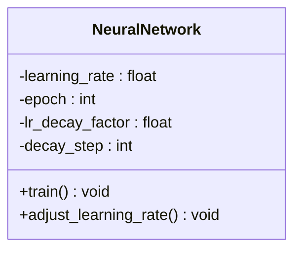
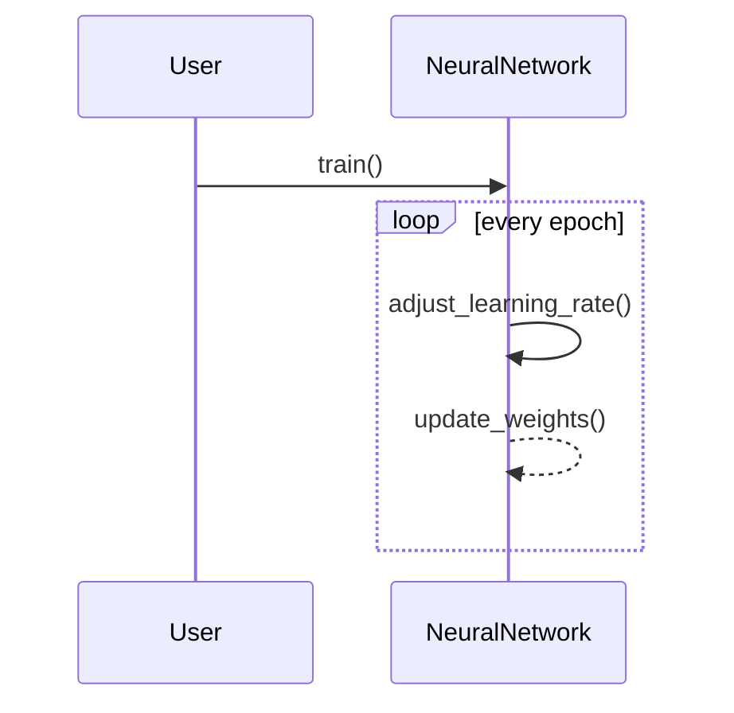

## Step Decay: Learning Rate Adjustment Strategy

### Introduction
Step Decay is a learning rate scheduling technique used in training neural networks. It involves reducing the learning rate by a certain factor after a set number of epochs. This strategy helps to improve the convergence of the model and achieve better performance by avoiding overshooting the minimum of the loss function.

### Benefits
1. **Stabilizes Training:** Gradually reducing the learning rate helps in stabilizing training by preventing large updates.
2. **Improves Accuracy:** Allows for finer adjustments to weights, leading to better convergence and accuracy.
3. **Controlled Training Duration:** Offers predictable training time by reducing learning rates at set intervals.

### Trade-offs
1. **Requires Manual Tuning:** The epochs at which the learning rate is reduced and the reduction factor need to be determined empirically.
2. **May Increase Training Time:** Gradual reduction might prolong the training process.
3. **Not Always Optimal:** May not work well with all types of datasets or architectures.

### Use Cases
- **Long Training Jobs:** Commonly used in situations where models need to be trained over several epochs, especially for deep learning models.

### UML Diagrams

#### UML Class Diagram


#### UML Sequence Diagram


### Code Examples

#### Python
```python
class NeuralNetwork:
    def __init__(self, learning_rate, decay_factor, decay_step):
        self.learning_rate = learning_rate
        self.decay_factor = decay_factor
        self.decay_step = decay_step
        self.epoch = 0

    def train(self):
        while not convergence_achieved():
            self.epoch += 1
            self.adjust_learning_rate()
            # training logic

    def adjust_learning_rate(self):
        if self.epoch % self.decay_step == 0:
            self.learning_rate *= self.decay_factor
```

#### Java
```java
public class NeuralNetwork {
    private double learningRate;
    private double decayFactor;
    private int decayStep;
    private int epoch;

    public NeuralNetwork(double learningRate, double decayFactor, int decayStep) {
        this.learningRate = learningRate;
        this.decayFactor = decayFactor;
        this.decayStep = decayStep;
        this.epoch = 0;
    }

    public void train() {
        while (!convergenceAchieved()) {
            epoch++;
            adjustLearningRate();
            // training logic
        }
    }

    private void adjustLearningRate() {
        if (epoch % decayStep == 0) {
            learningRate *= decayFactor;
        }
    }
}
```

#### Scala
```scala
class NeuralNetwork(var learningRate: Double, val decayFactor: Double, val decayStep: Int) {
    private var epoch: Int = 0

    def train(): Unit = {
        while (!convergenceAchieved()) {
            epoch += 1
            adjustLearningRate()
            // training logic
        }
    }

    private def adjustLearningRate(): Unit = {
        if (epoch % decayStep == 0) {
            learningRate *= decayFactor
        }
    }
}
```

#### Clojure
```clojure
(defn create-neural-network [learning-rate decay-factor decay-step]
  {:learning-rate learning-rate
   :decay-factor decay-factor
   :decay-step decay-step
   :epoch 0})

(defn adjust-learning-rate [network]
  (if (zero? (mod (:epoch network) (:decay-step network)))
    (update network :learning-rate #(* % (:decay-factor network)))
    network))

(defn train [network]
  (loop [net network]
    (if (convergence-achieved?)
      net
      (recur (-> net
                 (update :epoch inc)
                 adjust-learning-rate
                 ; training logic
                 )))))
```

### Related Design Patterns
1. **Exponential Decay:** Another method of reducing the learning rate, which involves reducing it exponentially rather than at fixed steps.
2. **Polynomial Decay:** Reduces the learning rate according to a polynomial function.
3. **Cosine Annealing:** Adjusts the learning rate following a cosine curve, providing gradual reduction and potential restarts.

### Resources and References
- **Papers:** Research papers discussing learning rate schedules.
- **Libraries:** TensorFlow, PyTorch, and Keras have built-in support for various learning rate schedules.
- **Tutorials:** Online tutorials and courses for practical implementations and visualizations.

### Summary
Step Decay is a widely-used method for adjusting the learning rate during the training of neural networks. By systematically reducing the learning rate, it aids in stabilizing training and achieving better convergence. Despite requiring manual tuning, its simplicity and effectiveness make it a popular choice among practitioners. Understanding and correctly implementing Step Decay can be crucial for the success of long training jobs and complex models.
