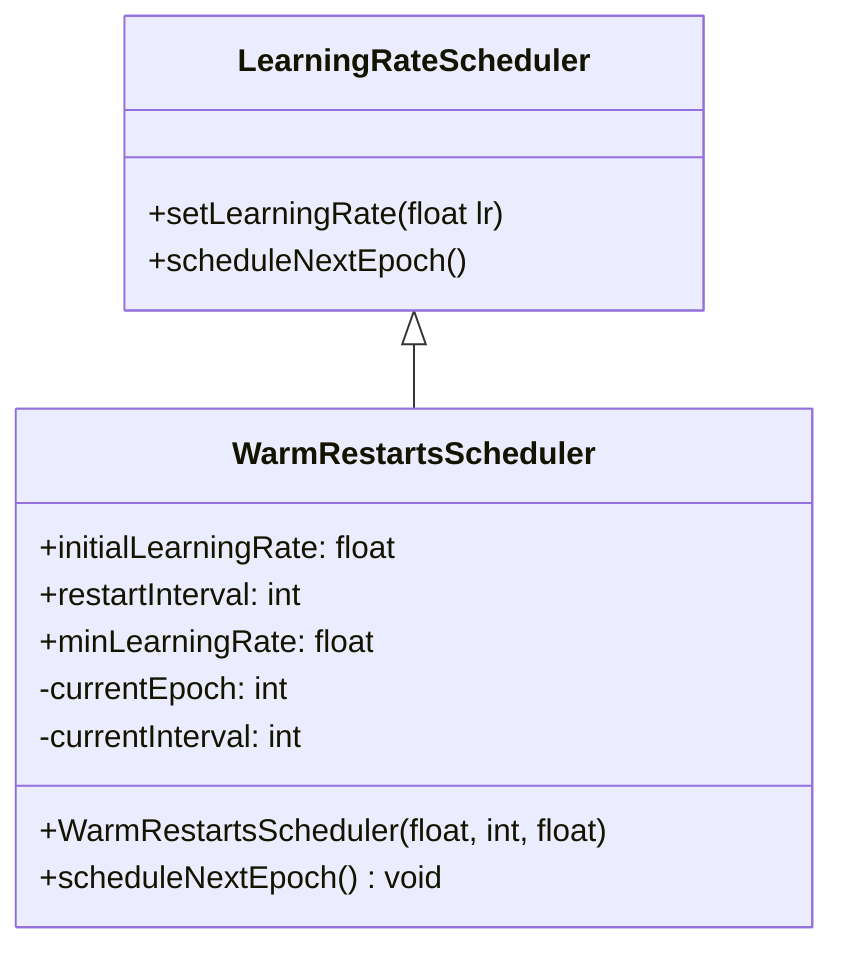
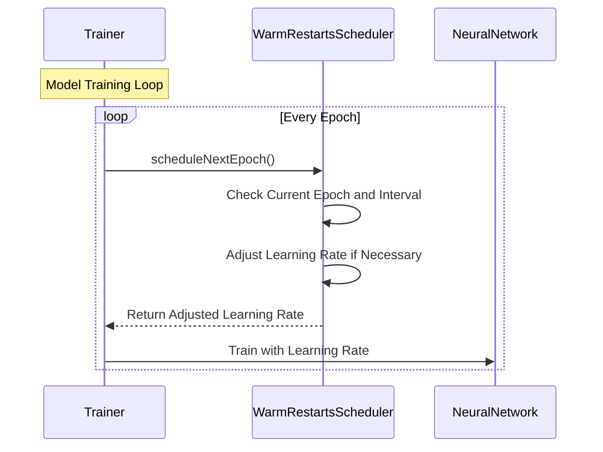

## Warm Restarts: Periodic Restarts of Learning Rate Schedule

Warm Restarts is a technique used in training neural networks where the learning rate schedule is periodically restarted. This approach helps in escaping local minima, facilitating better exploration of the gradient space, and potentially leading to improved model performance.

### Detailed Description

Warm Restarts, often implemented as part of a learning rate scheduling strategy, involves reducing the learning rate after a certain number of epochs and then periodically resetting it. This helps the model to converge more effectively by avoiding getting stuck in local minima and exploring different regions of the gradient space.

### UML Class Diagram



### UML Sequence Diagram



### Examples in Different Languages

#### Python

```python
class WarmRestartsScheduler:
    def __init__(self, initial_lr, restart_interval, min_lr=1e-6):
        self.initial_lr = initial_lr
        self.restart_interval = restart_interval
        self.min_lr = min_lr
        self.current_epoch = 0
        self.current_interval = restart_interval
    
    def get_learning_rate(self):
        return self.initial_lr * (0.5 ** (self.current_epoch // self.restart_interval))
    
    def schedule_next_epoch(self):
        self.current_epoch += 1
        if self.current_epoch % self.restart_interval == 0:
            self.current_interval *= 2

scheduler = WarmRestartsScheduler(initial_lr=0.1, restart_interval=10)
for epoch in range(100):
    lr = scheduler.get_learning_rate()
    # Train your model with the learning rate `lr`
    scheduler.schedule_next_epoch()
```

#### Java

```java
public class WarmRestartsScheduler {
    private double initialLearningRate;
    private int restartInterval;
    private double minLearningRate;
    private int currentEpoch;
    private int currentInterval;

    public WarmRestartsScheduler(double initialLearningRate, int restartInterval, double minLearningRate) {
        this.initialLearningRate = initialLearningRate;
        this.restartInterval = restartInterval;
        this.minLearningRate = minLearningRate;
        this.currentEpoch = 0;
        this.currentInterval = restartInterval;
    }

    public double getLearningRate() {
        return initialLearningRate * Math.pow(0.5, (currentEpoch / restartInterval));
    }

    public void scheduleNextEpoch() {
        currentEpoch++;
        if (currentEpoch % restartInterval == 0) {
            currentInterval *= 2;
        }
    }

    public static void main(String[] args) {
        WarmRestartsScheduler scheduler = new WarmRestartsScheduler(0.1, 10, 1e-6);
        for (int epoch = 0; epoch < 100; epoch++) {
            double lr = scheduler.getLearningRate();
            // Train your model with the learning rate `lr`
            scheduler.scheduleNextEpoch();
        }
    }
}
```

#### Scala

```scala
class WarmRestartsScheduler(initialLearningRate: Double, restartInterval: Int, minLearningRate: Double = 1e-6) {
    private var currentEpoch: Int = 0
    private var currentInterval: Int = restartInterval

    def getLearningRate: Double = {
        initialLearningRate * math.pow(0.5, (currentEpoch / restartInterval).toDouble)
    }

    def scheduleNextEpoch(): Unit = {
        currentEpoch += 1
        if (currentEpoch % restartInterval == 0) {
            currentInterval *= 2
        }
    }
}

object WarmRestartsExample {
    def main(args: Array[String]): Unit = {
        val scheduler = new WarmRestartsScheduler(0.1, 10)
        for (epoch <- 0 until 100) {
            val lr = scheduler.getLearningRate
            // Train your model with the learning rate `lr`
            scheduler.scheduleNextEpoch()
        }
    }
}
```

#### Clojure

```clojure
(defn warm-restarts-scheduler [initial-lr restart-interval & [min-lr]]
  (let [min-lr (or min-lr 1e-6)
        state (atom {:current-epoch 0 :current-interval restart-interval})]
    {:get-learning-rate
     (fn []
       (* initial-lr (Math/pow 0.5 (quot (:current-epoch @state) restart-interval))))
     :schedule-next-epoch
     (fn []
       (swap! state update :current-epoch inc)
       (when (zero? (mod (:current-epoch @state) restart-interval))
         (swap! state update :current-interval #(* % 2))))}))

;; Example usage
(let [scheduler (warm-restarts-scheduler 0.1 10)]
  (dotimes [epoch 100]
    (let [lr ((:get-learning-rate scheduler))]
      ;; Train your model with the learning rate `lr`
      ((:schedule-next-epoch scheduler)))))
```

### Benefits

1. **Enhanced Exploration:** By periodically resetting the learning rate, the optimizer can escape local minima and explore different regions of the gradient space.
2. **Improved Convergence:** Helps in achieving better convergence properties and potentially higher accuracy.
3. **Adaptability:** Can adapt to various training schedules and datasets.

### Trade-offs

1. **Increased Computation:** Periodic restarts require more computations and can increase the training time.
2. **Complexity in Tuning:** Requires careful tuning of initial learning rate, restart intervals, and minimum learning rate.
3. **Resource Intensive:** Can demand more computational resources, especially with large-scale models and datasets.

### Use Cases

1. **Large Neural Networks:** Suitable for training deep neural networks where the risk of getting stuck in local minima is high.
2. **Complex Datasets:** Effective on complex datasets where optimal gradient exploration can lead to significantly better performance.
3. **Hyperparameter Optimization:** Useful in scenarios involving extensive hyperparameter tuning.

### Related Design Patterns

- **Learning Rate Annealing:** Gradually decreasing the learning rate over time, which is a simpler alternative.
- **Cyclic Learning Rates:** Involves cyclically varying the learning rate within a certain range.

### Resources and References

- **Open Source Frameworks:** 
  - PyTorch: `torch.optim.lr_scheduler.CosineAnnealingWarmRestarts`
  - TensorFlow: `tf.keras.callbacks.LearningRateScheduler`
- **Research Papers:** 
  - "SGDR: Stochastic Gradient Descent with Warm Restarts" by Ilya Loshchilov and Frank Hutter.
- **Online Resources:** 
  - [PyTorch Learning Rate Schedulers](https://pytorch.org/docs/stable/optim.html#how-to-adjust-learning-rate)
  - [TensorFlow Learning Rate Scheduling](https://www.tensorflow.org/api_docs/python/tf/keras/optimizers/schedules)

### Summary

Warm Restarts is a powerful design pattern for neural network training that involves periodic resetting of the learning rate. This method enhances the optimizer's ability to explore the gradient space and avoid local minima, potentially leading to improved model performance. It is particularly useful in large and complex neural networks and offers benefits such as improved convergence and enhanced exploration at the cost of increased computational complexity and resource usage. Warm Restarts are supported in various deep learning frameworks and continue to be a topic of active research and application in the field of machine learning.
