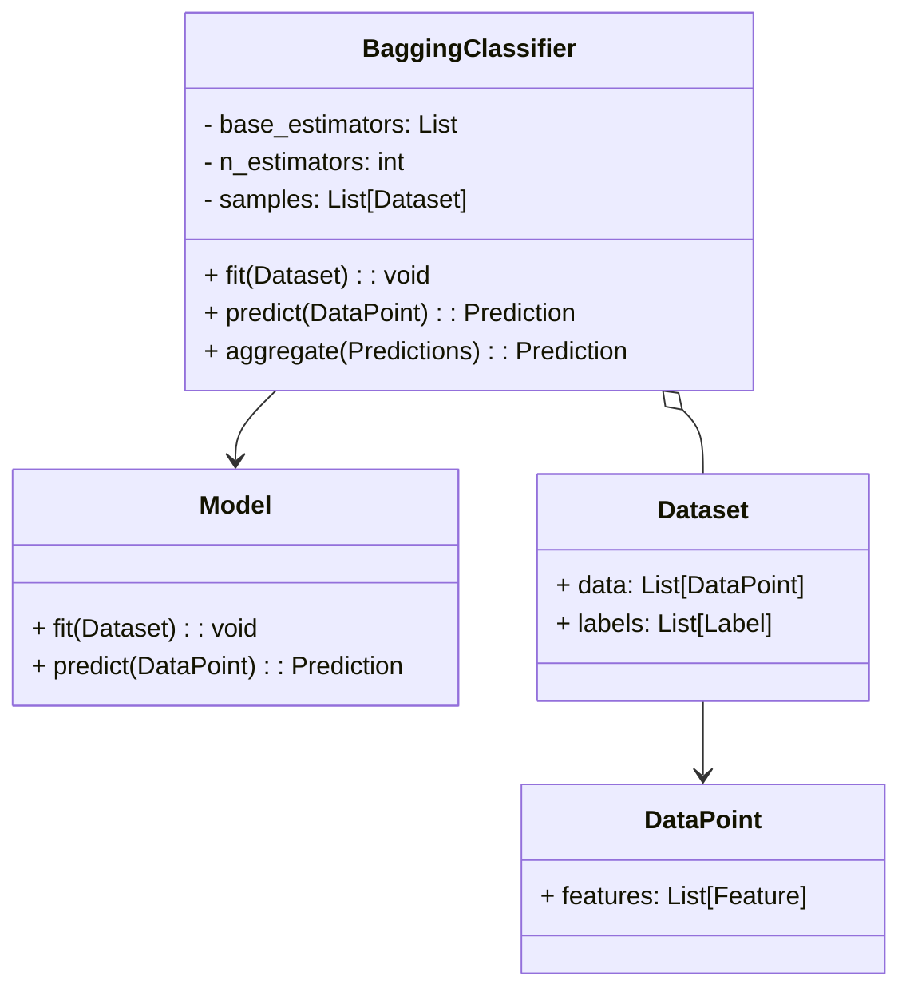
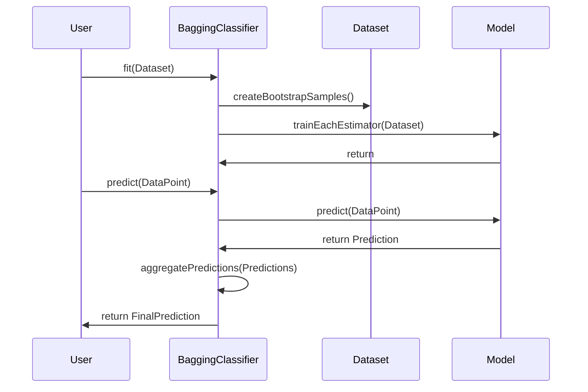

## Introduction to Bagging

Bagging, short for Bootstrap Aggregating, is an ensemble learning method that aims to improve the stability and accuracy of machine learning algorithms. It is particularly effective in reducing variance and preventing overfitting, which are common challenges in neural network models.

## How Bagging Works

The basic idea of Bagging involves creating multiple subsets of the original dataset using a technique known as bootstrapping. Each subset is used to train a separate model (often a decision tree). The predictions from all these models are then combined (aggregated) to form a final prediction. For regression tasks, averaging is used, while for classification, majority voting determines the final outcome.

### Steps in Bagging

1. **Bootstrap Sampling**: Generate multiple subsets of the original dataset by sampling with replacement.
2. **Model Training**: Train a separate model on each bootstrapped subset.
3. **Aggregation**: Combine the predictions of all models through averaging or voting.

## UML Diagrams

### Class Diagram



### Sequence Diagram



## Benefits of Bagging

- **Reduces Variance**: By combining the results of multiple models, Bagging reduces the variance associated with individual models.
- **Improves Stability**: More stable predictions as the influence of noise in any single model is diminished.
- **Handles Overfitting**: Effective in scenarios where models tend to overfit the training data.

## Trade-offs

- **Increased Computation**: Requires training multiple models, which can be computationally intensive.
- **Complexity in Interpretation**: Ensemble methods can be harder to interpret compared to single models.

## Use Cases

- **Reducing Overfitting**: Particularly useful for high-variance models like decision trees.
- **High-Stakes Decision Making**: Where stability and reliability are critical, such as in medical diagnosis or financial forecasting.

## Implementation Examples

### Python

```python
from sklearn.ensemble import BaggingClassifier
from sklearn.tree import DecisionTreeClassifier
from sklearn.datasets import load_iris
from sklearn.model_selection import train_test_split

data = load_iris()
X_train, X_test, y_train, y_test = train_test_split(data.data, data.target, test_size=0.2)

model = BaggingClassifier(base_estimator=DecisionTreeClassifier(), n_estimators=50, random_state=42)
model.fit(X_train, y_train)
predictions = model.predict(X_test)
```

### Java

```java
import weka.classifiers.meta.Bagging;
import weka.classifiers.trees.J48;
import weka.core.Instances;
import weka.core.converters.ConverterUtils.DataSource;

public class BaggingExample {
    public static void main(String[] args) throws Exception {
        DataSource source = new DataSource("data/iris.arff");
        Instances data = source.getDataSet();
        data.setClassIndex(data.numAttributes() - 1);

        Bagging bagger = new Bagging();
        bagger.setClassifier(new J48());
        bagger.setNumIterations(50);
        bagger.buildClassifier(data);

        // Use bagger for predictions
    }
}
```

### Scala

```scala
import org.apache.spark.ml.classification.DecisionTreeClassifier
import org.apache.spark.ml.classification.RandomForestClassifier
import org.apache.spark.sql.SparkSession

val spark = SparkSession.builder.appName("BaggingExample").getOrCreate()
val data = spark.read.format("libsvm").load("data/mllib/sample_libsvm_data.txt")

val dt = new DecisionTreeClassifier().setLabelCol("label").setFeaturesCol("features")
val bagging = new RandomForestClassifier().setBaseLearner(dt).setNumTrees(50)

val model = bagging.fit(data)
val predictions = model.transform(data)
```

### Clojure

```clojure
(require '[clj-ml.classifiers :as cls])

(let [data (cls/load-instances :arff "data/iris.arff")
      bagger (cls/make-classifier :meta :bagging :base-classifier (cls/make-classifier :trees :j48))]
  (cls/build bagger data))
```

## Related Design Patterns

- **Boosting**: Focuses on reducing bias by combining models sequentially, each correcting errors of the previous ones.
- **Stacking**: Combines multiple models using another model that learns to best combine the base models.

## Resources and References

- [Scikit-Learn Documentation on Bagging](https://scikit-learn.org/stable/modules/ensemble.html#bagging)
- [Weka Documentation](https://waikato.github.io/weka-wiki/bagging/)
- [Spark MLlib](https://spark.apache.org/mllib/)

## Summary

Bagging is a robust ensemble method that enhances the stability and accuracy of models by reducing variance. It is particularly effective in tackling overfitting, making it suitable for various high-stakes applications. By understanding the benefits, trade-offs, and proper implementations across multiple programming languages, practitioners can leverage Bagging to build more reliable and generalizable models.


