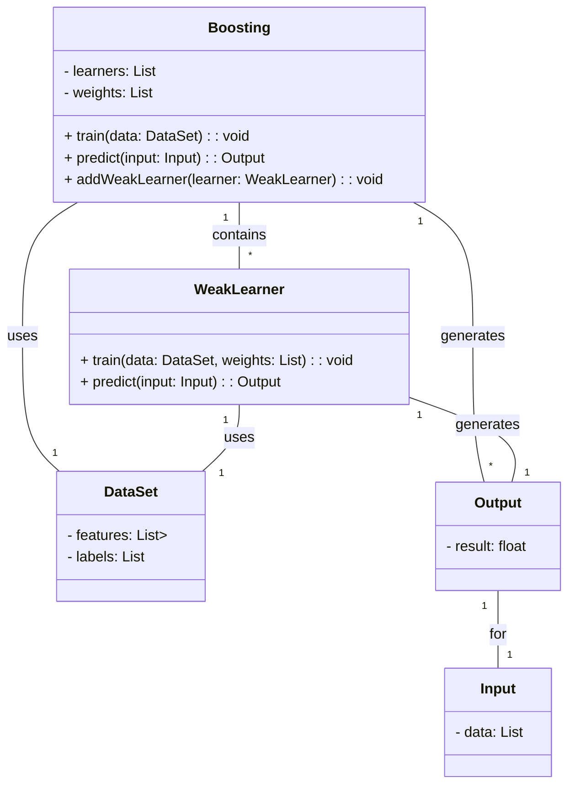
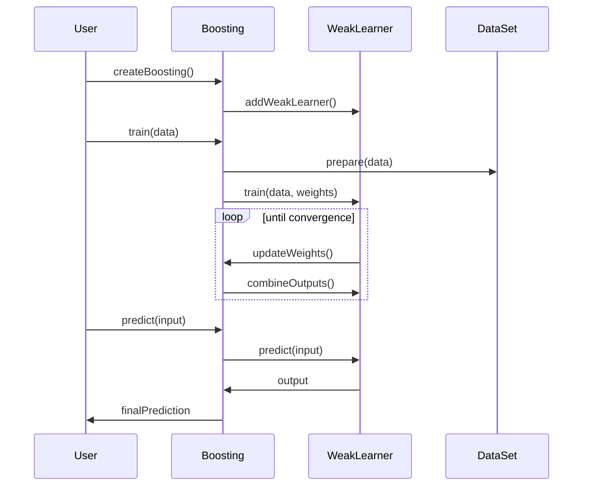

## Overview of Boosting

Boosting is an ensemble learning technique aimed at improving the accuracy of machine learning models. It sequentially combines multiple weak learners, each correcting the errors made by its predecessor, to build a robust and accurate final model. 

## Detailed Description

Boosting algorithms typically adjust the weights of training instances, focusing more on harder-to-classify instances as iterations progress. The idea is to convert a set of weak learners (models that are slightly better than random guessing) into a single strong learner.

### How It Works

1. **Initialization**: Start with assigning equal weights to all training instances.
2. **Iteration**: At each iteration, a weak learner is trained with the weighted data.
    - After training, the performance of the weak learner is evaluated.
    - Higher weights are assigned to the instances that were misclassified.
3. **Combination**: The predictions from all weak learners are combined using a weighted vote or another method to produce the final prediction.

### Algorithm

Consider the AdaBoost algorithm as an example:


\begin{aligned}
&1. \quad \text{Initialize weights } w_i = \frac{1}{n}, \text{ where } i = 1,2,...,n\\
&2. \quad \text{For each weak learner } m = 1,2,...,M:\\
&\quad \quad a. \quad \text{Train weak learner using weights } w_i\\
&\quad \quad b. \quad \text{Calculate the error } \epsilon_m \text{ of the weak learner}\\
&\quad \quad c. \quad \text{Calculate the learner weight } \alpha_m = \ln \left( \frac{1 - \epsilon_m}{\epsilon_m} \right)\\
&\quad \quad d. \quad \text{Update weights } w_i = w_i \exp(\alpha_m \text{ if misclassified, } -\alpha_m \text{ if correctly classified})\\
&3. \quad \text{Combine weak learners' outputs using } \alpha_m \text{ weights to get the final model}
\end{aligned}


## UML Diagrams

### Class Diagram



### Sequence Diagram



## Examples in Different Languages

### Python

```python
from sklearn.ensemble import AdaBoostClassifier
from sklearn.tree import DecisionTreeClassifier

X = [[0, 0], [1, 1]]
y = [0, 1]

model = AdaBoostClassifier(base_estimator=DecisionTreeClassifier(max_depth=1), n_estimators=50)

model.fit(X, y)

prediction = model.predict([[0, 0]])
print(prediction)
```

### Java

```java
import weka.classifiers.meta.AdaBoostM1;
import weka.classifiers.trees.DecisionStump;
import weka.core.Instances;
import weka.core.converters.ConverterUtils.DataSource;

public class BoostingExample {
    public static void main(String[] args) throws Exception {
        DataSource source = new DataSource("data.arff");
        Instances data = source.getDataSet();
        data.setClassIndex(data.numAttributes() - 1);
        
        AdaBoostM1 model = new AdaBoostM1();
        model.setClassifier(new DecisionStump());
        model.setNumIterations(50);

        model.buildClassifier(data);

        double prediction = model.classifyInstance(data.instance(0));
        System.out.println(prediction);
    }
}
```

### Scala

```scala
import org.apache.spark.ml.classification.{AdaBoostClassifier, DecisionTreeClassifier}
import org.apache.spark.sql.SparkSession

object BoostingExample {
  def main(args: Array[String]): Unit = {
    val spark = SparkSession.builder.appName("BoostingExample").getOrCreate()
    
    val data = spark.read.format("libsvm").load("data.txt")
    
    val dt = new DecisionTreeClassifier().setMaxDepth(1)
    val adaBoost = new AdaBoostClassifier().setBaseLearner(dt).setNumIterations(50)

    val model = adaBoost.fit(data)

    val prediction = model.transform(data)
    prediction.show()
    
    spark.stop()
  }
}
```

### Clojure

```clojure
(ns boosting-example.core
  (:require [weka.classifiers.meta :refer [AdaBoostM1]]
            [weka.classifiers.trees :refer [DecisionStump]]
            [weka.core :refer [Instances ConverterUtils$DataSource]]))

(defn -main []
  (let [data (.. (ConverterUtils$DataSource. "data.arff") (getDataSet))]
    (.setClassIndex data (- (.numAttributes data) 1))
    
    (let [model (doto (AdaBoostM1.)
                  (.setClassifier (DecisionStump.))
                  (.setNumIterations 50))]
      
      (.buildClassifier model data)
      
      (let [instance (.firstInstance data)
            prediction (.classifyInstance model instance)]
        
        (println prediction)))))
```

## Benefits and Trade-offs

### Benefits
- **Higher Accuracy**: Often leads to significant improvements in prediction accuracy.
- **Versatility**: Applicable to a variety of weak learners and use-cases.
- **Reduction of Bias**: Focuses on previously misclassified instances, thereby reducing bias.

### Trade-offs
- **Computational Cost**: More computationally intensive due to sequential training.
- **Overfitting**: Risk of overfitting, particularly with noisy datasets.
- **Complexity**: Increased model complexity can make interpretation difficult.

## Use Cases

- **Fraud Detection**: Enhanced accuracy in identifying fraudulent transactions.
- **Marketing**: Better customer segmentation and targeted marketing campaigns.
- **Medical Diagnosis**: Improved accuracy in diagnosing diseases based on patient data.

## Related Design Patterns

- **Bagging**: Combines multiple models but trains them in parallel on different subsets of the data.
- **Stacking**: Combines multiple models using another model to make the final prediction.

## Resources and References

- **Scikit-learn Documentation**: [scikit-learn.org](https://scikit-learn.org/stable/modules/ensemble.html#forest)
- **Spark MLlib**: [spark.apache.org](https://spark.apache.org/mllib/)
- **WEKA Documentation**: [weka.wikispaces.com](http://weka.wikispaces.com/AdaBoost)

## Open Source Frameworks

- **Scikit-learn**
- **Apache Spark (MLlib)**
- **WEKA**

## Summary

Boosting is an effective ensemble technique that combines multiple weak learners to form a strong learner, enhancing model performance. Despite its computational cost and risk of overfitting, its ability to produce high-accuracy models makes it a popular choice in machine learning applications. Understanding and implementing boosting can significantly improve your models, particularly for complex and high-dimensional data.
