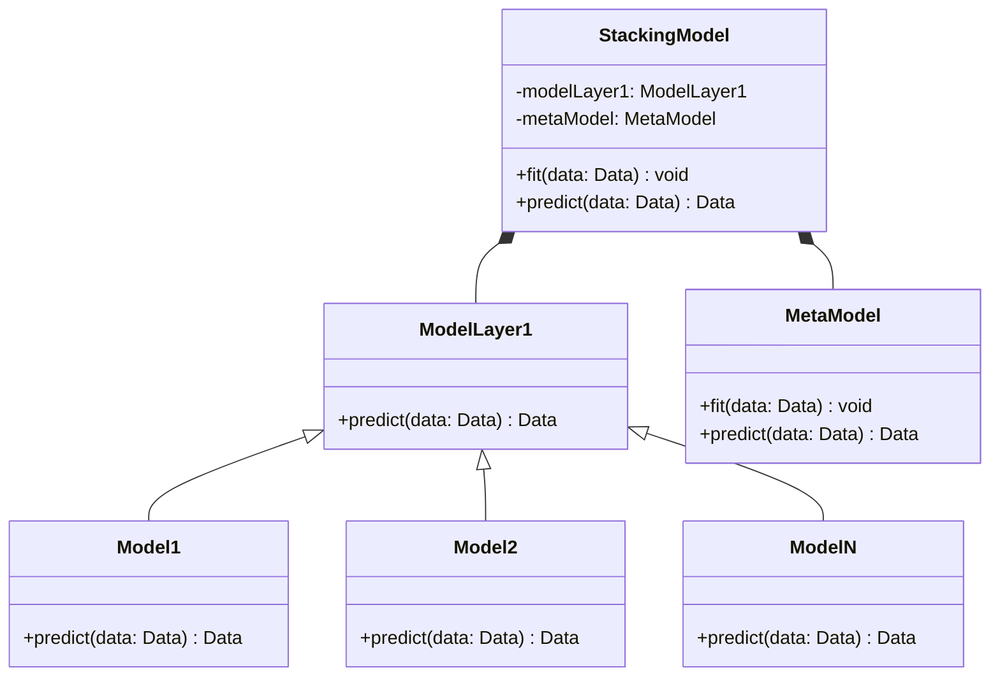
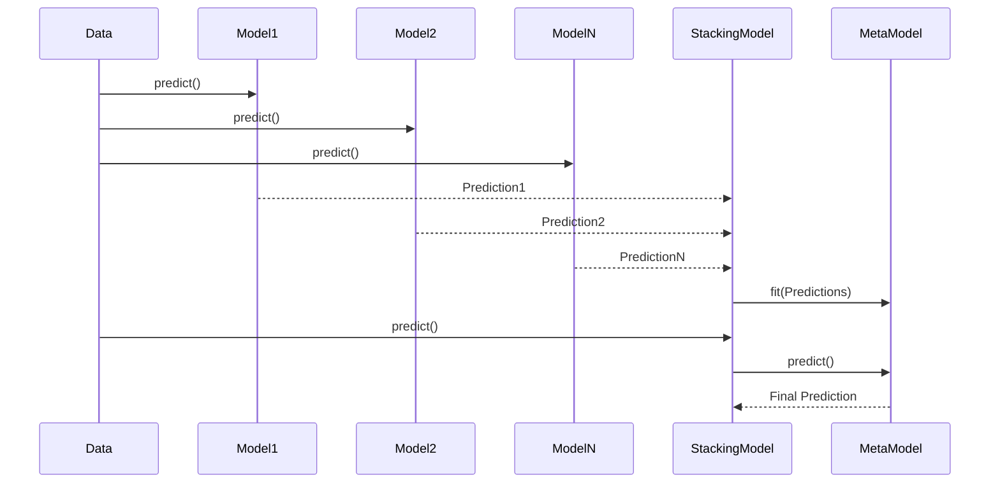

## Introduction

Stacking, also known as stacked generalization, is an ensemble learning technique that combines predictions from multiple machine learning models using a meta-model. This approach leverages the strengths and compensates for the weaknesses of various individual models to improve predictive performance.

## UML Diagrams

### Class Diagram



### Sequence Diagram



## Detailed Description

### Benefits

- **Improved Accuracy**: By combining different models, the stacking approach can often outperform individual models.
- **Flexibility**: You can combine different types of models (e.g., decision trees, neural networks, linear models).
- **Robustness**: Reduces the risk of relying too much on a single model, which may perform poorly under certain conditions.

### Trade-offs

- **Complexity**: Requires careful tuning of both the base models and the meta-model.
- **Computational Cost**: Increased training and prediction time due to multiple models.
- **Implementation Difficulty**: Requires managing the data flow between multiple models and the meta-model.

## Examples

### Python
```python
from sklearn.model_selection import train_test_split
from sklearn.ensemble import StackingClassifier
from sklearn.linear_model import LogisticRegression
from sklearn.svm import SVC
from sklearn.tree import DecisionTreeClassifier

X, y = load_data()  # Your function to load data

X_train, X_test, y_train, y_test = train_test_split(X, y, test_size=0.2)

base_models = [
    ('svc', SVC(kernel='linear')),
    ('dt', DecisionTreeClassifier())
]

meta_model = LogisticRegression()

stacking_model = StackingClassifier(estimators=base_models, final_estimator=meta_model)

stacking_model.fit(X_train, y_train)

predictions = stacking_model.predict(X_test)
```

### Java
```java
import weka.classifiers.Classifier;
import weka.classifiers.meta.Stacking;
import weka.classifiers.trees.J48;
import weka.classifiers.functions.Logistic;
import weka.core.Instances;
import weka.core.converters.ConverterUtils.DataSource;

public class StackingExample {
    public static void main(String[] args) throws Exception {
        DataSource source = new DataSource("data.arff");
        Instances data = source.getDataSet();
        data.setClassIndex(data.numAttributes() - 1);

        // Base classifiers
        Classifier[] baseClassifiers = { new J48(), new weka.classifiers.functions.SMO() };

        // Meta classifier
        Classifier metaClassifier = new Logistic();

        // Initialize Stacking
        Stacking stacking = new Stacking();
        stacking.setClassifiers(baseClassifiers);
        stacking.setMetaClassifier(metaClassifier);
        
        // Train Stacking model
        stacking.buildClassifier(data);

        // Evaluate model - assuming test data is available
        Instances testData = source.getDataSet(); // Load test data similarly
        for (int i = 0; i < testData.numInstances(); i++) {
            double prediction = stacking.classifyInstance(testData.instance(i));
            System.out.println("Predicted: " + prediction);
        }
    }
}
```

### Scala
```scala
import org.apache.spark.ml.classification.{LogisticRegression, DecisionTreeClassifier, OneVsRest}
import org.apache.spark.ml.feature.VectorAssembler
import org.apache.spark.sql.SparkSession

val spark = SparkSession.builder.appName("StackingExample").getOrCreate()

// Load dataset
val data = spark.read.format("libsvm").load("data.txt")

// Split dataset
val Array(trainingData, testData) = data.randomSplit(Array(0.8, 0.2))

// Define base models
val dt = new DecisionTreeClassifier().setLabelCol("label").setFeaturesCol("features")
val ovr = new OneVsRest().setClassifier(dt)

// Train base models
val ovrModel = ovr.fit(trainingData)

// Define meta-model
val lr = new LogisticRegression()

// Extract predictions from base model
val predictions = ovrModel.transform(testData)
val assembler = new VectorAssembler().setInputCols(Array("prediction")).setOutputCol("meta_features")
val metaData = assembler.transform(predictions)

// Train meta-model
val lrModel = lr.fit(metaData)

// Make predictions
val finalPredictions = lrModel.transform(metaData)
finalPredictions.show()
```

### Clojure
```clojure
(ns stacking-example
  (:require [clojure.java.io :as io]
            [clojure.data.csv :as csv]
            [clj-ml.classifiers :as classifiers]
            [clj-ml.data :as data]))

(defn load-data [filename]
  (with-open [reader (io/reader filename)]
    (doall (csv/read-csv reader))))

(defn stacking-example []
  (let [dataset (load-data "data.csv")
        dataset (data/make-dataset-from-csv dataset :class-at 4)
        dt-classifier (classifiers/make-classifier :decision-tree)
        svc-classifier (classifiers/make-classifier :svc)
        meta-classifier (classifiers/make-classifier :logistic-regression)
        base-classifiers [dt-classifier svc-classifier]
        stacking (classifiers/make-classifier :stacking :classifiers base-classifiers :meta-classifier meta-classifier)]
    (classifiers/train stacking dataset)
    (let [predictions (map #(classifiers/classify stacking %) (data/dataset-instances dataset))]
      (println "Predictions: " predictions))))

(stacking-example)
```

## Use Cases

- **Financial Forecasting**: Combining predictions from different financial models to improve the accuracy of stock price predictions.
- **Medical Diagnosis**: Leveraging various diagnostic models to provide a more accurate diagnosis based on medical records.
- **Recommendation Systems**: Enhancing the recommendations by combining different algorithms like collaborative filtering and content-based filtering.

## Related Design Patterns

- **Bagging**: Another ensemble technique that involves training multiple versions of a model on different subsets of the data.
- **Boosting**: Sequentially trains models to correct the errors of previous models.
- **Voting**: Combines the predictions from multiple models by taking a majority or weighted vote.

## Resources and References

- **Books**: 
  - "Ensemble Methods: Foundations and Algorithms" by Zhi-Hua Zhou
  - "Pattern Recognition and Machine Learning" by Christopher Bishop
- **Frameworks**: 
  - [Scikit-learn](https://scikit-learn.org/stable/modules/ensemble.html#stacking)
  - [Weka](https://www.cs.waikato.ac.nz/ml/weka/documentation.html)
  - [Spark MLlib](https://spark.apache.org/mllib/)
- **Online Courses**: 
  - "Machine Learning" by Andrew Ng on Coursera
  - "Advanced Machine Learning" by HSE University on Coursera

## Summary

Stacking is a robust ensemble learning technique that improves prediction accuracy by combining the strengths of multiple models using a meta-model. While it introduces complexity and computational costs, its flexibility and effectiveness in various domains make it a valuable tool for machine learning practitioners. Whether in financial forecasting, medical diagnosis, or recommendation systems, stacking leverages the best aspects of individual models to create a more powerful and accurate predictive system.
