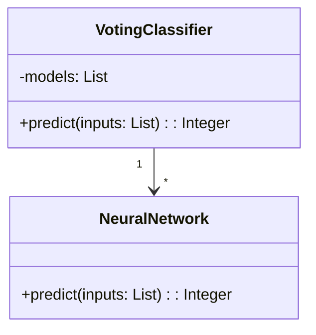
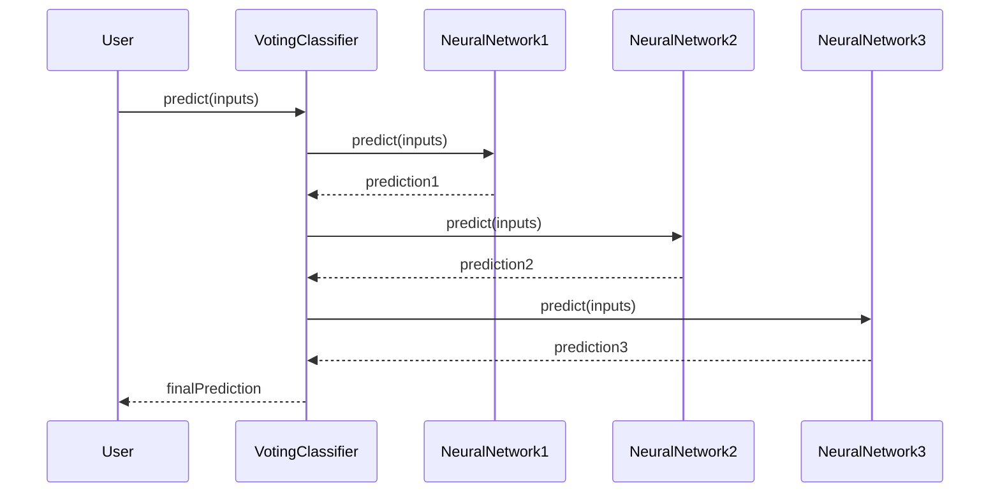

The **Voting** design pattern is an ensemble learning technique where multiple neural network models contribute to a final decision. This pattern involves combining predictions from different models based on the majority vote, which leads to more robust and accurate class predictions.

## Description

The Voting pattern uses an ensemble of neural networks to improve classification performance by taking the majority vote of predictions from each model. This method ensures that the final prediction is more robust to individual model errors and reduces the variance of predictions.

## Benefits

- **Increased Robustness:** By aggregating the decisions of multiple models, the pattern reduces the impact of any single model's bias or variance.
- **Enhanced Accuracy:** Often results in more accurate predictions than any individual model alone.
- **Simplicity:** Easy to implement and understand.

## Trade-offs

- **Computational Cost:** Requires training and maintaining multiple models, which can be computationally expensive.
- **Complexity in Management:** Managing multiple models can increase the complexity of the system.
- **Delayed Predictions:** May take longer to make predictions due to the need for all models to contribute.

## Use Cases

- **Medical Diagnosis:** Ensuring robust predictions by combining multiple diagnostic models.
- **Fraud Detection:** Reducing false positives/negatives by using an ensemble of detection algorithms.
- **Sentiment Analysis:** Providing more accurate sentiment predictions from social media data.

## UML Class Diagram



## UML Sequence Diagram



## Implementation Examples

### Python

```python
from sklearn.ensemble import VotingClassifier
from sklearn.neural_network import MLPClassifier

model1 = MLPClassifier()
model2 = MLPClassifier()
model3 = MLPClassifier()

ensemble = VotingClassifier(estimators=[('mlp1', model1), ('mlp2', model2), ('mlp3', model3)], voting='hard')

ensemble.fit(X_train, y_train)

predictions = ensemble.predict(X_test)
```

### Java

```java
import weka.classifiers.meta.Vote;
import weka.classifiers.functions.MultilayerPerceptron;

MultilayerPerceptron mlp1 = new MultilayerPerceptron();
MultilayerPerceptron mlp2 = new MultilayerPerceptron();
MultilayerPerceptron mlp3 = new MultilayerPerceptron();

Vote ensemble = new Vote();
ensemble.setClassifiers(new weka.classifiers.Classifier[] { mlp1, mlp2, mlp3 });

// Train ensemble model
ensemble.buildClassifier(trainData);

// Predict using ensemble model
double[] predictions = ensemble.distributionsForInstances(testData);
```

### Scala

```scala
import org.apache.spark.ml.classification.{MultilayerPerceptronClassifier, OneVsRest}
import org.apache.spark.sql.SparkSession

val spark = SparkSession.builder.appName("VotingPattern").getOrCreate()

val mlp1 = new MultilayerPerceptronClassifier()
val mlp2 = new MultilayerPerceptronClassifier()
val mlp3 = new MultilayerPerceptronClassifier()

// Placeholder for combining multiple models in Spark
val ovr = new OneVsRest()
ovr.setClassifier(mlp1) // setting one, can iterate similarly for others

val model = ovr.fit(trainingData)

val predictions = model.transform(testData)
```

### Clojure

```clojure
(require '[clj-ml.classifiers :as classifiers])
(require '[clj-ml.data :as data])

(def mlp1 (classifiers/make-classifier :multi-layer-perceptron {}))
(def mlp2 (classifiers/make-classifier :multi-layer-perceptron {}))
(def mlp3 (classifiers/make-classifier :multi-layer-perceptron {}))

(def ensemble (classifiers/make-classifier :vote {:classifiers [mlp1 mlp2 mlp3]}))

(classifiers/train ensemble train-data)
(classifiers/classify ensemble test-instance)
```

## Related Design Patterns

- **Bagging:** Similar to voting but emphasizes training multiple models on different subsets of the training data.
- **Boosting:** Focuses on training sequential models where each model attempts to correct the errors of its predecessor.

## Resources

- [scikit-learn VotingClassifier Documentation](https://scikit-learn.org/stable/modules/generated/sklearn.ensemble.VotingClassifier.html)
- [Apache Spark MLlib](https://spark.apache.org/mllib/)
- [Weka Vote Classifier](https://weka.sourceforge.io/doc.dev/weka/classifiers/meta/Vote.html)
- [Clojure Machine Learning (clj-ml)](https://github.com/antoniogarrote/clj-ml)

## Open Source Frameworks

- **scikit-learn**: Python-based machine learning library.
- **Weka**: Java-based machine learning library.
- **Apache Spark**: Unified analytics engine for big data processing.
- **clj-ml**: Machine learning library for Clojure.

## Final Summary

The Voting pattern in neural networks is a powerful ensemble technique that enhances the robustness and accuracy of model predictions through majority voting. It is simple to implement but comes with a trade-off of increased computational complexity and potential prediction latency. Use cases span across various industries requiring reliable prediction mechanisms, such as medical diagnostics and fraud detection. Understanding this pattern and its related patterns like Bagging and Boosting can provide a solid foundation for developing robust machine learning systems.

By leveraging open-source frameworks and libraries, the implementation of the Voting pattern becomes accessible, allowing practitioners to focus on designing and optimizing their models for specific use cases.
