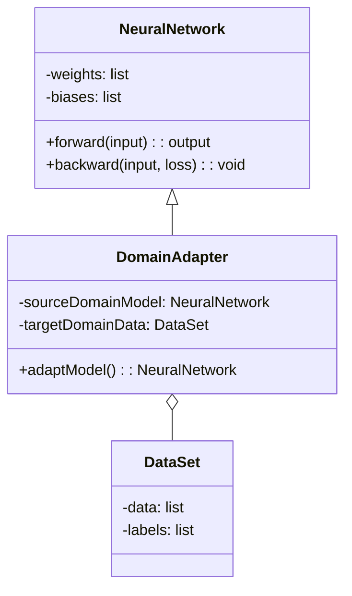
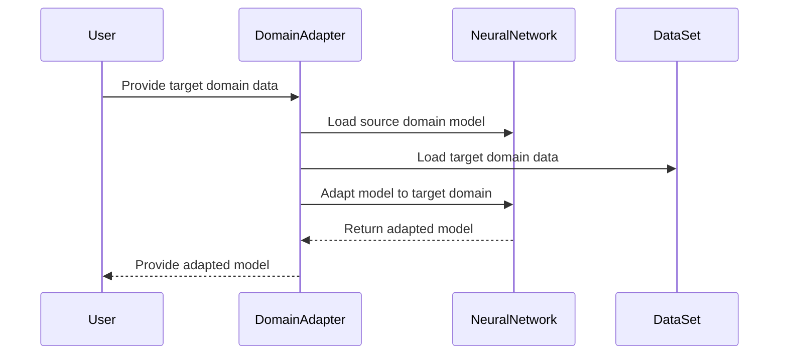

## Domain Adaptation: Adjusting Models to New Domain Data

Domain Adaptation in Neural Networks refers to the methodology of refining pre-trained models to adapt and generalize effectively to new, often different, domain data. This approach is vital when there's a shift in the underlying data distribution between the source (training) domain and the target (testing) domain.

### Benefits

1. **Improved Generalization:** Enhances model performance on target domain data.
2. **Resource Efficiency:** Utilizes pre-trained models, saving computational resources and time.
3. **Scalability:** Facilitates adaptation across different domains without building models from scratch.

### Trade-offs

1. **Data Dependency:** Effectiveness depends on the similarity between source and target domain data.
2. **Complexity:** Requires careful tuning and selection of adaptation techniques.
3. **Overfitting Risk:** Potential risk of overfitting to the target domain.

### Use Cases

- Adapting speech recognition models trained on one language to work with another language.
- Transferring object detection models trained on synthetic data to perform effectively on real-world data.
- Generalizing sentiment analysis models across different industries, e.g., from finance to healthcare.

### UML Diagrams

#### Class Diagram



#### Sequence Diagram



### Example Implementations

#### Python

```python
import torch
import torch.nn as nn

class NeuralNetwork(nn.Module):
    def __init__(self):
        super(NeuralNetwork, self).__init__()
        self.layer = nn.Linear(10, 2)

    def forward(self, x):
        return self.layer(x)

class DomainAdapter:
    def __init__(self, source_model, target_data):
        self.source_model = source_model
        self.target_data = target_data

    def adapt_model(self):
        optimizer = torch.optim.Adam(self.source_model.parameters(), lr=0.001)
        criterion = nn.CrossEntropyLoss()
        
        for data, labels in self.target_data:
            optimizer.zero_grad()
            output = self.source_model(data)
            loss = criterion(output, labels)
            loss.backward()
            optimizer.step()
        
        return self.source_model

source_model = NeuralNetwork()
target_data = [ (torch.randn(10), torch.randint(0, 2, (2,))) for _ in range(100) ]
adapter = DomainAdapter(source_model, target_data)
adapted_model = adapter.adapt_model()
```

#### Java

```java
import java.util.List;

class NeuralNetwork {
    private List<Double> weights;
    private List<Double> biases;

    public double[] forward(double[] input) {
        // Implement forward pass
        return new double[]{};
    }

    public void backward(double[] input, double loss) {
        // Implement backward pass
    }
}

class DataSet {
    List<double[]> data;
    List<int[]> labels;

    public List<double[]> getData() { return data; }
    public List<int[]> getLabels() { return labels; }
}

class DomainAdapter {
    private NeuralNetwork sourceDomainModel;
    private DataSet targetDomainData;

    public DomainAdapter(NeuralNetwork model, DataSet data) {
        this.sourceDomainModel = model;
        this.targetDomainData = data;
    }

    public NeuralNetwork adaptModel() {
        // Placeholder for adaptation logic
        return this.sourceDomainModel;
    }
}

// Example usage
NeuralNetwork sourceModel = new NeuralNetwork();
DataSet targetData = new DataSet();
DomainAdapter adapter = new DomainAdapter(sourceModel, targetData);
NeuralNetwork adaptedModel = adapter.adaptModel();
```

#### Scala

```scala
class NeuralNetwork {
  var weights: List[Double] = _
  var biases: List[Double] = _
  
  def forward(input: Array[Double]): Array[Double] = {
    // Implement forward pass
    Array()
  }

  def backward(input: Array[Double], loss: Double): Unit = {
    // Implement backward pass
  }
}

case class DataSet(data: List[Array[Double]], labels: List[Array[Int]])

class DomainAdapter(sourceDomainModel: NeuralNetwork, targetDomainData: DataSet) {
  def adaptModel(): NeuralNetwork = {
    // Placeholder for adaptation logic
    sourceDomainModel
  }
}

// Example usage
val sourceModel = new NeuralNetwork()
val targetData = DataSet(List(Array(1.0, 2.0)), List(Array(1)))
val adapter = new DomainAdapter(sourceModel, targetData)
val adaptedModel = adapter.adaptModel()
```

#### Clojure

```clojure
(defn forward [model input]
  ;; Placeholder for forward pass
  [])

(defn backward [model input loss]
  ;; Placeholder for backward pass
  )

(defn adapt-model [source-model target-data]
  (doseq [data target-data]
    (let [[input labels] data]
      ;; Placeholder for adaptation logic
      ))
  source-model)

;; Example usage
(def source-model {:weights [] :biases []})
(def target-data [([1 2 3] [0 1]) ([4 5 6] [1 0])])

(def adapted-model (adapt-model source-model target-data))
```

### Related Design Patterns

- **Transfer Learning:** Using pre-trained models as a starting point for training on new tasks.
- **Meta-Learning:** Learning how to learn across different tasks to improve generalization.
- **Few-Shot Learning:** Adapting models to perform tasks with limited labeled data.

### Resources and References

- **Books:**
  - "Deep Learning" by Ian Goodfellow, Yoshua Bengio, and Aaron Courville.
  - "Machine Learning Yearning" by Andrew Ng.
- **Research Papers:**
  - "Domain-Adversarial Training of Neural Networks" by Ganin et al.
  - "Learning Transferable Features with Deep Adaptation Networks" by Long et al.
- **Online Articles:**
  - [Domain Adaptation in Machine Learning](https://www.analyticsvidhya.com/blog/2020/01/domain-adaptation-in-machine-learning/)
  - [Understanding Transfer Learning](https://towardsdatascience.com/transfer-learning-using-pre-trained-models-fc8b751b52e8)
- **Frameworks:**
  - PyTorch
  - TensorFlow
  - Scikit-learn

### Summary

Domain Adaptation is a critical design pattern in Neural Networks enabling models trained on one domain to generalize well to new, unseen domains. This approach leverages existing models to save resources, enhance performance, and achieve scalability. Despite its complexity and potential for overfitting, the benefits often outweigh the trade-offs. With applications across various fields and strong synergy with related patterns like Transfer Learning and Meta-Learning, Domain Adaptation remains a valuable strategy for cross-domain generalization.


