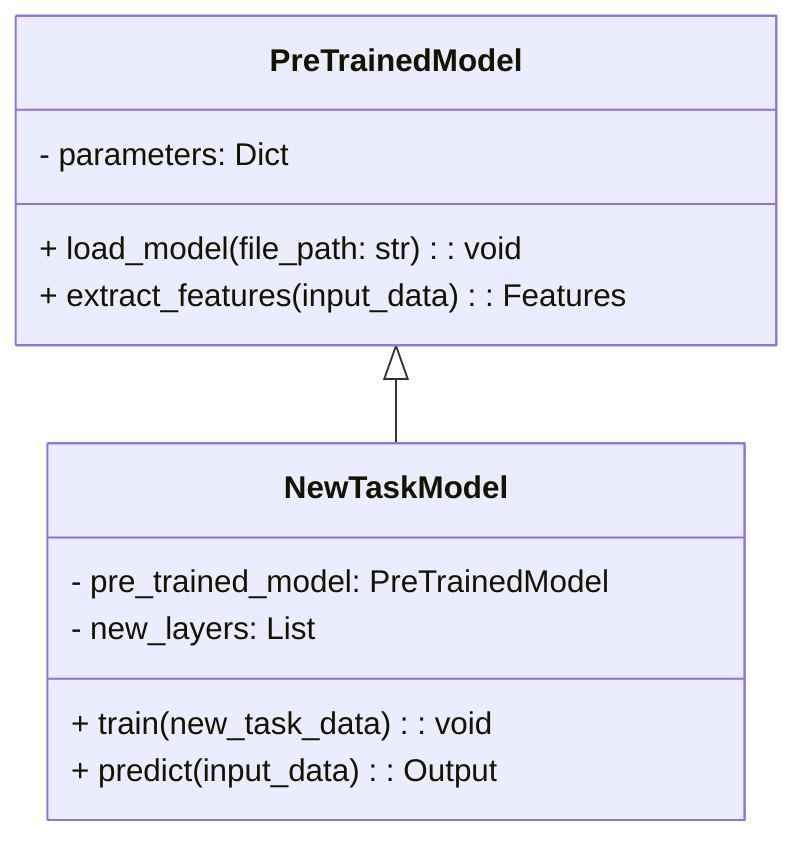
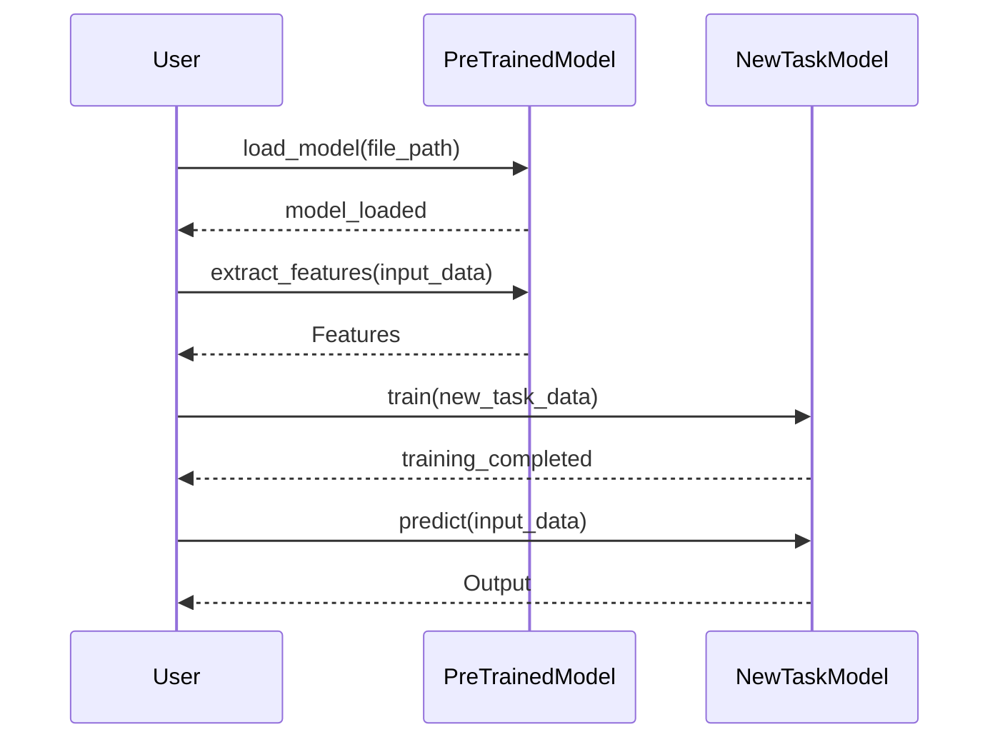

## Introduction

Feature Extraction is a design pattern in neural networks where pre-trained layers are used as feature extractors for new tasks. This technique, which falls under the broader scope of transfer learning, leverages the previously learned features to improve the performance and efficiency of training new models. 

## Benefits

- **Efficiency:** Reduces training time since the initial layers of the network are already trained.
- **Performance:** Pre-trained models often perform better due to learned features from large datasets.
- **Flexibility:** Easily adapt a model to new tasks by fine-tuning only the final layers.

## Trade-offs

- **Overfitting:** There is a risk of overfitting if the pre-trained model is not properly tuned to the new task.
- **Complexity:** Integrating pre-trained models can add complexity to the model architecture and training pipeline.
- **Data Dependency:** The performance may highly depend on how similar the pre-trained model's data domain is to the new task's data domain.

## Use Cases

1. **Image Classification:** Using pre-trained CNN models such as VGG, ResNet, or Inception as feature extractors for new image datasets.
2. **Natural Language Processing:** Leveraging pre-trained embeddings or transformer models for tasks like text classification, sentiment analysis, or named entity recognition.
3. **Speech Recognition:** Adopting pre-trained acoustic models for new language datasets.

## UML Class Diagram



### Explanation

- **PreTrainedModel:** A base class representing a pre-trained model that provides feature extraction capabilities.
- **NewTaskModel:** A model for the new task that integrates the pre-trained model and adds new layers specific to the new task.

## UML Sequence Diagram



### Explanation

1. **Loading the Pre-Trained Model:** The pre-trained model is loaded from a file.
2. **Feature Extraction:** Features are extracted from the input data using the pre-trained model.
3. **Training the New Model:** The new task-specific model is trained using the new task data.
4. **Prediction:** The trained model makes predictions on new input data.

## Example Implementations

### Python

```python
import tensorflow as tf
from tensorflow.keras.applications import VGG16
from tensorflow.keras import layers, models

base_model = VGG16(weights='imagenet', include_top=False)

for layer in base_model.layers:
    layer.trainable = False

model = models.Sequential([
    base_model,
    layers.Flatten(),
    layers.Dense(256, activation='relu'),
    layers.Dense(1, activation='sigmoid')
])

model.compile(optimizer='adam', loss='binary_crossentropy', metrics=['accuracy'])

model.fit(new_task_data, epochs=10)
```

### Java

```java
// Java code using DL4J library
import org.deeplearning4j.nn.api.OptimizationAlgorithm;
import org.deeplearning4j.nn.conf.MultiLayerConfiguration;
import org.deeplearning4j.nn.conf.NeuralNetConfiguration;
import org.deeplearning4j.nn.conf.layers.DenseLayer;
import org.deeplearning4j.nn.conf.layers.OutputLayer;
import org.deeplearning4j.nn.weights.WeightInit;
import org.nd4j.linalg.lossfunctions.LossFunctions;

public class FeatureExtractionExample {
    public static void main(String[] args) {
        // Load pre-trained model
        // Assume the pre-trained model is loaded here

        // New model configuration
        MultiLayerConfiguration conf = new NeuralNetConfiguration.Builder()
            .optimizationAlgo(OptimizationAlgorithm.STOCHASTIC_GRADIENT_DESCENT)
            .list()
            .layer(0, new DenseLayer.Builder().nIn(preTrainedLayerOutputSize).nOut(256)
                .activation("relu")
                .weightInit(WeightInit.XAVIER)
                .build())
            .layer(1, new OutputLayer.Builder(LossFunctions.LossFunction.NEGATIVELOGLIKELIHOOD)
                .nIn(256).nOut(10)
                .activation("softmax")
                .build())
            .build();

        // Assume the model is trained here
    }
}
```

### Scala

```scala
import org.deeplearning4j.nn.conf.MultiLayerConfiguration
import org.deeplearning4j.nn.conf.NeuralNetConfiguration
import org.deeplearning4j.nn.conf.layers.DenseLayer
import org.deeplearning4j.nn.conf.layers.OutputLayer
import org.deeplearning4j.optimize.api.IterationListener
import org.nd4j.linalg.dataset.api.iterator.DataSetIterator
import org.nd4j.linalg.lossfunctions.LossFunctions

object FeatureExtractionExample extends App {
  val conf: MultiLayerConfiguration = new NeuralNetConfiguration.Builder()
    .iterations(1)
    .learningRate(0.01)
    .list()
    .layer(0, new DenseLayer.Builder().nIn(preTrainedLayerOutputSize).nOut(256)
      .activation("relu")
      .build())
    .layer(1, new OutputLayer.Builder(LossFunctions.LossFunction.MCXENT)
      .activation("softmax")
      .nIn(256).nOut(numClasses).build())
    .pretrain(false).backprop(true).build()

  // Assume the model is trained here
}
```

### Clojure

```clojure
(require '[dl4clj.nn.api :as nn-api])
(require '[dl4clj.nn.conf.builders :as conf-builders])
(require '[dl4clj.nn.conf.layers :as layers])

(def pre-trained-conf
  (conf-builders/multi-layer-config :list
    {:layer-0 (layers/dense-layer :n-in pre-trained-layer-output-size :n-out 256 :activation "relu")
     :layer-1 (layers/output-layer :n-in 256 :n-out num-classes :activation "softmax" :loss-fn :neg-log-likelihood)}))

(def model
  (nn-api/multi-layer-network :conf pre-trained-conf))

;; Assume the model is trained here
```

## Related Design Patterns

- **Transfer Learning:** Broader category that encompasses feature extraction, model fine-tuning, and other techniques for leveraging pre-trained models.
- **Model Fine-Tuning:** Similar to feature extraction but involves further training on the pre-trained layers to better adapt to the new task.

## Resources and References

- [TensorFlow Documentation](https://www.tensorflow.org/guide/keras/transfer_learning)
- [PyTorch Transfer Learning](https://pytorch.org/tutorials/beginner/transfer_learning_tutorial.html)
- [DeepLearning4J Documentation](https://deeplearning4j.org/)
- [Hugging Face Transformers](https://huggingface.co/transformers/)

## Open Source Frameworks

- **TensorFlow:** Offers extensive support for transfer learning and feature extraction with models such as VGG, ResNet, and MobileNet.
- **PyTorch:** Provides a variety of pre-trained models and utilities for transfer learning.
- **DeepLearning4J:** A robust library for building and training neural networks in Java and Scala.
- **Hugging Face Transformers:** Specialized in natural language processing with numerous pre-trained models.

## Summary

Feature Extraction is a powerful design pattern that enables the reuse of pre-trained models for new tasks, improving both efficiency and performance. By incorporating pre-trained models, developers can build more sophisticated and capable neural networks with reduced training time and resources. Understanding the benefits and trade-offs is crucial for effectively applying this pattern to achieve optimal results in various machine learning applications.
