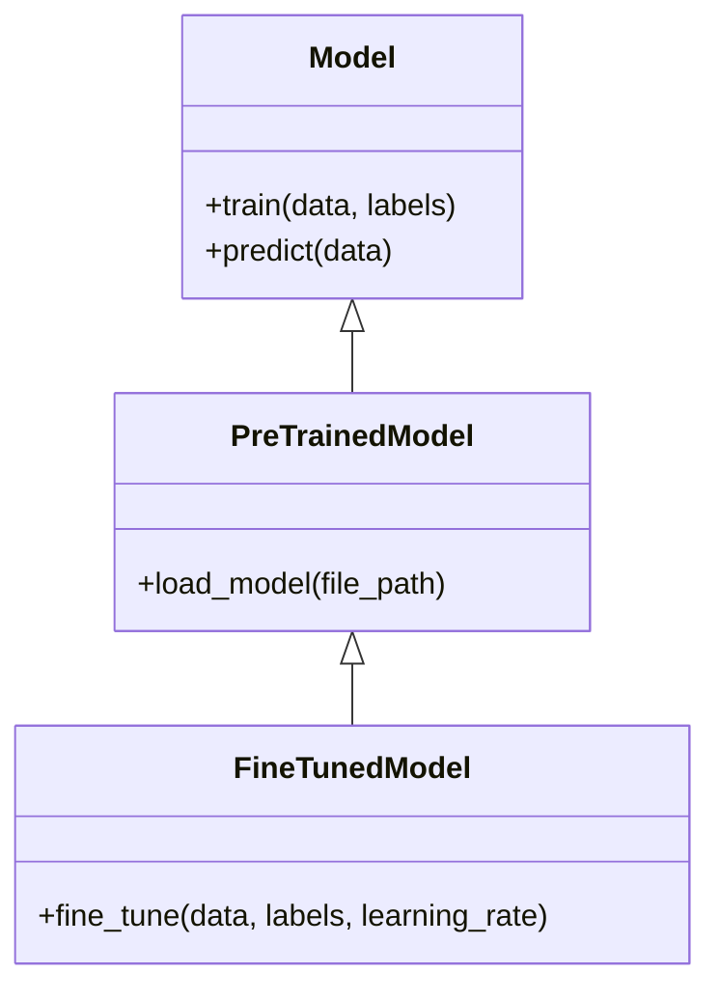
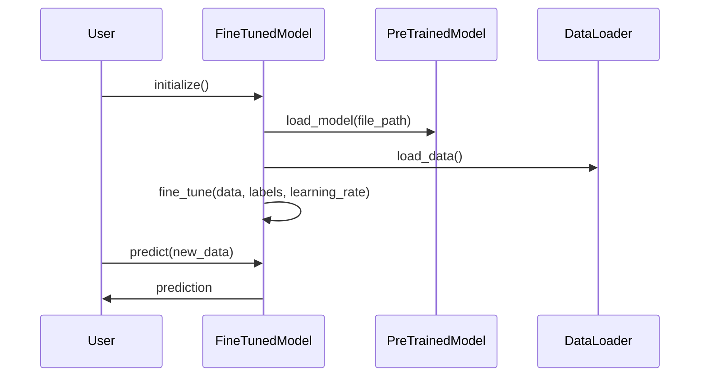

Fine-Tuning is a pivotal design pattern in neural networks, offering a strategic approach to adapt pre-trained models to new tasks by continuing their training with a small learning rate. This method leverages the extensive knowledge embedded in the pre-trained model, facilitating efficient and effective learning for specific applications.

## Introduction

Fine-Tuning involves taking a pre-trained model and training it further on a new, often smaller dataset with a low learning rate. This technique is especially useful in transfer learning scenarios where we want to leverage existing models that have been trained on large datasets to solve new, domain-specific tasks.

## Benefits

- **Reduced Training Time:** Leveraging pre-trained models significantly reduces the time required to train new models.
- **Improved Performance:** Pre-trained models have learned from large datasets, enabling better performance even with less data.
- **Efficiency:** Fine-tuning uses less computational resources compared to training from scratch.
- **Knowledge Transfer:** Utilizes the generic features learned by pre-trained models to adapt to new tasks effectively.

## Trade-Offs

- **Overfitting:** Fine-tuning with a very small dataset can lead to overfitting.
- **Dependency on Pre-Trained Models:** The quality of the fine-tuned model depends heavily on the pre-trained model used.
- **Limited Flexibility:** The architecture of the pre-trained model may not be ideal for the new task.

## UML Class Diagram



### Explanation
- `Model` is the base class with generic methods for training and prediction.
- `PreTrainedModel` extends `Model` and includes a method for loading a pre-trained model.
- `FineTunedModel` further extends `PreTrainedModel` with a method for fine-tuning the model with specific data and a small learning rate.

## UML Sequence Diagram



### Explanation
1. The `User` initializes the `FineTunedModel`.
2. The `FineTunedModel` loads a pre-trained model.
3. Data for fine-tuning is loaded.
4. The model is fine-tuned with the specific data and a small learning rate.
5. Predictions are made on new data using the fine-tuned model.

## Implementation

### Python

```python
import tensorflow as tf
from tensorflow.keras.models import load_model

class FineTunedModel:
    def __init__(self, model_path):
        self.model = load_model(model_path)

    def fine_tune(self, data, labels, learning_rate):
        self.model.compile(optimizer=tf.keras.optimizers.Adam(learning_rate=learning_rate),
                           loss='categorical_crossentropy',
                           metrics=['accuracy'])
        self.model.fit(data, labels, epochs=5)

    def predict(self, new_data):
        return self.model.predict(new_data)
```

### Java

```java
import org.deeplearning4j.nn.multilayer.MultiLayerNetwork;
import org.deeplearning4j.optimize.api.IterationListener;

public class FineTunedModel {
    private MultiLayerNetwork model;

    public FineTunedModel(String modelPath) {
        model = MultiLayerNetwork.load(new File(modelPath), true);
    }

    public void fineTune(DataSet data, double learningRate) {
        model.setLearningRate(learningRate);
        model.fit(data);
    }

    public INDArray predict(INDArray newData) {
        return model.output(newData);
    }
}
```

### Scala

```scala
import org.deeplearning4j.nn.multilayer.MultiLayerNetwork
import org.nd4j.linalg.dataset.api.iterator.DataSetIterator
import org.nd4j.linalg.factory.Nd4j

class FineTunedModel(modelPath: String) {
  private val model: MultiLayerNetwork = MultiLayerNetwork.load(new File(modelPath), true)

  def fineTune(data: DataSetIterator, learningRate: Double): Unit = {
    model.setLearningRate(learningRate)
    model.fit(data)
  }

  def predict(newData: INDArray): INDArray = {
    model.output(newData)
  }
}
```

### Clojure

```clojure
(ns fine-tuning
  (:require [dl4clj.nn.api.multilayer-network :refer [load fit]]
            [dl4clj.linalg.api.ndarray :refer [output]]))

(defn fine-tuned-model [model-path]
  (let [model (load model-path true)]
    (fn [data learning-rate]
      (doto model
        (.setLearningRate learning-rate)
        (fit data)))))

(defn predict [model new-data]
  (output model new-data))
```

## Use Cases

- **Image Classification:** Adapting a pre-trained image classification model to a specific set of categories.
- **Natural Language Processing:** Fine-tuning a pre-trained language model to improve its performance on domain-specific texts.
- **Speech Recognition:** Adapting a pre-trained speech recognition model for accents or dialects.
- **Medical Imaging:** Utilizing pre-trained models for diagnosing specific diseases with medical imaging data.

## Related Design Patterns

- **Transfer Learning:** A broader concept that includes fine-tuning as one of the methods for leveraging pre-trained models.
- **Feature Extraction:** Using a pre-trained model to extract features from data, which can be fed into another model.
- **Model Ensembling:** Combining multiple models, which can include fine-tuned models, to improve overall performance.

## Resources & References

- [TensorFlow Documentation](https://www.tensorflow.org/guide/keras/transfer_learning)
- [PyTorch Transfer Learning Tutorial](https://pytorch.org/tutorials/beginner/transfer_learning_tutorial.html)
- [DeepLearning4J Fine-Tuning Documentation](https://deeplearning4j.konduit.ai/how-to-guides/fine-tuning)
- [Keras Fine-Tuning Guide](https://keras.io/guides/transfer_learning/)

## Summary

Fine-Tuning is an efficient way to adapt pre-trained models to new, specific tasks, leveraging existing knowledge embedded in the models. By continuing the training of a pre-trained model with a small learning rate, we can quickly and effectively achieve high performance on new tasks. While it offers numerous benefits, such as reduced training time and improved performance, it is important to be mindful of potential overfitting and dependency on the pre-trained model's quality. Overall, fine-tuning is a powerful design pattern within the realm of neural networks and machine learning.

Feel free to explore the related resources and implement fine-tuning techniques to enhance your machine learning projects.
