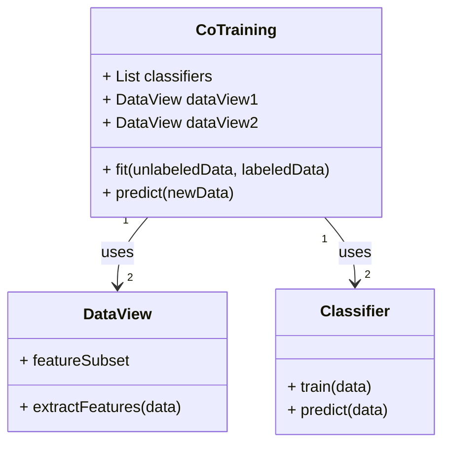
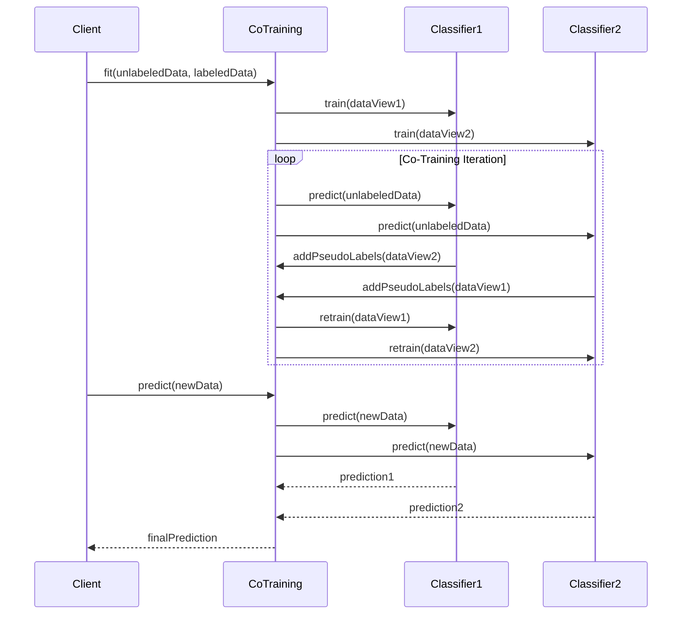

## Co-Training: Leveraging Multiple Views for Semi-Supervised Learning

Co-Training is a semi-supervised learning technique that employs multiple views of the data to enhance the performance of machine learning models when labeled data is limited. This design pattern is highly effective in scenarios where obtaining labeled data is expensive or time-consuming, but unlabeled data is abundant.

### Overview

Co-Training is built on the premise that different views of the same data can provide complementary information. Typically, it involves training two separate models on different feature sets derived from the same dataset and using each model's predictions to improve the other. This iterative process continues until the models converge or meet a predefined stopping criterion.

### UML Class Diagram



### UML Sequence Diagram



### Detailed Explanation

#### Components

1. **CoTraining Class**: Manages the co-training process by orchestrating the interactions between data views and classifiers.
2. **DataView Class**: Represents different feature subsets or perspectives of the same dataset.
3. **Classifier Class**: Represents the machine learning models used in the co-training process.

#### Process

1. **Initialization**: Split the dataset into two views, each containing a distinct subset of features.
2. **Initial Training**: Train two classifiers, one on each view.
3. **Pseudo-Labeling**: Use each classifier's predictions on the unlabeled data to generate pseudo-labels for the other view.
4. **Retraining**: Retrain each classifier on its respective view, augmented with the pseudo-labeled data from the other view.
5. **Iteration**: Repeat the pseudo-labeling and retraining steps until the classifiers converge or meet a stopping criterion.
6. **Prediction**: For new data, use both classifiers and combine their predictions to generate the final output.

### Benefits

- **Utilizes Unlabeled Data**: Makes effective use of abundant unlabeled data.
- **Improves Performance**: Enhances model accuracy in situations with limited labeled data.
- **Combines Strengths**: Takes advantage of multiple data views, leveraging different perspectives of the same data.

### Trade-Offs

- **Complexity**: More complex than supervised learning due to the need for multiple models and iterative retraining.
- **Resource Intensive**: Requires additional computational resources for managing multiple classifiers and data views.
- **Convergence Issues**: May struggle to converge if the views are not truly independent or if the initial models are poor.

### Example Implementations

#### Python Example

```python
from sklearn.base import clone
from sklearn.model_selection import train_test_split

class CoTraining:
    def __init__(self, classifier1, classifier2, view1, view2):
        self.classifier1 = classifier1
        self.classifier2 = classifier2
        self.view1 = view1
        self.view2 = view2

    def fit(self, X_unlabeled, y_labeled):
        X_train, X_valid, y_train, y_valid = train_test_split(self.view1, y_labeled, test_size=0.2)
        self.classifier1.fit(X_train, y_train)
        X_train, X_valid, y_train, y_valid = train_test_split(self.view2, y_labeled, test_size=0.2)
        self.classifier2.fit(X_train, y_train)
        
        # Co-Training Loop
        for _ in range(10):  # Assuming fixed iterations for simplicity
            pseudo_labels1 = self.classifier1.predict(self.view2)
            pseudo_labels2 = self.classifier2.predict(self.view1)
            self.classifier1.fit(self.view1, pseudo_labels2)
            self.classifier2.fit(self.view2, pseudo_labels1)
        
    def predict(self, X_new):
        pred1 = self.classifier1.predict(self.view1.transform(X_new))
        pred2 = self.classifier2.predict(self.view2.transform(X_new))
        return (pred1 + pred2) / 2  # Simple averaging, could use a more sophisticated method
```

#### Java Example

```java
public class CoTraining {
    private Classifier classifier1;
    private Classifier classifier2;
    private DataView view1;
    private DataView view2;

    public CoTraining(Classifier classifier1, Classifier classifier2, DataView view1, DataView view2) {
        this.classifier1 = classifier1;
        this.classifier2 = classifier2;
        this.view1 = view1;
        this.view2 = view2;
    }

    public void fit(List<DataPoint> unlabeledData, List<DataPoint> labeledData) {
        classifier1.train(view1.extractFeatures(labeledData));
        classifier2.train(view2.extractFeatures(labeledData));

        for (int i = 0; i < 10; i++) {  // Assuming fixed iterations
            List<Label> pseudoLabels1 = classifier1.predict(view2.extractFeatures(unlabeledData));
            List<Label> pseudoLabels2 = classifier2.predict(view1.extractFeatures(unlabeledData));
            classifier1.train(view1.extractFeatures(pseudoLabels2));
            classifier2.train(view2.extractFeatures(pseudoLabels1));
        }
    }

    public List<Label> predict(List<DataPoint> newData) {
        List<Label> pred1 = classifier1.predict(view1.extractFeatures(newData));
        List<Label> pred2 = classifier2.predict(view2.extractFeatures(newData));
        return average(pred1, pred2);
    }

    private List<Label> average(List<Label> pred1, List<Label> pred2) {
        // Implement averaging logic
        return null;
    }
}
```

#### Scala Example

```scala
class CoTraining(classifier1: Classifier, classifier2: Classifier, view1: DataView, view2: DataView) {

  def fit(unlabeledData: List[DataPoint], labeledData: List[DataPoint]): Unit = {
    classifier1.train(view1.extractFeatures(labeledData))
    classifier2.train(view2.extractFeatures(labeledData))

    for (_ <- 1 to 10) { // Assuming fixed iterations
      val pseudoLabels1 = classifier1.predict(view2.extractFeatures(unlabeledData))
      val pseudoLabels2 = classifier2.predict(view1.extractFeatures(unlabeledData))
      classifier1.train(view1.extractFeatures(pseudoLabels2))
      classifier2.train(view2.extractFeatures(pseudoLabels1))
    }
  }

  def predict(newData: List[DataPoint]): List[Label] = {
    val pred1 = classifier1.predict(view1.extractFeatures(newData))
    val pred2 = classifier2.predict(view2.extractFeatures(newData))
    average(pred1, pred2)
  }

  private def average(pred1: List[Label], pred2: List[Label]): List[Label] = {
    // Implement averaging logic
    List()
  }
}
```

#### Clojure Example

```clojure
(defn co-training
  [classifier1 classifier2 view1 view2]
  {:classifier1 classifier1
   :classifier2 classifier2
   :view1 view1
   :view2 view2})

(defn fit
  [co-training unlabeled-data labeled-data]
  (let [classifier1 (get co-training :classifier1)
        classifier2 (get co-training :classifier2)
        view1 (get co-training :view1)
        view2 (get co-training :view2)]
    (.train classifier1 (extract-features view1 labeled-data))
    (.train classifier2 (extract-features view2 labeled-data))
    (loop [i 0]
      (when (< i 10)
        (let [pseudo-labels1 (.predict classifier1 (extract-features view2 unlabeled-data))
              pseudo-labels2 (.predict classifier2 (extract-features view1 unlabeled-data))]
          (.train classifier1 (extract-features view1 pseudo-labels2))
          (.train classifier2 (extract-features view2 pseudo-labels1))
          (recur (inc i)))))))

(defn predict
  [co-training new-data]
  (let [classifier1 (get co-training :classifier1)
        classifier2 (get co-training :classifier2)
        view1 (get co-training :view1)
        view2 (get co-training :view2)
        pred1 (.predict classifier1 (extract-features view1 new-data))
        pred2 (.predict classifier2 (extract-features view2 new-data))]
    ;; Implement averaging logic here
    ))
```

### Use Cases

1. **Natural Language Processing (NLP)**: Utilizing different linguistic features such as syntax and semantics.
2. **Computer Vision**: Combining various image transformations or color channels.
3. **Healthcare**: Integrating multiple sources of patient data like medical records and lab results.
4. **Fraud Detection**: Leveraging different transaction data views, such as geographical and temporal patterns.

### Related Design Patterns

- **Self-Training**: Similar to co-training but uses a single view and model.
- **Multi-Task Learning**: Trains models on multiple related tasks simultaneously.
- **Ensemble Learning**: Combines multiple models to improve overall performance.

### Resources and References

- [Yarowsky, D. (1995). Unsupervised Word Sense Disambiguation Rivaling Supervised Methods.](https://www.aclweb.org/anthology/P95-1026/)
- [Blum, A., & Mitchell, T. (1998). Combining Labeled and Unlabeled Data with Co-Training.](https://www.cs.cmu.edu/~avrim/Papers/co-training.pdf)
- [Scikit-learn documentation](https://scikit-learn.org/stable/)
- [Machine Learning Mastery: Semi-Supervised Learning](https://machinelearningmastery.com/semi-supervised-learning/)

### Open Source Frameworks

- **Scikit-learn**: Provides basic tools for semi-supervised learning.
- **TensorFlow**: Flexible platform for implementing custom co-training algorithms.
- **Keras**: High-level API that can be used for rapid prototyping of co-training models.

### Final Summary

The Co-Training design pattern is a powerful strategy for semi-supervised learning, leveraging multiple views of the data to improve model performance when labeled data is scarce. By iteratively refining models using pseudo-labels from complementary data perspectives, co-training can achieve impressive results in various domains. However, its complexity and resource requirements necessitate careful implementation and tuning.

This article has detailed the pattern's components, process, benefits, trade-offs, and provided code examples in multiple programming languages to guide your implementation. Understanding Co-Training's use cases and related design patterns can further aid in selecting the right approach for your specific problem, enhancing the efficacy of your machine learning models.
