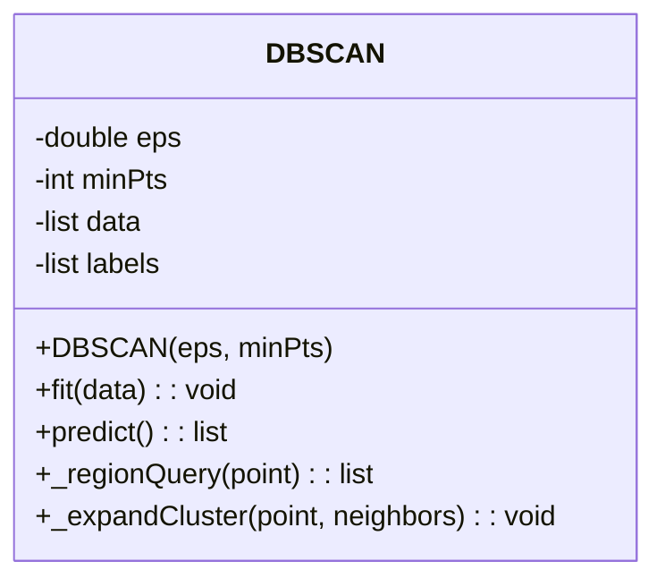
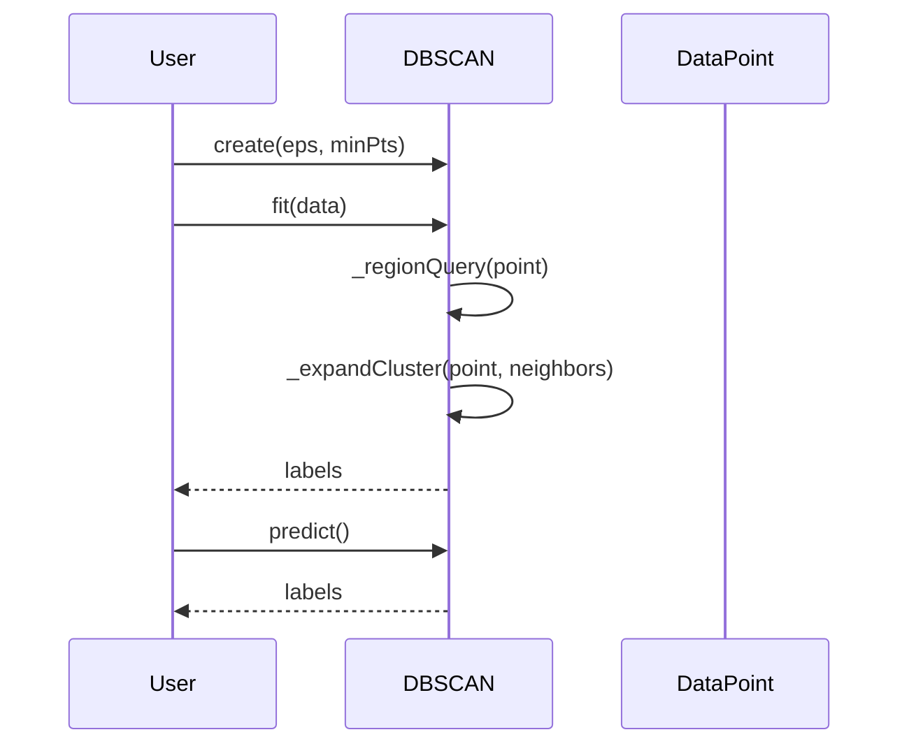

## Introduction

DBSCAN (Density-Based Spatial Clustering of Applications with Noise) is a popular density-based clustering algorithm. It is widely used in machine learning for identifying clusters in datasets that are noisy or contain outliers.

## UML Diagrams

### Class Diagram



### Sequence Diagram



## Detailed Explanation

### Key Parameters

- **eps:** The maximum distance between two samples for one to be considered as in the neighborhood of the other. This parameter is crucial for defining the density region.
- **minPts:** The number of points in a neighborhood to qualify as a dense region. This parameter helps identify cluster cores.

### Main Methods

1. **fit(data):** This method performs clustering on the data.
2. **predict():** This method predicts the cluster labels for the data.
3. **_regionQuery(point):** This method finds all points in the eps-neighborhood of a point.
4. **_expandCluster(point, neighbors):** This method expands the cluster.

## Benefits

1. **Robust to Noisy Data:** DBSCAN can identify clusters of varying shapes and sizes, even in noisy data.
2. **No Need to Specify Number of Clusters:** Unlike K-means, DBSCAN does not require the user to specify the number of clusters in advance.
3. **Handles Outliers:** Outliers are easily identified as noise points.

## Trade-offs

1. **Parameter Sensitivity:** The performance of DBSCAN depends heavily on the choice of `eps` and `minPts`.
2. **High Dimensional Data:** DBSCAN may struggle with high-dimensional data, as the concept of density can become less meaningful.
3. **Computational Complexity:** DBSCAN has a time complexity of O(n log n), but this can increase depending on the implementation and data distribution.

## Examples of Use Cases

1. **Astronomical Data Analysis:** Identifying star clusters in the sky.
2. **Geospatial Analysis:** Finding groups of similar geographical points, such as earthquake epicenters.
3. **Market Segmentation:** Segmenting customers based on purchasing behaviors.

## Example Code

### Python

```python
from sklearn.cluster import DBSCAN
import numpy as np

data = np.array([[1, 2], [2, 2], [2, 3], [8, 7], [8, 8], [25, 80]])

clustering = DBSCAN(eps=3, min_samples=2).fit(data)
print(clustering.labels_)
```

### Java

```java
import smile.clustering.DBSCAN;

public class DBSCANExample {
    public static void main(String[] args) {
        double[][] data = {
            {1, 2}, {2, 2}, {2, 3}, {8, 7}, {8, 8}, {25, 80}
        };
        DBSCAN<double[]> dbscan = new DBSCAN<>(data, 3, 2);
        int[] labels = dbscan.getClusterLabel();
        for (int label : labels) {
            System.out.println(label);
        }
    }
}
```

### Scala

```scala
import org.apache.spark.ml.clustering.DBSCAN
import org.apache.spark.sql.SparkSession

val spark = SparkSession.builder.appName("DBSCAN Example").getOrCreate()
val data = Seq((1, 2), (2, 2), (2, 3), (8, 7), (8, 8), (25, 80)).toDF("x", "y")

val dbscan = new DBSCAN()
  .setEpsilon(3)
  .setMinPoints(2)
val model = dbscan.fit(data)
val predictions = model.transform(data)
predictions.show()
spark.stop()
```

### Clojure

```clojure
(ns dbscan-example
  (:require [clojure.core.matrix :as m]
            [clojure.ml.dbscan :as db]))

(def data (m/matrix [[1 2] [2 2] [2 3] [8 7] [8 8] [25 80]]))
(def params {:eps 3 :min-pts 2})
(def model (db/fit-dbscan data params))

(println (:clusters model))
```

## Related Design Patterns

1. **K-means Clustering:** A centroid-based clustering algorithm that requires the number of clusters to be specified beforehand.
2. **Hierarchical Clustering:** Builds a hierarchy of clusters either agglomeratively or divisively.

## Resources

1. **[Scikit-Learn Documentation on DBSCAN](https://scikit-learn.org/stable/modules/generated/sklearn.cluster.DBSCAN.html)**
2. **[Smile Java Machine Learning Library](https://haifengl.github.io/)**
3. **[Spark MLlib Documentation](https://spark.apache.org/docs/latest/ml-clustering.html)**

## References

- Ester, M., Kriegel, H.-P., Sander, J., & Xu, X. (1996). A Density-Based Algorithm for Discovering Clusters in Large Spatial Databases with Noise. Proceedings of the 2nd International Conference on Knowledge Discovery and Data Mining (KDD-96).

## Summary

DBSCAN is a powerful clustering algorithm that can identify clusters of arbitrary shapes in noisy datasets without requiring the number of clusters to be specified. While it offers robustness to outliers and noise, its performance can be sensitive to parameter choices and may struggle with high-dimensional data. With applications in various domains and implementations in multiple programming languages, DBSCAN remains a widely-used tool in the machine learning and data analysis toolkit.
