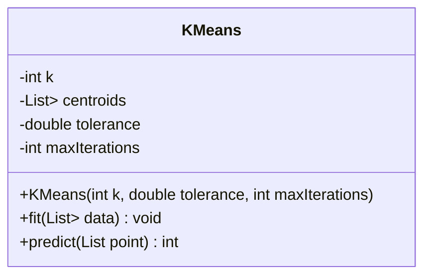
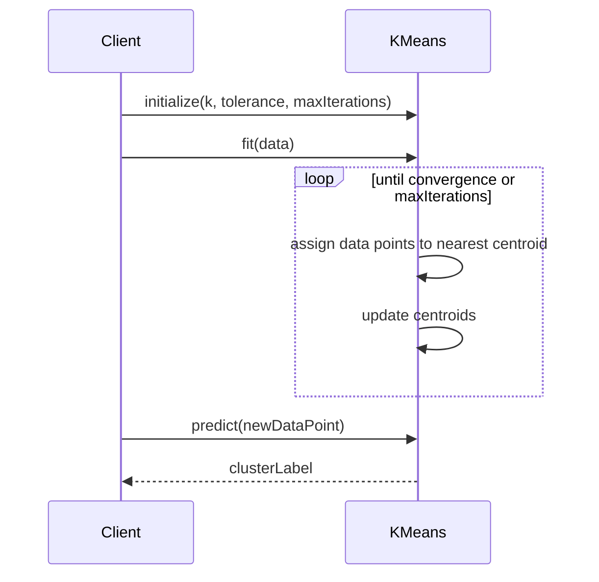

K-Means Clustering is a widely-used technique in unsupervised learning to partition datasets into K distinct clusters. This method aims to group data points such that points in the same cluster are more similar to each other than to those in other clusters.

## Benefits

- **Simplicity**: Easy to implement and understand.
- **Scalability**: Efficient for large datasets.
- **Versatility**: Used in various applications like market segmentation, image compression, and more.

## Trade-offs

- **Requires K**: The number of clusters \\(K\\) must be specified in advance.
- **Sensitive to Initialization**: Random initial centroids can affect the result.
- **Outlier Sensitivity**: Outliers can skew clusters.

## Use Cases

- **Market Segmentation**: Group customers based on purchasing behavior.
- **Image Segmentation**: Partition an image into meaningful segments.
- **Anomaly Detection**: Identify unusual data patterns.

## UML Class Diagram



## UML Sequence Diagram



## Example Implementations

### Python

```python
from sklearn.cluster import KMeans

data = [[1, 2], [1, 4], [1, 0],
        [4, 2], [4, 4], [4, 0]]

kmeans = KMeans(n_clusters=2, random_state=0).fit(data)

label = kmeans.predict([[0, 0]])
print(label)
```

### Java

```java
import org.apache.commons.math3.ml.clustering.KMeansPlusPlusClusterer;
import org.apache.commons.math3.ml.clustering.DoublePoint;
import org.apache.commons.math3.ml.clustering.Cluster;

import java.util.ArrayList;
import java.util.List;

public class KMeansExample {
    public static void main(String[] args) {
        List<DoublePoint> points = new ArrayList<>();
        points.add(new DoublePoint(new double[]{1, 2}));
        points.add(new DoublePoint(new double[]{1, 4}));
        // Add more points...

        KMeansPlusPlusClusterer<DoublePoint> clusterer = new KMeansPlusPlusClusterer<>(2);
        List<Cluster<DoublePoint>> clusterResults = clusterer.cluster(points);

        // Output cluster results
        for (Cluster<DoublePoint> cluster : clusterResults) {
            System.out.println("Cluster: " + cluster.getPoints());
        }
    }
}
```

### Scala

```scala
import org.apache.spark.ml.clustering.KMeans
import org.apache.spark.sql.SparkSession

val spark = SparkSession.builder.appName("KMeansExample").getOrCreate()
val data = Seq((0, Array(1.0, 2.0)), (1, Array(4.0, 5.0)), (2, Array(7.0, 8.0)))
val df = spark.createDataFrame(data).toDF("id", "features")

val kmeans = new KMeans().setK(2).setSeed(1L)
val model = kmeans.fit(df)

val predictions = model.transform(df)
predictions.show()

spark.stop()
```

### Clojure

```clojure
(require '[clj-ml.clustering :as clust]
         '[clj-ml.data :as data])

(def sample-data (data/make-dataset {:attributes [{:name :x1}
                                                  {:name :x2}]}
                                    {:instances [[1 2] [3 4] [5 6]]}))

(def kmeans (clust/make-clusterer :k-means {:number-clusters 2}))

(def clusters (clust/clusterer-build kmeans sample-data))

(clust/clusterer-predict clusters [7 8])
```

## Related Design Patterns

- **Agglomerative Clustering**: Another clustering algorithm that builds nested clusters.
- **DBSCAN**: Density-based clustering that can find arbitrarily shaped clusters.

## Resources and References

- [Scikit-learn Documentation](https://scikit-learn.org/stable/modules/clustering.html#k-means)
- [Apache Commons Math](https://commons.apache.org/proper/commons-math/javadocs/api-3.6.1/org/apache/commons/math3/ml/clustering/KMeansPlusPlusClusterer.html)
- [Spark MLlib KMeans](https://spark.apache.org/docs/latest/ml-clustering.html#k-means)
- [Clojure Machine Learning](https://clj-ml.github.io/)

## Open Source Frameworks

- **Scikit-learn**: Python machine learning library that provides K-Means clustering.
- **Apache Commons Math**: Provides K-Means clustering functionality in Java.
- **Apache Spark**: Distributed computing framework with MLlib for machine learning in Scala.
- **clj-ml**: A Clojure library for machine learning.

## Summary

K-Means Clustering is an effective and straightforward method for partitioning datasets into K distinct clusters. Its ease of use and scalability make it an excellent choice for various applications, from market segmentation to anomaly detection. While it has some limitations, understanding these and using appropriate initialization and parameter tuning can significantly enhance its performance.

Make sure to explore related design patterns and leverage available open source frameworks to maximize the effectiveness of your K-Means Clustering implementations.


