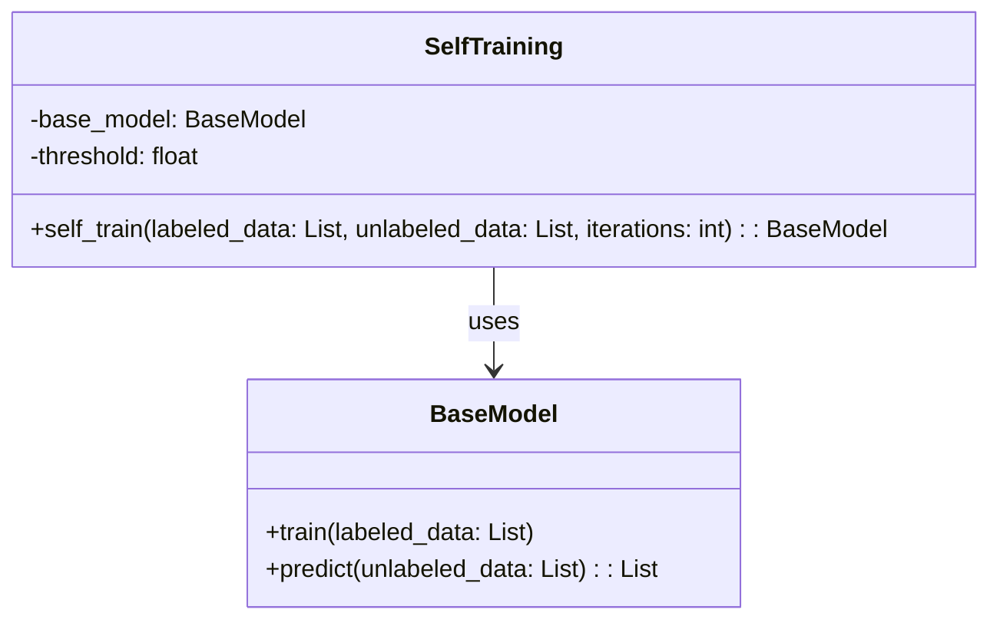
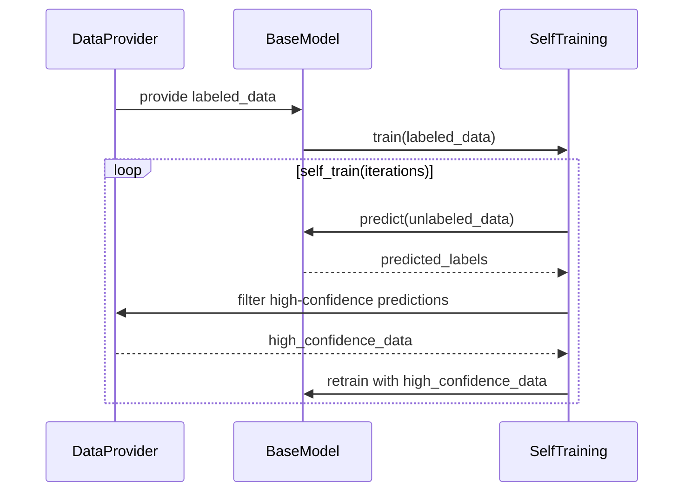

## Self-Training: Semi-Supervised Learning with Model Predictions

The Self-Training design pattern is a semi-supervised learning approach that leverages a model’s own predictions to label new data. This method can significantly improve performance when labeled data is scarce but unlabeled data is abundant.

### Benefits
- **Data Efficiency:** Makes use of a large amount of unlabeled data, which is often easier to obtain.
- **Performance Boost:** Improves model performance in situations where labeled data is limited.
- **Iterative Improvement:** The model continuously refines itself, leading to incremental improvements.

### Trade-Offs
- **Error Propagation:** Incorrect self-labeled data can reinforce errors, leading to suboptimal models.
- **Computational Cost:** Requires multiple rounds of training, which can be computationally expensive.
- **Complexity:** Adds additional steps to the training pipeline, increasing complexity.

## UML Class Diagram



### Explanation
- **BaseModel:** This represents the initial model that can be trained and used for predictions.
- **SelfTraining:** This class incorporates the Self-Training logic, using the base model to self-label new data iteratively.

## UML Sequence Diagram



### Explanation
1. **DataProvider** supplies labeled data to the BaseModel.
2. The **BaseModel** is trained on the labeled data.
3. In each iteration of self-training, the **SelfTraining** component uses the **BaseModel** to predict labels for the unlabeled data.
4. High-confidence predictions are filtered and used to re-train the **BaseModel**.

## Python Example

```python
import numpy as np
from sklearn.model_selection import train_test_split
from sklearn.metrics import accuracy_score
from sklearn.ensemble import RandomForestClassifier

class SelfTraining:
    def __init__(self, base_model, threshold=0.8):
        self.base_model = base_model
        self.threshold = threshold

    def self_train(self, labeled_data, unlabeled_data, iterations=10):
        X_labeled, y_labeled = labeled_data
        X_unlabeled = unlabeled_data

        for _ in range(iterations):
            self.base_model.fit(X_labeled, y_labeled)
            probas = self.base_model.predict_proba(X_unlabeled)
            max_proba = np.max(probas, axis=1)
            high_conf_indices = max_proba >= self.threshold
            
            X_high_conf = X_unlabeled[high_conf_indices]
            y_high_conf = self.base_model.predict(X_high_conf)

            X_labeled = np.concatenate((X_labeled, X_high_conf), axis=0)
            y_labeled = np.concatenate((y_labeled, y_high_conf), axis=0)
            X_unlabeled = X_unlabeled[~high_conf_indices]

        return self.base_model

base_model = RandomForestClassifier()
self_trainer = SelfTraining(base_model)
labeled_data = (X_train_labeled, y_train_labeled)
unlabeled_data = X_train_unlabeled
trained_model = self_trainer.self_train(labeled_data, unlabeled_data)

y_pred = trained_model.predict(X_test)
print('Accuracy:', accuracy_score(y_test, y_pred))
```

## Java Example

```java
import weka.classifiers.Classifier;
import weka.classifiers.trees.RandomForest;
import weka.core.Instances;
import weka.core.converters.ConverterUtils.DataSource;

public class SelfTraining {
    private Classifier baseModel;
    private double threshold;

    public SelfTraining(Classifier baseModel, double threshold) {
        this.baseModel = baseModel;
        this.threshold = threshold;
    }

    public Classifier selfTrain(Instances labeledData, Instances unlabeledData, int iterations) throws Exception {
        for (int i = 0; i < iterations; i++) {
            baseModel.buildClassifier(labeledData);
            Instances newLabeledData = new Instances(labeledData);
            
            for (int j = 0; j < unlabeledData.numInstances(); j++) {
                double[] distribution = baseModel.distributionForInstance(unlabeledData.instance(j));
                double maxProba = 0;
                int maxIndex = -1;

                for (int k = 0; k < distribution.length; k++) {
                    if (distribution[k] > maxProba) {
                        maxProba = distribution[k];
                        maxIndex = k;
                    }
                }

                if (maxProba >= threshold) {
                    double[] values = unlabeledData.instance(j).toDoubleArray();
                    values[unlabeledData.classIndex()] = maxIndex;
                    newLabeledData.add(unlabeledData.instance(j).copy(values));
                }
            }

            labeledData = newLabeledData;
        }

        return baseModel;
    }

    public static void main(String[] args) throws Exception {
        Instances labeledData = DataSource.read("labeled.arff");
        Instances unlabeledData = DataSource.read("unlabeled.arff");
        labeledData.setClassIndex(labeledData.numAttributes() - 1);
        unlabeledData.setClassIndex(unlabeledData.numAttributes() - 1);

        RandomForest baseModel = new RandomForest();
        SelfTraining selfTraining = new SelfTraining(baseModel, 0.8);
        Classifier trainedModel = selfTraining.selfTrain(labeledData, unlabeledData, 10);

        // Evaluation code here...
    }
}
```

## Related Design Patterns

### **Bootstrapping**
This pattern involves generating new data points by perturbing the original dataset. Unlike Self-Training, Bootstrapping focuses on enhancing dataset diversity rather than labeling new data.

### **Active Learning**
Active Learning queries the user to label the most informative data points. In contrast, Self-Training autonomously labels data based on model confidence.

## Resources and References
- **Books:** "Semi-Supervised Learning" by Olivier Chapelle, Bernhard Scholkopf, Alexander Zien.
- **Articles:** "Self-training with consistency regularization for text classification" by Zhu et al.
- **Frameworks:** Scikit-learn, Weka, TensorFlow.

## Final Summary

The Self-Training design pattern is an effective semi-supervised learning technique that iteratively enhances model performance by using its own predictions to label new data. While powerful, it comes with trade-offs such as potential error propagation and computational overhead. Nonetheless, it remains a valuable strategy for leveraging unlabeled datasets in various applications, from text classification to image recognition.
