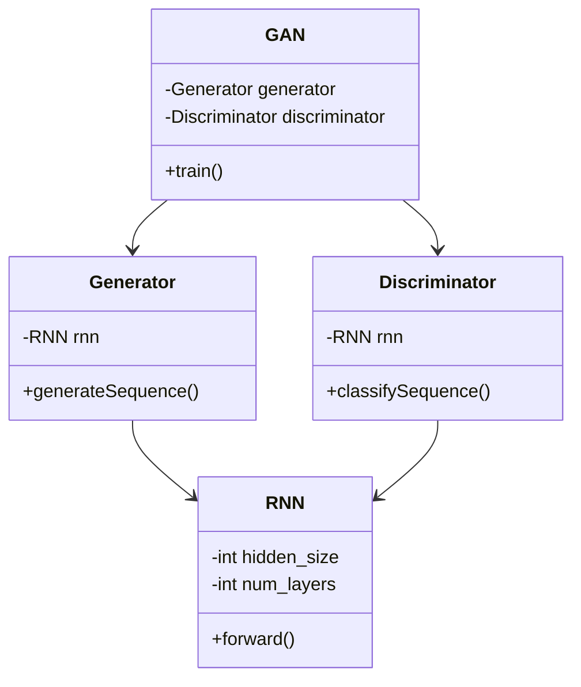
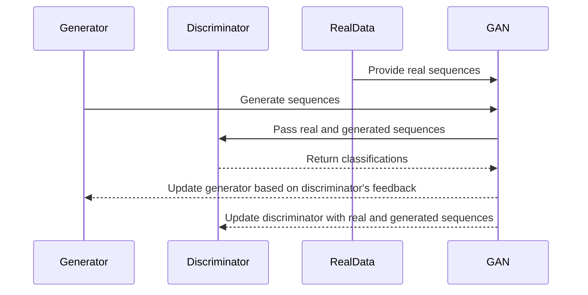

The GAN-RNN design pattern is a combination of Generative Adversarial Networks (GANs) and Recurrent Neural Networks (RNNs) aimed at generating sequential data. This hybrid architecture leverages the strengths of both models: the generative capabilities of GANs and the temporal dependencies handled by RNNs.


## Introduction

Generative Adversarial Networks (GANs) have revolutionized the field of artificial intelligence by enabling the generation of high-quality data that is indistinguishable from real data. However, standard GANs are limited in their ability to model sequential dependencies. Recurrent Neural Networks (RNNs), on the other hand, are excellent at handling sequences of data, making them ideal for tasks like language modeling, time series prediction, and sequential data generation. By integrating GANs with RNNs, we can generate high-quality sequential data.

## Architecture Overview

A GAN-RNN consists of two main components:
- **Generator**: An RNN-based model that generates sequential data.
- **Discriminator**: A model (often another RNN) that evaluates the authenticity of the generated data.

During training, these components engage in a game-theoretic scenario where the generator tries to fool the discriminator, while the discriminator learns to distinguish between real and generated sequences.

## UML Diagrams

### Class Diagram

Below is a UML Class Diagram illustrating the GAN-RNN structure:



### Sequence Diagram

The Sequence Diagram below demonstrates a typical training cycle in a GAN-RNN:



## Implementation Examples

### Python

Here is an example implementation in Python using PyTorch:

```python
import torch
import torch.nn as nn

class RNNGenerator(nn.Module):
    def __init__(self, input_size, hidden_size, num_layers):
        super(RNNGenerator, self).__init__()
        self.rnn = nn.RNN(input_size, hidden_size, num_layers, batch_first=True)
        self.fc = nn.Linear(hidden_size, input_size)

    def forward(self, x):
        h_0 = torch.zeros(num_layers, x.size(0), hidden_size)
        out, _ = self.rnn(x, h_0)
        out = self.fc(out)
        return out

class RNNDiscriminator(nn.Module):
    def __init__(self, input_size, hidden_size, num_layers):
        super(RNNDiscriminator, self).__init__()
        self.rnn = nn.RNN(input_size, hidden_size, num_layers, batch_first=True)
        self.fc = nn.Linear(hidden_size, 1)

    def forward(self, x):
        h_0 = torch.zeros(num_layers, x.size(0), hidden_size)
        out, _ = self.rnn(x, h_0)
        out = self.fc(out[:, -1, :])
        return out

class GAN:
    def __init__(self, generator, discriminator, lr=0.001):
        self.generator = generator
        self.discriminator = discriminator
        self.criterion = nn.BCEWithLogitsLoss()
        self.optimizer_G = torch.optim.Adam(generator.parameters(), lr=lr)
        self.optimizer_D = torch.optim.Adam(discriminator.parameters(), lr=lr)

    def train(self, real_data, epochs):
        for epoch in range(epochs):
            # Train Discriminator
            self.optimizer_D.zero_grad()
            real_labels = torch.ones(real_data.size(0), 1)
            fake_data = self.generator(torch.randn(real_data.size()))
            fake_labels = torch.zeros(fake_data.size(0), 1)
            loss_D = self.criterion(self.discriminator(real_data), real_labels) + \
                     self.criterion(self.discriminator(fake_data.detach()), fake_labels)
            loss_D.backward()
            self.optimizer_D.step()

            # Train Generator
            self.optimizer_G.zero_grad()
            fake_data = self.generator(torch.randn(real_data.size()))
            loss_G = self.criterion(self.discriminator(fake_data), real_labels)
            loss_G.backward()
            self.optimizer_G.step()
```

### Java

A simple implementation in Java:

```java
// Note: Implementation requires deep learning frameworks such as DL4J

public class RNNGenerator extends MultiLayerNetwork {
    public RNNGenerator(int inputSize, int hiddenSize, int numLayers) {
        super(new NeuralNetConfiguration.Builder()
            .list()
            .layer(0, new GravesLSTM.Builder().nIn(inputSize).nOut(hiddenSize).build())
            .layer(1, new RnnOutputLayer.Builder().nIn(hiddenSize).nOut(inputSize).build())
            .build());
    }

    public INDArray generate(INDArray input) {
        return output(input);
    }
}

public class RNNDiscriminator extends MultiLayerNetwork {
    public RNNDiscriminator(int inputSize, int hiddenSize, int numLayers) {
        super(new NeuralNetConfiguration.Builder()
            .list()
            .layer(0, new GravesLSTM.Builder().nIn(inputSize).nOut(hiddenSize).build())
            .layer(1, new OutputLayer.Builder().nIn(hiddenSize).nOut(1).build())
            .build());
    }

    public double classify(INDArray input) {
        return output(input).getDouble(0);
    }
}
```

### Scala

Using Apache MXNet for Scala:

```scala
import org.apache.mxnet._
import org.apache.mxnet.optimizer.Adam

class RNNGenerator(inputSize: Int, hiddenSize: Int, numLayers: Int) {
    // Define the architecture
    val input = Symbol.Variable("data")
    val rnn = RNN(input, stateSize = hiddenSize, mode = RNNCellType.LSTM)
    val output = Symbol.FullyConnected(data = rnn, numHidden = inputSize)
    
    val mod = new Module(output, dataShapes = Array(Shape(1, inputSize)))
    mod.bind(Array(Shape(1, inputSize)), Some(Shape(1, inputSize)))
    mod.initParams()
    mod.initOptimizer(new Adam())
}

class RNNDiscriminator(inputSize: Int, hiddenSize: Int, numLayers: Int) {
    // Define the architecture
    val input = Symbol.Variable("data")
    val rnn = RNN(input, stateSize = hiddenSize, mode = RNNCellType.LSTM)
    val output = Symbol.FullyConnected(data = rnn, numHidden = 1)
    
    val mod = new Module(output, dataShapes = Array(Shape(1, inputSize)))
    mod.bind(Array(Shape(1, inputSize)), Some(Shape(1, inputSize)))
    mod.initParams()
    mod.initOptimizer(new Adam())
}
```

### Clojure

Using DeepLearning4j for Clojure:

```clojure
(defn create-rnn-generator [input-size hidden-size num-layers]
  (new-builder
   .layer (org.deeplearning4j.nn.conf.layers.LSTM$Builder. :nIn input-size :nOut hidden-size)
   .layer (org.deeplearning4j.nn.conf.layers.RnnOutputLayer$Builder. :nIn hidden-size :nOut input-size)))

(defn create-rnn-discriminator [input-size hidden-size num-layers]
  (new-builder
   .layer (org.deeplearning4j.nn.conf.layers.LSTM$Builder. :nIn input-size :nOut hidden-size)
   .layer (org.deeplearning4j.nn.conf.layers.OutputLayer$Builder. :nIn hidden-size :nOut 1)))
```

## Benefits

- **Sequential Data Generation**: Capable of producing realistic sequential data, crucial for applications such as text and time series generation.
- **End-to-end Training**: By training the generator and discriminator simultaneously, the system can learn complex patterns in sequential data.
- **Flexibility**: The architecture can be adapted to various types of sequential data.

## Trade-offs

- **Complexity**: Training GANs is notoriously difficult due to their adversarial nature, and combining them with RNNs adds additional complexity.
- **Resource Intensive**: Requires significant computational resources for training, especially for long sequences.
- **Stability Issues**: GANs can suffer from mode collapse and unstable training dynamics, which may be exacerbated in GAN-RNNs.

## Use Cases

- **Language Modeling**: Generating coherent sequences of text.
- **Music Generation**: Creating new pieces of music by learning from existing compositions.
- **Time Series Prediction**: Generating future data points based on historical trends.

## Related Design Patterns

- **Seq2Seq**: A pattern used for sequence-to-sequence tasks that often uses RNNs or their variants.
- **Autoencoders**: Useful for dimensionality reduction and feature learning, often employed in conjunction with GANs.
- **Attention Mechanism**: Enhances model performance on sequence-based tasks by focusing on relevant parts of the input sequence.

## Resources and References

- **Papers**: 
  - "Generative Adversarial Nets" by Ian Goodfellow et al.
  - "Sequence Generative Adversarial Nets with Policy Gradient" by Lantao Yu et al.
- **Frameworks**:
  - PyTorch
  - TensorFlow
  - DeepLearning4j
  - Apache MXNet

## Summary

The GAN-RNN design pattern provides a powerful approach for generating sequential data by combining the strengths of GANs and RNNs. Despite its complexity and computational demands, this architecture opens up new possibilities for generating realistic sequential data in various domains, from language to music and time series forecasting.

By understanding and implementing the GAN-RNN pattern, data scientists and machine learning engineers can tackle more sophisticated problems in sequential data generation, leading to more advanced AI applications.

For further exploration, the provided resources and references will offer additional insights and implementation guidance.
