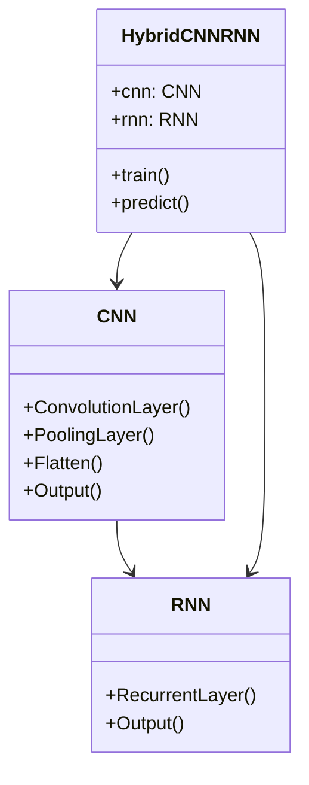
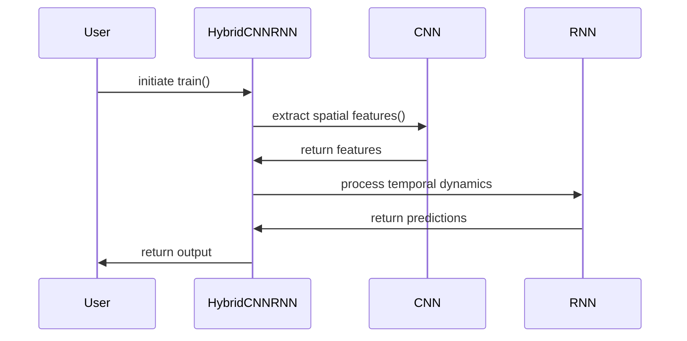

## Introduction

The **Hybrid CNN-RNN** design pattern effectively combines Convolutional Neural Networks (CNNs) and Recurrent Neural Networks (RNNs) to leverage their respective strengths in handling spatial and temporal data. This is particularly useful for applications like video recognition, where both spatial (image frames) and temporal (sequence of frames) information are crucial.

## Benefits

1. **Spatial Feature Extraction**: CNNs are proficient at extracting spatial features from image data.
2. **Temporal Dynamics Modeling**: RNNs excel at understanding temporal dependencies and sequential information.
3. **Enhanced Accuracy**: Combining CNNs and RNNs leads to more accurate models for tasks requiring both spatial and temporal understanding.
4. **Scalability**: This pattern allows for modular design, where CNN and RNN components can be optimized and scaled independently.

## Trade-offs

1. **Complexity**: Integrating CNNs and RNNs increases the complexity of the model architecture.
2. **Training Time**: More sophisticated models often require more extensive training times and computational resources.
3. **Hyperparameter Tuning**: Balancing the parameters for both CNN and RNN components can be challenging.

## Use Case: Video Recognition

In video recognition, each frame of the video is first processed by a CNN to extract spatial features. These features are then fed into an RNN to capture the temporal dynamics. This combination is adept at tasks such as action recognition, gesture recognition, and video classification.

## UML Diagrams

### Class Diagram



### Sequence Diagram



## Code Examples

### Python

```python
import torch
import torch.nn as nn

class CNN(nn.Module):
    def __init__(self):
        super(CNN, self).__init__()
        self.conv = nn.Conv2d(3, 16, 3, 1)
        self.pool = nn.MaxPool2d(2, 2)
        self.flatten = nn.Flatten()

    def forward(self, x):
        x = self.pool(torch.relu(self.conv(x)))
        x = self.flatten(x)
        return x

class RNN(nn.Module):
    def __init__(self):
        super(RNN, self).__init__()
        self.rnn = nn.LSTM(input_size=16*14*14, hidden_size=256, num_layers=1, batch_first=True)
        self.fc = nn.Linear(256, 10)

    def forward(self, x):
        x, _ = self.rnn(x)
        x = self.fc(x[:, -1, :])
        return x

class HybridCNNRNN(nn.Module):
    def __init__(self):
        super(HybridCNNRNN, self).__init__()
        self.cnn = CNN()
        self.rnn = RNN()

    def forward(self, x):
        batch_size, timesteps, C, H, W = x.size()
        c_out = self.cnn(x.view(batch_size * timesteps, C, H, W))
        r_out = self.rnn(c_out.view(batch_size, timesteps, -1))
        return r_out

model = HybridCNNRNN()
input_tensor = torch.randn((32, 10, 3, 28, 28))  # batch of 32 videos, each with 10 frames of 28x28 RGB images
output = model(input_tensor)
print(output.shape)  # Expected output: torch.Size([32, 10])
```

### Java

```java
import org.deeplearning4j.nn.api.Layer;
import org.deeplearning4j.nn.conf.MultiLayerConfiguration;
import org.deeplearning4j.nn.conf.NeuralNetConfiguration;
import org.deeplearning4j.nn.conf.layers.*;
import org.deeplearning4j.nn.multilayer.MultiLayerNetwork;
import org.deeplearning4j.optimize.api.TrainingListener;
import org.nd4j.linalg.dataset.api.iterator.DataSetIterator;

public class HybridCNNRNN {

    private MultiLayerNetwork model;

    public HybridCNNRNN() {
        MultiLayerConfiguration conf = new NeuralNetConfiguration.Builder()
            .list()
            .layer(0, new ConvolutionLayer.Builder(3, 3)
                .nIn(3)
                .nOut(16)
                .stride(1, 1)
                .activation(Activation.RELU)
                .build())
            .layer(1, new SubsamplingLayer.Builder(SubsamplingLayer.PoolingType.MAX)
                .kernelSize(2, 2)
                .stride(2, 2)
                .build())
            .layer(2, new LSTM.Builder()
                .nIn(16 * 14 * 14)
                .nOut(256)
                .activation(Activation.TANH)
                .build())
            .layer(3, new RnnOutputLayer.Builder()
                .nIn(256)
                .nOut(10)
                .activation(Activation.SOFTMAX)
                .build())
            .backpropType(BackpropType.Standard)
            .build();

        model = new MultiLayerNetwork(conf);
        model.init();
    }

    public void train(DataSetIterator trainData, TrainingListener... listeners) {
        model.setListeners(listeners);
        model.fit(trainData);
    }

    public INDArray predict(INDArray input) {
        return model.output(input);
    }
}
```

### Scala

```scala
import org.deeplearning4j.nn.conf._
import org.deeplearning4j.nn.conf.layers._
import org.deeplearning4j.nn.multilayer.MultiLayerNetwork
import org.nd4j.linalg.dataset.api.iterator.DataSetIterator

class HybridCNNRNN {

  val conf: MultiLayerConfiguration = new NeuralNetConfiguration.Builder()
    .list()
    .layer(0, new ConvolutionLayer.Builder(3, 3)
      .nIn(3)
      .nOut(16)
      .stride(1, 1)
      .activation(Activation.RELU)
      .build())
    .layer(1, new SubsamplingLayer.Builder(SubsamplingLayer.PoolingType.MAX)
      .kernelSize(2, 2)
      .stride(2, 2)
      .build())
    .layer(2, new LSTM.Builder()
      .nIn(16 * 14 * 14)
      .nOut(256)
      .activation(Activation.TANH)
      .build())
    .layer(3, new RnnOutputLayer.Builder()
      .nIn(256)
      .nOut(10)
      .activation(Activation.SOFTMAX)
      .build())
    .backpropType(BackpropType.Standard)
    .build()

  val model = new MultiLayerNetwork(conf)
  model.init()

  def train(trainData: DataSetIterator): Unit = {
    model.fit(trainData)
  }

  def predict(input: INDArray): INDArray = {
    model.output(input)
  }
}
```

### Clojure

```clojure
(ns hybrid-cnn-rnn.core
  (:require [org.deeplearning4j.nn.api :refer [NeuralNetwork]]
            [org.deeplearning4j.nn.conf.layers :refer [ConvolutionLayer$Builder
                                                       SubsamplingLayer$Builder
                                                       LSTM$Builder
                                                       RnnOutputLayer$Builder]]
            [org.deeplearning4j.nn.multilayer :as multi-layer]))

(defn create-model []
  (let [conf (-> (NeuralNetConfiguration$Builder.)
                 (.list)
                 (.layer 0 (-> (ConvolutionLayer$Builder. 3 3)
                               (.nIn 3)
                               (.nOut 16)
                               (.stride 1 1)
                               (.activation (Activation/RELU))
                               (.build)))
                 (.layer 1 (-> (SubsamplingLayer$Builder.)
                               (.kernelSize 2 2)
                               (.stride 2 2)
                               (.build)))
                 (.layer 2 (-> (LSTM$Builder.)
                               (.nIn (* 16 14 14))
                               (.nOut 256)
                               (.activation (Activation/TANH))
                               (.build)))
                 (.layer 3 (-> (RnnOutputLayer$Builder.)
                               (.nIn 256)
                               (.nOut 10)
                               (.activation (Activation/SOFTMAX))
                               (.build)))
                 (.backpropType (BackpropType/Standard))
                 (.build))]
    (multi-layer/multi-layer-network conf)))

(defn train-model [model train-data]
  (.fit model train-data))

(defn predict [model input]
  (.output model input))
```

## Related Design Patterns

- **Sequential Neural Network**: Uses a series of layers arranged in sequence, suitable for simpler tasks compared to the hybrid pattern.
- **ResNet (Residual Networks)**: Incorporates skip connections to mitigate the vanishing gradient problem in very deep networks.
- **Attention Mechanism**: Enhances models by focusing on important parts of the input, often used in conjunction with RNNs in NLP tasks.

## Resources and References

- [Deep Learning Book by Ian Goodfellow](https://www.deeplearningbook.org/)
- [CS231n: Convolutional Neural Networks for Visual Recognition](http://cs231n.stanford.edu/)
- [Sequence Models by Andrew Ng on Coursera](https://www.coursera.org/learn/nlp-sequence-models)

## Open Source Frameworks

- **TensorFlow**: Extensive support for both CNNs and RNNs with rich documentation.
- **PyTorch**: Popular for its dynamic computation graph and ease of use.
- **Deeplearning4j**: JVM-based framework useful for integrating with Java and Scala projects.

## Summary

The **Hybrid CNN-RNN** design pattern elegantly combines the strengths of Convolutional Neural Networks and Recurrent Neural Networks to process structured data, particularly useful in video recognition tasks. Despite the increased complexity and training time, the enhanced accuracy and scalability make this pattern a powerful tool in modern deep learning applications. Understanding its intricacies and implementation can significantly boost the performance of models dealing with both spatial and temporal data.

---

By integrating these advanced neural network structures, you can address complex problems in video recognition and other sequential tasks with higher accuracy and efficiency. The example codes in Python, Java, Scala, and Clojure provided here should offer a good starting point for your implementations. For further reading and experimentation, explore the listed resources and frameworks to deepen your understanding.
