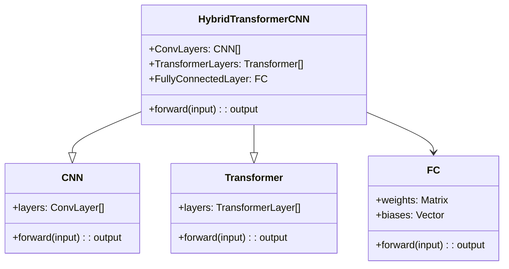
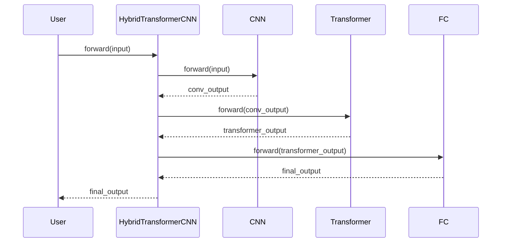

## Introduction
The Hybrid Transformer-CNN design pattern blends the power of Transformer models with Convolutional Neural Networks (CNNs) to achieve robust hierarchical feature extraction. This pattern leverages the strengths of both models, offering superior performance in tasks that require comprehensive feature extraction.

## Benefits
- **Hierarchical Feature Extraction:** Combines local feature extraction (CNNs) with global context understanding (Transformers).
- **Enhanced Accuracy:** Superior performance in complex tasks requiring multi-scale feature analysis.
- **Flexibility:** Can be adapted to various domains like image classification, object detection, and natural language processing.

## Trade-offs
- **Computational Cost:** Increased complexity leading to higher computational resources required.
- **Training Time:** Longer training periods due to the integration of multiple sophisticated models.
- **Implementation Complexity:** Higher barrier to entry in terms of implementation and tuning.

## Use Cases
- **Image Classification:** Enhancing feature extraction for improved classification accuracy.
- **Object Detection:** Superior detection capabilities due to combined contextual and spatial analysis.
- **Natural Language Processing:** Improved context understanding and token feature extraction.

## UML Class Diagram



## UML Sequence Diagram



## Example Implementations

### Python

```python
import torch
import torch.nn as nn
from transformers import BertModel

class HybridTransformerCNN(nn.Module):
    def __init__(self):
        super(HybridTransformerCNN, self).__init__()
        self.conv_layers = nn.Sequential(
            nn.Conv2d(3, 64, kernel_size=3, padding=1),
            nn.ReLU(),
            nn.MaxPool2d(kernel_size=2, stride=2)
        )
        self.transformer = BertModel.from_pretrained('bert-base-uncased')
        self.fc = nn.Linear(768, 10)  # Assuming 10 classes for classification

    def forward(self, x):
        x = self.conv_layers(x)
        x = x.view(x.size(0), -1)  # Flatten
        x = self.transformer(x)[0]
        x = self.fc(x)
        return x

model = HybridTransformerCNN()
```

### Java

```java
// Pseudo-code, specific frameworks like DL4J needed for actual implementation
public class HybridTransformerCNN extends NeuralNetwork {
    private CNN cnnLayers;
    private Transformer transformer;
    private DenseLayer fcLayer;

    public HybridTransformerCNN() {
        cnnLayers = new CNN();
        transformer = new Transformer();
        fcLayer = new DenseLayer(768, 10); // Assuming 10 classes
    }

    public Tensor forward(Tensor input) {
        Tensor convOutput = cnnLayers.forward(input);
        Tensor transformerOutput = transformer.forward(convOutput);
        Tensor finalOutput = fcLayer.forward(transformerOutput);
        return finalOutput;
    }
}
```

### Scala

```scala
// Pseudo-code
class HybridTransformerCNN extends Module {
  val convLayers = Sequential(
    Conv2d(3, 64, kernel_size=3, padding=1),
    ReLU(),
    MaxPool2d(kernel_size=2, stride=2)
  )
  val transformer = BertModel.from_pretrained("bert-base-uncased")
  val fc = Linear(768, 10) // Assuming 10 classes

  def forward(x: Tensor): Tensor = {
    val x = convLayers.forward(x)
    val x = x.view(x.size(0), -1)
    val x = transformer.forward(x).get(0)
    val x = fc.forward(x)
    x
  }
}
```

### Clojure

```clojure
;; Pseudo-code, using a deep learning library like Cortex
(defn hybrid-transformer-cnn []
  (let [conv-layers (sequential (conv2d 3 64 :kernel-size 3 :padding 1)
                                 relu
                                 (max-pool2d :kernel-size 2 :stride 2))
        transformer (bert-model :from-pretrained "bert-base-uncased")
        fc (linear 768 10)] ;; Assuming 10 classes
    (fn [x]
      (let [x (-> x
                  (conv-layers)
                  (reshape [(size 0) -1])
                  (transformer))
            x (fc x)]
        x))))
```

## Related Design Patterns
- **Attention Mechanism:** Core to transformer models, it focuses on different parts of the input sequence to improve performance.
- **Residual Networks (ResNet):** Similar hierarchical feature extraction technique used within CNNs to address the vanishing gradient problem.
- **Inception Network:** Utilizes multiple filter sizes to capture different feature scales within CNNs.

## Resources and References
- **Open Source Frameworks:** PyTorch, TensorFlow, Keras, Hugging Face Transformers.
- **Key Papers:**
  - Vaswani et al., "Attention is All You Need"
  - He et al., "Deep Residual Learning for Image Recognition"
- **Further Reading:**
  - [Transformer Models](https://arxiv.org/abs/1706.03762)
  - [Convolutional Neural Networks](https://www.deeplearningbook.org/)

## Summary
The Hybrid Transformer-CNN pattern is a sophisticated integration of transformers and CNNs, offering a powerful approach for tasks requiring robust hierarchical feature extraction. While it comes with increased computational costs and implementation complexity, its benefits in performance and flexibility make it a valuable tool in various advanced deep learning applications.
