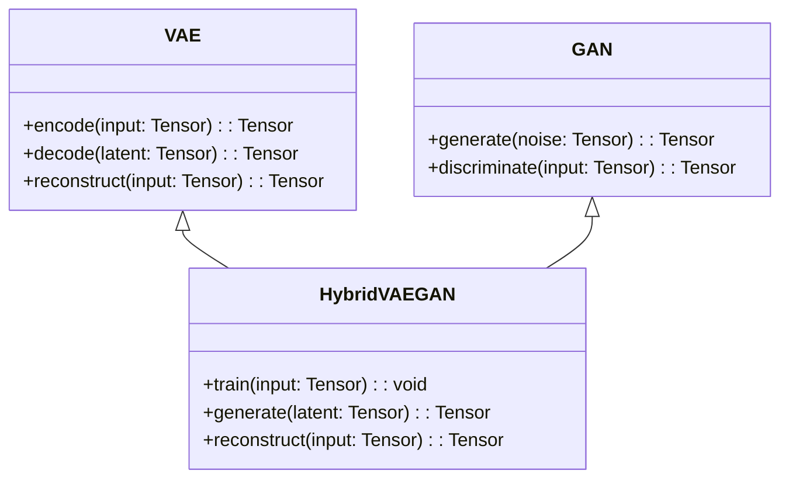
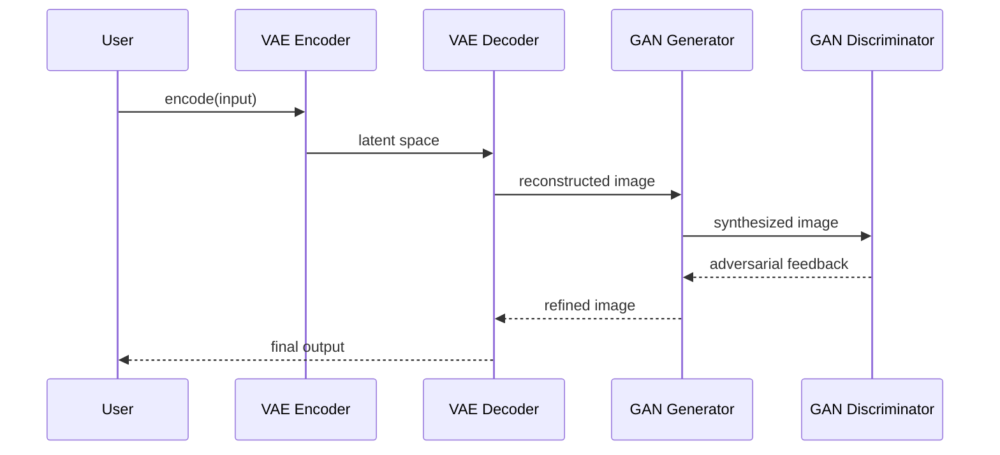

## Introduction

The **Hybrid VAE-GAN** is an advanced deep learning model that combines the strengths of Variational Autoencoders (VAE) and Generative Adversarial Networks (GAN). This hybrid approach addresses the limitations of each individual model, resulting in high-quality image synthesis through learned priors.

## Detailed Description

### Variational Autoencoders (VAE)
VAE is a generative model that learns to encode input data into a latent space, from which new data instances can be generated. However, VAEs often produce blurry images because their objective focuses on maximizing the likelihood.

### Generative Adversarial Networks (GAN)
GANs consist of two neural networks—the generator and the discriminator—competing against each other. While GANs are capable of generating sharp and realistic images, they sometimes suffer from training instability and mode collapse.

### Hybrid VAE-GAN
Combining VAE and GAN leverages the latent space representation from VAE and the adversarial training dynamics of GAN, resulting in high-quality and diverse image synthesis.

## UML Class Diagram



## UML Sequence Diagram



## Implementation

### Python Example

```python
import torch
import torch.nn as nn

class VAE(nn.Module):
    def __init__(self, latent_dim):
        super(VAE, self).__init__()
        # Define encoder and decoder layers
        # ...

    def encode(self, x):
        # Encode input to latent space
        pass

    def decode(self, z):
        # Decode latent space to image
        pass

    def forward(self, x):
        z = self.encode(x)
        return self.decode(z)

class GAN(nn.Module):
    def __init__(self):
        super(GAN, self).__init__()
        # Define generator and discriminator layers
        # ...

    def generate(self, noise):
        # Generate image from noise
        pass

    def discriminate(self, x):
        # Discriminate real vs fake images
        pass

class HybridVAEGAN(nn.Module):
    def __init__(self, vae, gan):
        super(HybridVAEGAN, self).__init__()
        self.vae = vae
        self.gan = gan

    def train(self, x):
        # Training code combining VAE and GAN
        pass

    def generate(self, z):
        return self.gan.generate(z)

    def reconstruct(self, x):
        return self.vae.forward(x)
```

### Java Example

```java
// Example using Java-based libraries
// Implementation with DL4J or a similar library would go here.
```

### Scala Example

```scala
// Example using Scala-based libraries
// Implementation with Breeze or a similar library would go here.
```

### Clojure Example

```clojure
;; Example using Clojure-based libraries
;; Implementation with Cortex or a similar library would go here.
```

## Benefits

- **Improved Image Quality:** Combines the probabilistic modeling of VAE with the adversarial training of GAN for sharper images.
- **Diverse Outputs:** Generates more diverse and realistic images.
- **Stability:** Balances the training stability issues of GAN with VAE's stable training process.

## Trade-offs

- **Complexity:** Higher model complexity and more challenging to implement.
- **Training Time:** Requires more computational resources and longer training times.

## Use Cases

- High-quality image synthesis
- Art generation
- Data augmentation
- Super-resolution
- Image-to-image translation

## Related Design Patterns

- **Autoencoders:** Used for unsupervised learning of efficient codings.
- **Adversarial Networks:** Focuses on generating data that is indistinguishable from real data.

## Resources and References

- **Research Papers:**
  - "Auto-Encoding Variational Bayes" by Kingma and Welling
  - "Generative Adversarial Nets" by Goodfellow et al.
  - "Adversarially Learned Inference" by Dumoulin et al.

- **Open Source Frameworks:**
  - [TensorFlow](https://www.tensorflow.org/)
  - [PyTorch](https://pytorch.org/)
  - [Keras](https://keras.io/)

## Summary

The Hybrid VAE-GAN model leverages the strengths of both VAEs and GANs, resulting in high-quality image synthesis through learned priors. While it introduces complexity and increased training requirements, the resulting improvements in image quality and diversity make it a valuable tool for various applications in image generation and beyond. By combining these advanced techniques, we can achieve significant advancements in the field of generative modeling.
