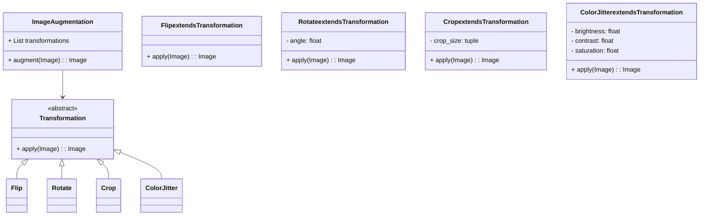
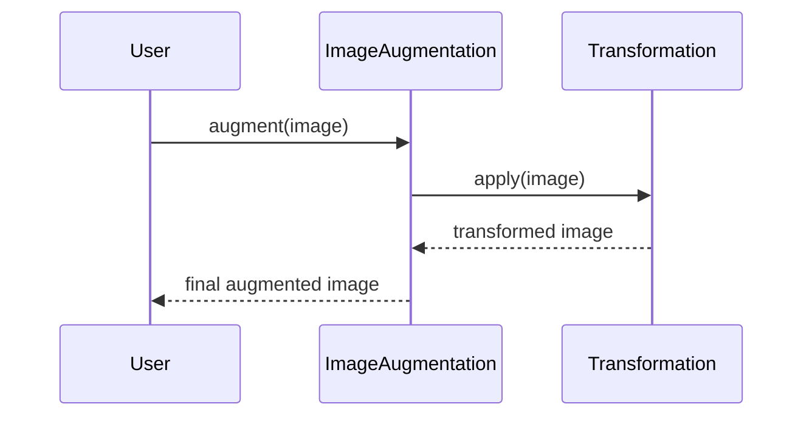

## Introduction

Image Augmentation is a critical technique in neural network training, particularly in the field of computer vision. It involves applying various transformations such as flips, rotations, and crops to original images to create a more diverse and extensive dataset. This method helps improve the generalization capability of neural networks, making them more robust and effective in real-world applications.

## Benefits of Image Augmentation

- **Improved Model Generalization:** By training on a diverse set of images, models can generalize better to unseen data.
- **Preventing Overfitting:** Augmentation techniques increase the variety of training data, reducing the risk of overfitting.
- **Cost-effective:** It’s an inexpensive way to expand datasets compared to collecting new data.

## Common Techniques

### Flips
Flipping an image horizontally or vertically.

### Rotations
Rotating images by specific angles.

### Crops
Random or center cropping of images.

### Color Jittering
Altering the color properties like brightness, contrast, saturation.

### Noise Injection
Adding random noise to images.

## Use Case: Increasing Image Dataset Diversity

Augmentation is extensively used in tasks like image classification, object detection, and segmentation to improve the model's performance by artificially increasing the diversity and size of the training dataset.

## UML Class Diagram



## UML Sequence Diagram



## Example Implementations

### Python

```python
import cv2
import numpy as np

class ImageAugmentation:
    def __init__(self, transformations):
        self.transformations = transformations

    def augment(self, image):
        for transform in self.transformations:
            image = transform.apply(image)
        return image

class Flip:
    def apply(self, image):
        return cv2.flip(image, 1)  # Horizontal flip

class Rotate:
    def __init__(self, angle):
        self.angle = angle

    def apply(self, image):
        (h, w) = image.shape[:2]
        M = cv2.getRotationMatrix2D((w / 2, h / 2), self.angle, 1)
        return cv2.warpAffine(image, M, (w, h))

class Crop:
    def __init__(self, crop_size):
        self.crop_size = crop_size

    def apply(self, image):
        x, y, w, h = self.crop_size
        return image[y:y+h, x:x+w]

augmentor = ImageAugmentation([Flip(), Rotate(45), Crop((10, 10, 100, 100))])
augmented_image = augmentor.augment(original_image)
```

### Java

```java
import java.awt.image.BufferedImage;
import java.awt.Graphics2D;
import java.awt.geom.AffineTransform;

public class ImageAugmentation {
    private List<Transformation> transformations;

    public ImageAugmentation(List<Transformation> transformations) {
        this.transformations = transformations;
    }

    public BufferedImage augment(BufferedImage image) {
        for (Transformation transform : transformations) {
            image = transform.apply(image);
        }
        return image;
    }
}

interface Transformation {
    BufferedImage apply(BufferedImage image);
}

class Flip implements Transformation {
    @Override
    public BufferedImage apply(BufferedImage image) {
        AffineTransform tx = AffineTransform.getScaleInstance(-1, 1);
        tx.translate(-image.getWidth(), 0);
        return createTransformed(image, tx);
    }

    private BufferedImage createTransformed(BufferedImage image, AffineTransform at) {
        BufferedImage newImage = new BufferedImage(image.getWidth(), image.getHeight(), image.getType());
        Graphics2D g = newImage.createGraphics();
        g.transform(at);
        g.drawImage(image, 0, 0, null);
        g.dispose();
        return newImage;
    }
}

// Similar classes for Rotate and Crop can be implemented here.
```

### Scala

```scala
import java.awt.image.BufferedImage
import java.awt.Graphics2D
import java.awt.geom.AffineTransform

class ImageAugmentation(transformations: List[Transformation]) {
  def augment(image: BufferedImage): BufferedImage = {
    transformations.foldLeft(image)((img, transform) => transform.apply(img))
  }
}

trait Transformation {
  def apply(image: BufferedImage): BufferedImage
}

class Flip extends Transformation {
  override def apply(image: BufferedImage): BufferedImage = {
    val tx = AffineTransform.getScaleInstance(-1, 1)
    tx.translate(-image.getWidth, 0)
    createTransformed(image, tx)
  }

  private def createTransformed(image: BufferedImage, at: AffineTransform): BufferedImage = {
    val newImage = new BufferedImage(image.getWidth, image.getHeight, image.getType)
    val g = newImage.createGraphics
    g.transform(at)
    g.drawImage(image, 0, 0, null)
    g.dispose()
    newImage
  }
}

// Implement Rotate and Crop similarly.
```

### Clojure

```clojure
(defn flip
  [image]
  (let [width (.getWidth image)
        height (.getHeight image)]
    (doto (BufferedImage. width height (.getType image))
      (-> (.createGraphics)
          (.drawImage image (- width) 0 width height nil)))))

(defn rotate
  [image angle]
  (let [tx (AffineTransform/getRotateInstance (Math/toRadians angle)
                                              (/ (.getWidth image) 2)
                                              (/ (.getHeight image) 2))
        op (AffineTransformOp. tx AffineTransformOp/TYPE_BILINEAR)]
    (.filter op image nil)))

(defn crop
  [image x y w h]
  (.getSubimage image x y w h))

(defn augment-image
  [image transformations]
  (reduce (fn [img transform]
            (transform img))
          image
          transformations))

;; Usage example
(def original-image ... )  ;; Assume an image is loaded here
(def transformations [(partial flip)
                      (partial rotate 45)
                      (partial crop 10 10 100 100)])

(def augmented-image (augment-image original-image transformations))
```

## Related Design Patterns

- **Decorator Pattern:** Extending functionality of an object in a flexible and reusable way.
- **Factory Pattern:** Creating objects (transformations) without specifying the exact class of object that will be created.

## Resources and References

- **OpenCV Documentation:** Comprehensive guide on image processing functions in OpenCV.
- **scikit-image:** A collection of algorithms for image processing in Python.
- **Deep Learning for Computer Vision (Coursera):** Online course covering various aspects of image augmentation.

## Summary

Image Augmentation is an indispensable technique in modern neural network training, providing essential benefits like improved generalization and reduced overfitting. By incorporating various transformations such as flips, rotations, and crops, it enhances dataset diversity cost-effectively. Understanding and applying image augmentation can significantly elevate the performance of machine learning models in real-world applications.
