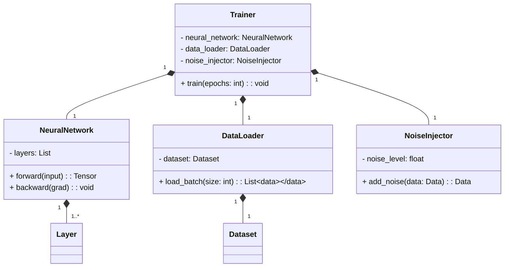
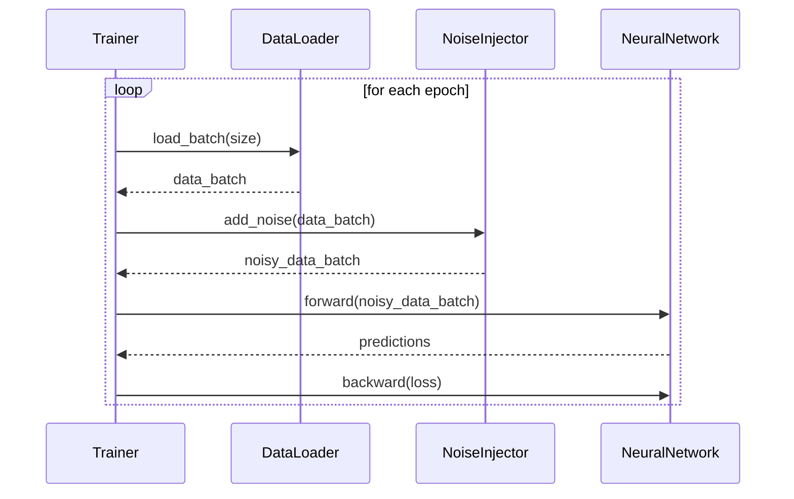

## Overview

Noise Injection is a neural network design pattern that involves adding random noise to the training data. The primary objective of this technique is to enhance the model's robustness and generalization by preventing it from overfitting to the training data.

## Benefits

- **Improves Generalization:** Adding noise helps the model generalize better to unseen data.
- **Reduces Overfitting:** Noise Injection makes it difficult for the model to memorize the training data, thereby reducing overfitting.
- **Enhances Robustness:** The model becomes more robust to variations and noise in real-world data.

## Trade-offs

- **Increased Training Time:** Additional epochs may be required to achieve convergence.
- **Complexity in Noise Selection:** The type and amount of noise need careful tuning to avoid degrading model performance.

## Use Cases

- Image Classification: To make models resistant to variations in lighting, background, and occlusions.
- Speech Recognition: To make models robust against different accents and background noises.
- Financial Forecasting: To handle fluctuations and outliers in the data.

## UML Diagrams

### Class Diagram



### Sequence Diagram



## Examples

### Python

```python
import numpy as np

class NoiseInjector:
    def __init__(self, noise_level=0.1):
        self.noise_level = noise_level
    
    def add_noise(self, data):
        noise = np.random.normal(0, self.noise_level, data.shape)
        return data + noise

noise_injector = NoiseInjector()
noisy_data = noise_injector.add_noise(training_data)
```

### Java

```java
import java.util.Random;

public class NoiseInjector {
    private double noiseLevel;

    public NoiseInjector(double noiseLevel) {
        this.noiseLevel = noiseLevel;
    }

    public double[] addNoise(double[] data) {
        Random rand = new Random();
        double[] noisyData = new double[data.length];
        for (int i = 0; i < data.length; i++) {
            noisyData[i] = data[i] + rand.nextGaussian() * noiseLevel;
        }
        return noisyData;
    }
}

// Usage
NoiseInjector noiseInjector = new NoiseInjector(0.1);
double[] noisyData = noiseInjector.addNoise(trainingData);
```

### Scala

```scala
import scala.util.Random

class NoiseInjector(val noiseLevel: Double) {
  def addNoise(data: Array[Double]): Array[Double] = {
    data.map(x => x + Random.nextGaussian() * noiseLevel)
  }
}

// Usage
val noiseInjector = new NoiseInjector(0.1)
val noisyData = noiseInjector.addNoise(trainingData)
```

### Clojure

```clojure
(defn add-noise [data noise-level]
  (map #(+ % (rand-norm 0 noise-level)) data))

;; Usage
(def training-data [1.0, 2.0, 3.0])
(def noisy-data (add-noise training-data 0.1))
```

## Related Design Patterns

- **Dropout:** Regularization technique that randomly drops neurons during training to prevent overfitting.
- **Data Augmentation:** Techniques like rotation, flipping, and scaling applied to data to increase diversity.

## Resources and References

- [Deep Learning Book by Ian Goodfellow](https://www.deeplearningbook.org/)
- [PyTorch Documentation](https://pytorch.org/docs/stable/index.html)
- [TensorFlow Guide](https://www.tensorflow.org/guide)

## Open Source Frameworks

- **PyTorch:** A flexible deep learning framework for research and production.
- **TensorFlow:** An open-source machine learning library for dataflow and differentiable programming.
- **Keras:** A high-level neural networks API written in Python.

## Summary

Noise Injection is a valuable design pattern in neural networks aimed at improving model robustness and generalization. By adding noise to the training data, the model becomes better equipped to handle real-world variations and noise. While it comes with trade-offs such as increased training time, its benefits in terms of robustness and reduced overfitting often outweigh these concerns.
