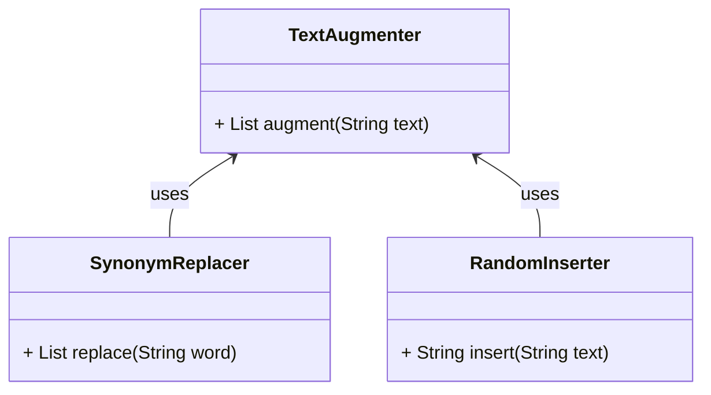
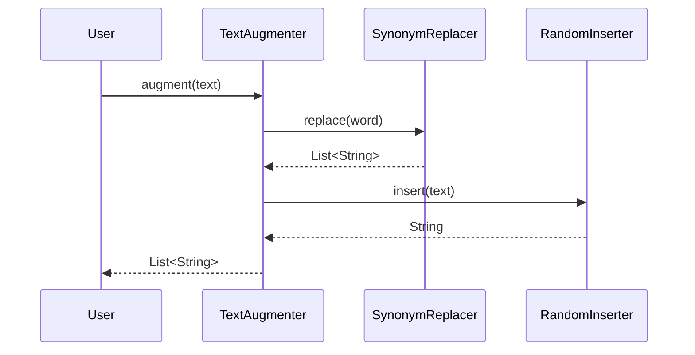

## Introduction
Text augmentation techniques like synonym replacement and random insertion are powerful methods to expand and enrich Natural Language Processing (NLP) datasets. These techniques involve modifying text data in various ways to generate new, diverse data points from existing samples. By doing so, we can enhance model performance, improve generalization, and reduce overfitting.

## Benefits and Trade-offs

### Benefits
1. **Improved Model Generalization:** Augmented data can help models generalize better by exposing them to a wider variety of text inputs.
2. **Data Expansion:** Useful for scenarios where acquiring new labeled data is expensive or time-consuming.
3. **Reduced Overfitting:** Introducing variability in the dataset helps in reducing the risk of overfitting.
4. **Enhanced Robustness:** Models trained on augmented data are more robust to noise and variations in real-world scenarios.

### Trade-offs
1. **Quality Control:** Poorly executed augmentation can introduce noise and degrade the dataset's quality.
2. **Complexity:** Managing and implementing sophisticated augmentation techniques can be computationally expensive and complex.
3. **Computational Overhead:** Data augmentation increases the computational load during both training and preprocessing stages.

## Common Text Augmentation Techniques

1. **Synonym Replacement:** Replaces words with their synonyms.
2. **Random Insertion:** Randomly inserts new words into the text.
3. **Random Swap:** Swaps the position of two words in the text.
4. **Random Deletion:** Deletes random words from the text.

## UML Diagrams

### UML Class Diagram
Below is a UML Class Diagram illustrating the basic structure for a text augmentation system.



### UML Sequence Diagram
A sequence diagram for the process of text augmentation:



## Example Implementations

### Python
```python
import random
from nltk.corpus import wordnet

class TextAugmenter:
    def __init__(self, techniques):
        self.techniques = techniques

    def augment(self, text):
        for technique in self.techniques:
            text = technique(text)
        return text

def synonym_replacement(text):
    words = text.split()
    new_text = []
    for word in words:
        synonyms = wordnet.synsets(word)
        if synonyms:
            new_text.append(synonyms[0].lemmas()[0].name())
        else:
            new_text.append(word)
    return ' '.join(new_text)

def random_insertion(text):
    words = text.split()
    new_word = random.choice(words)
    index = random.randint(0, len(words))
    words.insert(index, new_word)
    return ' '.join(words)

techniques = [synonym_replacement, random_insertion]
augmenter = TextAugmenter(techniques)
print(augmenter.augment("This is a sample sentence."))
```

### Java
```java
import java.util.*;

public class TextAugmenter {
    private List<Function<String, String>> techniques;

    public TextAugmenter(List<Function<String, String>> techniques) {
        this.techniques = techniques;
    }

    public String augment(String text) {
        for (Function<String, String> technique : techniques) {
            text = technique.apply(text);
        }
        return text;
    }
    
    public static String synonymReplacement(String text) {
        // Simple synonym replacement logic
        return text.replace("sample", "example");
    }

    public static String randomInsertion(String text) {
        String[] words = text.split(" ");
        List<String> wordList = new ArrayList<>(Arrays.asList(words));
        int index = new Random().nextInt(wordList.size());
        wordList.add(index, "random");
        return String.join(" ", wordList);
    }

    public static void main(String[] args) {
        List<Function<String, String>> techniques = new ArrayList<>();
        techniques.add(TextAugmenter::synonymReplacement);
        techniques.add(TextAugmenter::randomInsertion);
        
        TextAugmenter augmenter = new TextAugmenter(techniques);
        System.out.println(augmenter.augment("This is a sample sentence."));
    }
}
```

### Scala
```scala
import scala.util.Random

object TextAugmenter {
  def augment(text: String, techniques: List[String => String]): String = {
    techniques.foldLeft(text)((acc, tech) => tech(acc))
  }

  def synonymReplacement(text: String): String = {
    text.replaceAll("sample", "example")
  }

  def randomInsertion(text: String): String = {
    val words = text.split(" ")
    val index = Random.nextInt(words.length)
    words.patch(index, Seq("random"), 0).mkString(" ")
  }

  def main(args: Array[String]): Unit = {
    val techniques = List(synonymReplacement _, randomInsertion _)
    val result = augment("This is a sample sentence.", techniques)
    println(result)
  }
}
```

### Clojure
```clojure
(ns text-augmenter.core
  (:require [clojure.string :as str]))

(defn synonym-replacement [text]
  (str/replace text "sample" "example"))

(defn random-insertion [text]
  (let [words (str/split text #" ")
        index (rand-int (count words))]
    (str/join " " (conj (vec words) "random" index))))

(defn augment [text techniques]
  (reduce (fn [acc tech] (tech acc)) text techniques))

(defn -main [& args]
  (let [techniques [synonym-replacement random-insertion]]
    (println (augment "This is a sample sentence." techniques))))
```

## Use Cases

- **Text Classification:** Augmented datasets can help create more robust text classification models.
- **Sentiment Analysis:** Better model generalization by exposing to varied expressions of sentiment.
- **Language Translation:** Augmenting data in both source and target languages to improve translation models.

## Related Design Patterns

- **Data Augmentation:** Often used in computer vision and general machine learning tasks to expand datasets.
- **Transfer Learning:** Augmenting pre-trained models with new, augmented data for better performance on specific tasks.

## Resources and References

- [NLTK Documentation](https://www.nltk.org/)
- [Stanford NLP](https://stanfordnlp.github.io/CoreNLP/)
- [WordNet](https://wordnet.princeton.edu/)

## Open Source Frameworks

- **NLTK (Natural Language Toolkit):** Python library for working with human language data.
- **TextAugment:** Python library specifically for text augmentation.

## Summary
Text augmentation is a crucial technique in NLP for expanding datasets and improving model performance. By using techniques like synonym replacement and random insertion, practitioners can significantly enhance the diversity and robustness of their training data. While these methods bring many benefits, they also introduce certain trade-offs that must be carefully managed. With the right tools and approaches, text augmentation can lead to substantial improvements in a variety of NLP tasks.
