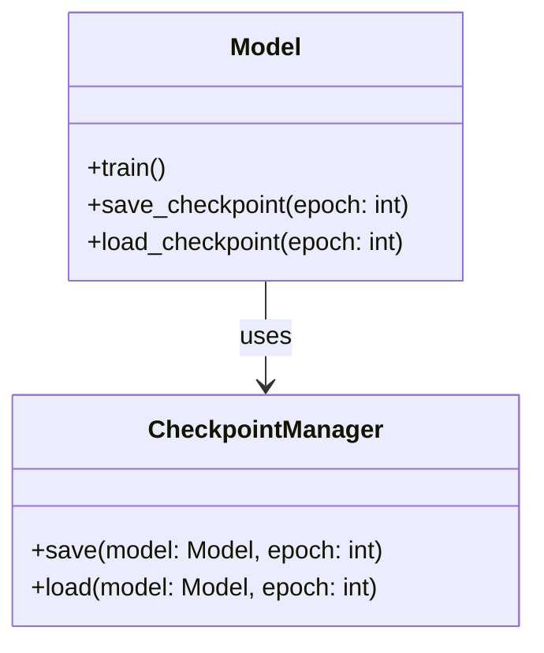
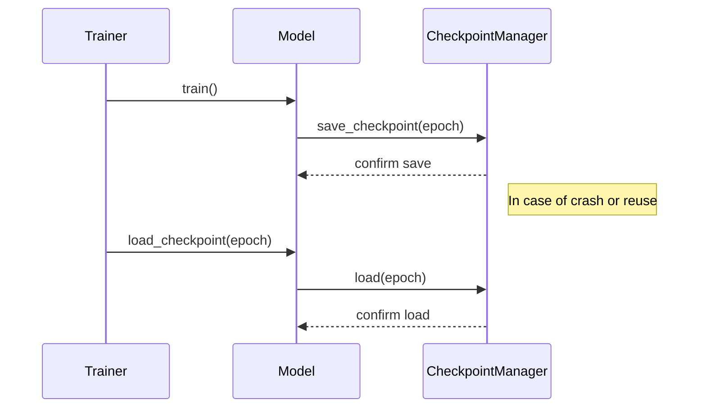

## Overview of Checkpointing

Checkpointing is a crucial design pattern in the realm of Neural Networks and Machine Learning. It involves periodically saving the state of a model during its training process. This can be immensely beneficial for a number of reasons, including recovery from crashes, system failures, or reusing the model at a later point in time for further training, evaluation, or deployment.

## Benefits of Checkpointing

- **Recovery from Crashes:** In case of unexpected shutdowns or failures, checkpointing allows you to resume training from the last saved state, minimizing the loss of progress.
- **Incremental Training:** Models can be trained in stages. You can stop training at checkpoints and resume later without starting from scratch.
- **Experimentation:** You can save various versions of the model and experiment with different hyperparameters or architectures by resuming from different checkpoints.
- **Resource Optimization:** Saves time and computational resources by not having to retrain models from scratch.

## Trade-offs of Checkpointing

- **Storage Overhead:** Periodically saving model states can require substantial storage space, especially for large models.
- **I/O Overhead:** Frequent saving can introduce input/output overhead that may slow down the training process.
- **Complexity:** Implementing an efficient checkpointing mechanism can add complexity to the training pipeline.

## UML Diagrams

### UML Class Diagram



### UML Sequence Diagram



## Code Examples

### Python

```python
import torch
import torch.nn as nn
import torch.optim as optim

class NeuralNet(nn.Module):
    def __init__(self):
        super(NeuralNet, self).__init__()
        # Model definition

    def forward(self, x):
        # Forward pass

model = NeuralNet()
optimizer = optim.Adam(model.parameters())
checkpoint_path = 'model_checkpoint.pth'

def save_checkpoint(epoch, model, optimizer):
    torch.save({
        'epoch': epoch,
        'model_state_dict': model.state_dict(),
        'optimizer_state_dict': optimizer.state_dict(),
    }, checkpoint_path)

def load_checkpoint(model, optimizer):
    checkpoint = torch.load(checkpoint_path)
    model.load_state_dict(checkpoint['model_state_dict'])
    optimizer.load_state_dict(checkpoint['optimizer_state_dict'])
    return checkpoint['epoch']

epoch = 0
while training:
    train(model, optimizer)
    save_checkpoint(epoch, model, optimizer)
    epoch += 1
```

### Java

```java
import java.io.*;

public class CheckpointingExample {
    private static final String CHECKPOINT_PATH = "model_checkpoint.ser";

    public static void saveCheckpoint(Model model, Optimizer optimizer, int epoch) throws IOException {
        try (ObjectOutputStream out = new ObjectOutputStream(new FileOutputStream(CHECKPOINT_PATH))) {
            out.writeInt(epoch);
            out.writeObject(model);
            out.writeObject(optimizer);
        }
    }

    public static int loadCheckpoint(Model model, Optimizer optimizer) throws IOException, ClassNotFoundException {
        try (ObjectInputStream in = new ObjectInputStream(new FileInputStream(CHECKPOINT_PATH))) {
            int epoch = in.readInt();
            model = (Model) in.readObject();
            optimizer = (Optimizer) in.readObject();
            return epoch;
        }
    }

    // During training
    int epoch = 0;
    while (training) {
        train(model, optimizer);
        saveCheckpoint(model, optimizer, epoch);
        epoch++;
    }
}
```

### Scala

```scala
import java.io._

case class Model() // Define your model
case class Optimizer() // Define your optimizer

object CheckpointingExample {
  val CHECKPOINT_PATH = "model_checkpoint.ser"

  def saveCheckpoint(epoch: Int, model: Model, optimizer: Optimizer): Unit = {
    val oos = new ObjectOutputStream(new FileOutputStream(CHECKPOINT_PATH))
    try {
      oos.writeInt(epoch)
      oos.writeObject(model)
      oos.writeObject(optimizer)
    } finally {
      oos.close()
    }
  }

  def loadCheckpoint(): (Int, Model, Optimizer) = {
    val ois = new ObjectInputStream(new FileInputStream(CHECKPOINT_PATH))
    try {
      val epoch = ois.readInt()
      val model = ois.readObject().asInstanceOf[Model]
      val optimizer = ois.readObject().asInstanceOf[Optimizer]
      (epoch, model, optimizer)
    } finally {
      ois.close()
    }
  }

  // During training
  var epoch = 0
  while (training) {
    train(model, optimizer)
    saveCheckpoint(epoch, model, optimizer)
    epoch += 1
  }
}
```

### Clojure

```clojure
(ns checkpointing-example
  (:import [java.io ObjectOutputStream ObjectInputStream FileOutputStream FileInputStream]))

(defn save-checkpoint [epoch model optimizer checkpoint-path]
  (with-open [oos (ObjectOutputStream. (FileOutputStream. checkpoint-path))]
    (.writeInt oos epoch)
    (.writeObject oos model)
    (.writeObject oos optimizer)))

(defn load-checkpoint [checkpoint-path]
  (with-open [ois (ObjectInputStream. (FileInputStream. checkpoint-path))]
    (let [epoch (.readInt ois)
          model (.readObject ois)
          optimizer (.readObject ois)]
      {:epoch epoch :model model :optimizer optimizer})))

;; During training
(def epoch 0)
(while training
  (train model optimizer)
  (save-checkpoint epoch model optimizer "model_checkpoint.ser")
  (def epoch (inc epoch)))
```

## Examples of Use Cases

- **Disaster Recovery:** During long training sessions, unexpected events like power outages or system crashes can occur. Checkpointing ensures minimal data loss.
- **Hyperparameter Tuning:** Allows resuming training with different hyperparameters without retraining from scratch.
- **Collaborative Research:** Multiple teams or researchers can work on the same model by sharing checkpoints.
- **Production Deployments:** Models can be iteratively improved and deployed by loading the latest checkpoints.

## Related Design Patterns

- **Observer Pattern:** Can be used in conjunction with checkpointing to notify various parts of the system (e.g., logging, monitoring) when checkpoints are created.
- **Snapshot Pattern:** Often used in similar contexts to save the state of an object or system at a point in time.

## Resources and References

- [TensorFlow Checkpointing Guide](https://www.tensorflow.org/guide/checkpoint)
- [PyTorch Saving and Loading Models](https://pytorch.org/tutorials/beginner/saving_loading_models.html)
- [Keras Checkpointing Callback](https://keras.io/api/callbacks/model_checkpoint/)
- [Apache MXNet Model Saving](https://mxnet.apache.org/versions/1.6/api/scala/docs/io/io.html)

## Open Source Frameworks

- **TensorFlow:** Comprehensive open-source platform for machine learning.
- **PyTorch:** Flexible deep learning platform that provides strong support for checkpointing.
- **Keras:** High-level neural networks API running on top of TensorFlow with built-in checkpointing callbacks.

## Summary

Checkpointing is an essential design pattern for managing long training sessions of neural networks by saving model states periodically. It mitigates risks associated with crashes, optimizes training efforts, and supports various practical applications like disaster recovery, hyperparameter tuning, collaborative research, and production deployment. However, implementing efficient checkpointing requires careful consideration of storage and I/O overheads.

By integrating checkpointing into your neural network training pipeline, you can significantly enhance the robustness and efficiency of your machine learning workflows.
