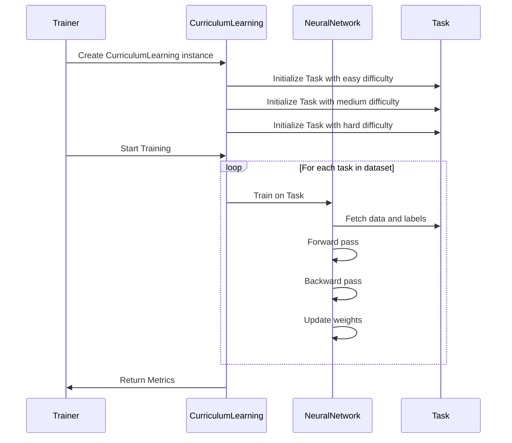

## Curriculum Learning: Structured Training for Neural Networks

Curriculum Learning is a training strategy inspired by the way humans learn. By starting with simple tasks and progressively increasing the complexity, neural networks can achieve better performance and faster convergence.

### Detailed Description

Curriculum Learning involves creating a sequence of learning tasks that start simple and gradually increase in difficulty. The underlying hypothesis is that simpler tasks can provide the network with foundational knowledge that can be built upon as the tasks become more complex. This mirrors educational curricula where learners progress from basic concepts to more advanced topics.

### Benefits

- **Improved Convergence**: By smoothing the learning curve, neural networks can converge faster.
- **Better Generalization**: Starting with simpler tasks can help in learning foundational features, leading to better generalization on complex tasks.
- **Robust Learning**: Reduced risk of getting stuck in local minima during training.

### Trade-offs

- **Task Sequence Design**: Designing an effective curriculum requires domain expertise and can be time-consuming.
- **Computational Overhead**: May need more training time overall due to the gradual learning process.

### Use Cases

- **Image Recognition**: Start with easier tasks (e.g., recognizing edges) before moving to complex tasks (e.g., identifying specific objects).
- **Natural Language Processing (NLP)**: Begin with basic tasks (e.g., word classification) and progress to complex tasks (e.g., sentiment analysis).
- **Reinforcement Learning**: Start with simplified environments and progressively introduce complexity.

### UML Diagrams

#### UML Class Diagram


#### UML Sequence Diagram



### Examples in Different Programming Languages

#### Python

```python
import torch
import torch.nn as nn
import torch.optim as optim

class SimpleTaskDataset(torch.utils.data.Dataset):
    def __init__(self, difficulty):
        # Initialize with easier or harder data
        pass
    
    def __getitem__(self, index):
        # Return a single data point
        pass
    
    def __len__(self):
        # Number of items in dataset
        pass

class SimpleNeuralNetwork(nn.Module):
    def __init__(self):
        super(SimpleNeuralNetwork, self).__init__()
        # Define layers
        pass
    
    def forward(self, x):
        # Forward pass logic
        pass

def train(model, dataset, optimizer, criterion):
    model.train()
    for data, target in dataset:
        optimizer.zero_grad()
        output = model(data)
        loss = criterion(output, target)
        loss.backward()
        optimizer.step()

tasks = [SimpleTaskDataset(difficulty) for difficulty in ['easy', 'medium', 'hard']]
model = SimpleNeuralNetwork()
optimizer = optim.SGD(model.parameters(), lr=0.01)
criterion = nn.CrossEntropyLoss()

for task in tasks:
    train_loader = torch.utils.data.DataLoader(task, batch_size=32)
    train(model, train_loader, optimizer, criterion)
```

#### Java

```java
import java.util.List;

public class CurriculumLearning {
    private List<Task> tasks;
    private NeuralNetwork model;

    public CurriculumLearning(List<Task> tasks, NeuralNetwork model) {
        this.tasks = tasks;
        this.model = model;
    }

    public void train() {
        for (Task task : tasks) {
            for (DataPoint data : task.getData()) {
                model.train(data);
            }
        }
    }
}

class Task {
    private List<DataPoint> data;
    private int difficulty;

    public Task(List<DataPoint> data, int difficulty) {
        this.data = data;
        this.difficulty = difficulty;
    }

    public List<DataPoint> getData() {
        return data;
    }
}

class NeuralNetwork {
    public void train(DataPoint data) {
        // Training logic
    }
}

class DataPoint {
    // Data structure for a single data point
}
```

#### Scala

```scala
class Task(val data: List[(Array[Double], Array[Double])], val difficulty: Int)

class NeuralNetwork {
  def train(data: Array[Double], label: Array[Double]): Unit = {
    // Training logic
  }
}

class CurriculumLearning(tasks: List[Task], model: NeuralNetwork) {
  def train(): Unit = {
    tasks.foreach { task =>
      task.data.foreach { case (data, label) =>
        model.train(data, label)
      }
    }
  }
}

// Example usage
val tasks = List(new Task(List((Array(1.0, 2.0), Array(0.0))), 1))
val model = new NeuralNetwork()
val curriculumLearning = new CurriculumLearning(tasks, model)
curriculumLearning.train()
```

#### Clojure

```clojure
(defn train [model data]
  ;; Training logic for model with given data
  )

(defn curriculum-learning [tasks model]
  (doseq [task tasks]
    (doseq [data (:data task)]
      (train model data))))

;; Example usage
(def tasks [{:data [[1 2] [3 4]], :difficulty 1}])
(def model {})
(curriculum-learning tasks model)
```

### Related Design Patterns

- **Transfer Learning**: Using a pre-trained model on new but related tasks.
- **Multi-task Learning**: Training a single model on multiple tasks simultaneously.

### Resources and References

- [Bengio, Y., Louradour, J., Collobert, R., & Weston, J. (2009). Curriculum learning. Proceedings of the 26th annual international conference on machine learning.](http://www.jmlr.org/proceedings/papers/v5/bengio09a/bengio09a.pdf)
- [OpenAI: Spinning Up in Deep RL](https://spinningup.openai.com/en/latest/)

### Open Source Frameworks

- [PyTorch](https://pytorch.org/)
- [TensorFlow](https://www.tensorflow.org/)

### Final Summary

Curriculum Learning provides a structured training approach for neural networks that can lead to improved convergence and generalization by starting with simple tasks and gradually increasing their complexity. Despite the potential increased training time and the need for expert task sequencing, this method can be highly effective in various domains, including image recognition and NLP. This pattern is closely related to Transfer Learning and Multi-task Learning, sharing the fundamental principle of structured, efficient learning. 

By understanding and implementing Curriculum Learning, practitioners can develop more robust and performant neural networks.
