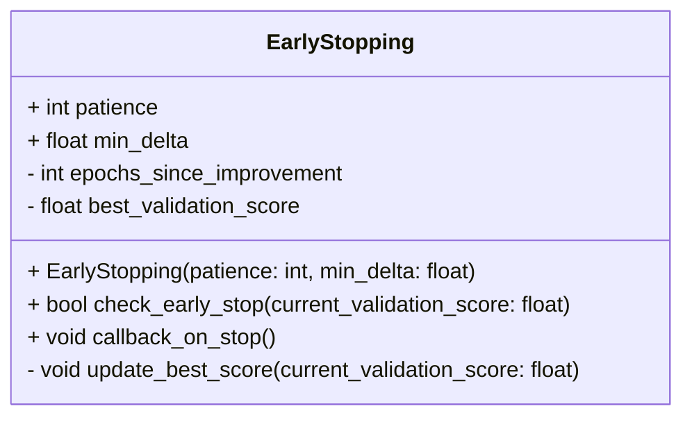
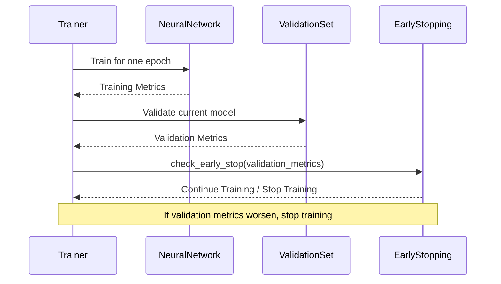

## Early Stopping: Prevention of Overfitting in Neural Networks

Early Stopping is a crucial technique used in training neural networks to mitigate the risk of overfitting. By monitoring the model’s performance on a validation dataset and halting the training process when the performance begins to deteriorate, Early Stopping helps in achieving a model that generalizes well to unseen data.

### Benefits of Early Stopping
- **Prevents Overfitting:** Stops the training once the validation error increases.
- **Reduces Training Time:** Saves computational resources by avoiding unnecessary epochs.
- **Improves Generalization:** Produces a model that performs better on new, unseen data.

### Trade-Offs
- **Validation Set Dependency:** Requires a separate validation set which reduces the amount of data used for training.
- **Potential Premature Stopping:** There is a risk of halting the training process too soon, possibly leading to underfitting.
- **Monitoring Overhead:** Adds computational overhead due to regular validation checks during training.

### Use Cases
- **Image Classification:** Often used in convolutional neural networks (CNNs) to avoid overfitting on image datasets.
- **Natural Language Processing:** Applied in recurrent neural networks (RNNs) or transformers to prevent overfitting in text data.
- **Regression Tasks:** Useful in preventing models from becoming too tailored to the training data.

### UML Class Diagram


### UML Sequence Diagram


### Example Implementations

#### Python
```python
class EarlyStopping:
    def __init__(self, patience=5, min_delta=0):
        self.patience = patience
        self.min_delta = min_delta
        self.best_score = None
        self.epochs_since_improvement = 0

    def check_early_stop(self, validation_score):
        if self.best_score is None:
            self.best_score = validation_score
            return False

        if validation_score < self.best_score + self.min_delta:
            self.epochs_since_improvement += 1
        else:
            self.best_score = validation_score
            self.epochs_since_improvement = 0

        return self.epochs_since_improvement >= self.patience

# early_stopping = EarlyStopping(patience=5, min_delta=0.01)
#     train(...)
#     if early_stopping.check_early_stop(val_loss):
#         break
```

#### Java
```java
public class EarlyStopping {
    private int patience;
    private double minDelta;
    private double bestScore;
    private int epochsSinceImprovement;

    public EarlyStopping(int patience, double minDelta) {
        this.patience = patience;
        this.minDelta = minDelta;
        this.bestScore = Double.POSITIVE_INFINITY;
        this.epochsSinceImprovement = 0;
    }

    public boolean checkEarlyStop(double validationScore) {
        if (validationScore < bestScore + minDelta) {
            epochsSinceImprovement++;
        } else {
            bestScore = validationScore;
            epochsSinceImprovement = 0;
        }
        return epochsSinceImprovement >= patience;
    }
}

// Example usage
// EarlyStopping earlyStopping = new EarlyStopping(5, 0.01);
// for (int epoch = 0; epoch < epochs; epoch++) {
//     train();
//     double valLoss = validate();
//     if (earlyStopping.checkEarlyStop(valLoss)) {
//         System.out.println("Early stopping");
//         break;
//     }
// }
```

#### Scala
```scala
class EarlyStopping(patience: Int, minDelta: Double) {
    private var bestScore: Option[Double] = None
    private var epochsSinceImprovement: Int = 0

    def checkEarlyStop(validationScore: Double): Boolean = {
        bestScore match {
            case Some(score) if validationScore < score + minDelta =>
                epochsSinceImprovement += 1
            case _ =>
                bestScore = Some(validationScore)
                epochsSinceImprovement = 0
        }
        epochsSinceImprovement >= patience
    }
}

// Example usage
// val earlyStopping = new EarlyStopping(5, 0.01)
// for (epoch <- 1 to epochs) {
//     train()
//     val valLoss = validate()
//     if (earlyStopping.checkEarlyStop(valLoss)) {
//         println("Early stopping")
//         break
//     }
// }
```

#### Clojure
```clojure
(defn early-stopping
  [{:keys [patience min-delta best-score epochs-since-improvement]
    :or {best-score nil epochs-since-improvement 0}} validation-score]
  (if (or (nil? best-score) (< validation-score (+ best-score min-delta)))
    {:best-score (if (nil? best-score) validation-score best-score)
     :epochs-since-improvement (inc epochs-since-improvement)}
    {:best-score validation-score
     :epochs-since-improvement 0}))

;; Example usage
;; (def early-stopping-state (atom {:patience 5 :min-delta 0.01}))
;; (doseq [epoch (range epochs)]
;;   (train ...)
;;   (let [val-loss (validate ...)
;;         state @early-stopping-state]
;;     (swap! early-stopping-state early-stopping state val-loss)
;;     (when (>= (:epochs-since-improvement @early-stopping-state) (:patience state))
;;       (println "Early stopping")
;;       (break))))
```

### Related Design Patterns
- **Checkpointing:** Save models at certain intervals to avoid loss during unexpected interruptions.
- **Regularization:** Techniques like L2/L1 regularization, Dropout to reduce overfitting.
- **Learning Rate Scheduling:** Adjust the learning rate to allow finer convergence.

### Resources and References
- [Understanding Early Stopping](https://machinelearningmastery.com/early-stopping-to-avoid-overtraining-neural-network-models/)
- [Deep Learning Book](https://www.deeplearningbook.org/contents/regularization.html)
- [Keras Documentation on Early Stopping](https://keras.io/api/callbacks/early_stopping/)

### Open Source Frameworks
- **TensorFlow/Keras:** Built-in EarlyStopping callback.
- **PyTorch:** Provides EarlyStopping through additional libraries like pytorch-lightning.

### Summary
Early Stopping is a powerful and widely-used technique in neural network training to prevent overfitting. By halting the training process once the validation error starts to rise, Early Stopping ensures that the model does not become overly tailored to the training data, thus improving generalization to new data. While it has many benefits, it also has some trade-offs, particularly around validation data dependency and monitoring overhead. It is an essential technique to be familiar with for anyone working in machine learning and neural networks.
