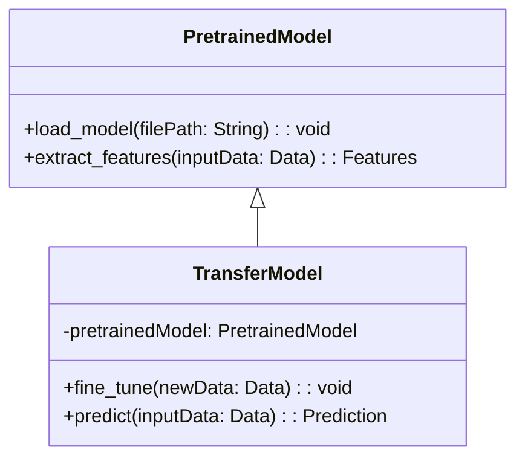
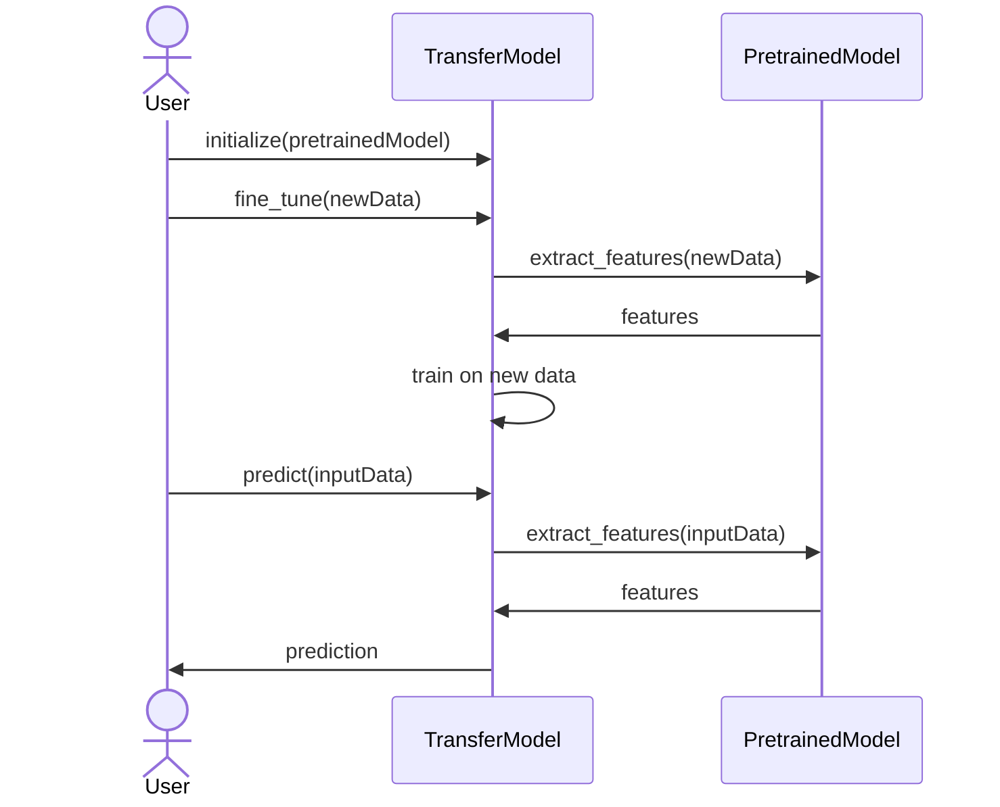

Transfer Learning is a machine learning technique that leverages pre-trained models to address new, but related tasks. This approach harnesses the knowledge embedded in existing models, reducing the need for extensive computational resources and data for training from scratch.

## Introduction
Transfer Learning allows models trained on large datasets to be adapted to new tasks with minimal additional training. By reusing and fine-tuning a pre-trained network, you can save significant time and computational power.

## UML Class Diagram



### Explanation
- **PretrainedModel**: Handles loading of the pre-trained model and feature extraction.
- **TransferModel**: Inherits from PretrainedModel and is responsible for fine-tuning the model with new data and making predictions.

## Sequence Diagram



### Explanation
- **User**: Initializes and fine-tunes the transfer model.
- **TransferModel**: Interacts with the pre-trained model to extract features and performs fine-tuning and predictions.

## Benefits
- **Reduced Training Time**: By leveraging pre-trained models, the training phase is significantly shorter.
- **Lower Data Requirements**: Requires less data for training since pre-trained models have already learned useful features.
- **Improved Performance**: Often results in better performance on new tasks due to the pre-learned features.

## Trade-offs
- **Compatibility**: Pre-trained models might not always align perfectly with the new task, requiring careful adjustments.
- **Overfitting**: Fine-tuning on small datasets can lead to overfitting.
- **License Restrictions**: Some pre-trained models may come with usage limitations.

## Example Use Cases
- **Image Classification**: Utilizing pre-trained models like ResNet or Inception for specialized classification tasks.
- **Natural Language Processing (NLP)**: Adapting models like BERT or GPT-3 for domain-specific text analysis.
- **Speech Recognition**: Fine-tuning models like DeepSpeech for accent or language-specific tasks.

## Implementation in Various Languages

### Python
```python
from tensorflow.keras.applications import VGG16
from tensorflow.keras.models import Model
from tensorflow.keras.layers import Dense, Flatten

base_model = VGG16(weights='imagenet', include_top=False, input_shape=(224, 224, 3))

for layer in base_model.layers:
    layer.trainable = False

x = base_model.output
x = Flatten()(x)
x = Dense(1024, activation='relu')(x)
predictions = Dense(10, activation='softmax')(x)

model = Model(inputs=base_model.input, outputs=predictions)

model.compile(optimizer='adam', loss='categorical_crossentropy', metrics=['accuracy'])
```

### Java
```java
import org.deeplearning4j.nn.multilayer.MultiLayerNetwork;
import org.deeplearning4j.nn.transferlearning.TransferLearning;
import org.deeplearning4j.nn.transferlearning.TransferLearningHelper;
import org.deeplearning4j.zoo.model.ResNet50;

MultiLayerNetwork pretrainedNet = ResNet50.builder().build().initPretrained();
MultiLayerNetwork transferNet = new TransferLearning.Builder(pretrainedNet)
    .setFeatureExtractor("fc1000")
    .removeOutputLayer()
    .addLayer(new DenseLayer.Builder().nIn(2048).nOut(256).activation(Activation.RELU).build())
    .addLayer(new OutputLayer.Builder(LossFunctions.LossFunction.NEGATIVELOGLIKELIHOOD).activation(Activation.SOFTMAX).nOut(10).build())
    .build();
```

### Scala
```scala
import org.deeplearning4j.nn.multilayer.MultiLayerNetwork
import org.deeplearning4j.nn.transferlearning.{TransferLearning, TransferLearningHelper}
import org.deeplearning4j.zoo.model.ResNet50

val pretrainedNet = ResNet50.builder().build().initPretrained()
val transferNet = new TransferLearning.Builder(pretrainedNet)
  .setFeatureExtractor("fc1000")
  .removeOutputLayer()
  .addLayer(new DenseLayer.Builder().nIn(2048).nOut(256).activation(Activation.RELU).build())
  .addLayer(new OutputLayer.Builder(LossFunctions.LossFunction.NEGATIVELOGLIKELIHOOD).activation(Activation.SOFTMAX).nOut(10).build())
  .build()
```

### Clojure
```clojure
(require '[dl4clj.nn.api.networks :as networks]
         '[dl4clj.nn.transfer-learning :as tl])

(let [pretrained-net (networks/init-pretrained {:model :resnet50})
      transfer-net (tl/transfer-learning-builder pretrained-net
                                                :set-feature-extractor "fc1000"
                                                :remove-output-layer true
                                                :add-layer (tl/dense-layer :n-in 2048 :n-out 256 :activation :relu)
                                                :add-layer (tl/output-layer :loss-function :negative-loglikelihood
                                                                            :activation :softmax :n-out 10))]
  transfer-net)
```

## Related Design Patterns
- **Fine-Tuning**: Similar to Transfer Learning, but more focused on adapting all model layers to the new task.
- **Multi-Task Learning**: Simultaneously trains a model on multiple tasks, sharing knowledge across them.
- **Ensemble Learning**: Combines predictions from multiple models to improve performance.

## Resources and References
- **Books**
  - "Deep Learning with Python" by François Chollet
  - "Hands-On Machine Learning with Scikit-Learn, Keras, and TensorFlow" by Aurélien Géron
- **Research Papers**
  - "Very Deep Convolutional Networks for Large-Scale Image Recognition" by Karen Simonyan and Andrew Zisserman
  - "BERT: Pre-training of Deep Bidirectional Transformers for Language Understanding" by Jacob Devlin et al.
- **Open Source Frameworks**
  - TensorFlow
  - PyTorch
  - Keras
  - DL4J (DeepLearning4J)

## Summary
Transfer Learning provides a robust mechanism for reusing pre-trained models to tackle new tasks effectively. It reduces the training time and data requirements significantly while improving model performance. However, developers must carefully consider compatibility and potential overfitting issues. Leveraging frameworks like TensorFlow and PyTorch makes implementing Transfer Learning more accessible and practical.

Incorporating Transfer Learning into your machine learning toolkit can offer substantial advantages, enabling you to build powerful models efficiently and with fewer resources.


