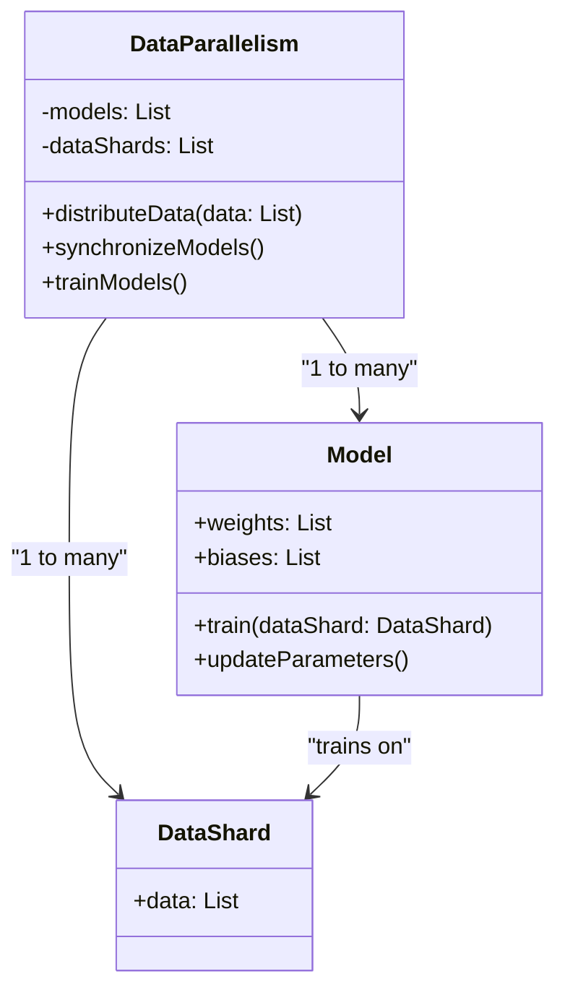
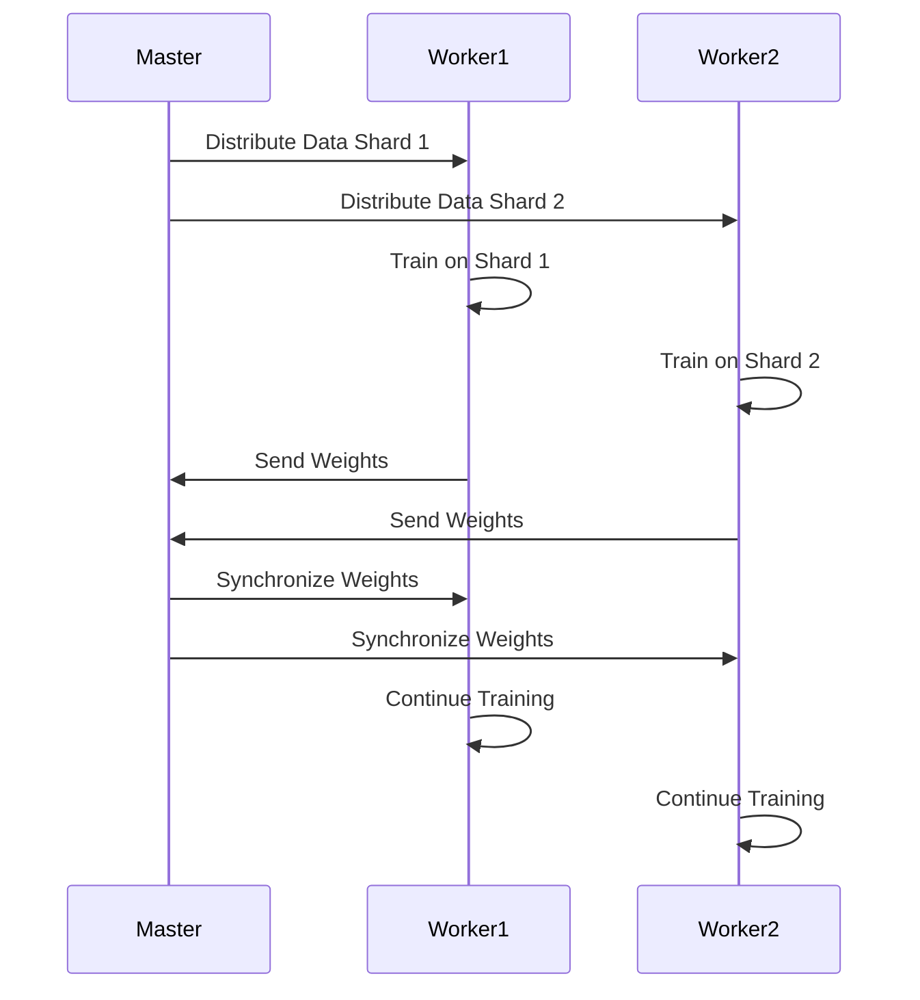

## Introduction

Data Parallelism is a design pattern used in neural networks where the same model is trained on different shards of data simultaneously. This allows the model to leverage multiple processors or machines, speeding up the training process significantly. It's especially effective when working with very large datasets.

## Detailed Description

Data Parallelism involves splitting the dataset into several smaller subsets, or shards, and distributing these across multiple processors or machines. Each processor trains a copy of the neural network model on its respective shard. Periodically, the weights and biases of these models are synchronized to ensure a consistent learning process.

### Benefits

- **Increased Speed**: Training can be significantly faster as the workload is distributed across multiple processors or machines.
- **Scalability**: Easily scales with the addition of more hardware resources.
- **Resource Utilization**: Makes efficient use of available computational resources, optimizing the training time.

### Trade-offs

- **Synchronization Overhead**: Synchronizing weights and biases across multiple models can add overhead.
- **Complexity**: Implementation can be more complex compared to simpler training setups.
- **Hardware Dependency**: Requires multiple CPUs or GPUs to be effective.

## UML Class Diagram



## UML Sequence Diagram



## Examples in Various Languages

### Python

```python
import torch
import torch.nn as nn
import torch.optim as optim
from torch.utils.data import DataLoader, random_split

class SimpleModel(nn.Module):
    def __init__(self):
        super(SimpleModel, self).__init__()
        self.fc = nn.Linear(10, 1)
        
    def forward(self, x):
        return self.fc(x)

dataset = [torch.randn(10) for _ in range(1000)]
dataloader = DataLoader(dataset, batch_size=64, shuffle=True)

model = SimpleModel().cuda()
model = nn.DataParallel(model)
criterion = nn.MSELoss()
optimizer = optim.SGD(model.parameters(), lr=0.01)

for epoch in range(10):
    for data in dataloader:
        data = data.cuda()
        optimizer.zero_grad()
        outputs = model(data)
        loss = criterion(outputs, torch.ones_like(outputs))
        loss.backward()
        optimizer.step()
```

### Java

```java
// Implementation using Deeplearning4j library

import org.deeplearning4j.nn.api.OptimizationAlgorithm;
import org.deeplearning4j.nn.conf.NeuralNetConfiguration;
import org.deeplearning4j.nn.conf.layers.DenseLayer;
import org.deeplearning4j.nn.conf.layers.OutputLayer;
import org.deeplearning4j.nn.multilayer.MultiLayerNetwork;
import org.deeplearning4j.optimize.listeners.ScoreIterationListener;
import org.nd4j.linalg.activations.Activation;
import org.nd4j.linalg.dataset.api.iterator.DataSetIterator;
import org.nd4j.linalg.dataset.api.iterator.impl.MnistDataSetIterator;
import org.nd4j.linalg.learning.config.Sgd;
import org.nd4j.linalg.lossfunctions.LossFunctions;

public class DataParallelismExample {
    public static void main(String[] args) throws Exception {
        DataSetIterator mnistTrain = new MnistDataSetIterator(64, true, 12345);

        MultiLayerConfiguration conf = new NeuralNetConfiguration.Builder()
            .seed(12345)
            .optimizationAlgo(OptimizationAlgorithm.STOCHASTIC_GRADIENT_DESCENT)
            .updater(new Sgd(0.01))
            .list()
            .layer(new DenseLayer.Builder().nIn(784).nOut(100)
                .activation(Activation.RELU)
                .build())
            .layer(new OutputLayer.Builder(LossFunctions.LossFunction.MCXENT)
                .nIn(100).nOut(10)
                .activation(Activation.SOFTMAX)
                .build())
            .build();

        MultiLayerNetwork model = new MultiLayerNetwork(conf);
        model.init();
        model.setListeners(new ScoreIterationListener(100));

        for (int i = 0; i < 10; i++) {
            model.fit(mnistTrain);
        }
    }
}
```

### Scala

```scala
import org.apache.spark.sql.SparkSession
import org.apache.spark.ml.linalg.Vectors
import org.apache.spark.ml.classification.LogisticRegression

object DataParallelismExample {
  def main(args: Array[String]): Unit = {
    val spark = SparkSession.builder.appName("DataParallelismExample").getOrCreate()
    
    // Sample data
    val data = spark.createDataFrame(Seq(
      (1.0, Vectors.dense(0.0, 1.1, 0.1)),
      (0.0, Vectors.dense(2.0, 1.0, -1.0)),
      (0.0, Vectors.dense(2.0, 1.3, 1.0)),
      (1.0, Vectors.dense(0.0, 1.2, -0.5))
    )).toDF("label", "features")
    
    // Logistic Regression model
    val lr = new LogisticRegression().setMaxIter(10).setRegParam(0.01)
    
    val model = lr.fit(data)
    
    // Print the coefficients and intercept for logistic regression
    println(s"Coefficients: ${model.coefficients} Intercept: ${model.intercept}")
    
    spark.stop()
  }
}
```

### Clojure

```clojure
(ns data-parallelism-example
  (:require [think.datatype.core :as dtype]
            [think.nn.core :as nn]))

(defn create-model []
  (nn/sequential-model :input-dims [10]
                       :layers [(nn/linear 10 1)]))

(defn train-model [model data]
  (let [loss (nn/mse-loss)
        optimizer (nn/sgd-optimizer :learning-rate 0.01)]
    (doseq [epoch (range 10)]
      (doseq [batch data]
        (let [outputs (nn/forward model batch)
              grad (nn/backward loss outputs)]
          (nn/step optimizer model grad))))))

(defn main []
  (let [dataset (dtype/->dense-matrix [[1.0 2.0] [3.0 4.0] [5.0 6.0]])
        model (create-model)]
    (train-model model dataset)))

(main)
```

## Use Cases

- **Image Classification**: Distributed training of convolutional neural networks (CNNs) on large image datasets.
- **Natural Language Processing (NLP)**: Speeding up the training of transformers or recurrent neural networks (RNNs) on vast corpora.
- **Recommendation Systems**: Parallel training on user-item interaction data for faster iteration.

## Related Design Patterns

- **Model Parallelism**: Splits the model itself across multiple devices instead of splitting the data. Suitable for very large models that can't fit on a single device.
- **Pipelining**: Divides the model into sequential stages, each handled by different processors to increase throughput.

## Resources and References

- [Deep Learning Book](http://www.deeplearningbook.org/)
- [Distributed Training with TensorFlow](https://www.tensorflow.org/guide/distributed_training)
- [Deeplearning4j](https://deeplearning4j.konduit.ai/)

## Open Source Frameworks

- **TensorFlow**: Offers built-in support for data parallelism through `tf.distribute.Strategy`.
- **PyTorch**: Provides `torch.nn.DataParallel` for easy multi-GPU data parallelism.
- **Apache Spark MLlib**: Enables distributed machine learning with its scalable algorithms and data handling capabilities.

## Summary

Data Parallelism is a crucial design pattern in the field of neural networks, especially when dealing with extensive datasets. By splitting the data and training models simultaneously across multiple processors or machines, it dramatically reduces training time and enhances scalability. While it introduces complexity and synchronization overhead, the benefits in speed and resource utilization are substantial, making it a valuable technique in various machine learning and deep learning applications.
