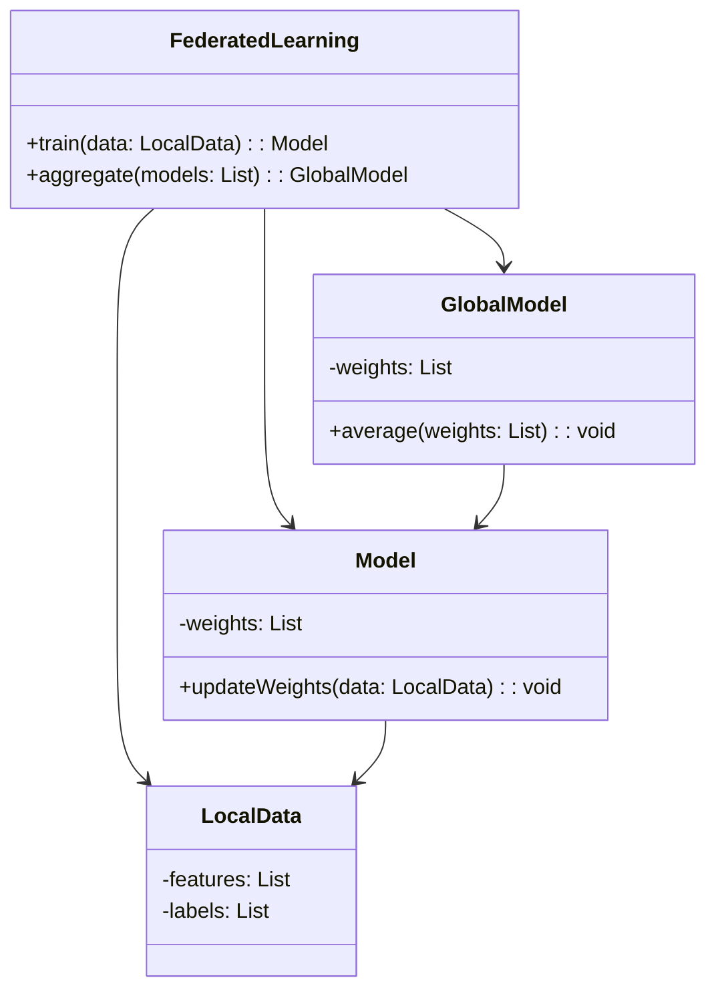
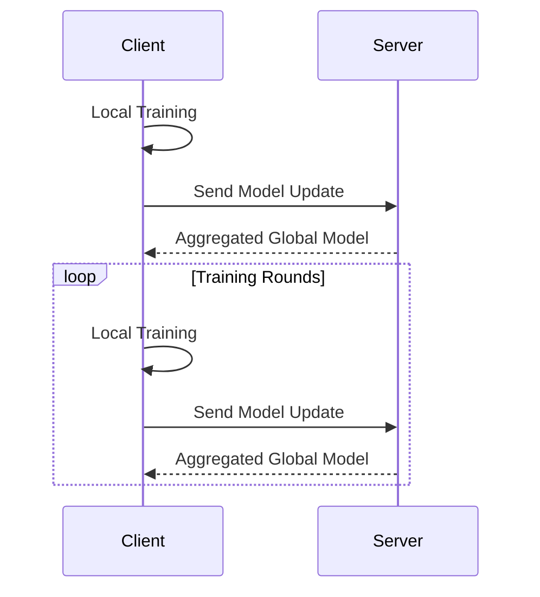

## Federated Learning: Training Across Decentralized Data

Federated Learning is a machine learning paradigm that enables models to be trained across multiple decentralized devices or servers holding local data samples, without exchanging their data. This approach enhances data privacy and security by ensuring that raw data remains local.

### Benefits of Federated Learning

- **Privacy-Preserving:** Sensitive data never leaves the user's device, minimizing data exposure.
- **Reduced Latency:** Training occurs locally, reducing the time needed to transfer data.
- **Scalability:** Distributed training allows scaling to many devices.
- **Compliance:** Helps meet regulations like GDPR by keeping data local.

### Trade-offs

- **Communication Overhead:** Synchronizing model updates across multiple devices can be bandwidth-intensive.
- **Complexity:** Managing distributed training and ensuring model convergence adds complexity.
- **Resource Constraints:** Local devices may have limited computational power and memory.

### Use Cases

- **Mobile Keyboard Predictions:** Training predictive text models on mobile devices without accessing users' texts.
- **Healthcare:** Federated learning on patient data across hospitals without sharing sensitive health information.
- **IoT Devices:** Enhancing smart home devices using local data while maintaining user privacy.

### UML Class Diagram



### UML Sequence Diagram



### Example Implementations

#### Python

```python
import numpy as np

class LocalModel:
    def __init__(self, weights):
        self.weights = weights

    def train(self, local_data):
        # Perform local training
        for data_point in local_data:
            self.weights += 0.1 * (data_point - self.weights)

class FederatedServer:
    def __init__(self):
        self.global_model = np.zeros(10)

    def aggregate(self, local_models):
        self.global_model = np.mean([model.weights for model in local_models], axis=0)

local_data1 = np.random.rand(10)
local_data2 = np.random.rand(10)
local_model1 = LocalModel(np.random.rand(10))
local_model2 = LocalModel(np.random.rand(10))

server = FederatedServer()

local_model1.train(local_data1)
local_model2.train(local_data2)

server.aggregate([local_model1, local_model2])
print("Global model weights: ", server.global_model)
```

#### Java

```java
import java.util.List;
import java.util.ArrayList;

class LocalModel {
    private double[] weights;

    public LocalModel(double[] weights) {
        this.weights = weights;
    }

    public void train(double[] localData) {
        // Perform local training
        for (int i = 0; i < weights.length; i++) {
            weights[i] += 0.1 * (localData[i] - weights[i]);
        }
    }

    public double[] getWeights() {
        return weights;
    }
}

class FederatedServer {
    private double[] globalModel;

    public FederatedServer() {
        globalModel = new double[10];
    }

    public void aggregate(List<LocalModel> localModels) {
        for (int i = 0; i < globalModel.length; i++) {
            globalModel[i] = localModels.stream().mapToDouble(m -> m.getWeights()[i]).average().orElse(0);
        }
    }

    public double[] getGlobalModel() {
        return globalModel;
    }
}

// Simulation
public class FederatedLearning {
    public static void main(String[] args) {
        double[] localData1 = new double[10];
        double[] localData2 = new double[10];
        LocalModel localModel1 = new LocalModel(localData1);
        LocalModel localModel2 = new LocalModel(localData2);

        FederatedServer server = new FederatedServer();

        // Local training
        localModel1.train(localData1);
        localModel2.train(localData2);

        // Server aggregation
        List<LocalModel> models = new ArrayList<>();
        models.add(localModel1);
        models.add(localModel2);
        server.aggregate(models);
        System.out.println("Global model weights: " + Arrays.toString(server.getGlobalModel()));
    }
}
```

#### Scala

```scala
object FederatedLearning {
  class LocalModel(var weights: Array[Double]) {
    def train(localData: Array[Double]): Unit = {
      // Perform local training
      weights.indices.foreach { i =>
        weights(i) += 0.1 * (localData(i) - weights(i))
      }
    }
  }

  class FederatedServer {
    var globalModel: Array[Double] = Array.fill(10)(0.0)

    def aggregate(localModels: List[LocalModel]): Unit = {
      globalModel = localModels.map(_.weights).transpose.map(_.sum / localModels.length)
    }
  }

  // Simulation
  def main(args: Array[String]): Unit = {
    val localData1 = Array.fill(10)(scala.util.Random.nextDouble())
    val localData2 = Array.fill(10)(scala.util.Random.nextDouble())

    val localModel1 = new LocalModel(localData1)
    val localModel2 = new LocalModel(localData2)

    val server = new FederatedServer

    // Local training
    localModel1.train(localData1)
    localModel2.train(localData2)

    // Server aggregation
    server.aggregate(List(localModel1, localModel2))
    println("Global model weights: " + server.globalModel.mkString(", "))
  }
}
```

#### Clojure

```clojure
(defn train-local-model [weights local-data]
  (mapv (fn [w d] (+ w (* 0.1 (- d w)))) weights local-data))

(defn aggregate-models [models]
  (mapv #(/ (reduce + %) (count models)) (apply map vector models)))

;; Simulation
(let [local-data1 (repeatedly 10 #(rand))
      local-data2 (repeatedly 10 #(rand))
      local-model1 (atom (repeatedly 10 #(rand)))
      local-model2 (atom (repeatedly 10 #(rand)))]

  ;; Local training
  (reset! local-model1 (train-local-model @local-model1 local-data1))
  (reset! local-model2 (train-local-model @local-model2 local-data2))

  ;; Server aggregation
  (let [global-model (aggregate-models [@local-model1 @local-model2])]
    (println "Global model weights:" global-model)))
```

### Related Design Patterns

- **Data Parallelism:** Splitting data across multiple nodes to perform parallel processing.
- **Model Parallelism:** Dividing the model across multiple devices, commonly used in scenarios with large models.
- **Distributed Training:** Enabling the training process to span multiple devices or servers, balancing loads and speeds.

### Resources and References

- [Google Research Blog on Federated Learning](https://research.google.com/federated-learning/)
- [Federated Learning Tutorial by TensorFlow](https://www.tensorflow.org/federated/tutorials/federated_learning_for_image_classification)
- [Paper: Communication-Efficient Learning of Deep Networks from Decentralized Data](https://arxiv.org/abs/1602.05629)
- [OpenMined](https://www.openmined.org/): An open-source community focusing on secure and private AI.

### Open Source Frameworks

- **TensorFlow Federated (TFF):** A framework for experimenting with Federated Learning algorithms.
- **PySyft:** A flexible library for encrypted, privacy-preserving machine learning.
- **FedML:** An open-source library designed for edge-computing-focused federated learning.

### Summary

Federated Learning represents a crucial step toward secure and private data analysis, allowing machine learning models to be trained on decentralized data without compromising user privacy. It finds significant applications in areas requiring data privacy, such as healthcare, mobile devices, and IoT. Despite challenges like communication overhead and complexity, its benefits in scalability and privacy make it an essential design pattern for modern neural network solutions.

By harnessing this design pattern, we can build innovative, privacy-preserving applications and contribute to a more secure data ecosystem. The accompanying resources and frameworks are valuable tools for practitioners looking to implement Federated Learning in their projects.

---
