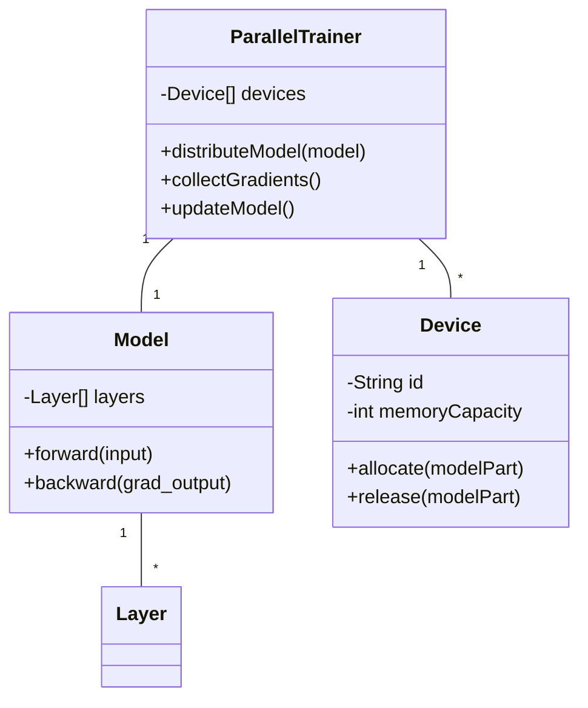
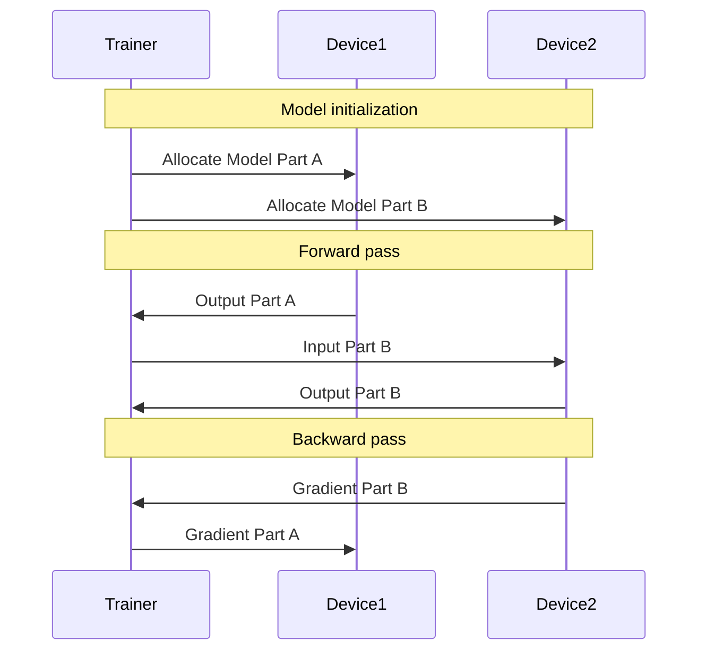

Model Parallelism is a neural network design pattern that involves splitting a large model across multiple devices. This design pattern is particularly useful for training large models that do not fit in the memory of a single device. By distributing different parts of the model across multiple GPUs or nodes, training becomes feasible even for models with extremely large parameter counts.

## Benefits

1. **Handling Large Models:** Enables training of large models that exceed the memory capacity of a single device.
2. **Optimized Resource Utilization:** Allows the use of multiple devices effectively, leading to better resource utilization.
3. **Scalability:** Facilitates the scalability of model training across multiple devices and nodes.

## Trade-offs

1. **Complexity:** Increases the complexity of model architecture and training routines.
2. **Communication Overhead:** May introduce significant communication overhead between devices.
3. **Device Synchronization:** Requires efficient synchronization mechanisms to ensure model consistency.

## UML Class Diagram



## UML Sequence Diagram



## Example Implementations

### Python

```python
import torch
import torch.nn as nn

class PartA(nn.Module):
    def __init__(self):
        super(PartA, self).__init__()
        self.layer = nn.Linear(10, 10)
    
    def forward(self, x):
        return self.layer(x)

class PartB(nn.Module):
    def __init__(self):
        super(PartB, self).__init__()
        self.layer = nn.Linear(10, 10)
    
    def forward(self, x):
        return self.layer(x)

model_a = PartA().to('cuda:0')
model_b = PartB().to('cuda:1')

input_tensor = torch.randn(10, 10).to('cuda:0')
output_a = model_a(input_tensor)
output_b = model_b(output_a.to('cuda:1'))
```

### Java

```java
// Java pseudocode for Model Parallelism

class ModelPartA {
    private Layer layer;

    public ModelPartA() {
        layer = new Layer();
    }

    public Tensor forward(Tensor input) {
        return layer.forward(input);
    }
}

class ModelPartB {
    private Layer layer;

    public ModelPartB() {
        layer = new Layer();
    }

    public Tensor forward(Tensor input) {
        return layer.forward(input);
    }
}

// Assume Layer and Tensor are pre-defined classes
ModelPartA partA = new ModelPartA();
ModelPartB partB = new ModelPartB();

Tensor input = new Tensor();
Tensor outputA = partA.forward(input);
Tensor outputB = partB.forward(outputA);
```

### Scala

```scala
class PartA extends Module {
    val layer = Linear(10, 10)

    def forward(x: Tensor): Tensor = {
        layer.forward(x)
    }
}

class PartB extends Module {
    val layer = Linear(10, 10)

    def forward(x: Tensor): Tensor = {
        layer.forward(x)
    }
}

val modelA = new PartA().toDevice("cuda:0")
val modelB = new PartB().toDevice("cuda:1")

val inputTensor = Tensor.rand(10, 10).toDevice("cuda:0")
val outputA = modelA.forward(inputTensor)
val outputB = modelB.forward(outputA.toDevice("cuda:1"))
```

### Clojure

```clojure
(defrecord PartA []
  nn/Module
  (forward [this x]
    (nn/linear x 10 10)))

(defrecord PartB []
  nn/Module
  (forward [this x]
    (nn/linear x 10 10)))

(def model-a (->PartA))
(def model-b (->PartB))

(def input-tensor (torch.randn [10 10]))
(def output-a (forward model-a input-tensor))
(def output-b (forward model-b output-a))
```

## Use Cases

1. **Large Language Models (LLMs):** Training models like GPT-3 or BERT, which have billions of parameters.
2. **Image Processing:** Large CNNs for high-resolution image recognition or generation tasks.
3. **Reinforcement Learning:** Training complex agents with large policy networks.

## Related Design Patterns

1. **Data Parallelism:** Involves replicating the entire model on multiple devices and splitting the data across these devices.
2. **Hybrid Parallelism:** Combines both Model Parallelism and Data Parallelism for more efficient training.

## Resources and References

- **OpenAI GPT-3:** Research paper detailing the architecture of a large language model.
- **DeepSpeed:** A deep learning optimization library for PyTorch, which supports model parallelism.
- **TensorFlow Model Parallelism Guide:** Official TensorFlow documentation on model parallelism.

## Summary

Model Parallelism is an effective design pattern for distributing a large neural network model across multiple devices, thereby enabling the training of models that would otherwise be infeasible to train on a single device due to memory constraints. While it offers numerous benefits in terms of handling large models and optimizing resource utilization, it also introduces complexity and potential communication overhead. By leveraging this pattern, along with related patterns such as Data Parallelism and Hybrid Parallelism, large-scale model training can be efficiently scaled and executed.


