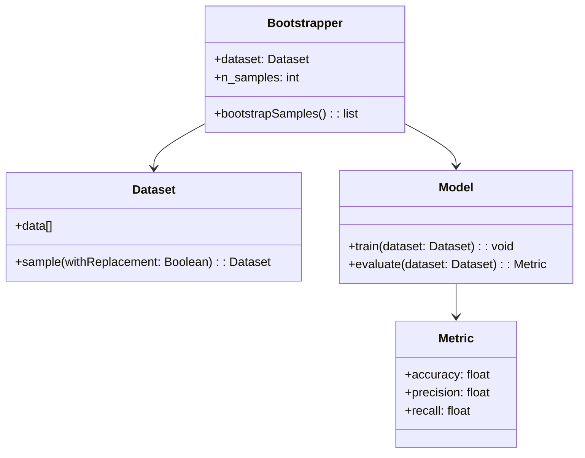
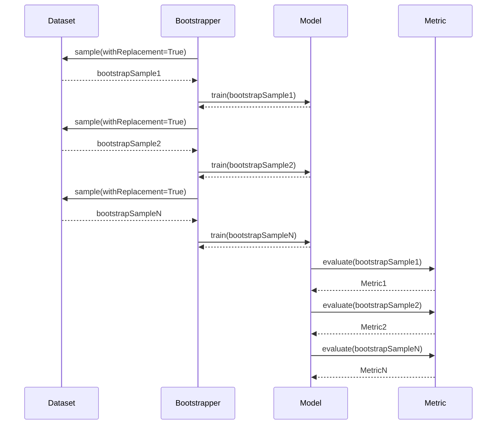

Bootstrapping is a statistical technique that involves randomly sampling with replacement from a dataset to create multiple bootstrap samples. This technique is particularly useful for estimating the performance of machine learning models, including neural networks. The key idea is to use these samples to train and validate the model multiple times, providing an empirical distribution of the performance metrics.

## Benefits of Bootstrapping

- **Model Performance Estimation:** Provides a robust method for estimating model accuracy, error rates, and other performance metrics.
- **Variance Estimation:** Helps in understanding the variability of model estimates.
- **Data Utilization:** Maximizes the use of available data by allowing multiple resampling.

## Trade-offs of Bootstrapping

- **Computational Cost:** Requires significant computational resources due to repeated sampling and training.
- **Bias-Variance Trade-off:** May introduce bias if the dataset is not large enough or if there are significant outliers.

## Use Cases for Bootstrapping

- **Model Validation:** Assessing the performance of neural network models by creating multiple training and validation sets.
- **Confidence Intervals:** Estimating the confidence intervals for model predictions.
- **Feature Selection:** Evaluating the importance of features in a neural network model.

## UML Class Diagram

Here is a UML Class Diagram representing the Bootstrapping design pattern:



## UML Sequence Diagram

The UML Sequence Diagram below demonstrates the interaction between components during the bootstrapping process:



## Examples in Various Languages

### Python

```python
import numpy as np
from sklearn.utils import resample

class Dataset:
    def __init__(self, data):
        self.data = data

    def sample(self, with_replacement=True):
        return resample(self.data, replace=with_replacement)

class Bootstrapper:
    def __init__(self, dataset, n_samples):
        self.dataset = dataset
        self.n_samples = n_samples

    def bootstrap_samples(self):
        return [self.dataset.sample() for _ in range(self.n_samples)]

class Model:
    def train(self, dataset):
        # Placeholder for training logic
        pass

    def evaluate(self, dataset):
        # Placeholder for evaluation logic
        return {"accuracy": np.random.rand()}

data = Dataset(np.array([[1, 2], [3, 4], [5, 6]]))
bootstrapper = Bootstrapper(data, 3)
model = Model()

for sample in bootstrapper.bootstrap_samples():
    model.train(sample)
    metrics = model.evaluate(sample)
    print(metrics)
```

### Java

```java
import java.util.ArrayList;
import java.util.List;
import java.util.Random;

class Dataset {
    List<int[]> data;

    public Dataset(List<int[]> data) {
        this.data = data;
    }

    public List<int[]> sample(boolean withReplacement) {
        List<int[]> sample = new ArrayList<>();
        Random rand = new Random();

        for (int i = 0; i < data.size(); i++) {
            sample.add(data.get(rand.nextInt(data.size())));
        }

        return sample;
    }
}

class Bootstrapper {
    Dataset dataset;
    int nSamples;

    public Bootstrapper(Dataset dataset, int nSamples) {
        this.dataset = dataset;
        this.nSamples = nSamples;
    }

    public List<List<int[]>> bootstrapSamples() {
        List<List<int[]>> samples = new ArrayList<>();
        for (int i = 0; i < nSamples; i++) {
            samples.add(dataset.sample(true));
        }
        return samples;
    }
}

class Model {
    public void train(List<int[]> dataset) {
        // Placeholder for training logic
    }

    public double evaluate(List<int[]> dataset) {
        // Placeholder for evaluation logic
        return Math.random();
    }
}

// Example usage
public class BootstrappingExample {
    public static void main(String[] args) {
        List<int[]> data = new ArrayList<>();
        data.add(new int[]{1, 2});
        data.add(new int[]{3, 4});
        data.add(new int[]{5, 6});
        Dataset dataset = new Dataset(data);
        Bootstrapper bootstrapper = new Bootstrapper(dataset, 3);
        Model model = new Model();

        for (List<int[]> sample : bootstrapper.bootstrapSamples()) {
            model.train(sample);
            double metrics = model.evaluate(sample);
            System.out.println(metrics);
        }
    }
}
```

### Scala

```scala
import scala.util.Random

class Dataset(val data: Array[Array[Int]]) {
  def sample(withReplacement: Boolean): Array[Array[Int]] = {
    val rand = new Random
    Array.fill(data.length)(data(rand.nextInt(data.length)))
  }
}

class Bootstrapper(dataset: Dataset, nSamples: Int) {
  def bootstrapSamples(): Array[Array[Array[Int]]] = {
    Array.fill(nSamples)(dataset.sample(true))
  }
}

class Model {
  def train(dataset: Array[Array[Int]]): Unit = {
    // Placeholder for training logic
  }

  def evaluate(dataset: Array[Array[Int]]): Double = {
    // Placeholder for evaluation logic
    Random.nextDouble()
  }
}

// Example usage
object BootstrappingExample extends App {
  val data = Array(Array(1, 2), Array(3, 4), Array(5, 6))
  val dataset = new Dataset(data)
  val bootstrapper = new Bootstrapper(dataset, 3)
  val model = new Model

  for (sample <- bootstrapper.bootstrapSamples()) {
    model.train(sample)
    val metrics = model.evaluate(sample)
    println(metrics)
  }
}
```

### Clojure

```clojure
(ns bootstrapping-example.core
  (:require [clojure.data.generators :as gen]))

(defn sample [data]
  (repeatedly (count data) #(rand-nth data)))

(defn bootstrap-samples [dataset n-samples]
  (repeatedly n-samples #(sample dataset)))

(defn train [dataset]
  ;; Placeholder for training logic
  nil)

(defn evaluate [dataset]
  ;; Placeholder for evaluation logic
  {:accuracy (rand)})

;; Example usage
(def data [[1 2] [3 4] [5 6]])
(def n-samples 3)

(doseq [sample (bootstrap-samples data n-samples)]
  (train sample)
  (println (evaluate sample)))
```

## Related Design Patterns

- **Cross-Validation:** Another method for estimating the performance of machine learning models by partitioning the data into multiple folds.
- **Bagging:** Often used in ensemble learning, bagging also involves bootstrapping to create multiple datasets and aggregate their predictions.

## Resources and References

- **Books:** 
  - "An Introduction to Statistical Learning" by Gareth James, Daniela Witten, Trevor Hastie, and Robert Tibshirani.
  - "The Elements of Statistical Learning" by Trevor Hastie, Robert Tibshirani, and Jerome Friedman.

- **Online Resources:**
  - [Wikipedia on Bootstrapping](https://en.wikipedia.org/wiki/Bootstrapping_(statistics))
  - [Scikit-learn Bootstrapping](https://scikit-learn.org/stable/modules/generated/sklearn.utils.resample.html)

- **Open Source Frameworks:**
  - [Scikit-learn](https://scikit-learn.org/)
  - [Apache Spark's MLlib](https://spark.apache.org/mllib/)

## Summary

Bootstrapping is a powerful and flexible technique for estimating the performance of neural network models. By generating multiple bootstrap samples, it allows for robust model validation and variance estimation. While computationally intensive, the insights gained from bootstrapping can significantly enhance model reliability and confidence in predictions. This pattern is widely applicable in various machine learning and statistical analysis scenarios, offering a foundational tool for data scientists and engineers.
