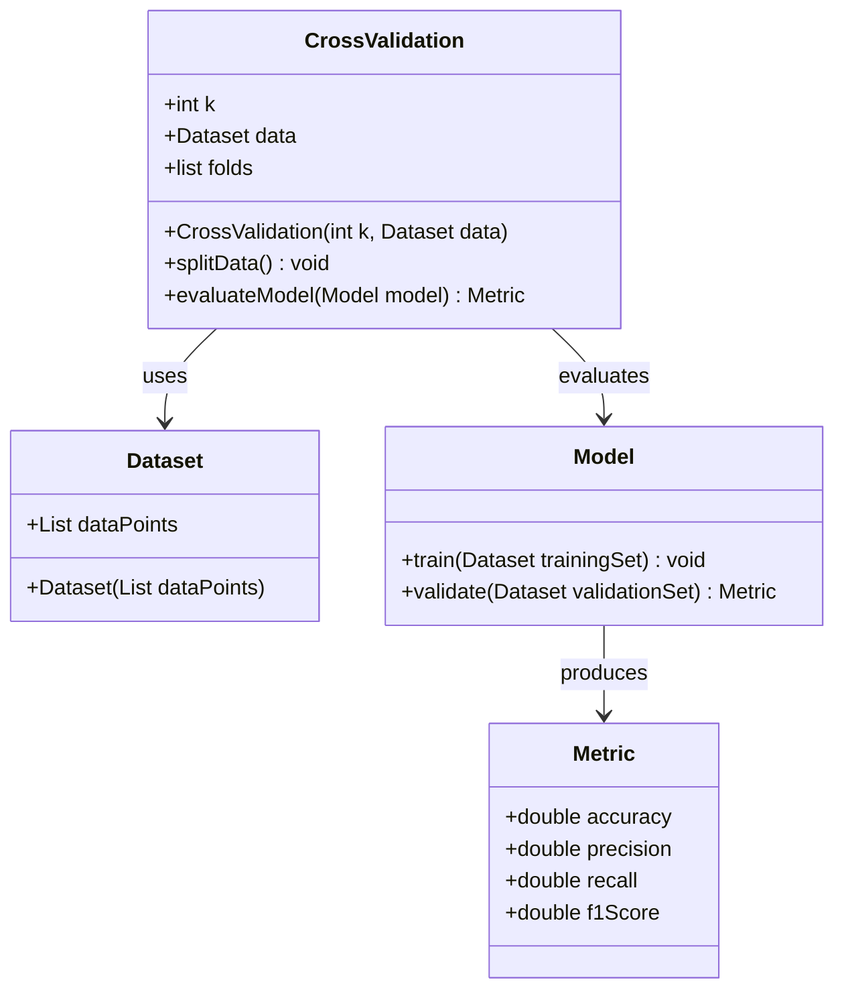
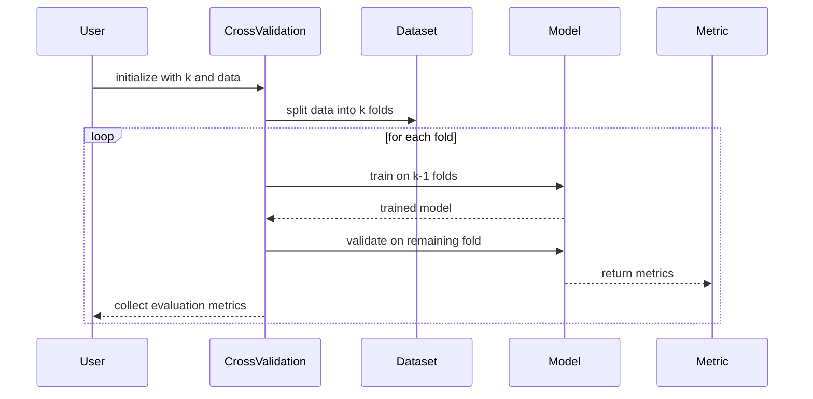

Cross-validation is a robust model evaluation method used widely in machine learning and neural networks. This technique splits the dataset into k folds, iteratively training and validating the model, to ensure it generalizes well to unseen data.

## Detailed Description

Cross-validation is primarily used to assess the performance of a machine learning model and understand how it will generalize to an independent dataset. By splitting the data into k subsets (or "folds"), each fold acts as both a training set and a validation set at different iterations. This prevents overfitting and gives a more reliable measure of model performance.

### Types of Cross-Validation

1. **K-Fold Cross-Validation**: The data is divided into k subsets of equal size. For each of k iterations, one fold is used as the validation set, and the remaining k-1 folds are used as the training set.
2. **Stratified K-Fold Cross-Validation**: A variation of k-fold that ensures each fold has a similar distribution of classes as the entire dataset.
3. **Leave-One-Out Cross-Validation (LOOCV)**: A special case where k equals the number of data points, meaning each data point is used once as a validation set.
4. **Time Series Cross-Validation**: Special method for time series data where folds respect temporal order.

## UML Class and Sequence Diagrams

### UML Class Diagram



### UML Sequence Diagram



## Examples in Different Programming Languages

### Python

```python
from sklearn.model_selection import KFold
from sklearn.metrics import accuracy_score

def cross_validate(model, X, y, k):
    kf = KFold(n_splits=k)
    accuracies = []
    for train_index, test_index in kf.split(X):
        X_train, X_test = X[train_index], X[test_index]
        y_train, y_test = y[train_index], y[test_index]
        model.fit(X_train, y_train)
        predictions = model.predict(X_test)
        accuracies.append(accuracy_score(y_test, predictions))
    return accuracies
```

### Java

```java
import java.util.*;
import org.apache.commons.math3.stat.descriptive.moment.Mean;

public class CrossValidation {
    public static double[] crossValidate(Model model, double[][] X, double[] y, int k) {
        KFold kf = new KFold(k, X.length);
        double[] accuracies = new double[k];
        int foldIndex = 0;
        for (Fold fold : kf) {
            model.fit(X[fold.trainIndices], y[fold.trainIndices]);
            double[] predictions = model.predict(X[fold.testIndices]);
            accuracies[foldIndex++] = accuracy(y[fold.testIndices], predictions);
        }
        return accuracies;
    }

    private static double accuracy(double[] yTrue, double[] yPred) {
        int correct = 0;
        for (int i = 0; i < yTrue.length; i++) {
            if (yTrue[i] == yPred[i]) correct++;
        }
        return (double) correct / yTrue.length;
    }
}
```

### Scala

```scala
import org.apache.spark.ml.evaluation.MulticlassClassificationEvaluator
import org.apache.spark.ml.Model

def crossValidate(model: Model, data: DataFrame, k: Int): Array[Double] = {
  val kf = new KFold(k, data.count().toInt)
  val accuracies = for (fold <- kf) yield {
    val trainingSet = data.filter(!fold.testIndices.contains(_))
    val testSet = data.filter(fold.testIndices.contains(_))
    val fittedModel = model.fit(trainingSet)
    val predictions = fittedModel.transform(testSet)
    val evaluator = new MulticlassClassificationEvaluator().setMetricName("accuracy")
    evaluator.evaluate(predictions)
  }
  accuracies.toArray
}
```

### Clojure

```clojure
(require '[clojure.data.csv :as csv]
         '[clojure.java.io :as io])

(defn cross-validate [model data k]
  (let [kf (k-fold data k)]
    (for [fold kf]
      (let [training-set (map #(data %) (remove fold test-indices))
            test-set (map #(data %) (fold test-indices))]
        (let [trained-model (train model training-set)]
          (accuracy (predict trained-model test-set) (actual test-set)))))))

(defn k-fold [data k]
  ; Implementation of k-fold partitioning
)

(defn train [model training-set]
  ; Implementation of model training
)

(defn predict [model test-set]
  ; Implementation of prediction
)

(defn accuracy [predictions actuals]
  ; Implementation of accuracy calculation
)
```

## Benefits and Trade-Offs

### Benefits

1. **Robust Model Evaluation**: Cross-validation provides a more accurate measure of a model's performance.
2. **Reduced Overfitting**: By using different training and validation sets, the model becomes more generalizable.
3. **Comprehensive Performance Metrics**: Averages performance across multiple folds, providing reliable metrics.

### Trade-Offs

1. **Computationally Expensive**: Performing k separate trainings can be resource-intensive.
2. **Complexity**: Implementation can be more complex than a single train-test split.

## Examples of Use Cases

1. **Hyperparameter Tuning**: Cross-validation is commonly used in grid or random search to find the best hyperparameters.
2. **Model Comparison**: Helps compare multiple models by providing a consistent evaluation metric.
3. **Feature Selection**: Used to evaluate the impact of different feature subsets on model performance.

## Related Design Patterns

1. **Bootstrapping**: An alternative method for estimating a model's performance by sampling with replacement.
2. **Holdout Method**: Simpler method involving a single train-test split.
3. **Bagging**: Combines multiple models trained on different samples to improve performance.

## Resources and References

1. **Books**:
   - "Hands-On Machine Learning with Scikit-Learn, Keras, and TensorFlow" by Aurélien Géron
   - "Pattern Recognition and Machine Learning" by Christopher M. Bishop
2. **Online Tutorials**:
   - [Scikit-learn documentation](https://scikit-learn.org/stable/modules/cross_validation.html)
   - [Cross-Validation for Model Evaluation in Python](https://machinelearningmastery.com/k-fold-cross-validation/)

## Open Source Frameworks

1. **Scikit-learn**: Python library offering extensive support for cross-validation.
2. **WEKA**: Java-based suite of machine learning software.
3. **Spark MLlib**: Scalable machine learning library from Apache Spark.

## Final Summary

Cross-validation is an indispensable technique in the arsenal of machine learning practitioners. By leveraging different subsets of data for training and validation, it ensures that models perform well on unseen data. While it might be computationally expensive, the benefits of robust and reliable model evaluation make it worth the effort.

Proper understanding and implementation of cross-validation can significantly improve the quality of machine learning solutions, offering insights that would be missed with simpler evaluation methods.
