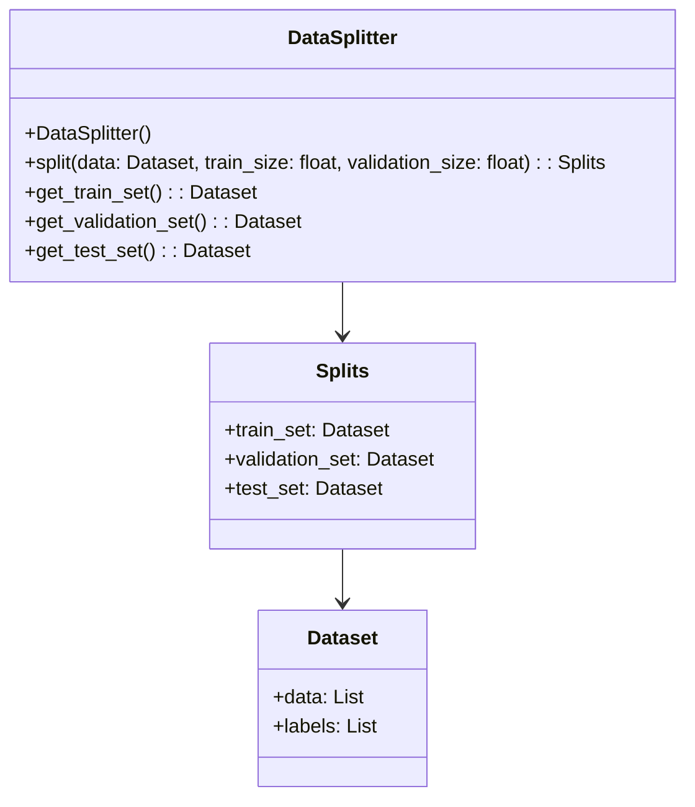
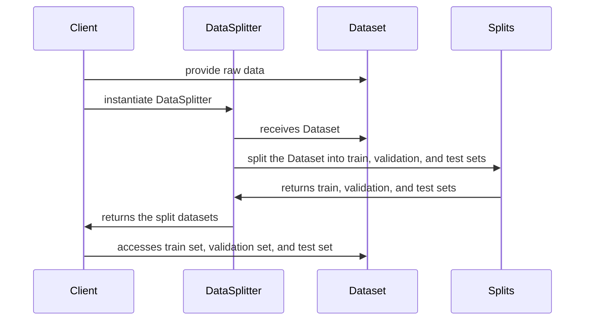

The Holdout method is a fundamental strategy used in machine learning to divide a dataset into distinct subsets: training, validation, and test sets. This approach ensures that the model can be evaluated and selected based on its performance on unseen data.

## Detailed Description

In machine learning and neural networks, evaluating a model's performance is crucial. The Holdout method allows us to assess how well our model generalizes to new, unseen data. By splitting the dataset into three sets:
- **Training set**: Used to train the model.
- **Validation set**: Used to tune the hyperparameters and validate the model during the training phase.
- **Test set**: Used to evaluate the final performance of the model after the training and validation phases are complete.

This segregation helps in avoiding overfitting and underfitting, ensuring that the model performs well on real-world data.

## UML Class and Sequence Diagrams

### Class Diagram



### Sequence Diagram



## Example Implementations

### Python

```python
from sklearn.model_selection import train_test_split

def holdout_split(data, labels, train_size=0.7, validation_size=0.2):
    data_train, data_temp, labels_train, labels_temp = train_test_split(data, labels, train_size=train_size)
    validation_size_adjusted = validation_size / (1 - train_size)
    data_val, data_test, labels_val, labels_test = train_test_split(data_temp, labels_temp, test_size=validation_size_adjusted)
    return (data_train, labels_train), (data_val, labels_val), (data_test, labels_test)
```

### Java

```java
import java.util.ArrayList;
import java.util.List;

public class DataSplitter {
    public static void main(String[] args) {
        List<Data> dataset = ... // Assume this is populated

        List<Data> trainSet = new ArrayList<>();
        List<Data> valSet = new ArrayList<>();
        List<Data> testSet = new ArrayList<>();

        int totalSize = dataset.size();
        int trainSize = (int) (totalSize * 0.7);
        int valSize = (int) (totalSize * 0.2);

        for (int i = 0; i < trainSize; i++) {
            trainSet.add(dataset.get(i));
        }

        for (int i = trainSize; i < trainSize + valSize; i++) {
            valSet.add(dataset.get(i));
        }

        for (int i = trainSize + valSize; i < totalSize; i++) {
            testSet.add(dataset.get(i));
        }
    }
}

class Data {
    // attributes
}
```

### Scala

```scala
import scala.util.Random

object DataSplitter {
  def holdoutSplit[T](data: Seq[T], trainSize: Double, validationSize: Double): (Seq[T], Seq[T], Seq[T]) = {
    val shuffled = Random.shuffle(data)
    val trainIndex = (trainSize * data.size).toInt
    val validationIndex = trainIndex + ((validationSize * data.size).toInt)
    
    val trainSet = shuffled.take(trainIndex)
    val valSet = shuffled.slice(trainIndex, validationIndex)
    val testSet = shuffled.drop(validationIndex)
    
    (trainSet, valSet, testSet)
  }
}
```

### Clojure

```clojure
(defn split-data
  [data labels train-size validation-size]
  (let [train-count (int (* train-size (count data)))
        validation-count (int (* validation-size (count data)))
        data-labels (map vector data labels)
        shuffled (shuffle data-labels)
        train-set (subvec shuffled 0 train-count)
        validation-set (subvec shuffled train-count (+ train-count validation-count))
        test-set (subvec shuffled (+ train-count validation-count) (count shuffled))]
    {:train train-set
     :validation validation-set
     :test test-set}))
```

## Benefits

1. **Simplicity**: The Holdout method is straightforward to implement and understand.
2. **Speed**: Fast data splitting without iterative processes.
3. **Adaptability**: Flexible splitting ratios to adapt to various dataset sizes and use cases.

## Trade-offs

1. **Randomness**: The split can be affected by the randomness, possibly leading to biased or non-representative training, validation, and test sets.
2. **Data Scarcity**: Ineffective with small datasets as it may not provide enough data for training or testing.

## Use Cases

- **Model Evaluation**: Provides a clear methodology for evaluating model performance.
- **Model Selection**: Helps in selecting the best-performing model based on validation set results.
- **Hyperparameter Tuning**: Allows tuning hyperparameters against the validation set to improve the model.

## Related Design Patterns

- **K-Fold Cross-Validation**: An alternative that divides data into k subsets and iteratively trains and validates across all subsets.
- **Bootstrapping**: Resamples the dataset with replacement to create multiple training sets for estimation and validation.

## Resources and References

- [scikit-learn: Model evaluation](https://scikit-learn.org/stable/model_selection.html)
- [Understanding Machine Learning: From Theory to Algorithms](https://www.cs.huji.ac.il/~shais/UnderstandingMachineLearning/copy.html)

## Open Source Frameworks

- **scikit-learn**: A widely used Python library for machine learning that supports data splitting and evaluation.
- **TensorFlow**: An open-source platform for machine learning that includes utilities for data splitting and preprocessing.

## Summary

The Holdout method is a pivotal design pattern in the realm of machine learning, offering a simplistic yet effective way to evaluate and select models. While it has its limitations, its ease of use and speed make it an invaluable tool in a data scientist's toolkit. For robust model evaluation, it is often complemented by other patterns like K-Fold Cross-Validation.


