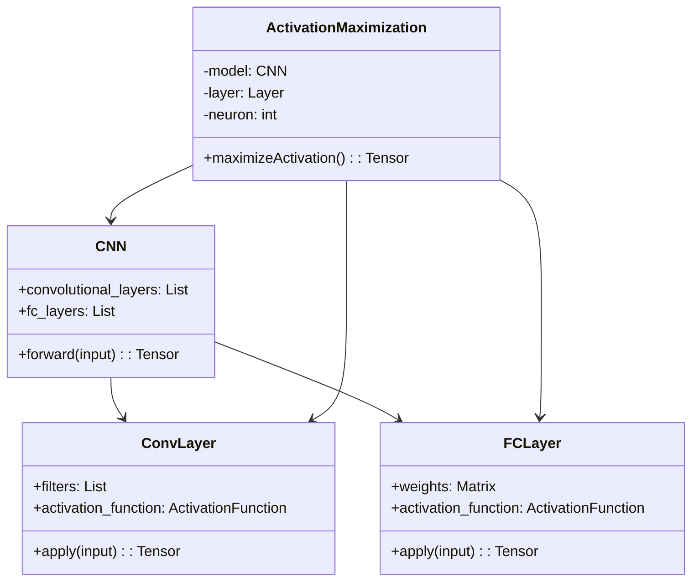
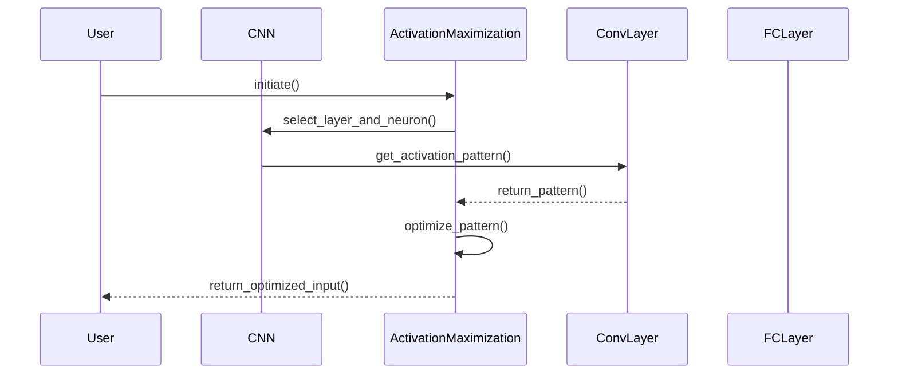

## Activation Maximization: Visualizing Neuronal Activations

Activation Maximization is a powerful technique used to visualize and understand what specific features or patterns in the input data cause particular neurons or layers in a Convolutional Neural Network (CNN) to activate. This process helps to interpret the inner workings of neural networks, making them less of a "black box" and providing insights into the features learned during training.

### Benefits
- **Interpretability:** Improves understanding of the model's decision-making process.
- **Debugging:** Helps identify why a network might be underperforming by visualizing irrelevant features it has learned.
- **Insight:** Provides deeper insights into the features detected by different layers of the network.

### Trade-offs
- **Complexity:** Involves solving an optimization problem that can be computationally intensive.
- **Overfitting:** Risk of the model overfitting to specific patterns in the input data rather than generalizing well.

### Use Cases
- **Feature Visualization:** To see what a CNN has learned at different layers.
- **Model Debugging:** Identifying layers that have learned irrelevant or misleading features.
- **Network Explanation:** Providing visual explanations for the decisions made by a network.

## UML Diagrams

### UML Class Diagram



### UML Sequence Diagram



## Detailed Explanations

The process starts with selecting a pre-trained CNN model, choosing a specific layer and neuron, and then using gradient ascent to maximize the activation of that neuron. This yields an input pattern that most activates the neuron.

### Examples

#### Python

```python
import tensorflow as tf
from tensorflow.keras.applications import VGG16

model = VGG16(weights='imagenet', include_top=True)
layer_name = 'block5_conv3'
filter_index = 0

layer_output = model.get_layer(layer_name).output
loss = tf.keras.backend.mean(layer_output[:, :, :, filter_index])
grads = tf.keras.backend.gradients(loss, model.input)[0]

iterate = tf.keras.backend.function([model.input], [loss, grads])
input_img_data = np.random.random((1, 224, 224, 3)) * 20 + 128
step = 1.

for i in range(40):
    loss_value, grads_value = iterate([input_img_data])
    input_img_data += grads_value * step
```

#### Java

```java
// Implementation for Java could use DL4J (Deep Learning for Java) framework.
// Assuming ND4J and other DL4J components are correctly set up.

MultiLayerNetwork model = ModelSerializer.restoreMultiLayerNetwork("path/to/model.zip");
String layerName = "block5_conv3";
int filterIndex = 0;

INDArray input = Nd4j.rand(1, 3, 224, 224);
Gradient gradient = new DefaultGradient();
Layer layer = model.getLayer(layerName);

for (int i = 0; i < 40; i++) {
    INDArray output = layer.activate(input, false, LayerWorkspaceMgr.noWorkspaces());
    gradient.gradientForVariable().put("input", output);
    input.addi(gradient.gradient().dup().muli(1.0));
}
```

#### Scala

```scala
// With BigDL, Spark-based deep learning framework

import com.intel.analytics.bigdl.tensor.Tensor
import com.intel.analytics.bigdl.nn.Module

val model = Module.loadModule[Float]("path/to/model")
val layerName = "block5_conv3"
val filterIndex = 0

var input = Tensor[Float](1, 3, 224, 224).randn()
val step = 1.0f

for (_ <- 0 until 40) {
  val output = model.forward(input)
  val gradient = model.backward(input, output)
  input += gradient * step
}
```

#### Clojure

```clojure
;; Using deep learning libraries like Cortex in Clojure

(def model (load-model "path/to/model"))
(def layer-name "block5_conv3")
(def filter-index 0)

(def input (tensor 1 3 224 224 :randn))
(def step 1.0)

(dotimes [i 40]
  (let [output (forward model input)
        gradient (backward model input output)]
    (swap! input #(add % (mul gradient step)))))
```

## Related Design Patterns

- **Saliency Maps:** Highlight regions of the input most responsible for the neural network's decision.
- **Class Activation Mapping (CAM):** Visualize class-specific regions within an image that are discriminative.
- **Grad-CAM:** Generalize CAM using gradients to provide localization maps.

## Resources and References

- **Deep Visualization Toolbox:** An open-source toolkit for visualizing CNNs.
- **O'Reilly's "Interpretable Machine Learning" by Christoph Molnar**
- **TensorFlow, PyTorch, and DL4J documentation for advanced neural network visualization techniques.**

## Open Source Frameworks

- **DeepDream:** For generating psychedelic images using gradient ascent.
- **Lucid:** A Python library for neural network interpretability.

## Summary

Activation Maximization serves as a crucial tool in the interpretability toolkit for deep learning models, particularly CNNs. By visualizing the features that activate neurons, data scientists and engineers can gain valuable insights into the inner workings of their models, leading to better performance and trustworthiness.

By following this detailed guide, you should be able to implement Activation Maximization in various programming languages, understand its benefits and trade-offs, and relate it to other interpretability methods. Whether you are debugging a model or seeking to explain its decisions, Activation Maximization can be an invaluable technique in your deep learning workflow.
