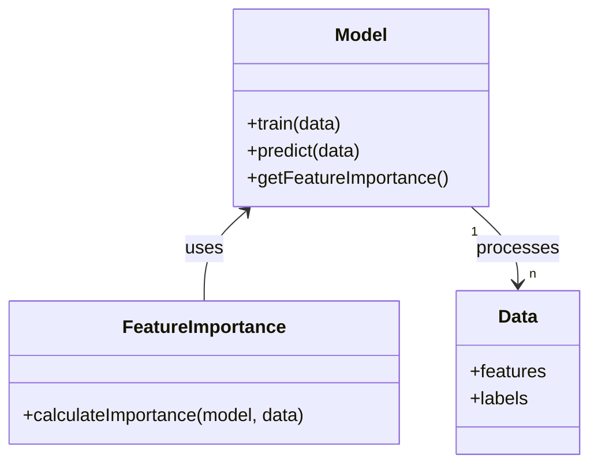
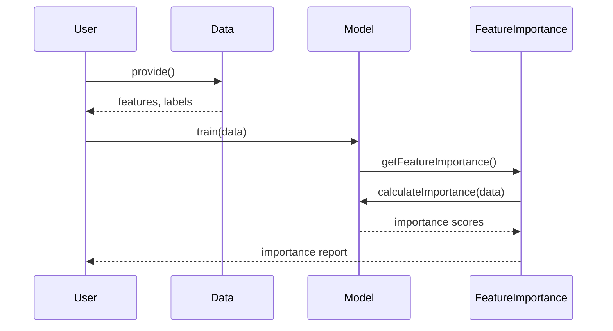

## Introduction

Feature Importance is a design pattern used to quantify the contribution of individual input features to the predictions made by a machine learning model, particularly in neural networks. This pattern is crucial for understanding model decisions, enhancing interpretability, and improving model trustworthiness.

## UML Class Diagram



## UML Sequence Diagram



## Detailed Description

Feature Importance helps identify how influential each feature is in the model’s prediction. This can be implemented through several methods such as permutation importance, SHAP values, and gradient-based methods. It is essential in domains where interpretability is as important as accuracy, such as healthcare, finance, and autonomous systems.

### Benefits

- **Improved Interpretability:** Makes the model decisions more understandable.
- **Error Analysis:** Helps in identifying and mitigating the impact of noisy or irrelevant features.
- **Model Trustworthiness:** Enhances trust in the model by explaining its decisions.
- **Feature Engineering:** Guides feature selection and engineering efforts.

### Trade-offs

- **Computational Overhead:** Calculating feature importance can be computationally expensive.
- **Potential for Misinterpretation:** Importance scores may be misinterpreted without proper understanding.
- **Model Dependency:** Different models might give different importance scores for the same features.

## Examples in Different Languages

### Python

```python
from sklearn.ensemble import RandomForestClassifier
from sklearn.datasets import make_classification
from sklearn.inspection import permutation_importance

X, y = make_classification(n_samples=1000, n_features=10)
model = RandomForestClassifier().fit(X, y)
result = permutation_importance(model, X, y, n_repeats=10, random_state=42)

for i in result.importances_mean.argsort()[::-1]:
    print(f"Feature {i}: {result.importances_mean[i]:.3f}")
```

### Java

```java
import weka.classifiers.trees.RandomForest;
import weka.core.Instances;
import weka.core.converters.ConverterUtils.DataSource;

public class FeatureImportance {
    public static void main(String[] args) throws Exception {
        DataSource source = new DataSource("data.arff");
        Instances data = source.getDataSet();
        data.setClassIndex(data.numAttributes() - 1);

        RandomForest model = new RandomForest();
        model.buildClassifier(data);

        for (int i = 0; i < data.numAttributes() - 1; i++) {
            System.out.println("Feature " + i + ": " + model.attributeImportance(i));
        }
    }
}
```

### Scala

```scala
import org.apache.spark.ml.feature.VectorAssembler
import org.apache.spark.ml.classification.RandomForestClassifier
import org.apache.spark.ml.evaluation.MulticlassClassificationEvaluator
import org.apache.spark.ml.{Pipeline, PipelineModel}
import org.apache.spark.sql.SparkSession

val spark = SparkSession.builder.appName("FeatureImportanceExample").getOrCreate()
val data = spark.read.format("libsvm").load("data.txt")

val featureColumns = data.columns.dropRight(1)
val assembler = new VectorAssembler().setInputCols(featureColumns).setOutputCol("features")

val rf = new RandomForestClassifier().setLabelCol("label").setFeaturesCol("features")
val pipeline = new Pipeline().setStages(Array(assembler, rf))

val model = pipeline.fit(data)
val featureImportances = model.stages(1).asInstanceOf[RandomForestClassificationModel].featureImportances
featureImportances.toArray.zipWithIndex.foreach { case (imp, idx) => println(s"Feature $idx: $imp") }
```

### Clojure

```clojure
(require '[clj-ml.data :as data]
         '[clj-ml.classifiers :as classifiers])

(def dataset (data/dataset "data.arff"))
(def classifier (classifiers/make-classifier :ensemble :random-forest))

(classifiers/train classifier dataset)
(def importance (classifiers/attribute-importance classifier dataset))

(doseq [[i v] (map vector (range) importance)]
  (println (str "Feature " i ": " v)))
```

## Use Cases

- **Healthcare:** Understanding which biomarkers or clinical features influence diagnosis.
- **Finance:** Identifying key financial indicators that predict risk.
- **Autonomous Systems:** Understanding sensor data influence on decisions.
- **Customer Insights:** Determining customer behavior drivers in churn models.

## Related Design Patterns

- **Model Interpretation Patterns:** Methods like SHAP values and LIME that provide interpretability.
- **Feature Selection Patterns:** Techniques to select important features before training.
- **Model Explanation Patterns:** Approaches for explaining overall model behavior beyond individual feature importance.

## Resources and References

- [Interpretable Machine Learning - Christoph Molnar](https://christophm.github.io/interpretable-ml-book/)
- [Permutation Feature Importance with Python](https://scikit-learn.org/stable/auto_examples/inspection/plot_permutation_importance.html)
- [Understanding Feature Importance](https://towardsdatascience.com/interpretable-machine-learning-2019-49428fd9a75d)

## Open Source Frameworks

- **SHAP (SHapley Additive exPlanations):** A unified framework for interpreting predictions.
- **LIME (Local Interpretable Model-agnostic Explanations):** An approach for explaining individual predictions.
- **Scikit-learn:** Provides functionality for permutation importance.
- **WEKA:** A collection of machine learning algorithms for data mining tasks.

## Summary

Feature Importance is a critical design pattern for understanding and interpreting the contributions of input features in neural networks and other machine learning models. By using this pattern, practitioners can improve model transparency, enhance interpretability, and make more informed decisions based on model outputs. Balancing the computational cost with the benefits of improved model insights, Feature Importance remains an essential tool in the machine learning toolkit.
