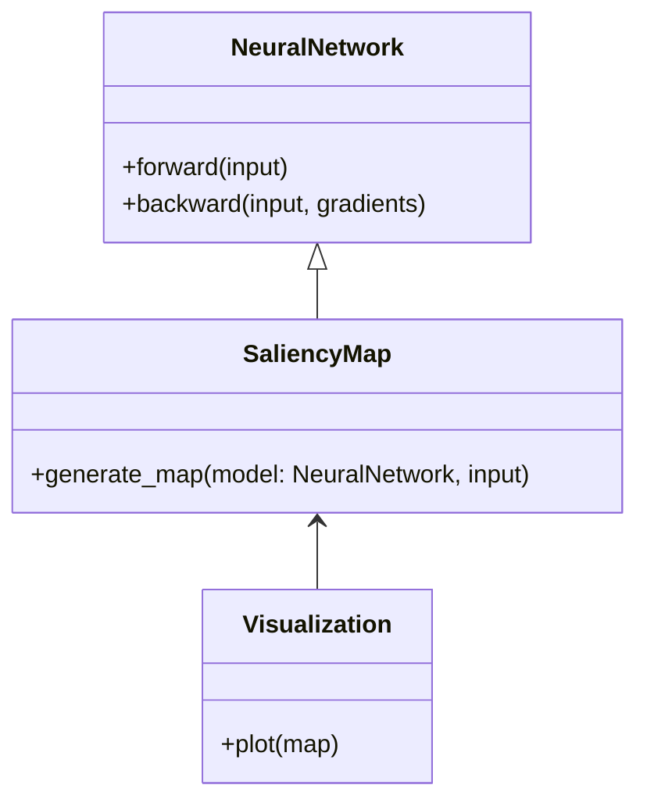
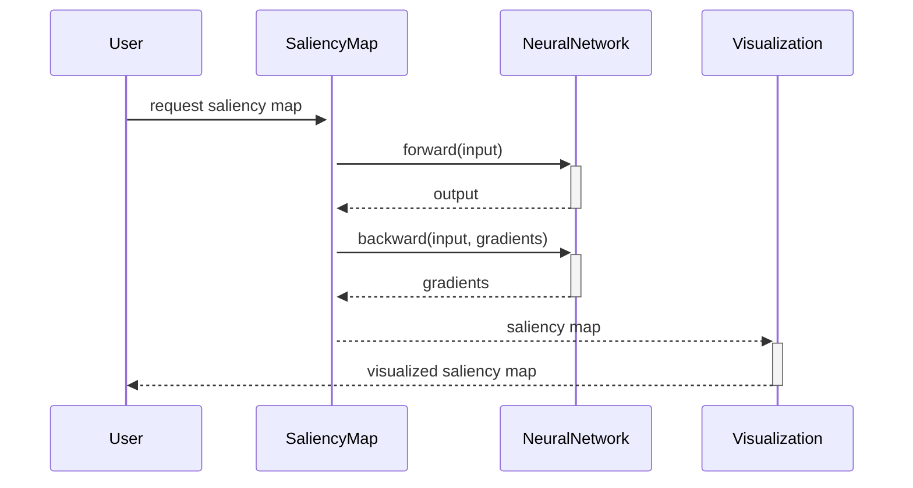

## Introduction

Saliency maps are a popular technique in neural network interpretability that help visualize and identify which parts of the input data are most influential in determining the output of a model. By highlighting these regions, data scientists and researchers can better understand model behavior, debug issues, and ensure more transparent AI systems.

## Benefits and Trade-offs

### Benefits
- **Model Interpretability:** Helps in understanding which features are important for the predictions.
- **Debugging:** Assists in diagnosing why a neural network might be making incorrect predictions.
- **Transparency:** Provides insights for stakeholders about model decision-making processes.
- **Safety:** Useful in critical applications like healthcare and autonomous vehicles to understand and validate model behavior.

### Trade-offs
- **Computational Cost:** Generating saliency maps can be computationally expensive.
- **Approximation:** Saliency maps can sometimes provide only an approximation of feature importance, which may not always be precise.
- **Resolution:** The clarity and granularity of saliency maps can be limited, especially in complex models.

## UML Diagrams

### Class Diagram



### Sequence Diagram



## Example Implementations

### Python Example

```python
import torch
import torch.nn as nn
import matplotlib.pyplot as plt

class SimpleNN(nn.Module):
    def __init__(self):
        super(SimpleNN, self).__init__()
        self.fc1 = nn.Linear(784, 256)
        self.relu = nn.ReLU()
        self.fc2 = nn.Linear(256, 10)

    def forward(self, x):
        x = self.fc1(x)
        x = self.relu(x)
        x = self.fc2(x)
        return x

def generate_saliency_map(model, input, target_class):
    model.eval()
    input = input.requires_grad_()
    output = model(input)
    target = output[0][target_class]
    target.backward()
    saliency = input.grad.data.abs()
    return saliency

def plot_saliency_map(saliency):
    plt.imshow(saliency.squeeze().numpy(), cmap='hot')
    plt.colorbar()
    plt.show()

model = SimpleNN()
input = torch.randn(1, 784)
saliency = generate_saliency_map(model, input, target_class=5)
plot_saliency_map(saliency)
```

### Java Example

```java
import org.deeplearning4j.nn.api.NeuralNetwork;
import org.deeplearning4j.nn.gradient.Gradient;
import org.deeplearning4j.optimize.listeners.ScoreIterationListener;
import org.nd4j.linalg.api.ndarray.INDArray;
import org.nd4j.linalg.factory.Nd4j;

public class SaliencyMap {
    public static INDArray generateSaliencyMap(NeuralNetwork model, INDArray input, int targetClass) {
        model.setInput(input);
        model.computeGradientAndScore();
        Gradient gradient = model.gradient();
        INDArray saliency = gradient.gradient().dup().absolute();
        return saliency;
    }

    public static void plotSaliencyMap(INDArray saliency) {
        // Placeholder for visualization code
        // Use a suitable Java library to visualize the saliency map
    }

    public static void main(String[] args) {
        // Example usage
        NeuralNetwork model = ... // initialize model
        INDArray input = Nd4j.rand(new int[]{1, 784});
        INDArray saliency = generateSaliencyMap(model, input, 5);
        plotSaliencyMap(saliency);
    }
}
```

### Scala Example

```scala
import org.deeplearning4j.nn.api.NeuralNetwork
import org.deeplearning4j.optimize.api.IterationListener
import org.nd4j.linalg.api.ndarray.INDArray
import org.nd4j.linalg.factory.Nd4j

object SaliencyMap {
  def generateSaliencyMap(model: NeuralNetwork, input: INDArray, targetClass: Int): INDArray = {
    model.setInput(input)
    model.computeGradientAndScore()
    val gradient = model.gradient()
    val saliency = gradient.gradient().dup().abs()
    saliency
  }

  def plotSaliencyMap(saliency: INDArray): Unit = {
    // Placeholder for visualization code
    // Use a suitable Scala library to visualize the saliency map
  }

  def main(args: Array[String]): Unit = {
    // Example usage
    val model: NeuralNetwork = ... // initialize model
    val input = Nd4j.rand(1, 784)
    val saliency = generateSaliencyMap(model, input, 5)
    plotSaliencyMap(saliency)
  }
}
```

### Clojure Example

```clojure
(ns saliency-map.core
  (:require [dl4j.nn.api :as nn]
            [nd4j.linalg.factory :as nd4j]))

(defn generate-saliency-map [model input target-class]
  (.setInput model input)
  (.computeGradientAndScore model)
  (let [gradient (.gradient (.gradient model))]
    (.absolute gradient)))

(defn plot-saliency-map [saliency]
  ;; Placeholder for visualization code
  ;; Use a suitable Clojure library to visualize the saliency map
  )

(defn -main [& args]
  ;; Example usage
  (let [model ... ;; initialize model
        input (nd4j/rand [1 784])
        saliency (generate-saliency-map model input 5)]
    (plot-saliency-map saliency)))
```

## Use Cases

1. **Medical Imaging:** Identifying which regions of an image are important for disease diagnosis.
2. **Autonomous Vehicles:** Understanding which objects or areas the model is focusing on for decision making.
3. **Fraud Detection:** Highlighting features that contribute to fraudulent activity detection.

## Related Design Patterns

- **Attention Mechanisms:** A method that enables the model to focus on specific parts of the input sequence when predicting the output.
- **Grad-CAM:** A specific type of saliency map technique used primarily with convolutional neural networks for visual explanations.

## Resources and References

- [Visualizing and Understanding Convolutional Networks](https://arxiv.org/abs/1311.2901)
- [Deep Learning for Computer Vision](https://www.deeplearningbook.org/)
- [Interpretability: Saliency Maps](https://www.interpretability.ai/)

## Open Source Frameworks

- [TensorFlow](https://www.tensorflow.org/)
- [PyTorch](https://pytorch.org/)
- [DeepLearning4J](https://deeplearning4j.org/)

## Summary

Saliency maps are invaluable tools in the interpretability of neural networks, providing insights into which parts of the input are most influential in determining the model's output. By leveraging these maps, researchers and practitioners can gain better transparency and reliability from their models, especially in high-stakes fields such as medical imaging and autonomous driving. Despite their computational costs and potential limitations, saliency maps represent a significant advancement towards more interpretable and trustworthy AI systems.
