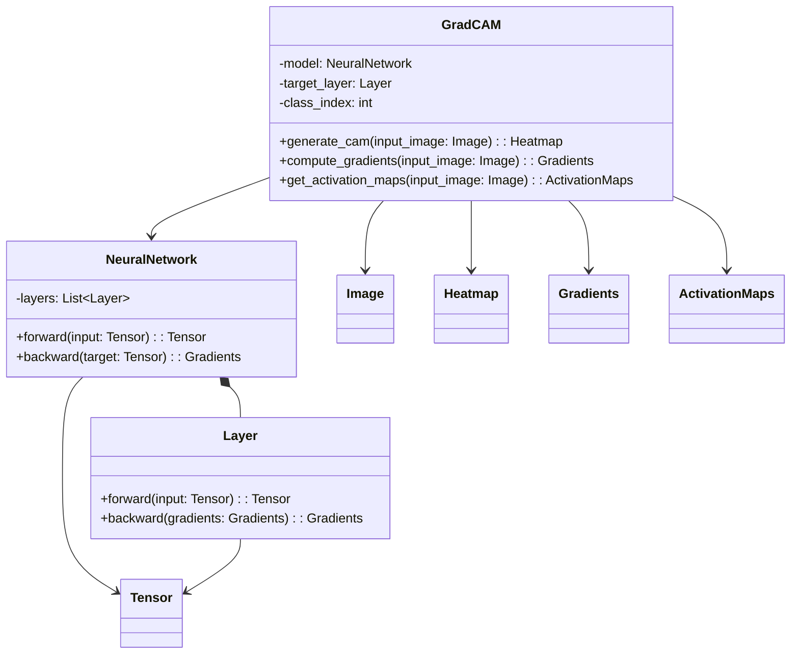
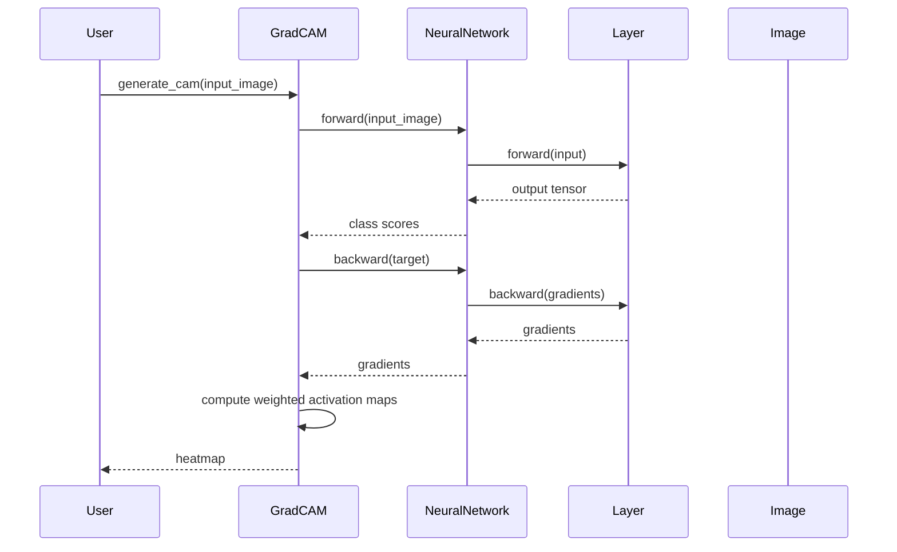

## Introduction to Grad-CAM

Gradient-weighted Class Activation Mapping (Grad-CAM) is a powerful visualization technique for Convolutional Neural Networks (CNNs). It provides insights into which regions of an input image are important for a model's predictions by leveraging the gradients of the target output with respect to the convolutional layers.

## Benefits of Grad-CAM

- **Interpretability:** Provides visual explanations, making model decisions understandable.
- **Transparency:** Helps in identifying biases and improving model transparency.
- **Debugging:** Useful for diagnosing and rectifying model errors.
- **Integration:** Can be integrated into existing CNN architectures without much overhead.

## Trade-offs of Grad-CAM

- **Computational Overhead:** Requires additional computational resources for generating visual explanations.
- **Resolution Limitations:** The resolution of the generated heatmaps is limited by the size of the convolutional features.

## UML Class Diagram for Grad-CAM



## UML Sequence Diagram for Grad-CAM



## Example Implementations of Grad-CAM

### Python

```python
import numpy as np
import tensorflow as tf
from tensorflow.keras.models import Model
import matplotlib.pyplot as plt

def grad_cam(input_model, image, layer_name, class_index):
    grad_model = Model(
        inputs=[input_model.inputs],
        outputs=[input_model.get_layer(layer_name).output, input_model.output]
    )

    with tf.GradientTape() as tape:
        conv_outputs, predictions = grad_model(image)
        loss = predictions[:, class_index]

    grads = tape.gradient(loss, conv_outputs)
    guided_grads = grads[0]
    conv_outputs = conv_outputs[0]

    weights = tf.reduce_mean(guided_grads, axis=(0, 1))
    cam = np.zeros(conv_outputs.shape[0:2], dtype=np.float32)

    for i, w in enumerate(weights):
        cam += w * conv_outputs[:, :, i]

    cam = np.maximum(cam, 0)
    cam = cam / cam.max()
    cam = np.uint8(cam * 255)
    cam = np.resize(cam, (image.shape[1], image.shape[2]))

    plt.imshow(cam, cmap='jet', alpha=0.5)
    plt.show()

# model = your_pretrained_model
# grad_cam(model, img, 'last_conv_layer', class_index)
```

### Java

```java
// Implementing Grad-CAM in Java
// Using libraries like DeepLearning4J for neural networks

import org.deeplearning4j.nn.api.NeuralNetwork;
import org.deeplearning4j.nn.graph.ComputationGraph;
import org.deeplearning4j.nn.gradient.Gradient;
import org.nd4j.linalg.api.ndarray.INDArray;
import org.nd4j.linalg.factory.Nd4j;

public class GradCAM {

    private ComputationGraph model;
    private String targetLayer;

    public GradCAM(ComputationGraph model, String targetLayer) {
        this.model = model;
        this.targetLayer = targetLayer;
    }

    public INDArray generateCAM(INDArray inputImage, int classIndex) {
        model.setInput(0, inputImage);
        model.feedForward();

        INDArray convOutput = model.getLayer(targetLayer).activate();
        INDArray gradients = computeGradients(convOutput, classIndex);

        INDArray weights = gradients.mean(2).mean(3);
        INDArray cam = Nd4j.zeros(convOutput.shape()[2], convOutput.shape()[3]);

        for (int i = 0; i < weights.shape()[1]; i++) {
            cam.addi(convOutput.get(NDArrayIndex.point(0), NDArrayIndex.point(i)).mul(weights.getDouble(i)));
        }

        return cam;
    }

    private INDArray computeGradients(INDArray convOutput, int classIndex) {
        model.backpropGradient(Nd4j.zerosLike(model.output().get(0)).putScalar(0, classIndex, 1));
        Gradient gradient = model.gradient();
        return gradient.gradientForVariable().get(targetLayer);
    }
}
```

### Scala

```scala
// Implementing Grad-CAM in Scala using Deeplearning4j
import org.deeplearning4j.nn.api.NeuralNetwork
import org.deeplearning4j.nn.graph.ComputationGraph
import org.deeplearning4j.nn.gradient.Gradient
import org.nd4j.linalg.factory.Nd4j
import org.nd4j.linalg.api.ndarray.INDArray

class GradCAM(model: ComputationGraph, targetLayer: String) {
  
  def generateCAM(inputImage: INDArray, classIndex: Int): INDArray = {
    model.setInput(0, inputImage)
    model.feedForward()
    
    val convOutput = model.getLayer(targetLayer).activate()
    val gradients = computeGradients(convOutput, classIndex)
    
    val weights = gradients.mean(2).mean(3)
    val cam = Nd4j.zeros(convOutput.shape()(2), convOutput.shape()(3))
    
    for (i <- 0 until weights.shape()(1).toInt) {
      cam.addi(convOutput.get(0, i).mul(weights.getDouble(i)))
    }
    
    cam
  }
  
  private def computeGradients(convOutput: INDArray, classIndex: Int): INDArray = {
    model.backpropGradient(Nd4j.zerosLike(model.output()(0)).putScalar(0, classIndex, 1))
    val gradient: Gradient = model.gradient()
    gradient.gradientForVariable().get(targetLayer)
  }
}
```

### Clojure

```clojure
;; Implementing Grad-CAM in Clojure using Cortex (a DL library)
(ns grad-cam.core
  (:require [cortex.nn.core :as nn]
            [cortex.nn.visualize :as vis]
            [clojure.core.matrix :as m]))

(defn compute-grad-cam [model input-image layer-name class-index]
  (let [forward-pass (nn/feedforward model input-image)
        conv-output (get-in forward-pass [layer-name :activations])
        target-output (get-in forward-pass [:output :activations])
        loss (m/esum (m/mul target-output (m/zeros target-output class-index 1)))
        gradient (nn/backpropagate model :output loss)
        weights (m/mean (get gradient layer-name :gradient) (range (m/dimensionality gradient 3)))
        cam (m/mul-sum conv-output weights)]
    (vis/plot-image (m/clip cam 0 1))))

;; Example usage:
;; (def model your-pretrained-model)
;; (def img your-input-image)
;; (compute-grad-cam model img "last-conv-layer" class-index)
```

## Related Design Patterns

- **Saliency Maps:** A technique to visualize which parts of an image influence the model's prediction.
- **Attention Mechanism:** Provides a weighted focus on relevant parts of the input sequence in sequence-to-sequence models.

## Use Cases

- **Medical Imaging:** Identifying important regions in medical scans.
- **Autonomous Driving:** Highlighting areas of interest in driving scenes.
- **Robotics:** Understanding sensor-based decisions in robotic applications.
- **Object Detection:** Visualizing important parts of an image that lead to object detection.

## Resources and References

- **Original Paper:** [Grad-CAM: Visual Explanations from Deep Networks via Gradient-based Localization](https://arxiv.org/abs/1610.02391)
- **TensorFlow Tutorial:** [TensorFlow Grad-CAM Tutorial](https://www.tensorflow.org/tutorials/interpretability/cnn_interpret)
- **Keras Documentation:** [Keras Visualization Toolkit](https://keras.io/examples/vision/grad_cam/)
- **DeepLearning4J Documentation:** [DeepLearning4J Documentation](https://deeplearning4j.org/docs/latest/)

## Open Source Frameworks

- **TensorFlow:** Comprehensive open-source library for machine learning.
- **Keras:** High-level neural networks API, written in Python.
- **PyTorch:** Deep learning framework that provides maximum flexibility and speed.

## Summary

Grad-CAM provides visual explanations for CNN predictions, facilitating model interpretability, transparency, and debugging. By highlighting regions in the input image that influence the model's decisions, Grad-CAM aids in understanding the internal workings of CNNs. Despite its computational overhead and resolution limitations, it is a widely adopted technique in various fields, such as medical imaging and autonomous driving, making it an invaluable tool in the realm of explainable AI.


