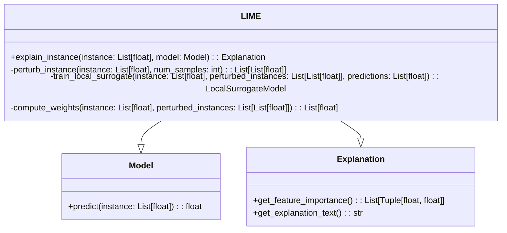
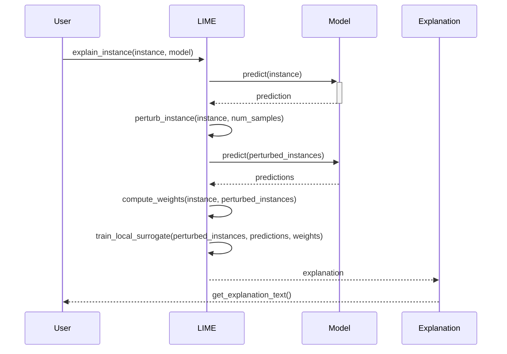

## Introduction

LIME (Local Interpretable Model-agnostic Explanations) is a powerful technique used to interpret individual predictions made by complex models. It works by perturbing the input data and observing the resulting changes in the model’s predictions. This article provides a detailed explanation of the LIME design pattern, complete with UML Class and Sequence diagrams, multiple programming examples, and discussions on benefits, trade-offs, use cases, and related design patterns.

## UML Diagrams

### UML Class Diagram



### UML Sequence Diagram



## Detailed Description

LIME aims to make the predictions of any machine learning model interpretable. It does this by creating local surrogate models that approximate the original model in the vicinity of the instance being explained. The key steps are as follows:

1. **Perturbation of Input:**
   Generate a new set of samples by perturbing the input instance. Perturbations can include changes to input features while maintaining the overall data distribution.

2. **Prediction:**
   Use the original model to predict the outcomes for the perturbed samples.

3. **Weight Computation:**
   Assign weights to the perturbed samples based on their proximity to the original instance. Generally, a distance metric like Euclidean distance is used.

4. **Local Surrogate Model Training:**
   Train an interpretable model (e.g., linear regression) on the perturbed samples and their corresponding predictions, using the computed weights.

5. **Explanation Generation:**
   Use the local surrogate model to generate feature importances or textual explanations for the original prediction.

## Programming Examples

### Python

```python
from lime.lime_tabular import LimeTabularExplainer
import numpy as np

instance = np.array([1, 2, 3, 4])
model = ...  # Assuming some pre-trained model

explainer = LimeTabularExplainer(training_data, feature_names=feature_names, class_names=class_names)

explanation = explainer.explain_instance(instance, model.predict_proba)
print(explanation.as_list())
```

### Java

```java
// Assuming a predefined model and LIME implementation

public class LimeExample {
    public static void main(String[] args) {
        double[] instance = {1, 2, 3, 4};
        Model model = ...;  // Some pre-trained model
        
        LimeTabularExplainer explainer = new LimeTabularExplainer(trainingData, featureNames, classNames);
        Explanation explanation = explainer.explainInstance(instance, model::predict);
        
        System.out.println(explanation.asList());
    }
}
```

### Scala

```scala
import lime.LimeTabularExplainer

// Sample instance and model
val instance = Array(1.0, 2.0, 3.0, 4.0)
val model = ... // Assuming some pre-trained model

// Create LIME explainer
val explainer = new LimeTabularExplainer(trainingData, featureNames, classNames)

// Explain instance
val explanation = explainer.explainInstance(instance, model.predict)
println(explanation.asList)
```

### Clojure

```clojure
(ns lime-example.core
  (:require [lime.tabular :refer [explain-instance]]
            [my-model :refer [model-predict]]))

(def instance [1 2 3 4])
(def training-data ...) ; Define training data
(def feature-names ["feature1" "feature2" "feature3" "feature4"])
(def class-names ["class1" "class2"])

(defn -main []
  (let [explainer (LimeTabularExplainer. training-data feature-names class-names)
        explanation (explain-instance explainer instance model-predict)]
    (println (.as-list explanation))))
```

## Benefits

1. **Model-Agnostic:**
   Can be applied to any machine learning model, regardless of its complexity or type.
   
2. **Local Interpretability:**
   Provides explanations that are specific to individual predictions, allowing for detailed analysis.

3. **Flexibility:**
   Supports various types of data including text, images, and tabular data.

## Trade-offs

1. **Computational Complexity:**
   Perturbing inputs and generating explanations can be computationally expensive.
   
2. **Stability:**
   Explanations can vary with different perturbations, making them less stable.

3. **Local Scope:**
   Explanations are localized and might not generalize to the entire model behavior.

## Use Cases

1. **Medical Diagnostics:**
   Explaining predictions made by a neural network diagnosing diseases from patient data.

2. **Financial Services:**
   Understanding why a loan application was approved or denied by a complex model.

3. **Image Recognition:**
   Identifying the parts of an image that contribute to a model’s classification decision.

## Related Design Patterns

- **SHAP (SHapley Additive exPlanations):**
  Another model-agnostic method for explaining predictions by computing the contribution of each feature.
  
- **Attention Mechanisms:**
  Used in neural networks to provide insight into which parts of the input data the model focuses on when making a prediction.

## Resources and References

- [Official LIME GitHub Repository](https://github.com/marcotcr/lime)
- Ribeiro, Marco Tulio, et al. "Why should I trust you?" Explaining the predictions of any classifier. *Proceedings of the 22nd ACM SIGKDD International Conference on Knowledge Discovery and Data Mining*. ACM, 2016.
- [Interpretable Machine Learning Book by Christoph Molnar](https://christophm.github.io/interpretable-ml-book/)

## Open Source Frameworks

- **LIME in Python:** [lime](https://pypi.org/project/lime/)
- **LIME in R:** [lime package](https://cran.r-project.org/web/packages/lime/index.html)

## Summary

LIME provides a robust approach to interpreting the predictions of any machine learning model by focusing on local fidelity. By perturbing the input data and observing the model's predictions, LIME builds a local surrogate model to offer insight into which features are most influential. Despite some computational and stability trade-offs, LIME remains a valuable tool for ensuring transparency and trust in AI systems.

By understanding the inner workings of complex models through techniques like LIME, stakeholders can make informed decisions and improve the accountability of AI-driven solutions.
