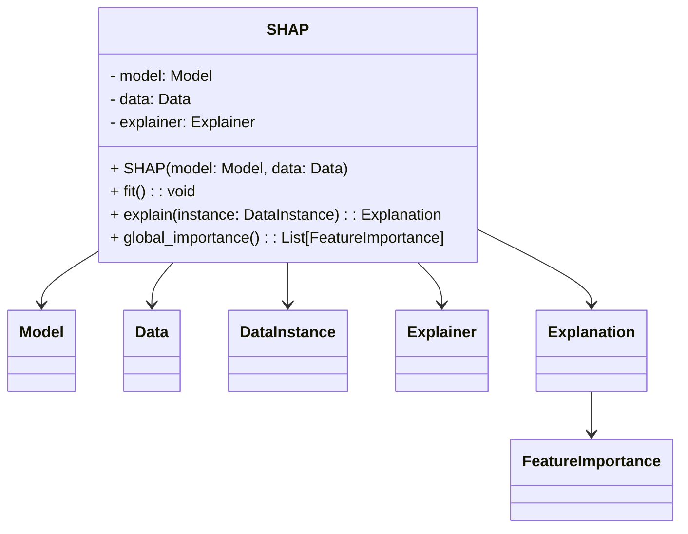
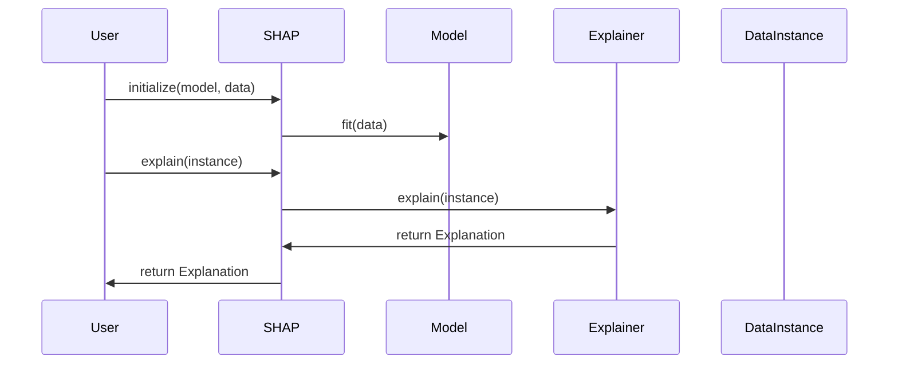

## Introduction to SHAP

SHAP (SHapley Additive exPlanations) is a unified approach to interpreting model predictions. This method leverages principles from game theory to assign an importance value to each feature of a neural network, thus providing a way to explain the contribution of each feature to the final prediction.

## Benefits

- **Consistency**: SHAP values ensure that features contributing positively to the prediction receive positive importance values, and vice versa.
- **Global Interpretability**: Aggregating SHAP values over many predictions provides a global feature importance measure.
- **Model Agnostic**: Applicable to any machine learning model, not just neural networks.
- **Local and Global Explanations**: Can explain individual predictions (local) and general model behavior (global).

## Trade-offs

- **Computationally Intensive**: Calculating SHAP values can be computationally expensive, especially for large models or datasets.
- **Complexity**: Understanding and interpreting SHAP values require a certain level of expertise in statistics and game theory.
- **Approximation**: In practice, SHAP values are often approximated, which might introduce some degree of error.

## Use Cases

- **Global Feature Importance**: Understand which features generally affect model predictions.
- **Model Debugging**: Identify and diagnose problems in the model by investigating feature importance.
- **Regulatory Compliance**: Provide explanations required for regulatory purposes in sensitive areas like finance and healthcare.

## UML Class Diagram



## UML Sequence Diagram



## Code Examples

### Python

```python
import shap
import xgboost

X, y = shap.datasets.boston()
model = xgboost.XGBRegressor().fit(X, y)

explainer = shap.Explainer(model, X)
shap_values = explainer(X)

shap.summary_plot(shap_values, X)
```

### Java

```java
import org.shap4j.ShapExplainer;
import org.shap4j.models.Model;
import org.shap4j.models.XGBoostModel;

public class ShapExample {
    public static void main(String[] args) {
        Model model = new XGBoostModel();
        ShapExplainer explainer = new ShapExplainer(model);

        double[] instance = { /* feature values */ };
        double[] shapValues = explainer.explain(instance);

        for (double value : shapValues) {
            System.out.println(value);
        }
    }
}
```

### Scala

```scala
import ai.shap4s._
import ai.shap4s.models._

object ShapExample {
  def main(args: Array[String]): Unit = {
    val model = new XGBoostModel()
    val explainer = new ShapExplainer(model)
    
    val instance = Array( /* feature values */ )
    val shapValues = explainer.explain(instance)
    
    shapValues.foreach(println)
  }
}
```

### Clojure

```clojure
(ns shap-example
  (:require [shap.core :refer [explain]]
            [shap.models :refer [xgboost-model]]))

(def model (xgboost-model))
(def instance [/* feature values */])

(def shap-values (explain model instance))

(println shap-values)
```

## Related Design Patterns

- **LIME (Local Interpretable Model-agnostic Explanations)**: Another popular method for explaining model predictions locally.
- **Partial Dependence Plots (PDP)**: Visualize the relationship between a feature and the predicted outcome.
- **Individual Conditional Expectation (ICE)**: Extends PDP by considering each individual instance.

## Resources

- [SHAP Documentation](https://shap.readthedocs.io/)
- [SHAP GitHub Repository](https://github.com/slundberg/shap)
- [Interpretable Machine Learning Book](https://christophm.github.io/interpretable-ml-book/shap.html)

## Open Source Frameworks

- **SHAP**: Provides Python and R implementations.
- **SHAP4J**: Java implementation for SHAP.
- **SHAP4S**: Scala implementation for SHAP.

## Summary

SHAP (SHapley Additive exPlanations) offers a powerful and consistent way to interpret the predictions of machine learning models by assigning importance values to each feature. While computationally intensive, its ability to provide both local and global explanations makes it an invaluable tool for debugging, regulatory compliance, and understanding model behavior. 

With implementations available in various programming languages and broad applicability across different types of models, SHAP stands out as a versatile and essential method in the toolkit of data scientists and machine learning practitioners.
