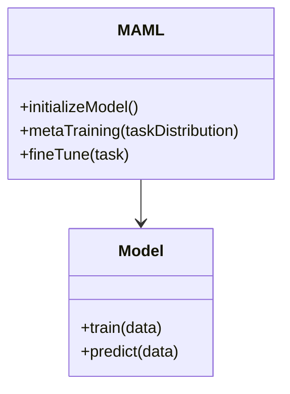
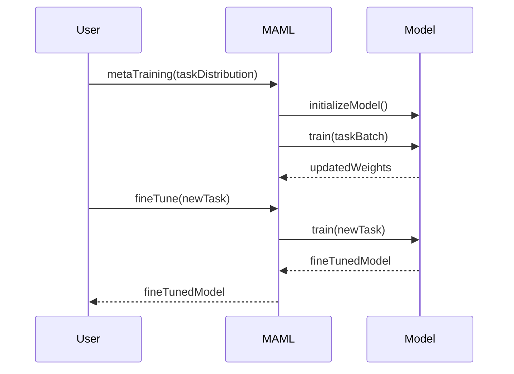

## Introduction

Model-Agnostic Meta-Learning (MAML) is a design pattern in the field of machine learning that allows a model to adapt quickly to new tasks using only a few training examples. It is particularly effective for few-shot learning scenarios.

## Detailed Description

MAML aims to find a good initialization for the model parameters that can be fine-tuned efficiently for a new task with minimal training data. Unlike traditional training methods that optimize the parameters for performance on a specific task, MAML optimizes for performance across a distribution of tasks.

### Key Concepts

- **Meta-Learning:** Learning to learn; the model is trained on multiple tasks so that it can generalize to new tasks quickly.
- **Few-Shot Learning:** Learning to perform tasks using very few training examples.

## UML Diagrams

### UML Class Diagram

Below is a UML class diagram representing the structure of MAML:



### UML Sequence Diagram

Below is a UML sequence diagram representing the MAML workflow:



## Code Examples

### Python Example

```python
import torch
import torch.nn as nn
import torch.optim as optim

class SimpleModel(nn.Module):
    def __init__(self):
        super(SimpleModel, self).__init__()
        self.fc = nn.Linear(10, 1)
    
    def forward(self, x):
        return self.fc(x)

def maml_loss(model, data, targets):
    predictions = model(data)
    return ((predictions - targets) ** 2).mean()

def meta_training(model, task_data, task_targets, meta_optimizer, num_iterations):
    for _ in range(num_iterations):
        for data, targets in zip(task_data, task_targets):
            optimizer = optim.SGD(model.parameters(), lr=0.01)
            optimizer.zero_grad()
            loss = maml_loss(model, data, targets)
            loss.backward()
            optimizer.step()
        
        meta_optimizer.zero_grad()
        meta_loss = sum([maml_loss(model, data, targets) for data, targets in zip(task_data, task_targets)]) / len(task_data)
        meta_loss.backward()
        meta_optimizer.step()

model = SimpleModel()
meta_optimizer = optim.Adam(model.parameters(), lr=0.001)
meta_training(model, task_data, task_targets, meta_optimizer, num_iterations=100)
```

### Java Example

```java
public class SimpleModel {
    private double[] weights;

    public SimpleModel(int inputSize) {
        weights = new double[inputSize];
    }

    public double predict(double[] input) {
        double result = 0;
        for (int i = 0; i < input.length; i++) {
            result += input[i] * weights[i];
        }
        return result;
    }

    public void train(double[][] data, double[] targets, double lr) {
        for (int i = 0; i < data.length; i++) {
            double error = predict(data[i]) - targets[i];
            for (int j = 0; j < weights.length; j++) {
                weights[j] -= lr * error * data[i][j];
            }
        }
    }
}

public class MAML {
    private SimpleModel model;

    public MAML(int inputSize) {
        model = new SimpleModel(inputSize);
    }

    public void metaTraining(double[][][] taskData, double[][] taskTargets, int numIterations, double lr) {
        for (int iteration = 0; iteration < numIterations; iteration++) {
            for (int task = 0; task < taskData.length; task++) {
                model.train(taskData[task], taskTargets[task], lr);
            }
        }
    }

    public SimpleModel fineTune(double[][] newTaskData, double[] newTaskTargets, double lr) {
        SimpleModel fineTunedModel = new SimpleModel(model.weights.length);
        fineTunedModel.train(newTaskData, newTaskTargets, lr);
        return fineTunedModel;
    }
}
```

### Scala Example

```scala
class SimpleModel(inputSize: Int) {
  var weights: Array[Double] = Array.fill(inputSize)(0.0)

  def predict(input: Array[Double]): Double = {
    weights.zip(input).map { case (w, i) => w * i }.sum
  }

  def train(data: Array[Array[Double]], targets: Array[Double], lr: Double): Unit = {
    for ((datum, target) <- data.zip(targets)) {
      val error = predict(datum) - target
      for (i <- weights.indices) {
        weights(i) -= lr * error * datum(i)
      }
    }
  }
}

class MAML(inputSize: Int) {
  val model = new SimpleModel(inputSize)

  def metaTraining(taskData: Array[Array[Array[Double]]], taskTargets: Array[Array[Double]], numIterations: Int, lr: Double): Unit = {
    for (_ <- 0 until numIterations) {
      for ((data, targets) <- taskData.zip(taskTargets)) {
        model.train(data, targets, lr)
      }
    }
  }

  def fineTune(newTaskData: Array[Array[Double]], newTaskTargets: Array[Double], lr: Double): SimpleModel = {
    val fineTunedModel = new SimpleModel(model.weights.length)
    fineTunedModel.train(newTaskData, newTaskTargets, lr)
    fineTunedModel
  }
}
```

### Clojure Example

```clojure
(ns maml.core)

(defn predict [model input]
  (reduce + (map * model input)))

(defn train [model data targets lr]
  (reduce
   (fn [model [datum target]]
     (let [error (- (predict model datum) target)]
       (mapv (fn [w x] (- w (* lr error x))) model datum)))
   model
   (map vector data targets)))

(defn meta-training [initial-model task-data task-targets num-iterations lr]
  (loop [model initial-model, iter num-iterations]
    (if (zero? iter)
      model
      (recur
       (reduce (fn [m [data targets]] (train m data targets lr)) model (map vector task-data task-targets))
       (dec iter)))))

(defn fine-tune [model new-task-data new-task-targets lr]
  (train model new-task-data new-task-targets lr))

;; Usage example
(def initial-model [0 0 0])
(def task-data [[[1 1 1] [2 2 2]] [[0.5 0.5 0.5] [1 1 1]]])
(def task-targets [[3 6] [1.5 3]])
(def num-iterations 100)
(def lr 0.01)

(def meta-trained-model (meta-training initial-model task-data task-targets num-iterations lr))
(def new-task-data [[2 2 2]])
(def new-task-targets [6])
(def fine-tuned-model (fine-tune meta-trained-model new-task-data new-task-targets lr))
```

## Benefits

- **Rapid Adaptation:** Models can adapt to new tasks with minimal data.
- **Model-Agnostic:** Applicable to any model trained with gradient-based methods.
- **Efficient Training:** Reduces the need for large datasets to train new models for each task.

## Trade-offs

- **Complexity:** Increases computational complexity due to meta-learning loops.
- **Initialization Sensitivity:** The choice of initial parameters can significantly impact performance.
- **Hyperparameter Sensitivity:** Requires careful tuning of meta-learning rate and training loops.

## Examples of Use Cases

- **Few-Shot Learning:** Adapting to new image classification tasks with few labeled examples.
- **Reinforcement Learning:** Quickly adapting to new environments or tasks in reinforcement learning.
- **Natural Language Processing:** Adapting models to new languages or domains with minimal data.

## Related Design Patterns

- **Reptile:** Similar to MAML but uses a different optimization approach.
- **Prototypical Networks:** Uses prototypes (mean vectors) of each class for few-shot learning.
- **Siamese Networks:** Uses pairwise comparisons for similarity learning.

## Resources and References

- [Original MAML Paper](https://arxiv.org/abs/1703.03400)
- [OpenAI's MAML Implementation](https://github.com/openai/maml)
- [PyTorch MAML Tutorial](https://pytorch.org/tutorials/beginner/meta_learning_maml.html)
- [TensorFlow Meta-Learning Library](https://github.com/deepmind/trfl)

## Summary

Model-Agnostic Meta-Learning (MAML) is a powerful meta-learning technique that allows models to quickly adapt to new tasks with minimal data. It is model-agnostic, making it versatile for various applications. Despite its benefits, it comes with trade-offs like increased complexity and sensitivity to hyperparameters. MAML has a wide range of applications, from image classification to reinforcement learning, making it a valuable tool in the machine learning toolkit.
