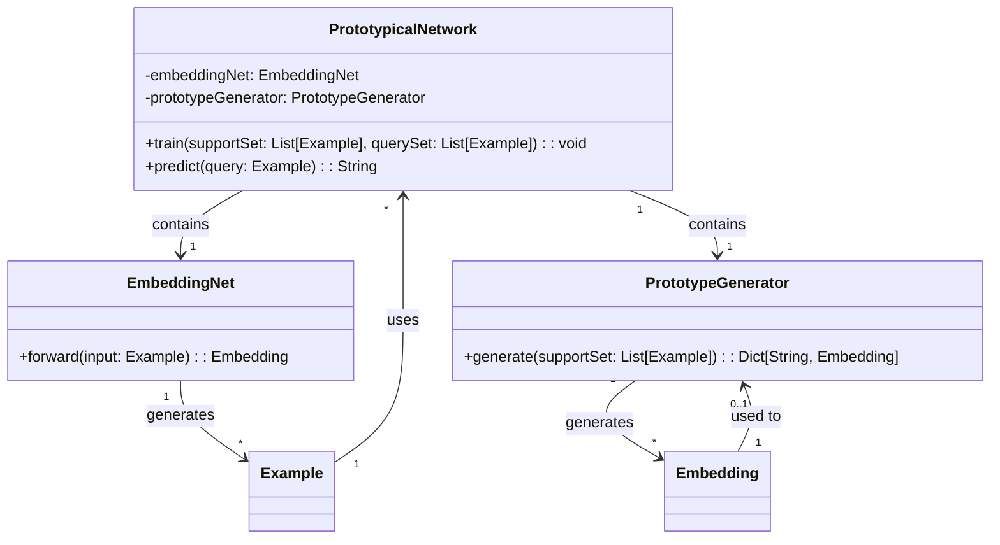
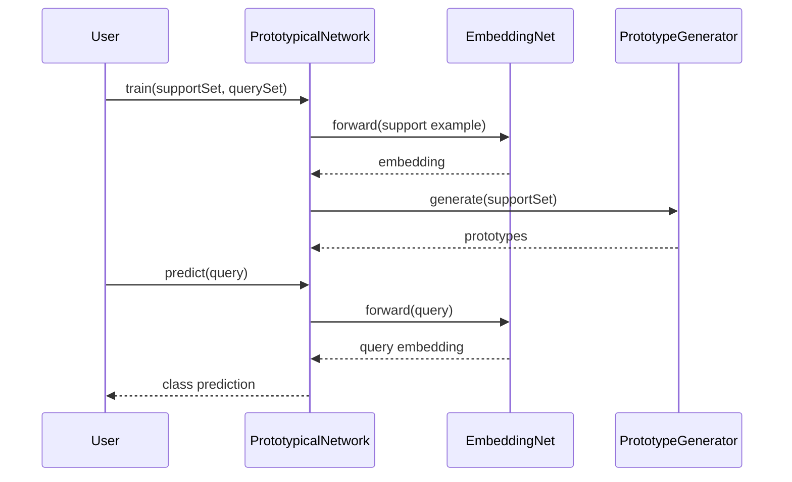

## Prototypical Networks: Few-Shot Classification Using Class Prototypes

### Overview

Prototypical Networks is a neural network design pattern specifically tailored for few-shot classification tasks. The core idea is to use prototypes, which are representative embeddings of each class, for classifying new examples.

### Detailed Description

Prototypical Networks address the challenge of few-shot learning where we have to make accurate predictions with only a handful of labeled examples per class. This pattern leverages class prototypes that are computed as the mean of embedded support points (examples) in each class. Classification is done by finding the class with the closest prototype to the query example in the embedding space.

### UML Diagrams

#### UML Class Diagram



#### UML Sequence Diagram



### Example Implementations

#### Python

```python
import torch
import torch.nn as nn
import torch.nn.functional as F

class EmbeddingNet(nn.Module):
    def __init__(self):
        super(EmbeddingNet, self).__init__()
        self.convnet = nn.Sequential(
            nn.Conv2d(1, 64, 3),
            nn.ReLU(),
            nn.MaxPool2d(2),
            nn.Conv2d(64, 128, 3),
            nn.ReLU(),
            nn.MaxPool2d(2)
        )
        self.fc = nn.Linear(128 * 5 * 5, 256)
    
    def forward(self, x):
        x = self.convnet(x)
        x = x.view(x.size(0), -1)
        x = self.fc(x)
        return x

class PrototypicalNetwork:
    def __init__(self, embedding_net):
        self.embedding_net = embedding_net
    
    def generate_prototypes(self, support_set):
        support_embeddings = self.embedding_net(support_set)
        classes = torch.unique(support_set.y)
        prototypes = [support_embeddings[support_set.y == c].mean(0) for c in classes]
        return prototypes
    
    def predict(self, query):
        query_embedding = self.embedding_net(query)
        distances = [F.pairwise_distance(query_embedding, proto) for proto in prototypes]
        return torch.argmin(distances)

```

#### Java

```java
import java.util.List;
import java.util.Map;
import java.util.stream.Collectors;

public class PrototypicalNetwork {
    private EmbeddingNet embeddingNet;

    public PrototypicalNetwork(EmbeddingNet embeddingNet) {
        this.embeddingNet = embeddingNet;
    }

    public Map<String, double[]> generatePrototypes(List<Example> supportSet) {
        Map<String, List<double[]>> grouped = supportSet.stream()
            .collect(Collectors.groupingBy(Example::getLabel, 
                Collectors.mapping(this.embeddingNet::forward, Collectors.toList())));
        return grouped.entrySet().stream()
            .collect(Collectors.toMap(Map.Entry::getKey, 
                e -> mean(e.getValue())));
    }

    public String predict(Example query) {
        double[] queryEmbedding = embeddingNet.forward(query);
        String nearestClass = "";
        double minDistance = Double.MAX_VALUE;
        for (Map.Entry<String, double[]> entry : prototypes.entrySet()) {
            double distance = euclideanDistance(queryEmbedding, entry.getValue());
            if (distance < minDistance) {
                minDistance = distance;
                nearestClass = entry.getKey();
            }
        }
        return nearestClass;
    }
}
```

#### Scala

```scala
class EmbeddingNet {
  def forward(input: Example): Array[Double] = {
    // Implementation of forward pass to obtain the embedding
  }
}

class PrototypicalNetwork(val embeddingNet: EmbeddingNet) {
  def generatePrototypes(supportSet: List[Example]): Map[String, Array[Double]] = {
    supportSet.groupBy(_.label)
      .mapValues(examples => mean(examples.map(embeddingNet.forward)))
  }

  def predict(query: Example, prototypes: Map[String, Array[Double]]): String = {
    val queryEmbedding = embeddingNet.forward(query)
    prototypes.minBy { case (_, prototype) => euclideanDistance(queryEmbedding, prototype) }._1
  }
}

def euclideanDistance(a: Array[Double], b: Array[Double]): Double = {
  math.sqrt(a.zip(b).map { case (x, y) => math.pow(x - y, 2) }.sum)
}

def mean(vectors: List[Array[Double]]): Array[Double] = {
  val n = vectors.size
  vectors.transpose.map(_.sum / n).toArray
}
```

#### Clojure

```clojure
(defn forward-pass [net example]
  ;; Simulate the forward pass on the neural network
  )

(defn generate-prototypes [embedding-net support-set]
  (->> support-set
       (group-by :label)
       (map (fn [[label examples]]
              [label (average (map #(forward-pass embedding-net %) examples))]))
       (into {})))

(defn predict [embedding-net prototypes query]
  (let [query-embedding (forward-pass embedding-net query)]
    (->> prototypes
         (map (fn [[label prototype]]
                [label (euclidean-distance query-embedding prototype)]))
         (apply min-key second)
         first)))

(defn euclidean-distance [a b]
  (Math/sqrt (reduce + (map #(Math/pow (- %1 %2) 2) a b))))

(defn average [vectors]
  (let [n (count vectors)]
    (map #(/ (reduce + %) n) (apply map vector vectors))))
```

### Benefits

- **Efficiency:** Reduces computational complexity by summarizing each class with a prototype.
- **Scalability:** Suitable for scaling to new classes without requiring extensive retraining.
- **Interpretability:** Prototypes provide intuitive understanding of class representations.

### Trade-offs

- **Sensitivity:** Performance heavily depends on the quality of embeddings.
- **Prototype Representation:** May not work well if class distributions are highly varied.

### Use Cases

- **Image Classification:** Particularly in domains like medical imaging where labeled data is scarce.
- **Language Processing:** Few-shot text classification tasks.

### Related Design Patterns

- **Siamese Networks:** Also used for few-shot learning but works by comparing pairs of examples.
- **Matching Networks:** Utilizes an attention mechanism over support examples for classification.

### Resources and References

- **[Original Paper: Prototypical Networks for Few-shot Learning](https://arxiv.org/abs/1703.05175)**
- **[Open Source Implementation - PyTorch](https://github.com/jakesnell/prototypical-networks)**
- **[Prototypical Networks: Semi-Supervised Learning](https://arxiv.org/abs/1805.01259)**

### Summary

Prototypical Networks provide an effective and intuitive approach for few-shot classification tasks. By utilizing prototypes, they offer a scalable and efficient solution suitable for a variety of applications with minimal labeled data. While there are trade-offs, understanding and leveraging this design pattern can significantly enhance the performance of classification tasks in resource-constrained environments.

This structured and detailed overview of Prototypical Networks should help in both understanding and implementing this powerful neural network design pattern.
