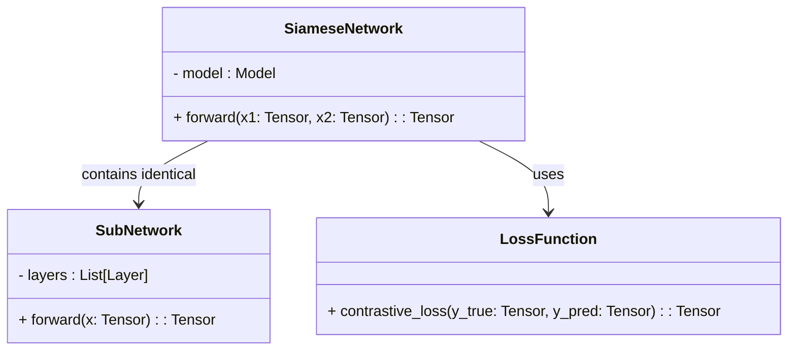
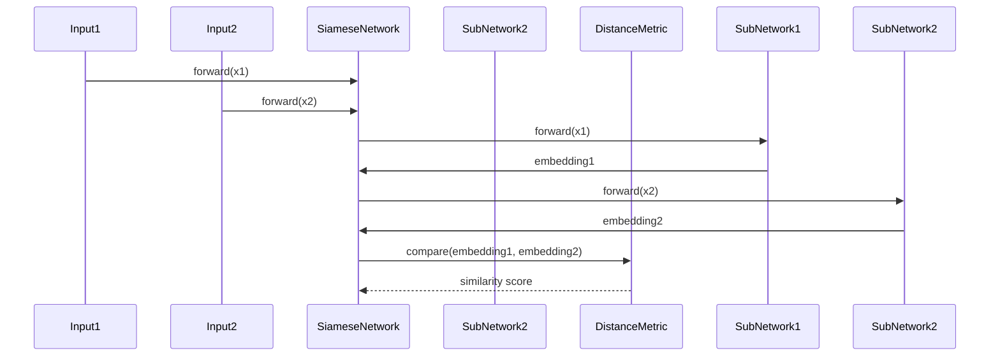

## Siamese Networks: A Neural Network for Measuring Similarity

### Introduction

Siamese Networks are a special type of neural network architecture designed to measure the similarity between two input samples. Unlike typical neural networks, Siamese Networks contain two or more identical subnetworks that share the same parameters. This unique structure is particularly useful in tasks where understanding the similarity or difference between inputs is crucial, such as in signature verification.

### How Siamese Networks Work

The core idea behind Siamese Networks is to pass two inputs through identical networks that share weights. These subnetworks generate embeddings for each input, which are then compared using a distance metric, such as the Euclidean distance, to determine similarity.

### UML Class Diagram



### UML Sequence Diagram



### Implementation Examples

#### Python (using PyTorch)

```python
import torch
import torch.nn as nn

class SubNetwork(nn.Module):
    def __init__(self):
        super(SubNetwork, self).__init__()
        self.fc1 = nn.Linear(128, 64)
        self.fc2 = nn.Linear(64, 32)

    def forward(self, x):
        x = torch.relu(self.fc1(x))
        x = torch.relu(self.fc2(x))
        return x

class SiameseNetwork(nn.Module):
    def __init__(self):
        super(SiameseNetwork, self).__init__()
        self.subnetwork = SubNetwork()

    def forward(self, x1, x2):
        embedding1 = self.subnetwork(x1)
        embedding2 = self.subnetwork(x2)
        return embedding1, embedding2

model = SiameseNetwork()
x1, x2 = torch.randn(1, 128), torch.randn(1, 128)
embedding1, embedding2 = model(x1, x2)
```

#### Java (using Deeplearning4j)

```java
import org.deeplearning4j.nn.conf.NeuralNetConfiguration;
import org.deeplearning4j.nn.conf.layers.DenseLayer;
import org.deeplearning4j.nn.conf.layers.OutputLayer;
import org.deeplearning4j.nn.multilayer.MultiLayerNetwork;
import org.nd4j.linalg.activations.Activation;
import org.nd4j.linalg.api.ndarray.INDArray;
import org.nd4j.linalg.dataset.api.iterator.DataSetIterator;
import org.nd4j.linalg.factory.Nd4j;
import org.nd4j.linalg.learning.config.Adam;
import org.nd4j.linalg.lossfunctions.LossFunctions;

public class SiameseNetwork {
    private MultiLayerNetwork network;

    public SiameseNetwork() {
        network = new MultiLayerNetwork(new NeuralNetConfiguration.Builder()
            .updater(new Adam(0.001))
            .list()
            .layer(new DenseLayer.Builder().nIn(128).nOut(64)
                .activation(Activation.RELU).build())
            .layer(new DenseLayer.Builder().nIn(64).nOut(32)
                .activation(Activation.RELU).build())
            .layer(new OutputLayer.Builder(LossFunctions.LossFunction.MSE)
                .activation(Activation.IDENTITY).nIn(32).nOut(32).build())
            .build());
        network.init();
    }

    public INDArray forward(INDArray x1, INDArray x2) {
        INDArray embedding1 = network.output(x1);
        INDArray embedding2 = network.output(x2);
        return Nd4j.concat(1, embedding1, embedding2);
    }

    public static void main(String[] args) {
        SiameseNetwork model = new SiameseNetwork();
        INDArray x1 = Nd4j.randn(1, 128);
        INDArray x2 = Nd4j.randn(1, 128);
        INDArray result = model.forward(x1, x2);
        System.out.println(result);
    }
}
```

#### Scala

```scala
import org.apache.mxnet._
import org.apache.mxnet.module.Module
import org.apache.mxnet.optimizer.Adam
import org.apache.mxnet.Shape

object SiameseNetwork {
  def createSubNetwork(): Symbol = {
    val data = Symbol.Variable("data")
    val fc1 = Symbol.api.FullyConnected(data, num_hidden = 64)
    val act1 = Symbol.api.Activation(fc1, act_type = "relu")
    val fc2 = Symbol.api.FullyConnected(act1, num_hidden = 32)
    Symbol.api.Activation(fc2, act_type = "relu")
  }

  def main(args: Array[String]): Unit = {
    val ctx = Context.cpu()
    val data1 = Symbol.Variable("data1")
    val data2 = Symbol.Variable("data2")
    val subNetwork = createSubNetwork()
    
    val embedding1 = subNetwork.bind(ctx, dataShapes = Map("data" -> Shape(1, 128)))
    val embedding2 = subNetwork.bind(ctx, dataShapes = Map("data" -> Shape(1, 128)))
    
    // Example usage
    val x1 = NDArray.ones(1, 128)
    val x2 = NDArray.ones(1, 128)
    
    embedding1.forward(isTrain = false, data = Map("data" -> x1))
    embedding2.forward(isTrain = false, data = Map("data" -> x2))
    
    println(embedding1.output.head)
    println(embedding2.output.head)
  }
}
```

#### Clojure

```clojure
(require '[clojure.core.matrix :as m])
(require '[think.datatype.core :as dt])
(require '[think.nn.core :as nn])

(defn sub-network []
  (nn/model
    {:input-shape [128]
     :layers [{:type :dense :units 64 :activation :relu}
              {:type :dense :units 32 :activation :relu}]}))

(defn siamese-network []
  {:subnetwork (sub-network)})

(defn forward [model x1 x2]
  (let [embedding1 (nn/forward (:subnetwork model) x1)
        embedding2 (nn/forward (:subnetwork model) x2)]
    {:embedding1 embedding1 :embedding2 embedding2}))

;; Example Usage
(def model (siamese-network))
(def x1 (m/matrix :dense [128] (repeat 128 0.5)))
(def x2 (m/matrix :dense [128] (repeat 128 0.2)))
(def embeddings (forward model x1 x2))
(prn embeddings)
```

### Benefits

- **Parameter Sharing:** Using identical subnetworks ensures parameter sharing, which reduces the number of parameters and computational cost.
- **Effective for Similarity Tasks:** Particularly suitable for tasks where determining the similarity between two inputs is crucial, such as signature verification, face verification, and one-shot learning.
- **Flexibility:** Can be adapted to various distance metrics and loss functions.

### Trade-offs

- **Training Complexity:** Requires a specialized training procedure and might be complex to tune, especially for specific tasks.
- **Computational Resources:** While parameter sharing reduces the number of parameters, training and deploying can still be computationally intensive, particularly with larger networks.

### Use Cases

- **Signature Verification:** Determining whether two signatures are from the same person.
- **Face Verification:** Verifying whether two images are of the same person.
- **One-shot Learning:** Learning from just one or a few training examples to perform tasks.

### Related Design Patterns

- **Triplet Networks:** Similar to Siamese Networks but uses three inputs: anchor, positive, and negative samples, to learn more discriminative features.
- **Autoencoders:** Neural networks designed for unsupervised learning tasks that can be adapted for similarity learning with minor modifications.

### Resources and References

- [Deep Learning for Computer Vision](https://www.deeplearningbook.org/)
- [PyTorch Documentation](https://pytorch.org/docs/stable/index.html)
- [Deeplearning4j](https://deeplearning4j.org/)
- [MXNet Scala API](https://mxnet.apache.org/versions/1.8.0/api/scala/)

### Open Source Frameworks

- **PyTorch**: A powerful framework for building and training neural networks.
- **TensorFlow**: Another popular framework supporting various neural network architectures including Siamese Networks.
- **Deeplearning4j**: A Java-based deep learning library for building neural networks.
- **MXNet**: A scalable and efficient deep learning library that supports multiple languages.

### Summary

Siamese Networks offer a unique approach to measuring similarity between inputs by using identical subnetworks that share parameters. This design pattern is particularly useful in applications requiring similarity detection, such as signature and face verification. Despite some complexities in training, Siamese Networks are effective and flexible, with various implementations available across different programming languages and frameworks.

By understanding the detailed workings, benefits, trade-offs, and applications of Siamese Networks, you can harness their full potential in your machine learning projects.
