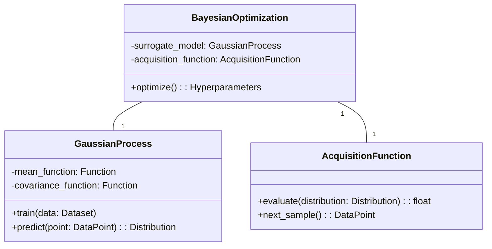
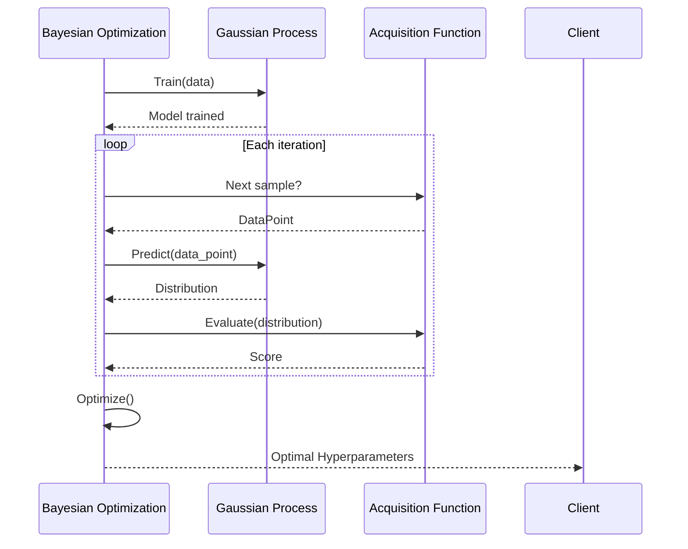

Bayesian Optimization is a powerful strategy used to model the performance of neural networks probabilistically. This technique is highly effective in directed architecture search, where the goal is to find the optimal configuration of a neural network with minimal computational cost.

## Introduction to Bayesian Optimization

Bayesian Optimization leverages Bayesian statistics to model the unknown function \\( f(x) \\), which represents the performance metric (e.g., accuracy, loss) of the neural network for a given set of hyperparameters. It uses a surrogate model, typically a Gaussian Process (GP), to estimate this function and decide where to sample next.

### Core Components

1. **Surrogate Model**: A probabilistic model (like Gaussian Process) that approximates the performance function.
2. **Acquisition Function**: Determines the next sampling point based on the surrogate model.

## Benefits

- **Efficiency**: Reduces the number of expensive evaluations needed to find the optimal neural network configuration.
- **Scalability**: Can handle high-dimensional search spaces common in neural network tuning.
- **Robustness**: Handles noisy observations and uncertainty in model predictions.

## Trade-offs

- **Computational Overhead**: Surrogate model training can be computationally expensive.
- **Scalability Issues**: Gaussian Processes struggle with very large datasets.

## UML Diagrams

### UML Class Diagram



### UML Sequence Diagram



## Examples

### Python

```python
from skopt import gp_minimize

def black_box_function(params):
    # Define the function to be minimized
    pass

result = gp_minimize(black_box_function, dimensions, n_calls=50, random_state=0)
print(result.x)
```

### Java

```java
import org.apache.commons.math3.optim.nonlinear.scalar.GoalType;
import org.apache.commons.math3.optim.nonlinear.scalar.noderiv.CMAESOptimizer;

double[] result = optimizer.optimize(
    new CMAESOptimizer.SimpleValueChecker(),
    new ObjectiveFunction(blackBoxFunction),
    GoalType.MINIMIZE,
    new InitialGuess(initialGuess),
    new SimpleBounds(lowerBounds, upperBounds)
).getPoint();
```

### Scala

```scala
import breeze.optimize._

val optimizer = new BayesianOptimization(blackBoxFunction)
val result = optimizer.minimize(initialGuess)
println(result)
```

### Clojure

```clojure
(require '[clojure.optimize.bayesian :refer [bayesian-optimize]])

(let [result (bayesian-optimize black-box-function)]
  (println result))
```

## Use Cases

1. **Neural Architecture Search (NAS)**: Optimizing the architecture of neural networks, such as the number of layers, number of units per layer, and activation functions.
2. **Hyperparameter Tuning**: Finding the optimal hyperparameters for training algorithms, like learning rate, batch size, and regularization parameters.

## Related Design Patterns

- **Grid Search**: A brute-force search method that evaluates all possible combinations in a predefined grid of hyperparameter values.
- **Random Search**: Samples hyperparameters randomly rather than exhaustively.
- **Hyperband**: An efficient hyperparameter optimization technique combining random search and early stopping.

## Resources

- [Bayesian Optimization with Scikit-Optimize](https://scikit-optimize.github.io/stable/)
- [Practical Bayesian Optimization of Machine Learning Algorithms](https://papers.nips.cc/paper/2012/hash/05311655f9d2b0a1a1d4526f94ae7ebe-Abstract.html)
- [Efficient Global Optimization Algorithm](http://www.kevinsmall.org/papers/2007/jones07.pdf)

## Open Source Frameworks

- **Scikit-Optimize**: A Python library for Bayesian optimization.
- **Spearmint**: A Bayesian optimization package from the University of Toronto.
- **GPyOpt**: Bayesian optimization in Python using Gaussian Processes from the University of Sheffield.

## Summary

Bayesian Optimization is an advanced and efficient method for hyperparameter tuning and neural architecture search. It uses probabilistic models to approximate the performance of neural networks, significantly reducing the computational cost involved in finding optimal configurations. While there are some trade-offs, such as computational overhead and scalability issues, the benefits far outweigh the drawbacks, making it a preferred choice in various machine learning and deep learning applications.

Implementing Bayesian Optimization can be done using various open-source frameworks, and it is widely applicable in tuning hyperparameters and designing neural network architectures for better performance.

Bayesian Optimization not only contributes to better model performance but also to the efficient use of computational resources. This makes it a valuable tool for researchers and practitioners in the field of machine learning and deep learning.


