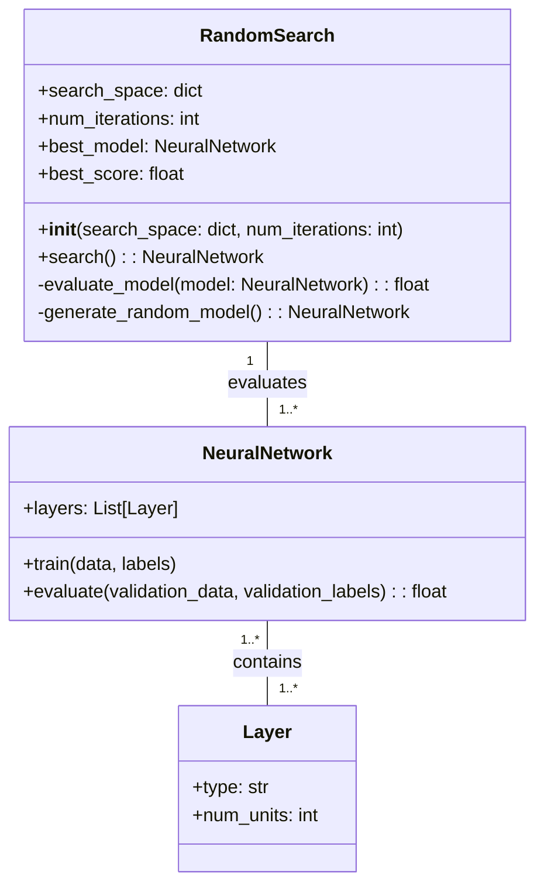
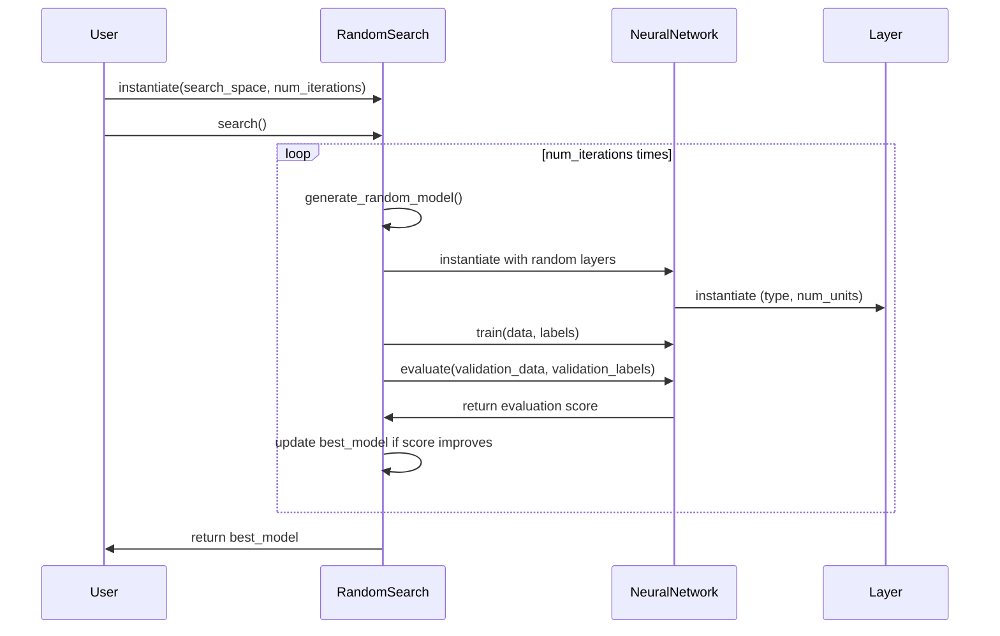

Random Search is a fundamental method used to explore various neural network architectures by selecting configurations randomly. Despite its simplicity, it serves as a useful baseline for more sophisticated architecture search strategies.

## Detailed Description

Random Search involves generating random configurations of neural network parameters and architectures and evaluating their performance on a validation dataset. The key idea is that by exploring the parameter space randomly, we can discover effective architectures without prior assumptions.

## Benefits and Trade-offs

### Benefits
- **Simplicity:** Easy to implement and understand.
- **No Assumptions:** Does not rely on prior knowledge or assumptions about the architecture.
- **Baseline:** Acts as a useful baseline for more complex methods.

### Trade-offs
- **Computational Cost:** Requires significant computational resources, especially for large parameter spaces.
- **Inefficiency:** May be inefficient compared to more informed search methods like Bayesian optimization or genetic algorithms.
- **Scalability:** May not scale well with increasing complexity of neural network architectures.

## Use Cases

- **Baseline Architecture Search:** Provides a benchmark for comparing the effectiveness of more advanced architecture search methods.
- **Exploratory Analysis:** Useful in the early stages of neural network design when the parameter space is unknown.

## UML Diagrams

### Class Diagram



### Sequence Diagram



## Implementation Examples

### Python

```python
import random

class RandomSearch:
    def __init__(self, search_space, num_iterations):
        self.search_space = search_space
        self.num_iterations = num_iterations
        self.best_model = None
        self.best_score = float('-inf')

    def search(self):
        for _ in range(self.num_iterations):
            model = self.generate_random_model()
            score = self.evaluate_model(model)
            if score > self.best_score:
                self.best_score = score
                self.best_model = model
        return self.best_model

    def evaluate_model(self, model):
        # Placeholder for model training and evaluation
        return random.uniform(0, 1)  # Simulated score

    def generate_random_model(self):
        # Placeholder for generating a random neural network
        return NeuralNetwork()

class NeuralNetwork:
    def __init__(self):
        self.layers = [Layer("dense", random.randint(10, 100)) for _ in range(random.randint(1, 5))]

class Layer:
    def __init__(self, layer_type, num_units):
        self.type = layer_type
        self.num_units = num_units
```

### Java

```java
import java.util.Random;

public class RandomSearch {
    private SearchSpace searchSpace;
    private int numIterations;
    private NeuralNetwork bestModel;
    private double bestScore;

    public RandomSearch(SearchSpace searchSpace, int numIterations) {
        this.searchSpace = searchSpace;
        this.numIterations = numIterations;
        this.bestScore = Double.NEGATIVE_INFINITY;
    }

    public NeuralNetwork search() {
        for (int i = 0; i < numIterations; i++) {
            NeuralNetwork model = generateRandomModel();
            double score = evaluateModel(model);
            if (score > bestScore) {
                bestScore = score;
                bestModel = model;
            }
        }
        return bestModel;
    }

    private double evaluateModel(NeuralNetwork model) {
        // Placeholder for model training and evaluation
        return new Random().nextDouble(); // Simulated score
    }

    private NeuralNetwork generateRandomModel() {
        return new NeuralNetwork();
    }

    public static void main(String[] args) {
        SearchSpace searchSpace = new SearchSpace();
        RandomSearch randomSearch = new RandomSearch(searchSpace, 10);
        NeuralNetwork bestModel = randomSearch.search();
        // Use the best model
    }
}
```

### Scala

```scala
import scala.util.Random

class RandomSearch(searchSpace: Map[String, Any], numIterations: Int) {
  var bestModel: NeuralNetwork = _
  var bestScore: Double = Double.NegativeInfinity

  def search(): NeuralNetwork = {
    for (_ <- 0 until numIterations) {
      val model = generateRandomModel()
      val score = evaluateModel(model)
      if (score > bestScore) {
        bestScore = score
        bestModel = model
      }
    }
    bestModel
  }

  private def evaluateModel(model: NeuralNetwork): Double = {
    // Placeholder for model training and evaluation
    Random.nextDouble() // Simulated score
  }

  private def generateRandomModel(): NeuralNetwork = {
    new NeuralNetwork()
  }
}

class NeuralNetwork {
  val layers: List[Layer] = (1 to Random.nextInt(5) + 1).map(_ => new Layer("dense", Random.nextInt(100) + 10)).toList
}

class Layer(layerType: String, numUnits: Int)

object RandomSearchApp extends App {
  val searchSpace = Map[String, Any]()
  val randomSearch = new RandomSearch(searchSpace, 10)
  val bestModel = randomSearch.search()
  // Use the best model
}
```

### Clojure

```clojure
(ns random-search.core
  (:gen-class))

(defn generate-random-model []
  ;; Placeholder for generating a random neural network
  {:layers (repeatedly (+ 1 (rand-int 5)) #(hash-map :type "dense" :num-units (+ 10 (rand-int 100))))})

(defn evaluate-model [model]
  ;; Placeholder for model training and evaluation
  (rand))  ; Simulated score

(defn random-search [search-space num-iterations]
  (loop [best-model nil
         best-score Double/NEGATIVE_INFINITY
         iterations 0]
    (if (>= iterations num-iterations)
      best-model
      (let [model (generate-random-model)
            score (evaluate-model model)]
        (if (> score best-score)
          (recur model score (inc iterations))
          (recur best-model best-score (inc iterations)))))))

(defn -main [& args]
  (let [search-space {}
        num-iterations 10
        best-model (random-search search-space num-iterations)]
    (println "Best Model:" best-model)))
```

## Related Design Patterns

- **Grid Search:** Systematically explores the parameter space using a grid of predefined values.
- **Bayesian Optimization:** Uses probabilistic models to guide the search process more efficiently.
- **Genetic Algorithms:** Evolves architectures using principles inspired by natural selection.

## Resources and References

- [Understanding Neural Network Hyperparameters](https://neuralnetworksanddeeplearning.com/)
- [Hyperparameter Optimization for Machine Learning](https://www.jeremyjordan.me/hyperparameter-tuning/)
- [Efficient Random Search Algorithms for Neural Architecture Search](https://arxiv.org/abs/1903.05793)
- [Scikit-learn RandomizedSearchCV](https://scikit-learn.org/stable/modules/generated/sklearn.model_selection.RandomizedSearchCV.html)

## Open Source Frameworks

- **Scikit-learn:** Implements `RandomizedSearchCV` for hyperparameter tuning.
- **Hyperopt:** A Python library for serial and parallel optimization over search spaces.
- **Keras Tuner:** A library for hyperparameter tuning in Keras models.

## Summary

Random Search is a simple yet effective method for exploring neural network architectures. It is particularly useful as a baseline for more advanced methods. While it may not be the most efficient or scalable approach, its simplicity and lack of assumptions make it a valuable tool in the neural network designer's toolkit.
