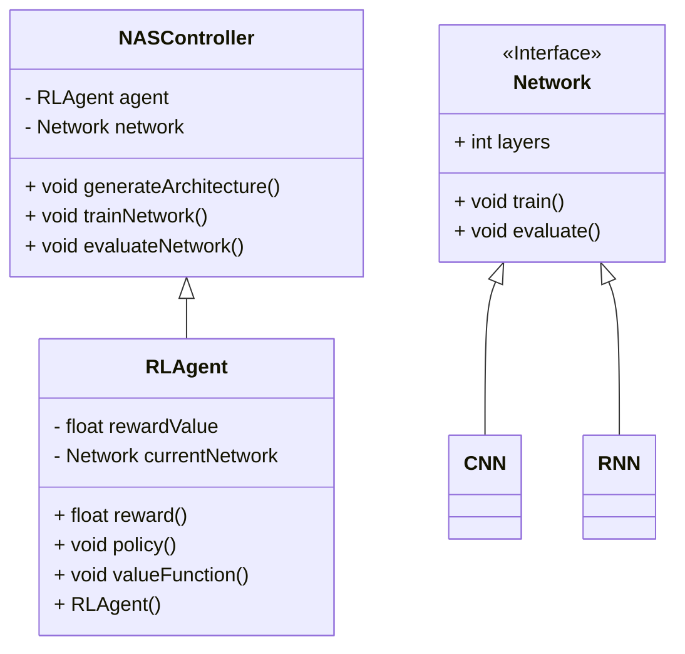
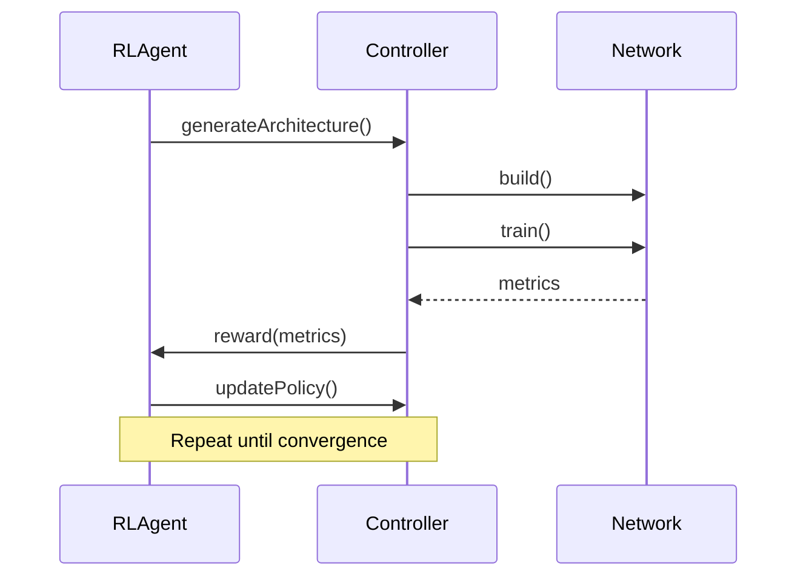

## Introduction
Neural Architecture Search (NAS) is a powerful technique to discover optimal neural network architectures that can yield superior performance on specific tasks. When combined with Reinforcement Learning (RL), this process becomes more targeted and efficient, leveraging the RL agent to explore the architecture space intelligently.

## UML Diagrams

### UML Class Diagram



### UML Sequence Diagram



## Detailed Explanation

### Components

1. **RLAgent**: The reinforcement learning agent responsible for exploring the architecture space. It uses a policy to decide on architecture components and receives a reward based on network performance.
2. **Controller**: Manages the training and evaluation of the architectures generated by the RLAgent.
3. **Network**: Represents various types of neural networks (e.g., CNNs, RNNs) and contains methods for training and evaluation.

### Process

1. **Architecture Generation**: The RLAgent instructs the Controller to generate an architecture.
2. **Network Training**: The generated architecture is instantiated and trained using the available dataset.
3. **Evaluation and Reward**: After training, the network is evaluated, and performance metrics are returned to the RLAgent.
4. **Policy Update**: Based on the received reward, the RLAgent updates its policy to favor architectures that yield better performance.
5. **Iteration**: Steps 1-4 are repeated until the agent converges to an optimal architecture.

## Benefits

- **Efficiency**: Reduces the time and computational resources needed to discover optimal architectures.
- **Targeted Exploration**: The RLAgent focuses on promising architecture regions, leading to faster convergence.
- **Adaptability**: Can be applied to various types of neural networks and datasets.

## Trade-offs

- **Complexity**: Implementation is more complex compared to traditional architecture search methods.
- **Computational Overhead**: Initial setup and tuning can be resource-intensive.

## Example Use Cases

- **Image Classification**: Finding optimal CNN architectures for image recognition tasks.
- **Natural Language Processing**: Discovering efficient RNN or Transformer models for language modeling.
- **Recommender Systems**: Identifying neural networks that provide better recommendations based on user behavior.

## Examples

### Python

```python
import tensorflow as tf
from tensorflow.keras import layers

class RLAgent:
    def __init__(self):
        self.policy = ... # Initialize policy
    
    def generateArchitecture(self):
        # Logic to generate neural network architecture
        pass
    
    def reward(self, metrics):
        # Reward based on performance metrics
        pass
    
    def updatePolicy(self):
        # Update policy based on rewards
        pass

class Controller:
    def __init__(self):
        self.agent = RLAgent()
        
    def trainNetwork(self, network):
        # Train the given network
        network.train()
        
    def evaluateNetwork(self, network):
        # Evaluate the given network
        return network.evaluate()

class Network:
    def __init__(self, layers):
        self.layers = layers
        
    def build(self):
        self.model = tf.keras.Sequential(self.layers)
    
    def train(self):
        # Training logic
        pass
    
    def evaluate(self):
        # Evaluation logic
        return {"accuracy": 0.9} # Placeholder for evaluation metrics

controller = Controller()
network = Network([layers.Dense(10, activation='relu'), layers.Dense(1)])
controller.trainNetwork(network)
metrics = controller.evaluateNetwork(network)
controller.agent.reward(metrics)
```

### Java

```java
import java.util.ArrayList;
import java.util.List;

// Interface for Network
interface Network {
    int layers = 0;

    void train();
    void evaluate();
}

// Convolutional Neural Network (CNN) implementing Network
class CNN implements Network {
    @Override
    public void train() {
        System.out.println("Training CNN...");
    }

    @Override
    public void evaluate() {
        System.out.println("Evaluating CNN...");
    }
}

// Recurrent Neural Network (RNN) implementing Network
class RNN implements Network {
    @Override
    public void train() {
        System.out.println("Training RNN...");
    }

    @Override
    public void evaluate() {
        System.out.println("Evaluating RNN...");
    }
}

// Reinforcement Learning Agent
class RLAgent {
    private float rewardValue;
    private Network currentNetwork;

    public RLAgent() {
        this.rewardValue = 0.0f;
    }

    public float reward() {
        // Return reward based on the current network performance
        return rewardValue;
    }

    public void policy() {
        // Define the policy for the agent
        System.out.println("Executing policy...");
    }

    public void valueFunction() {
        // Compute the value function
        System.out.println("Computing value function...");
    }

    public void setCurrentNetwork(Network network) {
        this.currentNetwork = network;
    }

    public Network getCurrentNetwork() {
        return currentNetwork;
    }
}

// Neural Architecture Search (NAS) Controller
class NASController {
    private RLAgent agent;
    private Network network;

    public NASController() {
        this.agent = new RLAgent();
        this.network = new CNN(); // Default network, can be changed
    }

    public void generateArchitecture() {
        // Logic for generating network architecture
        System.out.println("Generating architecture...");
        this.network = new RNN(); // Example: switch to RNN
    }

    public void trainNetwork() {
        // Train the current network
        System.out.println("Training network...");
        network.train();
    }

    public void evaluateNetwork() {
        // Evaluate the current network's performance and update RL agent
        System.out.println("Evaluating network...");
        network.evaluate();
        agent.setCurrentNetwork(network);
    }

    public RLAgent getAgent() {
        return agent;
    }

    public Network getNetwork() {
        return network;
    }
}

// Main class to run the example
public class NASExample {
    public static void main(String[] args) {
        NASController controller = new NASController();
        
        // Generate a new architecture
        controller.generateArchitecture();
        
        // Train the network
        controller.trainNetwork();
        
        // Evaluate the network
        controller.evaluateNetwork();
        
        // Get the agent's feedback
        RLAgent agent = controller.getAgent();
        float reward = agent.reward();
        System.out.println("Agent reward: " + reward);
        
        // Agent's decision-making
        agent.policy();
        agent.valueFunction();
    }
}
```

### Scala

```scala
// Trait for Network
trait Network {
  var layers: Int = 0

  def train(): Unit
  def evaluate(): Unit
}

// Convolutional Neural Network (CNN) implementing Network
class CNN extends Network {
  override def train(): Unit = {
    println("Training CNN...")
  }

  override def evaluate(): Unit = {
    println("Evaluating CNN...")
  }
}

// Recurrent Neural Network (RNN) implementing Network
class RNN extends Network {
  override def train(): Unit = {
    println("Training RNN...")
  }

  override def evaluate(): Unit = {
    println("Evaluating RNN...")
  }
}

// Reinforcement Learning Agent
class RLAgent {
  private var rewardValue: Double = 0.0
  private var currentNetwork: Network = _

  def reward(): Double = {
    // Return reward based on the current network performance
    rewardValue
  }

  def policy(): Unit = {
    // Define the policy for the agent
    println("Executing policy...")
  }

  def valueFunction(): Unit = {
    // Compute the value function
    println("Computing value function...")
  }

  def setCurrentNetwork(network: Network): Unit = {
    this.currentNetwork = network
  }

  def getCurrentNetwork: Network = currentNetwork
}

// Neural Architecture Search (NAS) Controller
class NASController {
  private val agent = new RLAgent()
  private var network: Network = new CNN() // Default network, can be changed

  def generateArchitecture(): Unit = {
    // Logic for generating network architecture
    println("Generating architecture...")
    this.network = new RNN() // Example: switch to RNN
  }

  def trainNetwork(): Unit = {
    // Train the current network
    println("Training network...")
    network.train()
  }

  def evaluateNetwork(): Unit = {
    // Evaluate the current network's performance and update RL agent
    println("Evaluating network...")
    network.evaluate()
    agent.setCurrentNetwork(network)
  }

  def getAgent: RLAgent = agent
  def getNetwork: Network = network
}

// Main object to run the example
object NASExample extends App {
  val controller = new NASController()

  // Generate a new architecture
  controller.generateArchitecture()

  // Train the network
  controller.trainNetwork()

  // Evaluate the network
  controller.evaluateNetwork()

  // Get the agent's feedback
  val agent = controller.getAgent
  val reward = agent.reward()
  println("Agent reward: " + reward)

  // Agent's decision-making
  agent.policy()
  agent.valueFunction()
}
```

### Clojure

Translating the class-based structure into Clojure, a functional programming language, involves using records and protocols. Clojure's approach to object-oriented concepts is different, but we can achieve similar functionality with protocols and records.

Here is an example of how the Neural Architecture Search (NAS) combined with Reinforcement Learning (RL) can be implemented in Clojure:

```clojure
(ns nas-example.core)

; Define a Protocol for Network
(defprotocol Network
  (train [this])
  (evaluate [this]))

; Implement the CNN as a record that implements the Network protocol
(defrecord CNN []
  Network
  (train [_] (println "Training CNN..."))
  (evaluate [_] (println "Evaluating CNN...")))

; Implement the RNN as a record that implements the Network protocol
(defrecord RNN []
  Network
  (train [_] (println "Training RNN..."))
  (evaluate [_] (println "Evaluating RNN...")))

; Define the RLAgent as a record
(defrecord RLAgent [reward-value current-network]
  (reward [this] @reward-value)
  (policy [this] (println "Executing policy..."))
  (value-function [this] (println "Computing value function..."))
  (set-current-network [this network] (swap! current-network (fn [_] network)))
  (get-current-network [this] @current-network))

; Define the NASController as a record with an RLAgent and a Network
(defrecord NASController [agent network]
  (generate-architecture [this]
    (println "Generating architecture...")
    (assoc this :network (RNN.)))  ; Example: switch to RNN
  (train-network [this]
    (println "Training network...")
    (train (:network this)))
  (evaluate-network [this]
    (println "Evaluating network...")
    (evaluate (:network this))
    ((:set-current-network (:agent this)) (:network this)))
  (get-agent [this] (:agent this))
  (get-network [this] (:network this)))

; Main function to run the example
(defn -main []
  (let [agent (->RLAgent (atom 0.0) (atom nil))
        controller (->NASController agent (CNN.))]

    ; Generate a new architecture
    ((:generate-architecture controller) controller)

    ; Train the network
    ((:train-network controller) controller)

    ; Evaluate the network
    ((:evaluate-network controller) controller)

    ; Get the agent's feedback
    (let [reward ((:reward agent) agent)]
      (println "Agent reward:" reward))

    ; Agent's decision-making
    ((:policy agent) agent)
    ((:value-function agent) agent)))

; Uncomment the following line if running this script directly
; (-main)
```

Note: The records and their interrelationships have been implemented in a manner that maintains functional programming principles while providing clarity similar to OOP constructs. Adjustments were made to match Clojure's idiomatic usage, including handling mutable state with `atom`.

### Explanation of the Code:
- **Network Protocol:** Defines the methods `train` and `evaluate` that must be implemented by any implementing Network record.
- **CNN Record:** Implements the Network protocol, providing specific implementations for `train` and `evaluate`.
- **RNN Record:** Similar to `CNN`, it implements the `Network` protocol.
- **RLAgent Record:** Contains methods similar to rewards, policies, and value functions. This uses `atom` for mutable state within the agent.
- **NASController Record:** Controls the architecture search process by generating new architectures, training, and evaluating them via methods that leverage the RL agent. It uses associated data to relate to the RLAgent and Network instances.
- **Main Function:** Demonstrates how to use the `NASController` to perform a simple NAS process, showing the training and evaluation steps along with interactions with the RL agent.

## Related Design Patterns

- **AutoML**: Automated Machine Learning, which includes various automated techniques beyond NAS.
- **Hyperparameter Optimization**: Techniques to find the optimal hyperparameters for training models.

## Resources and References

- [Auto-Keras](https://autokeras.com/): An open-source AutoML library.
- [NAS Benchmarks](https://github.com/google-research/nasbench): Datasets and benchmarks for NAS research.
- [Deep Reinforcement Learning Hands-On](https://www.packtpub.com/product/deep-reinforcement-learning-hands-on-second-edition/9781838559942): A practical guide to RL techniques.

## Conclusion

Reinforcement Learning for Neural Architecture Search provides a powerful and efficient approach to discover optimal neural network architectures. It enhances traditional NAS methods by incorporating an intelligent, reward-based mechanism to focus on promising architectural designs. Despite its complexity, the benefits in terms of efficiency and performance make it a valuable technique in the deep learning toolkit.

By following the structured approach discussed and implementing the examples in your preferred programming language, you can leverage the power of RL to streamline your neural architecture discovery process.
