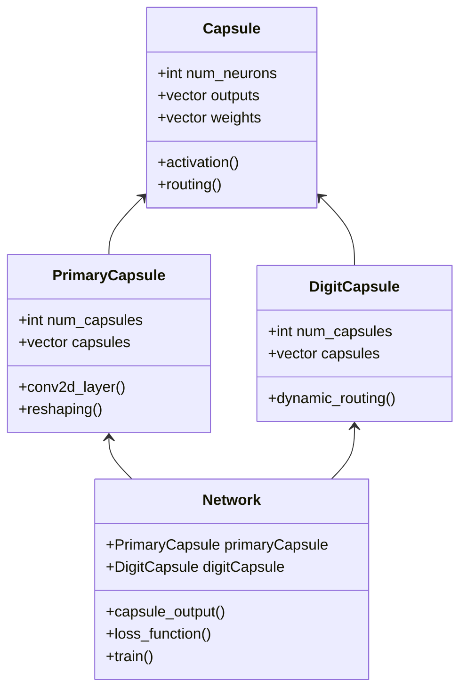
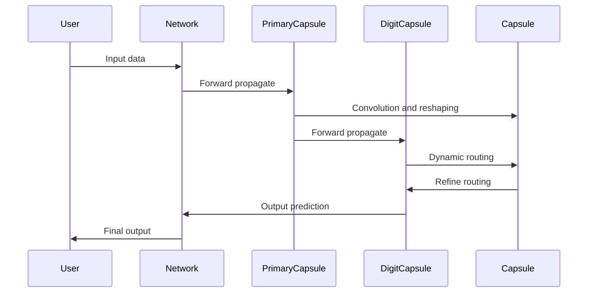

Capsule Networks, introduced by Geoffrey Hinton et al., aim to address some of the limitations of Convolutional Neural Networks (CNNs), particularly their inefficiency in preserving spatial hierarchies in images. Capsule Networks use groups of neurons, known as "capsules," and a dynamic routing mechanism to retain spatial relationships, making them highly effective in tasks requiring detailed understanding of spatial hierarchies.

## Overview

### What are Capsule Networks?

Capsule Networks consist of layers of capsules, where each capsule is a group of neurons that output both a probability of the detection of an entity and a detailed description of the entity's parameters. This structure allows the network to capture more complex patterns and hierarchies in the data compared to traditional CNNs.

### Dynamic Routing Between Capsules

Dynamic routing is a mechanism by which each capsule outputs are routed to the most appropriate parent capsules in the next layer, iteratively refining the routing process. This leads to more accurate representations and better generalization.

## Benefits

- **Preserves Spatial Hierarchies:** Capsule Networks maintain the spatial relationships between features, which is crucial for tasks like image recognition.
- **Robustness to Transformations:** They are more robust to rotations and translations of input data.
- **Dynamic Routing:** More effective in handling different viewpoints and perspectives.

## Trade-offs

- **Complexity:** Capsule Networks are more complex to implement and train than traditional CNNs.
- **Computational Cost:** They require more computational power due to the iterative dynamic routing process.
- **Scalability:** Scaling Capsule Networks for very large datasets and deep architectures can be challenging.

## Use Cases

- **Image Recognition:** Identifying objects in images while preserving spatial hierarchies.
- **Medical Imaging:** Analyzing medical scans with high precision.
- **3D Object Recognition:** Recognizing objects from multiple viewpoints in 3D space.

## UML Class Diagram



## UML Sequence Diagram



## Example Implementations

### Python (using TensorFlow)

```python
import tensorflow as tf
from tensorflow.keras import layers, models

class CapsuleLayer(layers.Layer):
    def __init__(self, num_capsules, dim_capsules, num_routing=3, **kwargs):
        super(CapsuleLayer, self).__init__(**kwargs)
        self.num_capsules = num_capsules
        self.dim_capsules = dim_capsules
        self.num_routing = num_routing

    def build(self, input_shape):
        self.kernel = self.add_weight(shape=(input_shape[-1], self.num_capsules * self.dim_capsules),
                                      initializer='glorot_uniform',
                                      trainable=True)
    
    def call(self, inputs):
        # Squashing function implementation and dynamic routing will be here
        pass

inputs = layers.Input(shape=(28, 28, 1))
x = layers.Conv2D(256, (9, 9), activation='relu')(inputs)
primary_caps = CapsuleLayer(num_capsules=8, dim_capsules=16)(x)
digit_caps = CapsuleLayer(num_capsules=10, dim_capsules=16)(primary_caps)
model = models.Model(inputs, digit_caps)
```

### Java

```java
// Java implementation of Capsule Networks is complex and may require custom libraries or frameworks
// Example is more conceptual and does not provide a full working implementation
public class CapsuleLayer {
    private int numCapsules;
    private int dimCapsules;
    private int numRouting;

    public CapsuleLayer(int numCapsules, int dimCapsules, int numRouting) {
        this.numCapsules = numCapsules;
        this.dimCapsules = dimCapsules;
        this.numRouting = numRouting;
    }

    public void build() {
        // Initialization of weights and biases
    }

    public void call(float[][] inputs) {
        // Forward pass and dynamic routing
    }
}

public class CapsuleNetwork {
    public static void main(String[] args) {
        CapsuleLayer primaryCaps = new CapsuleLayer(8, 16, 3);
        CapsuleLayer digitCaps = new CapsuleLayer(10, 16, 3);
        // Model construction and training process
    }
}
```

### Scala

```scala
// Simplified example using Breeze for matrix operations
import breeze.linalg._

class CapsuleLayer(numCapsules: Int, dimCapsules: Int, numRouting: Int) {
  var kernel: DenseMatrix[Double] = _

  def build(inputShape: (Int, Int)): Unit = {
    kernel = DenseMatrix.rand(inputShape._2, numCapsules * dimCapsules)
  }

  def call(inputs: DenseMatrix[Double]): DenseMatrix[Double] = {
    // Implement dynamic routing here
    inputs * kernel
  }
}

object CapsuleNetwork {
  def main(args: Array[String]): Unit = {
    val primaryCaps = new CapsuleLayer(8, 16, 3)
    primaryCaps.build((28, 256))
    // Continue building and training the network
  }
}
```

### Clojure

```clojure
(ns capsule-network.core
  (:require [clojure.core.matrix :as m]))

(defn capsule-layer [num-capsules dim-capsules num-routing]
  {:num-capsules num-capsules
   :dim-capsules dim-capsules
   :num-routing num-routing})

(defn build [layer input-shape]
  (assoc layer :kernel (m/rand [(:dim-capsules layer) (* (:num-capsules layer) input-shape)])))

(defn call [layer inputs]
  ;; Placeholder for dynamic routing
  (m/mmul inputs (:kernel layer)))

(defn -main []
  (let [primary-caps (capsule-layer 8 16 3)]
    (build primary-caps 256)
    ;; Continue with model construction
    ))
```

## Related Design Patterns

- **Convolutional Neural Networks (CNNs):** While CNNs are powerful for many image-related tasks, Capsule Networks enhance them by preserving spatial hierarchies and improving robustness to transformations.
- **Recurrent Neural Networks (RNNs):** Used for sequence data, RNNs also involve intricate architectures. However, Capsule Networks focus on spatial relationships rather than temporal ones.

## Resources and References

- [Capsule Networks Paper by Geoffrey Hinton](https://arxiv.org/abs/1710.09829)
- [TensorFlow Documentation](https://www.tensorflow.org/overview)
- [PyTorch Tutorials](https://pytorch.org/tutorials/)
- [Capsule Network Implementation in Keras](https://github.com/XifengGuo/CapsNet-Keras)

## Open Source Frameworks

- **CapsNet-Keras:** An open-source implementation of Capsule Networks using Keras and TensorFlow.
- **PyTorch-Capsule:** A PyTorch implementation of Capsule Networks, providing pre-built modules and utilities.

## Final Summary

Capsule Networks bring a transformative approach to deep learning by focusing on preserving spatial hierarchies through dynamic routing between capsules. While they are more complex and computationally intensive than traditional CNNs, the benefits they offer in terms of robustness and detail recognition are substantial. Their applications range from image recognition to medical imaging and 3D object recognition. Understanding the structure, benefits, trade-offs, and implementation of Capsule Networks provides valuable insights into tackling complex data representation challenges in machine learning.

By leveraging the powerful features of Capsule Networks and implementing them efficiently, engineers and researchers can advance the field of deep learning, pushing the boundaries of what's possible in various AI-driven domains.
