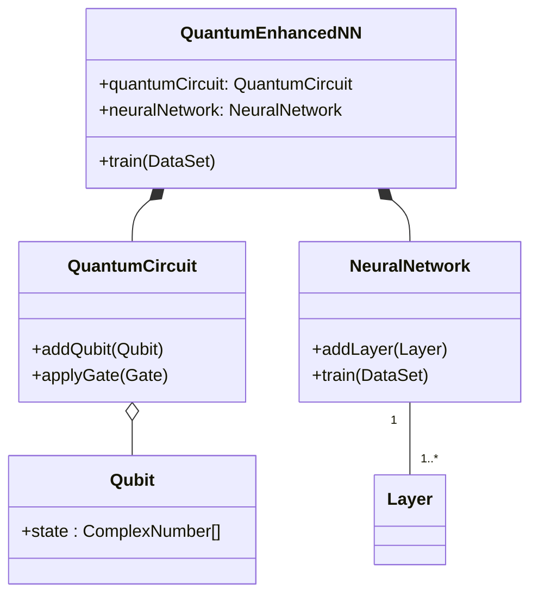
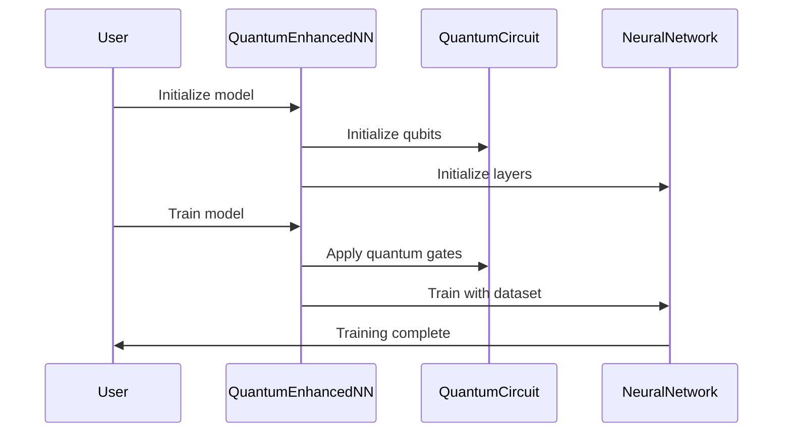

## Neural Enhanced Quantum Computing: Merging Neural Networks with Quantum Computing

Neural Enhanced Quantum Computing (NEQC) leverages the computational power of quantum mechanics to enhance neural network architectures. By synergizing these two paradigms, NEQC aims to tackle complex problems more efficiently and with higher accuracy than classical approaches.

## Key Concepts

### Quantum Computing
Quantum computing exploits the principles of quantum mechanics to perform computations. Quantum bits, or qubits, can exist in multiple states simultaneously, enabling quantum algorithms to solve certain problems exponentially faster than classical algorithms.

### Neural Networks
Neural networks are computational models inspired by the human brain, used primarily for pattern recognition and machine learning tasks. They consist of interconnected nodes (neurons) that process input data to produce a desired output.

## Benefits of NEQC

1. **Enhanced Computational Power:** Quantum algorithms can potentially solve problems that are infeasible for classical computers, boosting neural network capabilities.
2. **Improved Accuracy:** Quantum-enhanced algorithms may offer more precise solutions for complex problems.
3. **Reduced Training Time:** Quantum computations can significantly reduce the time required for training large neural networks.

## Trade-offs

1. **Complexity:** Integrating quantum computing with neural networks introduces significant complexity in both implementation and debugging.
2. **Resource Intensive:** Quantum computers are still in their infancy and require specialized hardware, making them less accessible.
3. **Algorithm Design:** Developing quantum algorithms that effectively enhance neural networks requires specialized knowledge and expertise.

## UML Diagrams

### UML Class Diagram



### UML Sequence Diagram



## Example Implementations

### Python

```python
from qiskit import QuantumCircuit, ClassicalRegister, execute, Aer

class QuantumEnhancedNN:
    def __init__(self, num_qubits):
        self.quantum_circuit = QuantumCircuit(num_qubits, num_qubits)
        self.neural_network = self.init_neural_network()
    
    def init_neural_network(self):
        # Initialize a neural network (e.g., using TensorFlow/Keras or PyTorch)
        pass

    def train(self, dataset):
        # Apply quantum operations
        self.quantum_circuit.h(range(self.quantum_circuit.num_qubits))
        self.quantum_circuit.measure_all()
        
        # Execute the circuit
        simulator = Aer.get_backend('qasm_simulator')
        result = execute(self.quantum_circuit, simulator).result()
        
        # Train neural network with results
        self.neural_network.train(dataset)
```

### Java

```java
import org.jquantum.*;

public class QuantumEnhancedNN {
    private QuantumCircuit quantumCircuit;
    private NeuralNetwork neuralNetwork;
    
    public QuantumEnhancedNN(int numQubits) {
        this.quantumCircuit = new QuantumCircuit(numQubits);
        this.neuralNetwork = new NeuralNetwork();
    }
    
    public void train(DataSet dataset) {
        // Apply quantum operations
        quantumCircuit.applyGate(new HadamardGate());
        
        // Measure and process results
        QuantumResult result = quantumCircuit.measure();
        
        // Train neural network with results
        neuralNetwork.train(dataset, result);
    }
}
```

### Scala

```scala
import quantum._

class QuantumEnhancedNN(numQubits: Int) {
    val quantumCircuit = new QuantumCircuit(numQubits)
    val neuralNetwork = new NeuralNetwork()
    
    def train(dataset: DataSet): Unit = {
        // Apply quantum operations
        quantumCircuit.applyGate(new HadamardGate)
        
        // Measure and process results
        val result = quantumCircuit.measure()
        
        // Train neural network with results
        neuralNetwork.train(dataset, result)
    }
}
```

### Clojure

```clojure
(ns quantum-enhanced-nn
  (:require [quantum.core :as quantum]
            [neural.network :as nn]))

(defn initialize-quantum-nn [num-qubits]
  {:quantum-circuit (quantum/create-circuit num-qubits)
   :neural-network (nn/create-network)})

(defn train [quantum-nn dataset]
  (let [{:keys [quantum-circuit neural-network]} quantum-nn]
    ;; Apply quantum operations
    (quantum/apply-gate quantum-circuit :hadamard)
    
    ;; Measure and process results
    (let [result (quantum/measure quantum-circuit)]
      ;; Train neural network with results
      (nn/train neural-network dataset result))))
```

## Use Cases

1. **Optimization Problems:** NEQC can enhance the ability to find optimal solutions in complex optimization problems such as the traveling salesman problem or portfolio optimization.
2. **Drug Discovery:** Quantum computing can improve the accuracy of molecular simulations, while neural networks can predict chemical properties.
3. **Cryptography:** Enhanced cryptographic algorithms for security protocols.

## Related Design Patterns

1. **Quantum Supremacy:** Focuses on quantum algorithms outperforming classical ones in specific tasks.
2. **Hybrid Quantum-Classical Computing:** Combines quantum and classical computing resources for specific tasks.
3. **Neural Architecture Search (NAS):** Automates the design of neural network architectures, which can be enhanced using quantum algorithms.

## Resources & References

1. [Quantum Machine Learning by Peter Wittek](https://www.amazon.com/Quantum-Machine-Learning-What-Teach/dp/0128100400)
2. [Qiskit Documentation](https://qiskit.org/documentation/)
3. [TensorFlow Quantum](https://www.tensorflow.org/quantum)
4. [IBM Quantum Experience](https://quantum-computing.ibm.com/)

## Open Source Frameworks

1. **Qiskit:** An open-source quantum computing framework by IBM.
2. **PennyLane:** A Python library for differentiable programming of quantum computers.
3. **TensorFlow Quantum:** Integrates TensorFlow with quantum computing.

## Summary

Neural Enhanced Quantum Computing represents a significant advancement in leveraging the strengths of both neural networks and quantum computing. While there are challenges and trade-offs, the potential benefits in terms of computational power, accuracy, and efficiency are immense. This design pattern can be particularly useful in optimization problems, drug discovery, and cryptography. The future of NEQC holds promising possibilities, and ongoing advancements in both quantum and neural network technologies will likely continue to drive innovation in this field.
