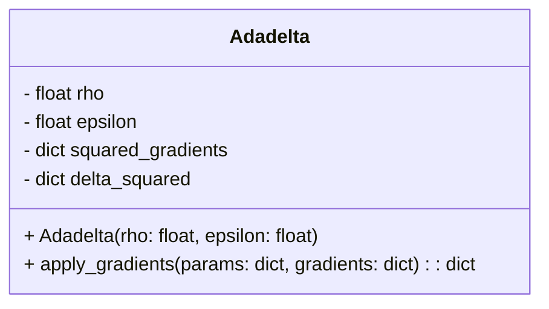
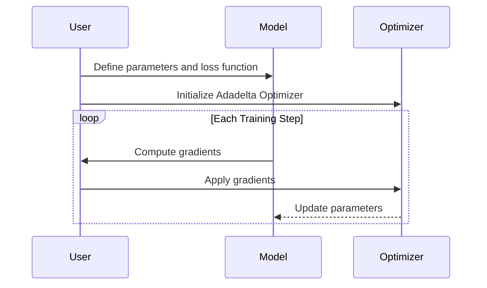

Adadelta is an adaptive learning rate optimization algorithm designed to correct momentum in gradient descent by adapting learning rates based on a moving window of gradient updates. Unlike other adaptive learning algorithms, Adadelta does not store past squared gradients; instead, it restricts the window of accumulated past gradients to a fixed size.

## Detailed Description

Adadelta was introduced by Matthew D. Zeiler in the paper "[ADADELTA: An Adaptive Learning Rate Method](https://arxiv.org/abs/1212.5701)". It aims to overcome the drawbacks of Adagrad, which performs well initially but decays the learning rate too aggressively. Adadelta dynamically adjusts the learning rates per dimension based on the window of past gradients.

### Key Equations

Adadelta can be summarized with the following equations:

1. **Accumulated Gradient Update:**

    E[g^2]_t = \rho E[g^2]_{t-1} + (1 - \rho) g_t^2 

2. **Parameter Update:**

    \Delta \theta_t = - \frac{\sqrt{E[\Delta \theta^2]_{t-1} + \epsilon}}{\sqrt{E[g^2]_t + \epsilon}} g_t 

3. **Accumulated Updates:**

    E[\Delta \theta^2]_t = \rho E[\Delta \theta^2]_{t-1} + (1 - \rho) \Delta \theta_t^2 

Where:
- \\( \rho \\) is the decay rate (typically close to 1, such as 0.95).
- \\( g_t \\) is the gradient at time step \\( t \\).
- \\( \epsilon \\) is a small constant to avoid division by zero.

## UML Diagrams

### Class Diagram



### Sequence Diagram



## Example Implementations

### Python

```python
class Adadelta:
    def __init__(self, rho=0.95, epsilon=1e-6):
        self.rho = rho
        self.epsilon = epsilon
        self.squared_gradients = {}
        self.delta_squared = {}

    def apply_gradients(self, params, gradients):
        for key in params.keys():
            if key not in self.squared_gradients:
                self.squared_gradients[key] = 0
                self.delta_squared[key] = 0
            
            self.squared_gradients[key] = (
                self.rho * self.squared_gradients[key] +
                (1 - self.rho) * gradients[key]**2
            )
            
            update = (
                - (self.delta_squared[key] + self.epsilon)**0.5 / 
                (self.squared_gradients[key] + self.epsilon)**0.5 *
                gradients[key]
            )
            
            self.delta_squared[key] = (
                self.rho * self.delta_squared[key] +
                (1 - self.rho) * update**2
            )
            
            params[key] += update
        
        return params

params = {'w': 0.5, 'b': 0.1}
gradients = {'w': 0.01, 'b': 0.002}
optimizer = Adadelta()
updated_params = optimizer.apply_gradients(params, gradients)
```

### Java

```java
import java.util.HashMap;

public class Adadelta {
    private double rho;
    private double epsilon;
    private HashMap<String, Double> squaredGradients;
    private HashMap<String, Double> deltaSquared;

    public Adadelta(double rho, double epsilon) {
        this.rho = rho;
        this.epsilon = epsilon;
        this.squaredGradients = new HashMap<>();
        this.deltaSquared = new HashMap<>();
    }

    public HashMap<String, Double> applyGradients(HashMap<String, Double> params, HashMap<String, Double> gradients) {
        for (String key : params.keySet()) {
            squaredGradients.putIfAbsent(key, 0.0);
            deltaSquared.putIfAbsent(key, 0.0);

            squaredGradients.put(key, rho * squaredGradients.get(key) + (1 - rho) * Math.pow(gradients.get(key), 2));

            double update = - (Math.sqrt(deltaSquared.get(key) + epsilon) / Math.sqrt(squaredGradients.get(key) + epsilon)) * gradients.get(key);

            deltaSquared.put(key, rho * deltaSquared.get(key) + (1 - rho) * Math.pow(update, 2));

            params.put(key, params.get(key) + update);
        }

        return params;
    }

    public static void main(String[] args) {
        HashMap<String, Double> params = new HashMap<>();
        params.put("w", 0.5);
        params.put("b", 0.1);

        HashMap<String, Double> gradients = new HashMap<>();
        gradients.put("w", 0.01);
        gradients.put("b", 0.002);

        Adadelta optimizer = new Adadelta(0.95, 1e-6);
        HashMap<String, Double> updatedParams = optimizer.applyGradients(params, gradients);

        System.out.println(updatedParams);
    }
}
```

### Scala

```scala
class Adadelta(val rho: Double = 0.95, val epsilon: Double = 1e-6) {
  private var squaredGradients: Map[String, Double] = Map()
  private var deltaSquared: Map[String, Double] = Map()

  def applyGradients(params: Map[String, Double], gradients: Map[String, Double]): Map[String, Double] = {
    params.map { case (key, value) =>
      squaredGradients = squaredGradients.updated(key, 
        rho * squaredGradients.getOrElse(key, 0.0) + (1 - rho) * Math.pow(gradients(key), 2))

      val update = - (Math.sqrt(deltaSquared.getOrElse(key, 0.0) + epsilon) / 
                      Math.sqrt(squaredGradients(key) + epsilon)) * gradients(key)

      deltaSquared = deltaSquared.updated(key, 
        rho * deltaSquared.getOrElse(key, 0.0) + (1 - rho) * Math.pow(update, 2))

      (key, value + update)
    }
  }
}

// Example usage
val params = Map("w" -> 0.5, "b" -> 0.1)
val gradients = Map("w" -> 0.01, "b" -> 0.002)
val optimizer = new Adadelta()
val updatedParams = optimizer.applyGradients(params, gradients)

println(updatedParams)
```

### Clojure

```clojure
(defn adadelta
  [rho epsilon]
  (atom {:rho rho
         :epsilon epsilon
         :squared-gradients {}
         :delta-squared {}}))

(defn apply-gradients
  [opt params gradients]
  (let [{:keys [rho epsilon squared-gradients delta-squared]} @opt]
    (doseq [[k v] params]
      (let [sg (get squared-gradients k 0)
            ds (get delta-squared k 0)
            g (get gradients k)
            sg' (+ (* rho sg) (* (- 1 rho) (Math/pow g 2)))
            update (* -1 (/ (Math/sqrt (+ ds epsilon))
                           (Math/sqrt (+ sg' epsilon)))
                     g)
            ds' (+ (* rho ds) (* (- 1 rho) (Math/pow update 2)))]
        (swap! opt assoc-in [:squared-gradients k] sg')
        (swap! opt assoc-in [:delta-squared k] ds')
        (swap! opt assoc-in [:params k] (+ v update))))))

;; Example usage
(def opt (adadelta 0.95 1e-6))
(def params {:w 0.5 :b 0.1})
(def gradients {:w 0.01 :b 0.002})

(apply-gradients opt params gradients)
(println @opt)
```

## Benefits

- **Dynamic Learning Rates:** Adadelta adapts the learning rate dynamically without requiring a manual setting, which is beneficial in scenarios where appropriate learning rates are unknown.
- **No Need for Learning Rate Decay:** Unlike other algorithms, Adadelta automatically decays the learning rate, removing the need for setting learning rate schedules.
- **Improved Convergence:** The method often results in faster and more stable convergence compared to static learning rate methods.

## Trade-offs

- **Complexity:** The algorithm is more complex than simpler methods like SGD, which can make it harder to understand and implement.
- **Memory Consumption:** Adadelta requires storage for accumulated gradients and updates, which can be an issue for models with large parameter spaces.

## Use Cases

- **Training Deep Neural Networks:** Adadelta is often used in training deep neural networks where momentum correction and dynamic learning rates are crucial for efficient convergence.
- **Complex Models:** Models with complex and high-dimensional parameter spaces can benefit from the adaptive nature of Adadelta.

## Related Design Patterns

- **Adagrad:** Adagrad is an adaptive learning rate method that reduces the learning rate over time but tends to decay too aggressively, which Adadelta corrects.
- **RMSprop:** RMSprop is similar to Adadelta but keeps an exponentially decaying average of past squared gradients. It also addresses the diminishing learning rates problem.
- **Adam:** Adam combines the benefits of both Adagrad and RMSprop by maintaining a running average of both the gradients and their squared values.

## Resources and References

- Zeiler, Matthew D. "[ADADELTA: An Adaptive Learning Rate Method](https://arxiv.org/abs/1212.5701)." arXiv preprint arXiv:1212.5701 (2012).
- [PyTorch: Adadelta](https://pytorch.org/docs/stable/generated/torch.optim.Adadelta.html)
- [TensorFlow: Adadelta](https://www.tensorflow.org/api_docs/python/tf/keras/optimizers/Adadelta)
- [Keras: Adadelta](https://keras.io/api/optimizers/adadelta/)

## Open Source Frameworks

- **TensorFlow:** Includes an implementation of Adadelta for gradient descent optimization.
- **PyTorch:** Provides a built-in Adadelta optimizer.
- **Keras:** Offers Adadelta as one of its optimization algorithms.

## Summary

Adadelta is an advanced optimization algorithm designed to provide dynamic learning rates, leading to more efficient and stable training for deep learning models. By addressing the shortcomings of Adagrad, Adadelta offers a balance between simplicity and adaptiveness, making it a powerful tool in the machine learning practitioner's toolbox. Its dynamic adjustment of learning rates makes it particularly useful in scenarios where manual tuning of learning rates is impractical or impossible.
