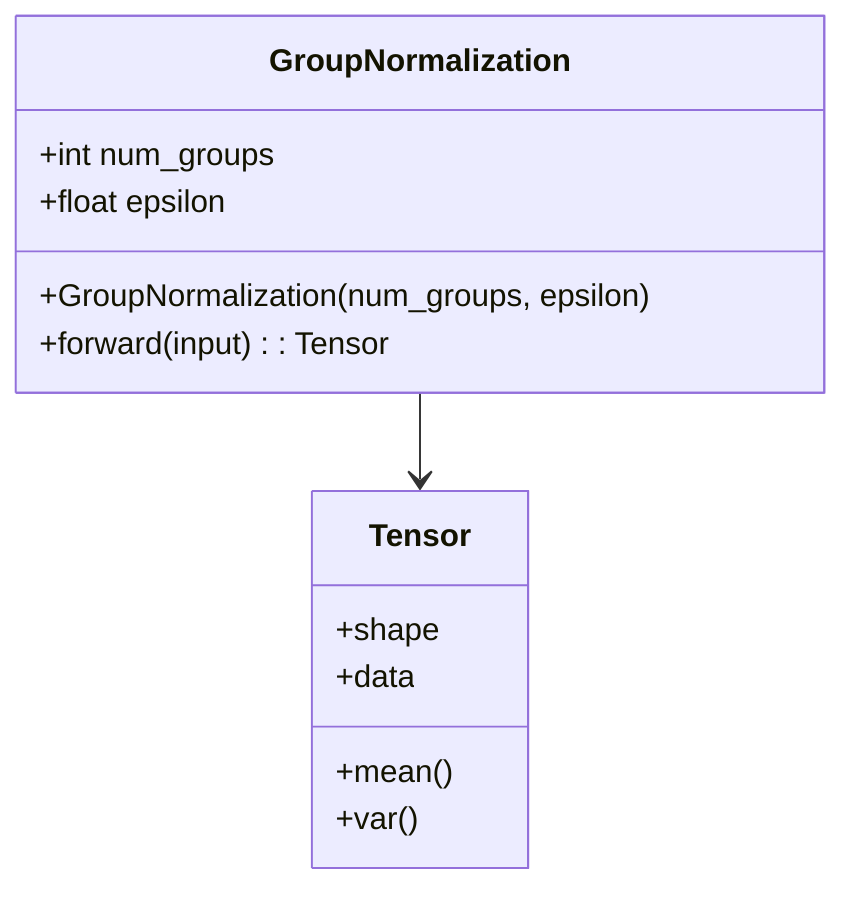
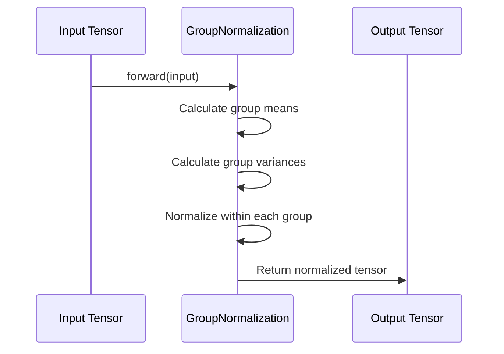

## Group Normalization: Normalization over Groups of Examples

Group Normalization is a normalization technique designed to handle scenarios where small batch sizes are common, such as training with limited resources or real-time applications. Unlike Batch Normalization, which normalizes over entire batches, Group Normalization normalizes over smaller groups of examples within a batch, making it more effective for a wider range of batch sizes.

### Benefits

1. **Effective for Small Batch Sizes:** Outperforms Batch Normalization when batch sizes are small.
2. **Better Convergence:** Facilitates faster and more stable convergence during training.
3. **Less Dependency on Batch Size:** Reduces the dependency on batch size for effective normalization.

### Trade-offs

1. **Computational Overhead:** May introduce additional computational overhead compared to simpler normalization techniques.
2. **Parameter Tuning:** Requires careful selection of the number of groups to optimize performance.

### Use Cases

- **Training on Edge Devices:** Where memory and computational resources are limited.
- **Real-time Applications:** Like real-time image processing where batch sizes are inherently small.
- **Medical Imaging:** Where datasets might be small due to limited availability.

### UML Diagrams

#### Class Diagram



#### Sequence Diagram



### Python Example

```python
import torch
import torch.nn as nn

class GroupNormalization(nn.Module):
    def __init__(self, num_groups, num_channels, eps=1e-5):
        super(GroupNormalization, self).__init__()
        self.num_groups = num_groups
        self.eps = eps
        self.weight = nn.Parameter(torch.ones(num_channels))
        self.bias = nn.Parameter(torch.zeros(num_channels))

    def forward(self, x):
        N, C, H, W = x.shape
        G = self.num_groups
        x = x.view(N, G, -1)
        mean = x.mean(-1, keepdim=True)
        var = x.var(-1, keepdim=True)
        x = (x - mean) / (var + self.eps).sqrt()
        return x.view(N, C, H, W) * self.weight.view(1, C, 1, 1) + self.bias.view(1, C, 1, 1)

x = torch.randn(16, 32, 64, 64)
gn = GroupNormalization(num_groups=8, num_channels=32)
y = gn(x)
```

### Java Example

```java
public class GroupNormalization {
    private int numGroups;
    private float epsilon;

    public GroupNormalization(int numGroups, float epsilon) {
        this.numGroups = numGroups;
        this.epsilon = epsilon;
    }

    public float[][][] forward(float[][][] input) {
        int N = input.length;
        int C = input[0].length;
        int H = input[0][0].length;
        int G = this.numGroups;

        float[][][] output = new float[N][C][H];
        for (int n = 0; n < N; n++) {
            for (int g = 0; g < G; g++) {
                int start = (C / G) * g;
                int end = (C / G) * (g + 1);

                float mean = 0.0f;
                float var = 0.0f;

                for (int c = start; c < end; c++) {
                    for (int h = 0; h < H; h++) {
                        mean += input[n][c][h];
                    }
                }
                mean /= (end - start) * H;

                for (int c = start; c < end; c++) {
                    for (int h = 0; h < H; h++) {
                        var += Math.pow(input[n][c][h] - mean, 2);
                    }
                }
                var /= (end - start) * H;

                for (int c = start; c < end; c++) {
                    for (int h = 0; h < H; h++) {
                        output[n][c][h] = (input[n][c][h] - mean) / (float)Math.sqrt(var + epsilon);
                    }
                }
            }
        }
        return output;
    }
}
```

### Scala Example

```scala
import breeze.linalg._

class GroupNormalization(val numGroups: Int, val epsilon: Double = 1e-5) {
  def forward(input: DenseMatrix[Double]): DenseMatrix[Double] = {
    val N = input.rows
    val C = input.cols
    val G = numGroups
    val groupSize = C / G

    val output = DenseMatrix.zeros[Double](N, C)

    for (g <- 0 until G) {
      val start = g * groupSize
      val end = (g + 1) * groupSize

      val group = input(::, start until end)
      val mean = breeze.stats.mean(group)
      val variance = breeze.stats.variance(group)

      output(::, start until end) := (group - mean) / math.sqrt(variance + epsilon)
    }
    output
  }
}

object GroupNormalizationExample extends App {
  val input = DenseMatrix.rand[Double](16, 32)
  val gn = new GroupNormalization(numGroups = 8)
  val output = gn.forward(input)
  println(output)
}
```

### Clojure Example

```clojure
(ns group-normalization.core
  (:require [clojure.core.matrix :as m]))

(defn group-normalize [input num-groups epsilon]
  (let [N (m/rows input)
        C (m/cols input)
        G num-groups
        group-size (/ C G)
        output (m/zeros N C)]
    (doseq [g (range G)]
      (let [start (* g group-size)
            end (* (inc g) group-size)
            group (m/submatrix input [[0 N] [start end]])
            mean (m/mean group)
            variance (m/variance group)]
        (m/assign! output (range start end) (m/div (m/sub group mean) (Math/sqrt (+ variance epsilon))))))
    output))

;; Example usage
(def input (m/array (repeatedly 512 #(rand 32))))
(def output (group-normalize input 8 1e-5))
(println output)
```

### Related Design Patterns

- **Batch Normalization:** Normalizes over entire batches; less effective for small batch sizes.
- **Layer Normalization:** Normalizes across the features instead of the batch dimension, useful for RNNs.
- **Instance Normalization:** Normalizes each instance in a batch independently; often used in style transfer.

### Resources and References

- [Group Normalization Research Paper](https://arxiv.org/abs/1803.08494)
- [PyTorch GroupNorm Documentation](https://pytorch.org/docs/stable/generated/torch.nn.GroupNorm.html)
- [TensorFlow GroupNorm Layer](https://www.tensorflow.org/addons/api_docs/python/tfa/layers/GroupNormalization)

### Open Source Frameworks

- **PyTorch:** Offers built-in support for Group Normalization through `torch.nn.GroupNorm`.
- **TensorFlow Addons:** Provides an implementation in the `tfa.layers.GroupNormalization`.

## Summary

Group Normalization is a robust normalization technique designed to work effectively with small batch sizes, which is common in resource-constrained environments and real-time applications. By normalizing over groups of examples, it provides better generalization and convergence properties. However, it introduces some computational overhead and requires parameter tuning to select the optimal number of groups. Group Normalization is complementary to other normalization techniques like Batch, Layer, and Instance Normalization and should be chosen based on specific use case requirements.

Leveraging frameworks like PyTorch and TensorFlow Addons can simplify the implementation and integration of Group Normalization into modern neural network architectures.
