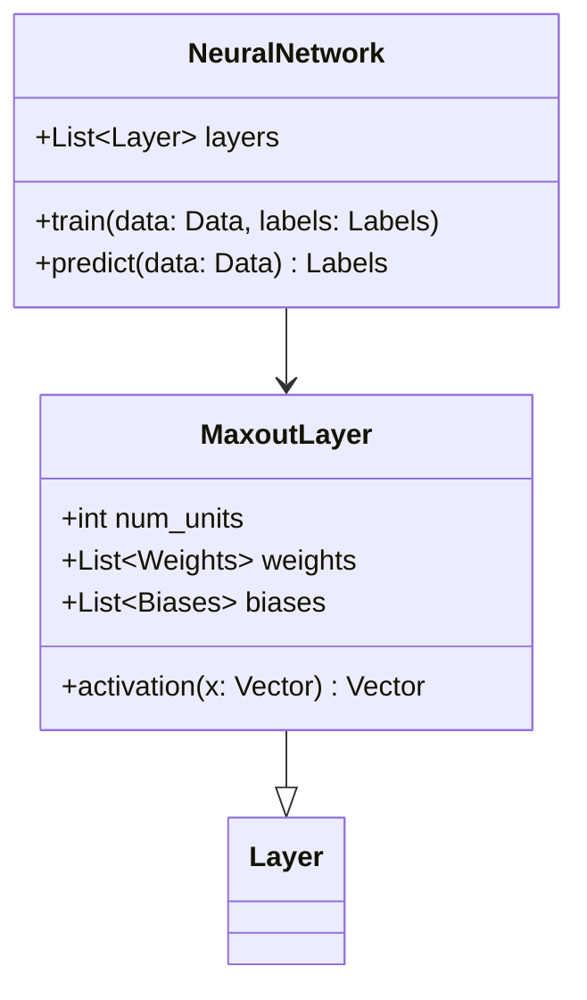
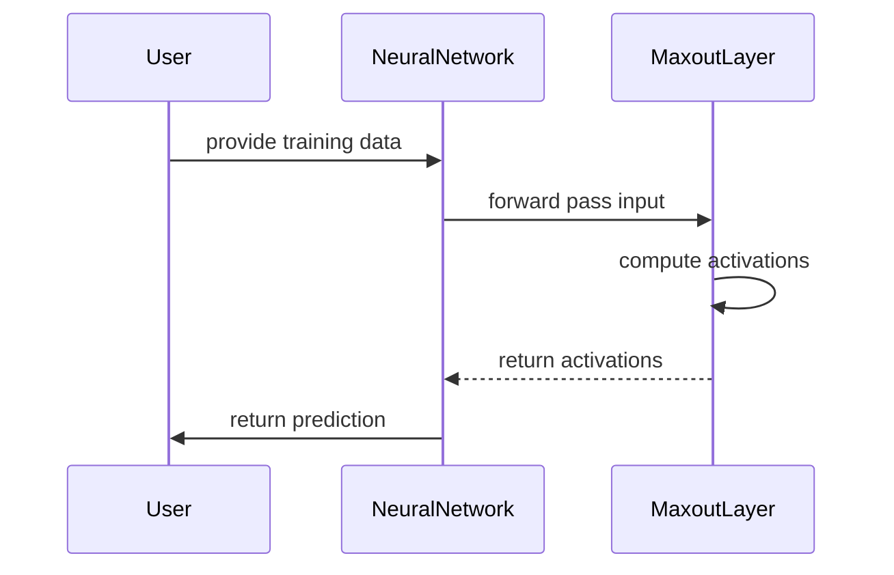

Maxout Networks are a type of neural network layer designed to perform non-linear transformations by taking the element-wise maximum of a set of inputs. This technique is particularly effective for applications that require max pooling, offering a more generalized and flexible model that can approximate a variety of non-linear activation functions.

## Detailed Description

Maxout Networks introduce a novel approach to constructing activation functions. Unlike traditional activation functions like ReLU or sigmoid, Maxout Networks select the maximum value from multiple linear projections of the input. Formally, given an input vector \\(x\\), a Maxout unit can be defined as:


\text{maxout}(x) = \max_{i=1}^k (x^T W_i + b_i)


Here, \\(W_i\\) and \\(b_i\\) are the weights and biases for the \\(i\\)-th linear projection. The primary advantage of this method is its capacity to learn a piecewise linear function that can approximate complex, non-linear functions.

## Benefits

- **Increased Flexibility:** Maxout units can approximate any convex function, providing greater flexibility than traditional activation functions.
- **Better Gradient Flow:** Similar to ReLU, Maxout units help mitigate the vanishing gradient problem, leading to more efficient training.
- **Robustness to Overfitting:** They are generally more robust to overfitting due to their flexibility and regularization properties.

## Trade-offs

- **Increased Computation:** Maxout Networks require multiple sets of weights, leading to an increase in computational and memory requirements.
- **Model Complexity:** With the added flexibility, there's a risk of over-parameterization, making the model more complex and harder to interpret.

## UML Class Diagram



## UML Sequence Diagram



## Example Implementations

### Python

```python
import numpy as np

class MaxoutLayer:
    def __init__(self, num_units, num_features):
        self.num_units = num_units
        self.weights = [np.random.randn(num_features) for _ in range(num_units)]
        self.biases = [np.random.randn() for _ in range(num_units)]
        
    def activation(self, x):
        return np.max([np.dot(x, w) + b for w, b in zip(self.weights, self.biases)], axis=0)

x = np.random.randn(10)
layer = MaxoutLayer(5, 10)
output = layer.activation(x)
print(output)
```

### Java

```java
import java.util.Random;

public class MaxoutLayer {
    private int numUnits;
    private double[][] weights;
    private double[] biases;

    public MaxoutLayer(int numUnits, int numFeatures) {
        this.numUnits = numUnits;
        weights = new double[numUnits][numFeatures];
        biases = new double[numUnits];
        Random rand = new Random();
        for (int i = 0; i < numUnits; i++) {
            for (int j = 0; j < numFeatures; j++) {
                weights[i][j] = rand.nextGaussian();
            }
            biases[i] = rand.nextGaussian();
        }
    }

    public double activation(double[] x) {
        double max = Double.NEGATIVE_INFINITY;
        for (int i = 0; i < numUnits; i++) {
            double sum = biases[i];
            for (int j = 0; j < x.length; j++) {
                sum += weights[i][j] * x[j];
            }
            if (sum > max) {
                max = sum;
            }
        }
        return max;
    }
}
```

### Scala

```scala
import scala.util.Random

class MaxoutLayer(numUnits: Int, numFeatures: Int) {
    private val weights = Array.fill(numUnits, numFeatures)(Random.nextGaussian())
    private val biases = Array.fill(numUnits)(Random.nextGaussian())
    
    def activation(x: Array[Double]): Double = {
        weights.zip(biases).map { case (w, b) => 
            w.zip(x).map { case (wi, xi) => wi * xi }.sum + b
        }.max
    }
}

// Example Usage
val x = Array.fill(10)(Random.nextGaussian())
val layer = new MaxoutLayer(5, 10)
val output = layer.activation(x)
println(output)
```

### Clojure

```clojure
(defn random-matrix [rows cols]
  (vec (repeatedly rows #(vec (repeatedly cols rand)))))

(defn maxout-layer [num-units num-features]
  {:weights (random-matrix num-units num-features)
   :biases (vec (repeatedly num-units rand))})

(defn activation [layer x]
  (apply max 
    (map (fn [w b] (+ (reduce + (map * w x)) b)) 
         (:weights layer) 
         (:biases layer))))

;; Example Usage
(def x (repeatedly 10 rand))
(def layer (maxout-layer 5 10))
(println (activation layer x))
```

## Use Cases

- **Image Classification:** Maxout Networks are highly effective in image classification tasks where max pooling is common.
- **Speech Recognition:** These networks can be used to improve the non-linear transformations in speech recognition systems.
- **Natural Language Processing:** Maxout units can enhance the representational capacity of networks used for NLP tasks.

## Related Design Patterns

- **Convolutional Neural Networks (CNN):** Often used alongside maxout layers for efficient image recognition.
- **Residual Networks (ResNet):** Can benefit from the flexible non-linear activations provided by maxout units.

## Resources and References

- [Original Maxout Networks Paper](https://arxiv.org/abs/1302.4389)
- [Open Source Implementation in TensorFlow](https://github.com/tensorflow/models/tree/master/research/maxout_networks)
- [Deep Learning Book by Ian Goodfellow](https://www.deeplearningbook.org/)

## Summary

Maxout Networks provide an effective alternative to traditional activation functions by utilizing the element-wise maximum of inputs. They offer increased flexibility, better gradient flow, and robustness to overfitting, making them a valuable tool in the deep learning toolbox. However, this comes at the cost of increased computation and potential model complexity. Understanding the appropriate use cases and trade-offs is key to effectively leveraging Maxout Networks in machine learning projects.

By implementing Maxout Networks in various programming languages and frameworks, developers can utilize this powerful technique in diverse applications, enhancing the performance and robustness of their neural network models.
