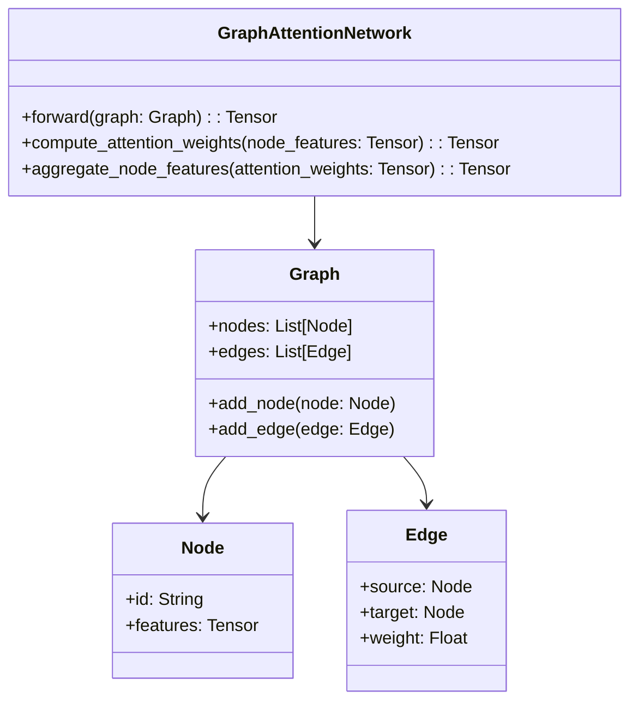
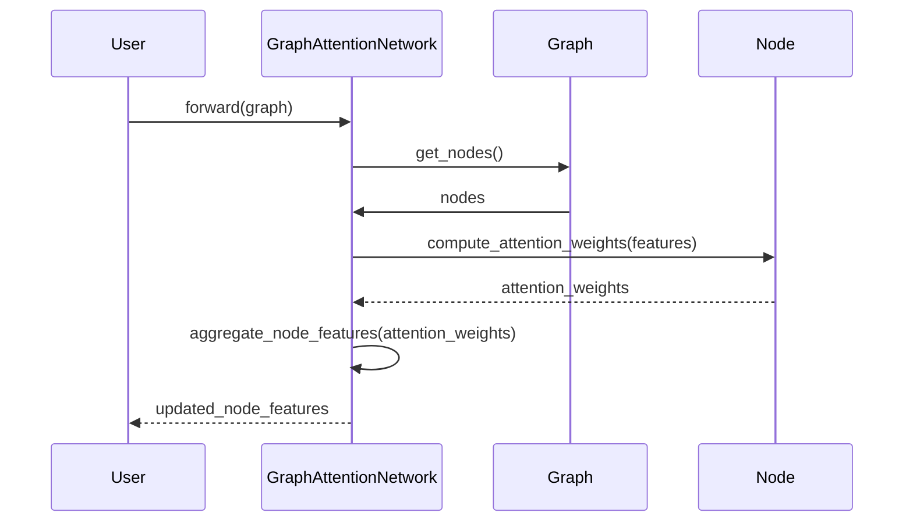

## Introduction
Graph Attention Networks (GAT) leverage attention mechanisms to enhance node feature aggregation in graph-structured data. GATs are designed to focus on the most relevant parts of the graph by assigning different weights to different nodes. This attention mechanism allows the model to capture the importance of neighboring nodes, improving the overall representation learning process.

## Benefits of Graph Attention Networks
- **Dynamic Importance Learning**: GATs learn the importance of neighboring nodes dynamically, which leads to more informative node representations.
- **Scalability**: By focusing on local neighborhoods, GATs can scale efficiently to larger graphs.
- **Flexibility**: GATs can be applied to a variety of graph-related problems without significant changes to the core algorithm.

## Trade-offs
- **Complexity**: The introduction of attention mechanisms increases the complexity of the model.
- **Computational Overhead**: Attention calculation can be computationally intensive, especially for large graphs.
- **Memory Usage**: Storing attention weights for large graphs can lead to increased memory consumption.

## Use Cases
- **Social Network Analysis**: Identifying influential users or communities in social networks.
- **Molecular Graphs**: Predicting molecular properties by focusing on relevant parts of the molecular structure.
- **Recommendation Systems**: Enhancing item recommendations by understanding user-item interactions better.
- **Traffic Networks**: Modeling traffic flow by considering the importance of various intersections and roads.

## UML Class Diagram
Here is a UML class diagram representing the core structure of a Graph Attention Network:



## UML Sequence Diagram
A sequence diagram depicting the forward pass in a Graph Attention Network:



## Examples in Different Programming Languages

### Python
```python
import torch
import torch.nn.functional as F
from torch_geometric.nn import GATConv

class GAT(torch.nn.Module):
    def __init__(self, in_channels, out_channels):
        super(GAT, self).__init__()
        self.conv1 = GATConv(in_channels, out_channels, heads=1)

    def forward(self, data):
        x, edge_index = data.x, data.edge_index
        x = self.conv1(x, edge_index)
        return F.elu(x)

# data = ... # Load your graph data here
# output = model(data)
```

### Java
```java
import org.deeplearning4j.nn.conf.MultiLayerConfiguration;
import org.deeplearning4j.nn.conf.NeuralNetConfiguration;
import org.deeplearning4j.nn.conf.graph.GraphAttentionVertex;
import org.deeplearning4j.nn.multilayer.MultiLayerNetwork;

public class GAT {
    public static void main(String[] args) {
        MultiLayerConfiguration conf = new NeuralNetConfiguration.Builder()
            .list()
            .layer(0, new GraphAttentionVertex.Builder(16, 32).build())
            .build();
        MultiLayerNetwork model = new MultiLayerNetwork(conf);
        model.init();
        // Load your graph data and train the model
    }
}
```

### Scala
```scala
import org.apache.spark.graphx.Graph
import org.deeplearning4j.nn.conf.NeuralNetConfiguration
import org.deeplearning4j.nn.conf.layers.GraphAttentionLayer
import org.deeplearning4j.nn.multilayer.MultiLayerNetwork

object GAT {
  def main(args: Array[String]): Unit = {
    val conf = new NeuralNetConfiguration.Builder()
      .layer(new GraphAttentionLayer.Builder(16, 32).build())
      .build()
    val model = new MultiLayerNetwork(conf)
    model.init()
    // Load your graph data and train the model
  }
}
```

### Clojure
```clojure
(ns gat-example
  (:require [dl4clj.nn.conf.builders :as b]
            [dl4clj.nn.api.multi-layer-network :as mln]))

(def conf (b/multi-layer-configuration-builder
           :list {:type :graph-attention
                  :in 16
                  :out 32}))

(def model (mln/new-multi-layer-network conf))

(mln/init! model)
;; Load your graph data and train the model
```

## Related Design Patterns
- **Graph Convolutional Networks (GCN)**: GCNs aggregate node information in a graph by leveraging convolution operations over the graph structure.
- **GraphSAGE**: This method samples and aggregates features from a node's local neighborhood.
- **Attention Mechanisms**: Widely used in NLP, attention mechanisms allow models to focus on specific parts of the input.

## Resources and References
- [Graph Attention Networks Paper](https://arxiv.org/abs/1710.10903)
- [PyTorch Geometric](https://pytorch-geometric.readthedocs.io/)
- [DeepLearning4J](https://deeplearning4j.org/)
- [Apache Spark GraphX](https://spark.apache.org/graphx/)

## Summary
Graph Attention Networks (GAT) introduce attention mechanisms to graph neural networks, enhancing the ability to dynamically learn the importance of neighboring nodes for node feature aggregation. While they offer significant benefits in terms of flexibility and scalability, they also come with increased computational and memory overhead. GATs have a wide range of applications, including social network analysis, molecular graphs, recommendation systems, and traffic networks.

Implementing GATs in various programming languages showcases their versatility and adaptability to different environments. Understanding the trade-offs and related patterns allows for informed decisions when choosing or designing graph-based models for specific applications.
