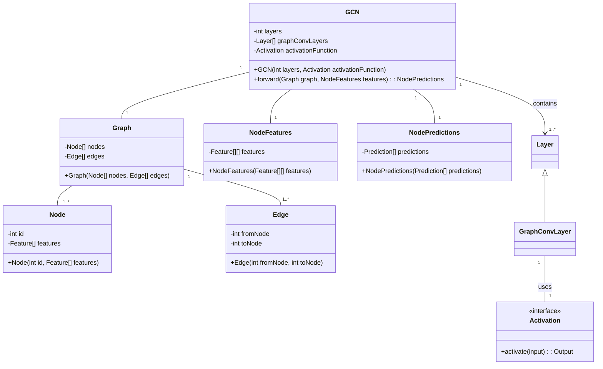
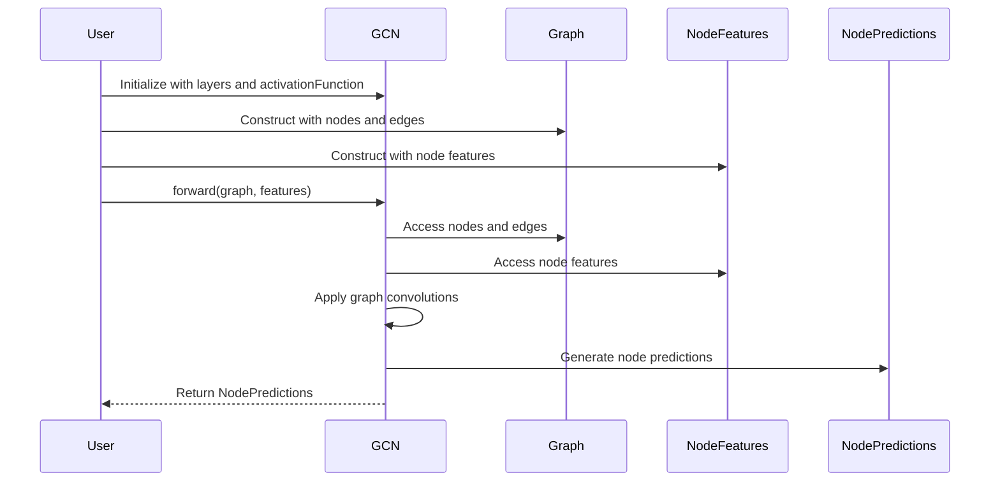

## Overview of Graph Convolutional Networks (GCN)

Graph Convolutional Networks (GCNs) are an extension of traditional convolutional neural networks (CNNs) designed to work with data represented as graphs. Unlike regular grids, graphs have a non-Euclidean structure, making traditional convolution operations inapplicable. GCNs extend the convolution operation to graph-structured data, enabling powerful methods for tasks such as node classification, link prediction, and graph classification.

## Benefits

- **Scalability:** Can handle large-scale graphs efficiently.
- **Representation Learning:** Automatically learns node representations that capture complex relationships.
- **Flexibility:** Applicable to various types of graph-structured data, including social networks, knowledge graphs, and biological networks.

## Trade-offs

- **Complexity:** Implementing GCNs can be more complex compared to traditional neural networks.
- **Computational Costs:** Can be computationally intensive, particularly for large graphs.
- **Hyperparameter Sensitivity:** Requires careful tuning of hyperparameters to achieve optimal performance.

## Use Cases

### Node Classification

Node classification involves predicting the label of a node based on its features and graph structure. This is commonly used in:
- **Social Networks:** Predicting user interests or groups.
- **Knowledge Graphs:** Inferring missing types or categories.
- **Biological Networks:** Classifying proteins or genes.

## UML Class Diagram



## UML Sequence Diagram



## Example Implementations

### Python (using PyTorch)

```python
import torch
import torch.nn as nn
import torch.nn.functional as F
from torch_geometric.nn import GCNConv

class GCN(nn.Module):
    def __init__(self, in_channels, hidden_channels, out_channels):
        super(GCN, self).__init__()
        self.conv1 = GCNConv(in_channels, hidden_channels)
        self.conv2 = GCNConv(hidden_channels, out_channels)
    
    def forward(self, x, edge_index):
        x = self.conv1(x, edge_index)
        x = F.relu(x)
        x = self.conv2(x, edge_index)
        return F.log_softmax(x, dim=1)

model = GCN(in_channels=3, hidden_channels=16, out_channels=2)
```

### Java (using Deep Java Library - DJL)

```java
import ai.djl.Model;
import ai.djl.basicmodelzoo.cv.classification.ResNetV1;
import ai.djl.ndarray.NDArray;
import ai.djl.ndarray.NDManager;
import ai.djl.training.Trainer;
import ai.djl.training.loss.Loss;
import ai.djl.training.util.ProgressBar;
import ai.djl.translate.TranslateException;

public class GCNExample {
    public static void main(String[] args) throws TranslateException {
        Model model = Model.newInstance("gcn");
        model.setBlock(new ResNetV1.Builder().setImageShape(new Shape(1, 3, 224, 224)).build());
        
        Trainer trainer = model.newTrainer(new ProgressBar());
        Loss loss = Loss.softmaxCrossEntropyLoss();
        trainer.setLoss(loss);

        // Dummy data
        NDManager manager = NDManager.newBaseManager();
        NDArray data = manager.ones(new Shape(1, 3, 224, 224));
        NDArray label = manager.ones(new Shape(1, 1));

        // Forward pass
        NDArray predictions = trainer.forward(data).get(0);
        System.out.println(predictions);
    }
}
```

### Scala

```scala
import breeze.linalg._
import org.graphframes.GraphFrame

case class Node(id: String, feature: DenseVector[Double])
case class Edge(src: String, dst: String)

class GCN(layers: List[DenseMatrix[Double]], activation: DenseVector[Double] => DenseVector[Double]) {
  def forward(graph: GraphFrame, features: DenseMatrix[Double]): DenseMatrix[Double] = {
    var x = features
    for (layer <- layers) {
      x = activation(layer * x)
    }
    x
  }
}

// Example usage
val nodes = List(Node("1", DenseVector(1.0, 2.0, 3.0)), Node("2", DenseVector(4.0, 5.0, 6.0)))
val edges = List(Edge("1", "2"), Edge("2", "1"))
val graph = GraphFrame(nodes.toDF(), edges.toDF())
val features = DenseMatrix((1.0, 2.0, 3.0), (4.0, 5.0, 6.0))
val layers = List(DenseMatrix.eye[Double](3))
val activation = (x: DenseVector[Double]) => x.map(math.tanh)

val gcn = new GCN(layers, activation)
val predictions = gcn.forward(graph, features)
println(predictions)
```

### Clojure

```clojure
(ns gcn-example.core
  (:require [clojure.core.matrix :as m]
            [clojure.core.matrix.linear :as lin]))

(defn gcn-layer [adj feature-weights]
  (m/mmul adj feature-weights))

(defn activation [x]
  (m/emap #(Math/tanh %) x))

(defn gcn-forward [adj features layers]
  (reduce (fn [f layer] (activation (gcn-layer adj (m/mmul f layer))))
          features
          layers))

;; Example usage
(def features (m/matrix [[1 2 3] [4 5 6]]))
(def layers [(m/eye 3)])
(def adj (m/matrix [[1 1] [1 1]]))

(def predictions (gcn-forward adj features layers))
(println predictions)
```

## Related Design Patterns

- **Convolutional Neural Networks (CNNs):** GCNs extend the principles of CNNs to graph data.
- **Recurrent Neural Networks (RNNs):** Both can handle data with non-fixed sizes but RNNs are typically used for sequences.

## Resources and References

- **Papers:** 
  - [Semi-Supervised Classification with Graph Convolutional Networks](https://arxiv.org/abs/1609.02907)
- **Books:**
  - "Deep Learning with Python" by François Chollet
- **Open Source Frameworks:**
  - [PyTorch Geometric](https://pytorch-geometric.readthedocs.io)
  - [Deep Graph Library (DGL)](https://www.dgl.ai/)

## Summary

Graph Convolutional Networks (GCNs) are a powerful extension of neural networks, specifically designed to handle the unique challenges presented by graph-structured data. They offer the ability to perform tasks such as node classification by leveraging the relationships captured in the graph's structure. GCNs are particularly useful in domains like social networks, knowledge graphs, and biological networks. With careful design and optimization, GCNs can provide significant performance improvements in these complex tasks.
