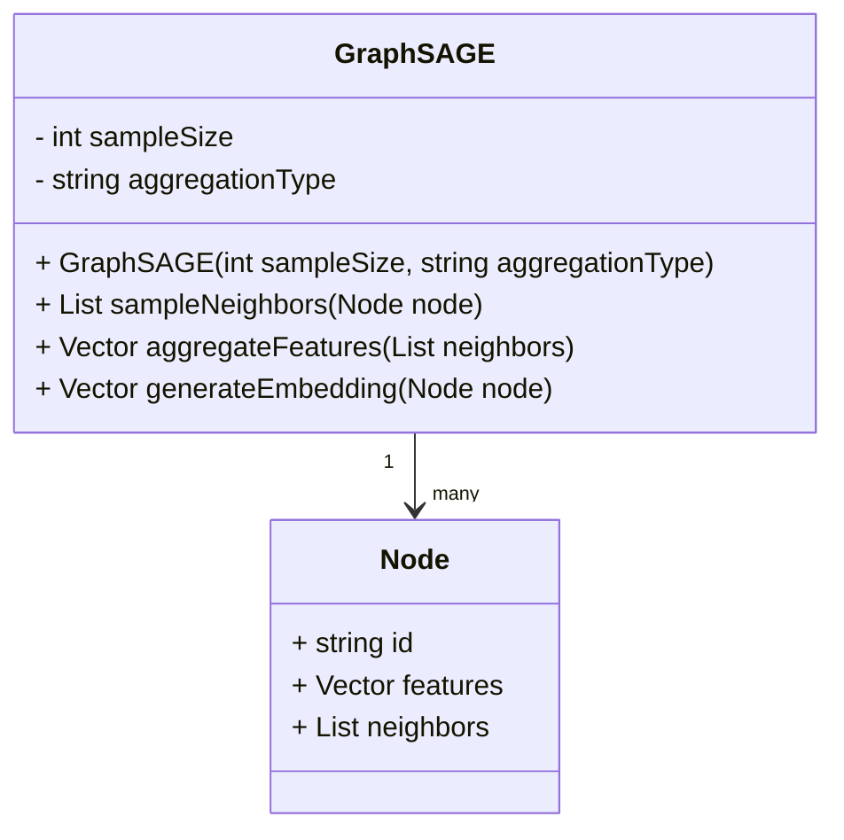
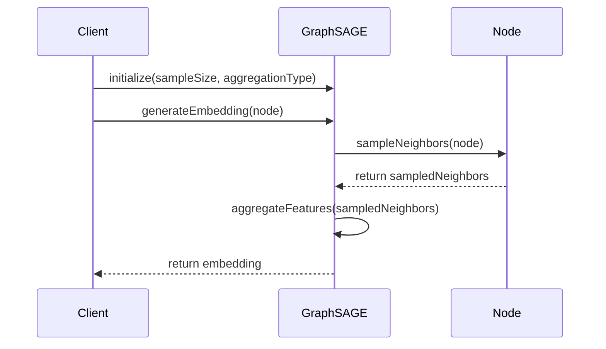

GraphSAGE, short for Graph Sample and Aggregation, is a framework designed to generate embeddings for nodes in a graph. It is particularly effective for handling large, dynamic graphs and generates embeddings by aggregating feature information from a node's neighbors.

## Detailed Description

In many real-world scenarios, graphs can be large and dynamic, making it challenging to generate effective node embeddings using traditional methods. GraphSAGE addresses this by learning an aggregation function that generates embeddings by sampling and aggregating features from a node's local neighborhood.

GraphSAGE performs the following steps:
1. **Neighborhood Sampling:** For each node, a fixed-size sample of its neighbors is selected.
2. **Feature Aggregation:** The features of the sampled neighbors are aggregated using a predefined function (e.g., mean, LSTM, or pooling).
3. **Embedding Generation:** The aggregated feature vector is used to compute the embedding for the node.

## Benefits

- **Scalability:** Efficient for large graphs due to fixed-size neighborhood sampling.
- **Flexibility:** Works with different types of aggregation functions.
- **Dynamic Graph Support:** Capable of handling dynamic and evolving graphs.

## Trade-offs

- **Approximation:** Sampling neighbors introduces approximation in the embedding process.
- **Aggregation Complexity:** The choice of aggregation function can impact both performance and the quality of embeddings.

## UML Class Diagram



## UML Sequence Diagram



## Examples in Python, Java, Scala, Clojure

### Python

```python
import numpy as np

class Node:
    def __init__(self, id, features, neighbors):
        self.id = id
        self.features = features
        self.neighbors = neighbors

class GraphSAGE:
    def __init__(self, sample_size, aggregation_type):
        self.sample_size = sample_size
        self.aggregation_type = aggregation_type
    
    def sample_neighbors(self, node):
        return np.random.choice(node.neighbors, self.sample_size)
    
    def aggregate_features(self, neighbors):
        if self.aggregation_type == 'mean':
            return np.mean([n.features for n in neighbors], axis=0)
        # Additional aggregation methods can be added here
    
    def generate_embedding(self, node):
        sampled_neighbors = self.sample_neighbors(node)
        aggregated_features = self.aggregate_features(sampled_neighbors)
        return aggregated_features

node_a = Node('A', np.array([1, 2, 3]), [])
node_b = Node('B', np.array([4, 5, 6]), [node_a])
graph_sage = GraphSAGE(1, 'mean')
embedding = graph_sage.generate_embedding(node_b)
print(embedding)
```

### Java

```java
import java.util.List;
import java.util.Random;

class Node {
    String id;
    double[] features;
    List<Node> neighbors;

    Node(String id, double[] features, List<Node> neighbors) {
        this.id = id;
        this.features = features;
        this.neighbors = neighbors;
    }
}

class GraphSAGE {
    private int sampleSize;
    private String aggregationType;
    private Random random;

    GraphSAGE(int sampleSize, String aggregationType) {
        this.sampleSize = sampleSize;
        this.aggregationType = aggregationType;
        this.random = new Random();
    }

    public List<Node> sampleNeighbors(Node node) {
        return node.neighbors.subList(0, Math.min(sampleSize, node.neighbors.size()));
    }

    public double[] aggregateFeatures(List<Node> neighbors) {
        double[] aggregatedFeatures = new double[neighbors.get(0).features.length];
        for (Node neighbor : neighbors) {
            for (int i = 0; i < aggregatedFeatures.length; i++) {
                aggregatedFeatures[i] += neighbor.features[i];
            }
        }
        for (int i = 0; i < aggregatedFeatures.length; i++) {
            aggregatedFeatures[i] /= neighbors.size();
        }
        return aggregatedFeatures;
    }

    public double[] generateEmbedding(Node node) {
        List<Node> sampledNeighbors = sampleNeighbors(node);
        return aggregateFeatures(sampledNeighbors);
    }
}

// Example usage
Node nodeA = new Node("A", new double[]{1, 2, 3}, List.of());
Node nodeB = new Node("B", new double[]{4, 5, 6}, List.of(nodeA));
GraphSAGE graphSAGE = new GraphSAGE(1, "mean");
double[] embedding = graphSAGE.generateEmbedding(nodeB);
System.out.println(Arrays.toString(embedding));
```

### Scala

```scala
import scala.util.Random

case class Node(id: String, features: Array[Double], neighbors: Seq[Node])

class GraphSAGE(sampleSize: Int, aggregationType: String) {
  private val random = new Random

  def sampleNeighbors(node: Node): Seq[Node] = {
    random.shuffle(node.neighbors).take(sampleSize)
  }

  def aggregateFeatures(neighbors: Seq[Node]): Array[Double] = {
    val aggregatedFeatures = Array.fill(neighbors.head.features.length)(0.0)
    for (neighbor <- neighbors) {
      for (i <- aggregatedFeatures.indices) {
        aggregatedFeatures(i) += neighbor.features(i)
      }
    }
    aggregatedFeatures.map(_ / neighbors.size)
  }

  def generateEmbedding(node: Node): Array[Double] = {
    val sampledNeighbors = sampleNeighbors(node)
    aggregateFeatures(sampledNeighbors)
  }
}

// Example usage
val nodeA = Node("A", Array(1.0, 2.0, 3.0), Seq())
val nodeB = Node("B", Array(4.0, 5.0, 6.0), Seq(nodeA))
val graphSAGE = new GraphSAGE(1, "mean")
val embedding = graphSAGE.generateEmbedding(nodeB)
println(embedding.mkString(", "))
```

### Clojure

```clojure
(defrecord Node [id features neighbors])

(defn sample-neighbors [node sample-size]
  (take sample-size (shuffle (:neighbors node))))

(defn aggregate-features [neighbors]
  (let [feature-lists (map :features neighbors)
        summed-features (reduce (partial map +) (repeat (count (first feature-lists)) 0.0) feature-lists)
        neighbor-count (count neighbors)]
    (map #(/ % neighbor-count) summed-features)))

(defn generate-embedding [node sample-size]
  (let [sampled-neighbors (sample-neighbors node sample-size)]
    (aggregate-features sampled-neighbors)))

;; Example usage
(def node-a (->Node "A" [1 2 3] []))
(def node-b (->Node "B" [4 5 6] [node-a]))
(def embedding (generate-embedding node-b 1))
(println embedding)
```

## Use Cases

- **Recommendation Systems:** Generating personalized recommendations based on user-item interaction graphs.
- **Social Networks:** Embedding users in social graphs for friend suggestions or community detection.
- **Molecular Graphs:** Predicting molecular properties by embedding molecules represented as graphs.
- **Knowledge Graphs:** Enhancing entity and relationship embeddings in knowledge bases.

## Related Design Patterns

- **Graph Convolutional Networks (GCN):** Similar to GraphSAGE but relies on convolution operations over the entire neighborhood.
- **DeepWalk:** Uses random walks on graphs to generate node embeddings, differing from GraphSAGE's aggregation approach.

## Resources and References

- **Paper:** [Inductive Representation Learning on Large Graphs](https://arxiv.org/abs/1706.02216)
- **GitHub Repositories:**
  - [GraphSAGE Reference Implementation](https://github.com/williamleif/GraphSAGE)
  - [Deep Graph Library (DGL)](https://github.com/dmlc/dgl)
- **Additional Readings:**
  - **Graph Neural Networks: A Review** by Zhou et al.
  - **Graph Representation Learning** by William L. Hamilton

## Summary

GraphSAGE is a scalable and flexible framework for generating node embeddings in large and dynamic graphs. By using a sampling and aggregation approach, it can efficiently handle diverse graphs while offering various aggregation strategies. Its applicability spans multiple domains, including recommendation systems, social networks, molecular graphs, and knowledge graphs, making it a versatile tool in the field of graph neural networks.
